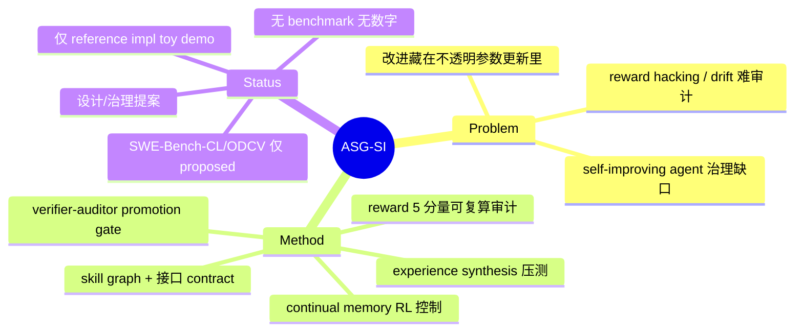

## Summary
ASG-SI 提出把 agent 的自我改进当成"往一张可审计 skill graph 上编译新技能"：每个候选技能从成功轨迹抽取、规范成带 precondition/postcondition 接口的程序，只有通过 verifier-auditor 在 held-out 任务、contract 校验与 controlled perturbation 上验证并留下 evidence bundle 后才被 promote；reward 拆成 5 个可复算、可独立审计的分量。它是一篇**设计/治理提案**，给出完整架构、威胁模型与一个可运行 reference implementation，但**全文无任何 benchmark 实证结果**（SWE-Bench-CL/ODCV-Bench 仅列为未来评测目标）。

## Problem & Motivation
- 部署中的 self-improving agent 有一组未解的安全与治理问题：优化压力会激励 reward hacking，behavioral drift 难以审计或复现，而改进往往被塞进不透明的参数更新里，而不是可复用、可验证的 artifact。
- 作者的立场是：把自我改进从"改权重"重构为"积累可验证、可复用的能力"，才能同时得到可复现评测与运营治理。威胁模型包含 adversary 影响任务分布、诱导"outcome-driven constraint violation"（agent 刷指标却违反安全要求）。

## Method
> 注：以下为论文提出的系统设计；除 reference implementation 的 toy demo 外无实证结果。

- **Skill 抽取与规范化**：从成功轨迹里找可复用子序列，归一化成 canonical program/template，赋予带 precondition/postcondition 的显式接口。prototype 用从单 tool-call 成功任务抽取的 canonical program template。
- **Promotion gating（核心）**：候选技能只有通过 verifier-auditor 的验证才加入 audited skill graph——在 **held-out tasks、contract checks 与 controlled perturbations** 上评估，产出包含 tool schema/args、tool outputs、contract 校验、deterministic test 结果的 **evidence bundle**。这正是 evolution-step gating 的一种形态。
- **可审计的 reward 分解**：reward 拆成 5 个可复算分量——tool validity（schema 合规）、outcome verification（deterministic evaluator）、skill reuse（尊重 contract 的调用）、composition（多技能链满足接口 contract）、memory discipline（有界 context 增长）；分量由 replayable evidence 复算，使 promotion 决策与学习信号可被独立审计。
- **Experience synthesis**：合成经验作为真实 rollout 的补充，用于 stress-test skill 接口与组合、扩展对 adversarial/edge-case 行为的覆盖。
- **Continual memory control**：用 RL 学习 memory 的更新/检索，使长程依赖在有界 context 下保留。

## Key Results
> [无实证评测] 全文无 benchmark 结果、无 table、无 success-rate 数字。唯一可运行 artifact 是 reference implementation（`asg_si_demo.py`，github.com/kenhuangus/ASG-SI）在 toy deterministic-replay 环境上演示 verifier-backed reward 构造、skill 编译、audit logging。Section "Evaluation Plan" 仅描述**打算**测什么（capability growth 分解、schema-correctness rate、audited improvement rate、SWE-Bench-CL / ODCV-Bench），属未来工作。

## Evidence Ledger
| Claim ID | Claim | Type | Source locator | Evidence excerpt | Status |
|:--|:--|:--|:--|:--|:--|
| C1 | 无实证/benchmark 评测，仅 runnable reference impl demo；SWE-Bench-CL/ODCV-Bench 仅作 proposed 未来目标 | benchmark-setting | Evaluation Plan / 全文 | "Evaluation for ASG-SI must measure capability growth, retention under continual streams, and constraint adherence" | source-verified |
| C2 | candidate 只有通过 verifier-auditor 在 held-out tasks + contract checks + controlled perturbations 验证并产出 evidence bundle 后才 promote | causal-mechanism | §5/§7 | "evaluates candidates on held-out tasks, contract checks, and controlled perturbations, producing an evidence bundle" | source-verified |
| C3 | reward 分解为 5 个可审计分量（tool validity / outcome verification / skill reuse / composition / memory discipline） | method | reward 节 §6 | "tool validity component scores whether tool calls satisfy schemas ... memory discipline component penalizes unbounded context growth" | source-verified |
| C4 | reference implementation 在 github.com/kenhuangus/ASG-SI | license-code | §12 | "A reference implementation ... available at https://github.com/kenhuangus/ASG-SI" | source-verified |

## Strengths & Weaknesses
**亮点**
- 把"可审计性/可复现性"提为 self-improvement 的一等目标，且给出具体机制词表：skill graph + 接口 contract + evidence bundle + reward 分解复算。这套"每个 promotion 决策都能被独立复算审计"的框架，是 GRASP/[[Papers/2606-SkillNb]] 这类**实证** gate 工作之外的一条**治理/审计角度**，补上了"gate 通过之后如何被第三方核验"的话语。
- 威胁模型明确（adversary 影响任务分布 + outcome-driven constraint violation），与 [[Papers/2509-Misevolution]] 的实证 misevolution 路径对得上——ASG-SI 相当于给出一个针对性的防御架构提案。

**局限与边界**
- **没有任何实证**：这是最大的边界。全文 0 table、0 success-rate，SWE-Bench-CL/ODCV-Bench 只是"打算测"。所以它的所有可靠性 claim 都停留在设计层——"gate 能防 reward hacking"未被任何数据支持。以 evidence-driven 标准看，这是一篇 position/architecture paper，不是方法验证。
- 作者自陈的死结：auditability 依赖 verifier 与 evidence store 的完整性与隔离——verifier 被攻破则 auditability 只是"表面属性、无强制力"；replay 验证有开销，非确定性环境需要受控 harness；verifiable reward 本身会制造"测什么就往什么方向漂"的 measurement incentive（即 gate 自身也可能被 game）。
- skill 接口可能 under-specified（漏行为）或 too strict（挡住合法变体），作者把 interface inference 与 adversarial verification suite 留作未来工作——恰恰是让这套 gate 真正可用的关键部分。
- 2 作者、无实验、偏 governance 立场（Ken Huang 为 AI security/governance 方向作者），定位更接近"给工业界的自我改进治理蓝图"，而非可复现的研究贡献。

**对领域/vault 的意义**：作为 [[Topics/SelfEvolvingAgents-Survey]] 的 evolution-step gating 家族第 3 篇（GRASP=编辑级 held-out probe 实证、[[Papers/2606-SkillNb]]=步骤级运行时 gate 实证、ASG-SI=技能图级审计治理提案），它的独特贡献是**可审计/可复现维度**——把 gate 从"接不接受这条编辑"扩展到"这个接受决策能否被独立复算和第三方审计"。但它是三者中唯一无实证的，survey 里应作为"设计提案/治理框架"呈现，不得与 GRASP/SkillNb 的实证结论并列为同等证据强度。

## Mind Map

## Notes
- 归入 SelfEvolvingAgents-Survey 的 gate 家族第 3 篇，与 [[Papers/2605-GRASP]]、[[Papers/2606-SkillNb]] 并读。三者构成一条从"实证 gate"到"审计治理"的谱：GRASP（编辑级、净修>净坏 probe）、SkillNb（步骤级、运行时 gate + 生命周期）、ASG-SI（skill-graph 级、evidence bundle + reward 复算审计，但无证据）。survey 的 evolution-step gating 小节可用这条谱作组织轴：gate 在哪一层、依据什么证据、以及**谁来核验 gate 本身**（ASG-SI 独有的第三方审计视角）。
- 待办：本篇 → SelfEvolvingAgents-Survey（gate 家族累积中）；ASG-SI 的"verifier 被攻破则 auditability 失效"是 survey Open Problem 2 修订时值得引的自陈边界（gate 自身的可信性不能假设）。
