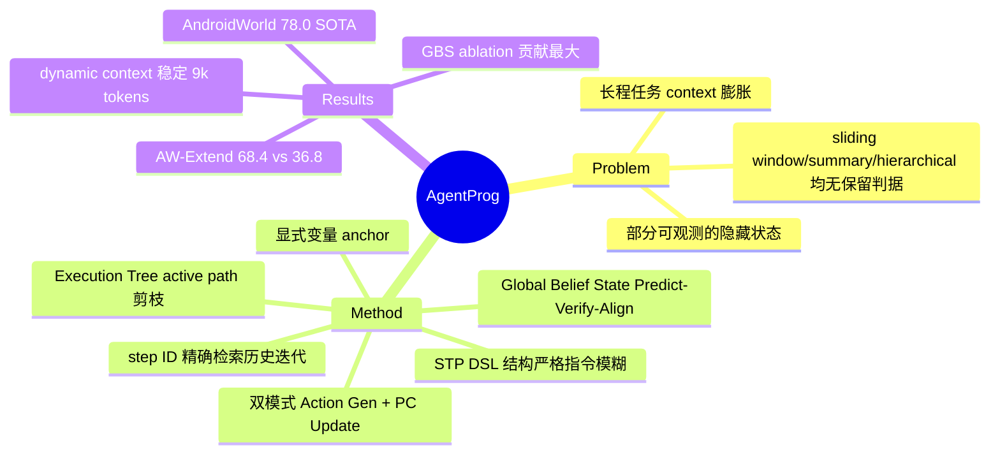

## Summary
针对 mobile GUI agent 长程任务中 interaction history 无限膨胀的 context 瓶颈，AgentProg 把任务先编译成自然语言风格的 Semantic Task Program（STP），运行时以「程序解释器」方式执行——context 只保留程序、Program Counter、active path 上的执行历史、显式变量和 Global Belief State，在 AndroidWorld 达到 78.0% SOTA，在自建长程套件 AW-Extend 上以 68.4% 大幅超过基线（最好基线 36.8%）。

## Problem & Motivation
长程 GUI 任务（数十到上百步）下，现有 context 管理手段各有根本缺陷：sliding window（UI-TARS）丢早期关键信息、summarization（M3A）丢语义细节、hierarchical planning（Mobile-Agent-v3）需要反复 re-plan 且不稳定——共同问题是**缺少「哪些信息对后续步骤必要」的原则性判据**。作者用 AW-Extend pilot 实验归纳出三类失败：(1) 缺整体规划（提前终止、漏子任务）；(2) 记不住关键中间信息（跨子任务传错参数）；(3) 对动态/部分可观测环境理解差（误判日期、误信操作已成功）。灵感来自传统程序：程序用 heap/stack + 变量 + 控制流天然实现了「保留什么、丢弃什么」，故把 agent 的执行历史重构为一段程序。

## Method
**两阶段框架**：STP Generation（执行前全局规划）→ STP Execution（增量解释执行）。

**1. Semantic Task Program (STP)**：一种自然语言风格 DSL。每步是模糊的 NL 指令（如 `get user name as {name}`），但骨架是严格的控制流——loop / if-else / function、花括号显式变量 `{task_list}`、动态类型（Text/Number/List/Object/Table）。设计哲学：**对流程精确（"iterate exactly 10 times"），对实现模糊（"extract the sentiment"）**，区别于 AutoDroid-V2 类符号 DSL（依赖精确 API 和 a11y tree，易 syntax error）。任务开始时由 LLM（Gemini-2.5-Pro）一次性生成 STP，并在此阶段显式声明需要跨步骤保留的关键变量。

**2. 运行时双模式交替**：
- **Action Generation**：根据 Program Counter (PC) 指向的当前 STP 行 + 当前 GUI observation，生成一小段 low-level Python code（原子 API：`start_app`/`click`/`swipe_down`/`input`；grounding 用 UI-TARS-1.5-API）。
- **Program Counter Update**：代码执行、环境更新后，由 LLM 决定 PC 操作，四选一：`hold`（步骤未完成留在原地）/ `continue`（下一步）/ `break`（跳出循环，如 iterator 抛 `StopIteration`）/ `return`（退出函数）。PC 转移是 LLM 动态决定而非确定性的。

**3. Program-Guided Context Management**（核心）：
- **Execution Tree 剪枝**：执行历史组织成树（sequential / conditional / loop 三类节点；未执行的分支不入树，每次循环迭代挂在 loop 入口下）。推理时只保留 root→当前节点的 **active path** 上的 step 信息和 observation，已完成的循环迭代和未走的分支全部剪掉。
- **Program-based Historical Step Retrieval**：循环中重访同一 program step 时，按 **step ID 精确检索**（非相似度检索）该步过去迭代的 action + 结果，注入 context 作参考，抑制重复错误/振荡。
- **变量管理**：Generation 阶段声明的变量是「anchor」，强制在整个执行期间持久化、不被剪枝误删；执行期还可用 Python 定义辅助变量（list、counter、iterator）做程序化状态跟踪。

**4. Global Belief State (GBS)**：受 Belief MDP 启发，处理部分可观测（剪贴板、back-stack、屏幕外状态不可见）。是一个 **原子性 NL 条目列表**（每条区分「已确认事实」vs「未验证假设」），以 Predict–Verify–Align 循环运行：维护假设 → 每步用 `current_screenshot` 校验 → 发现 Belief-Reality Gap 时立即标记旧状态失效（如 "Context Lost"），切到 recovery routine（重开 app、重填表单）。Prompt 强制规则：与截图矛盾的条目改写，**截图无法判真伪的条目必须保留**（屏幕上读不到的隐藏状态正是最关键的信息）；一切以 `current_screenshot` 为事实基线，belief 可能过期。

**每步推理时 agent 实际看到的 context**（Appendix D 明确列出）：(1) STP 全文；(2) 当前 PC / current line；(3) 剪枝后的 low-level Python code history（循环内重复历史被折叠）；(4) 变量及其当前值；(5) Global Belief State；(6) `current_screenshot`（仅当前截图）。

## Key Results
- **AndroidWorld**（116 任务）：AgentProg **78.0%**，新 SOTA（Mobile-Agent-v3 GUI-Owl-32B 73.3%、Agent S3 68.1%、UI-TARS-1.5-API 64.2%）。增益在 medium 难度最大（比 MobileUse +25.0%）。
- **AW-Extend**（自建，19 个长程任务，平均 >30 步；Compositional 强依赖跨 app 任务 + Iterative n=10/20 弱依赖批量任务，基于 AndroidWorld 环境/评测改造的 online benchmark）：AgentProg **68.4%** vs UI-TARS 36.8 / M3A(SoM) 28.9 / Mobile-Agent-v3(32B) 28.9——基线从 AndroidWorld 到 AW-Extend 全部灾难性退化，AgentProg 保持稳健。
- **Ablation**：去掉 GBS → AndroidWorld 78.0→53.9（-24.1）、AW-Extend 68.4→35.1（-33.3），是**最大单一组件**；去掉 Execution Tree → 78.0→61.6、68.4→39.5；去掉显式变量 → 78.0→64.2、68.4→50.0（影响较小，因为 Python 代码层仍可隐式追踪变量）。
- **STP 错误率**：全部 AndroidWorld 任务中仅 **2.5%** 的生成 STP 含不可恢复错误（错误分解/漏步骤/对 app 流程的无效假设）。
- **成本**：dynamic context 稳定在 ~9k tokens（50 步内近乎不涨；Mobile-Agent-v3 ~17k），但 static prefix 巨大（12.5k/call，靠 cache 摊薄）、output tokens 是基线 8-50 倍（belief state + PC 更新都要生成），latency 2662s/task 为三者最高。

## Strengths & Weaknesses
**亮点**：
- 「程序结构 = context 管理判据」是原则性的答案，而不是启发式压缩——保留什么由 control flow（active path）和 data flow（声明变量）决定，可解释且 task-aware。
- Ablation 信息量大：GBS 贡献（+24~33 点）远超程序结构本身（tree +16~29、变量 +14~18），说明**长程任务的最大瓶颈其实是环境状态理解/错误恢复，而非规划或记忆结构**——program 只解决 top-down 的一半，bottom-up 的异常检测靠 belief state。
- STP 的「结构严格、指令模糊」设计对 mobile 场景（a11y tree 不可靠）是合理折中，2.5% 的 STP 错误率支撑了「upfront 全局规划可行」的前提。

**局限**：
- Latency/cost 显著更高（output tokens 大、每步 2 次 LLM 调用），作者以「后台执行场景准确率优先」辩护，属于 trade-off 而非解决。
- AW-Extend 仅 19 任务且由作者自建（与方法同源），任务模板高度「可编程化」（批量增删改），天然利好 program 表示；对不可预先结构化的开放任务（探索型、目标模糊型）STP 能否生成有效程序未验证。
- GBS 本质是 prompt 工程（一段很长的 belief 维护规则），没有量化 belief 准确率本身，其贡献与「更多推理 token」的贡献未解耦。
- 未做 context-reset / amnesia 类极限实验：无法回答「程序状态（STP+PC+变量+belief）是否**充分**恢复执行」，尽管 Appendix D 列出的保留状态清单已非常接近一个可序列化的 checkpoint。

## Mind Map

## Notes
- 与 amnesia/resumability idea 的关系：Appendix D 明确列出每步重建 context 的五元组（STP、PC、剪枝代码史、变量、GBS）+ 当前截图——这**就是**一个显式状态表示，且论文数据表明该状态足以支撑 68.4% 的长程成功率。但论文没有做强制清空-恢复实验，也没有验证该状态的最小充分性（例如剪枝代码史能否也丢掉）。这是一个现成的、可直接拿来做 amnesia 测试的系统。
- GBS prompt 中「截图无法证伪的 belief 条目必须保留」这条规则，正是隐藏状态可恢复性的关键设计——值得在 resumability 实验中单独 ablate。
