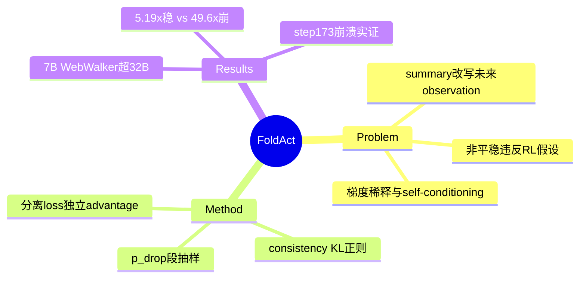

## Summary

对 context folding 路线的理论批评 + 修复方案：既有方法（点名 SUPO / FoldAgent[即 Context-Folding 2510.11967] / AgentFold / ReSum 等）把 summary 当标准 action，忽视了 **summary 会修改 agent 未来的 observation 空间**——observation 分布变成 policy-dependent、非平稳，违反 policy gradient 的平稳观察假设，带来梯度稀释、self-conditioning 训练崩溃、每 turn 独特 context 的计算成本三重问题。FoldAct 用分离 loss + full-context consistency loss（KL 正则）+ 选择性段训练修复，7B 在 WebWalker 46.1 超 32B baseline，训练提速 5.19×（无 consistency 的 49.6× 版本会在 step 173 崩溃）。

## Problem & Motivation

Context folding（执行中压缩交互历史）是长程 RL 的 scalability 刚需，但摘要动作与 tool-use 动作有本质区别：摘要**直接改写后续所有步的输入分布**。标准 RL 假设 observation 分布与 policy 无关；当 summary 由 πθ 生成，policy 更新 → summary 分布变化 → observation 分布变化的循环依赖出现。三个具体后果：(1) **梯度稀释**——summary token 只占 ~10%，统一 loss 下只拿同比例梯度，而折叠决策是关键决策；(2) **self-conditioning**——坏摘要丢关键信息 → 奖励退化 → 更新后的策略摘要更坏（恶性循环，实测训练崩溃）；(3) **计算成本**——每 turn 的压缩 context 唯一，KV cache 无法复用，需逐 turn 独立 forward。

## Method

- **分离 loss**：二元 mask 区分 summary/action token，各算独立 advantage 的 clip loss；summary 专属 reward——无信息生成摘要 −0.2（幻觉惩罚）、摘要保留关键信息且任务成功 +0.2。
- **Full context consistency loss**：ℒ = E[Σ_t KL(πθ(·|s_t 压缩状态) ‖ πθ(·|h_0:t 完整历史))]——把压缩视角下的行为向完整历史视角正则，压制分布漂移；完整历史仅离线存储、只对已生成 token 算 log-prob，每 turn 单次 forward。
- **Selective segment training**：以 p_drop 抽样 turn 计算 loss（实验 p=0.5，只训一半 turns）。
- **设置**：Qwen-2.5-7B-Instruct；local RAG（HotpotQA/PopQA；ASearcher 200 条正确轨迹、Qwen3-30B-A3B-Instruct 生成摘要）+ web search（WebWalker/GAIA/BrowseComp-en·zh/XBench-DeepSearch；WebExplorer 数据）。

## Key Results

- **Web**（Table 2）：WebWalker 46.1（7B）> ASearcher-Web-QwQ 32B 的 34.3；GAIA 45.0 > GPT-4.1-mini 32.73；BrowseComp-en 8.3 仍 < Claude-4-Sonnet 12.2。
- **Local RAG**（Table 1）：HotpotQA F1/EM 38.5/**29.5**（EM 全表最高，次高 ASearcher 22.7；F1 低于 ASearcher 41.5）；PopQA 32.9/28.8。
- **效率**（Table 4，16×L20）：full-context 训练 ~4846.72s/step 且峰值内存 441.04 GB（OOM）；FoldAct p=0.5+consistency 933.70s/step（**5.19×**，405.85 GB）；去 consistency 97.75s（49.6×，84.90 GB）**但不稳定**。
- **稳定性**（Fig 5）：无 consistency loss → KL 不稳、step 173 训练崩溃、step 50 后生成重复大量 token；有 → KL 全程稳定、响应长度 1,200–1,400。
- **消融**：consistency loss 使 HotpotQA EM 26.7→29.5（PopQA 29.2→29.0 边际降）；p_drop=0.5 vs 0 各 benchmark 有升有降（WebWalker +0.4 / GAIA −1.3 / XBench −2.5）——选择性训练主要是省算力，性能影响非均匀。
- **压缩率两端点**：Local RAG（1-10 turns）0.65，Web Search（10+ turns）0.25。

## Evidence Ledger

| Claim ID | Claim | Type | Source locator | Evidence excerpt | Status |
|:--|:--|:--|:--|:--|:--|
| C1 | summary 使 observation 分布 policy-dependent 非平稳；点名 SUPO/FoldAgent(=2510.11967)/AgentFold/ReSum/COMPASS/ACON/IterResearch 等；MemAct 未被引用 | causal-mechanism | §1/§2 | "summaries directly modify the agent's future observation space" | source-verified |
| C2 | 三挑战：梯度稀释（10% token→10% 信号）/self-conditioning 崩溃/每 turn 独特 context 无法复用 KV cache | causal-mechanism | §1 | "they receive only 10% of the gradient signal" | source-verified |
| C3 | 分离 loss（mask+独立 advantage；摘要 reward −0.2/+0.2）+ consistency KL + p_drop 段抽样 | benchmark-setting | §3 | "KL(πθ(·|st)‖πθ(·|h0:t))" | source-verified |
| C4 | Qwen-2.5-7B；ASearcher 200 轨迹 + Qwen3-30B-A3B-Instruct 摘要；WebExplorer 数据；baseline 列表 | benchmark-setting | §4 | "200 correct multi-turn trajectories from ASearcher" | source-verified |
| C5 | WebWalker 46.1 vs 32B 34.3；GAIA 45.0 vs 32.73；BC-en 8.3<12.2；HotpotQA 38.5/29.5（EM 最高、F1 低于 ASearcher） | number | Tables 1-2 | "46.1 vs 34.3" | source-verified |
| C6 | full-context ~4846.72s/step、441.04 GB OOM；p=0.5+cons 933.70s=5.19×（405.85 GB）；无 cons 97.75s=49.6×（84.90 GB） | number | Table 4 | "peak memory usage of 441.04 GB" | source-verified |
| C7 | 无 consistency：step 173 崩溃、step 50 后重复 token；有：KL 稳、长度 1200-1400 | number | Fig 5 | "training collapse at step 173" | source-verified |
| C8 | consistency 消融 HotpotQA EM 26.7→29.5；p_drop=0.5 vs 0 差异非均匀（WebWalker +0.4/GAIA −1.3/XBench −2.5/BC-zh −0.9） | number | Tables 1/3 | "46.1/45.7, 45.0/46.3" | source-verified（初稿"差异≤0.5"被 verifier 推翻，已修正） |
| C9 | 压缩率两场景端点：Local RAG 0.65（1-10 turns）/Web 0.25（10+ turns） | number | §5 | "compression ratio reaches 0.25" | source-verified |

## Strengths & Weaknesses

**Strengths**：
- 把 folding 路线的隐疾**形式化到 RL 假设层**（observation 非平稳性）而非停留在工程观察，且给出崩溃的实证（step 173、重复 token）——这正是 [[Papers/2510-ContextFolding]] 未报告的训练稳定性面。
- 49.6× vs 5.19× 的对照很诚实：把"快"与"稳"的 trade-off 摆出来而不是只报快的数字。
- 摘要专属 reward（幻觉 −0.2）与 [[Papers/2510-MemAct]] 自认的"稀疏奖励难归因到 memory 动作"短板正面相接——是该缺口的第一个显式解法。

**Weaknesses / 边界**：
- **命中面必须精确**（本段为本笔记综合判断，非论文原文）：批评点名 Context-Folding（以 FoldAgent 之名）——其 return 摘要确为 πθ 生成并进入主线程 observation，批评成立；但 **MemAct 全文未被引用**，而 MemAct 的 DCPO 段切分（段内前缀固定物理重构）已部分处理 Challenge 3（train-inference 一致性），其 summary token 仍吃轨迹级 advantage → Challenge 1（梯度稀释）依然命中。07-27 报告"FoldAct 反驳前两篇"的表述应修正为"点名反驳 Context-Folding；对 MemAct 是概念适用但未引用"。
- 7B 单模型、无多 run 方差；BrowseComp-en 8.3 的绝对水平很低，"稳定训练"不等于"强性能"。
- consistency loss 需离线存完整历史，长轨迹的存储/带宽成本未讨论；压缩率 0.25-0.65 的场景差异提示方法收益依赖任务结构。
- 与 Context-Folding 无同 benchmark 直接对照（FoldAct 用 HotpotQA/WebWalker 系，Context-Folding 用 BC-Plus/SWE）——理论批评有实证支撑（自家消融），但"修复后超过被批评方法"未被测量。

**对领域**：folding/summary-as-action 路线的三篇（MemAct/Context-Folding/FoldAct）合起来构成完整图景：formulation 两种（编辑 vs 结构化折叠）→ 训练问题被形式化（非平稳观察）→ 修复三件套。任何后续 context-as-action 工作应默认报告训练稳定性曲线与 summary token 的独立 credit 方案。

## Mind Map

## Notes

- 入队来源：[[Reports/2026-07-27-WebAgent-RL-and-Context-Landscape]] 交叉轴主线 top-10 第 3（"读它对前两篇的理论反驳"）。context-folding 家族三篇 digest 完毕。
- **三篇对读结论**（综合判断）：(1) 路线整体成立但训练脆弱——Context-Folding 的 process reward 与 FoldAct 的 consistency loss 是两种独立的稳定化手段，前者塑行为、后者压分布漂移，未合并测试；(2) FoldAct 的批评对 KV 回滚机制（Context-Folding 的推理侧）不构成攻击，攻击的是训练侧的 summary credit 与分布假设；(3) MemAct 位于批评射程内但未被点名，其 DCPO 与 FoldAct 的 selective segment training 结构相似（都是段级训练），差异在 summary token 是否有独立 credit——这是三篇留下的最干净 open question。
- 对 CUA-Survey §6.9.1/§6.9.3：Context-as-action 行的"主要张力"应补"训练侧非平稳性（FoldAct 形式化）"；07-27 报告 §4 "context 压缩单调有益"行的 FoldAct 依据（"压缩动作违反 RL 平稳性假设"）经全文核验成立且更精确。
