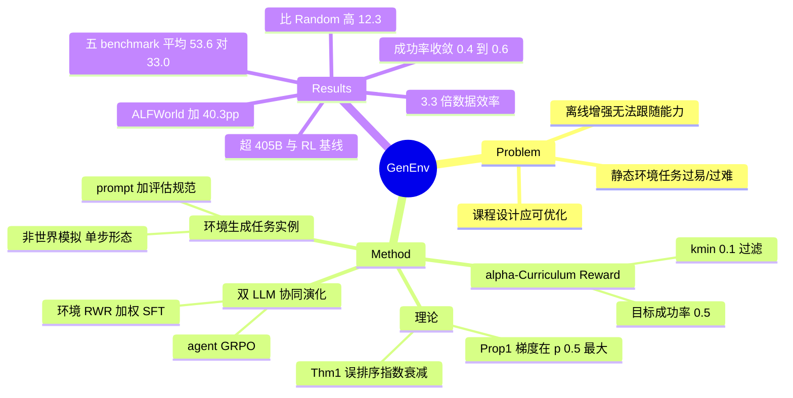

## Summary

GenEnv 把 agent 训练环境从静态数据集换成一个可训练的 LLM 任务生成器：生成器按 agent 近期成功率生成难度对齐的新任务（α-Curriculum Reward 以目标成功率 α=0.5 为峰的高斯形奖励，经 Reward-Weighted Regression 更新），agent 用 GRPO 在生成任务上训练，两者交替协同演化。7B agent 在 API-Bank/ALFWorld/BFCL/Bamboogle/TravelPlanner 五个真实 benchmark 上平均 53.6（基座 33.0），超过 Llama-3.1-405B 等大模型与 ReSearch/SearchR1/ToRL 等 RL 基线的平均分，ALFWorld 提升 +40.3 个百分点，且比 Gemini 2.5 Pro 离线增强用约 3.3× 少的合成数据取得更高验证分。**边界（独立核验）：π_env 只生成完整任务实例（含评估规范），不模拟交互观测——实质是单步任务生成系统而非世界模拟器，ALFWorld 多轮任务被拆成单步评测。**

## Problem & Motivation

LLM agent 的 RL 训练受制于静态环境与静态任务集：任务分布固定，agent 能力提升后大量任务变得过易（梯度信号趋零）或始终过难（reward 稀疏），数据扩增只能靠离线合成、无法跟随 agent 能力动态调整。作者的核心主张是把课程设计本身变成一个可优化的学习问题——让环境作为另一个策略，以"生成的任务落在 agent 能力边界（zone of proximal development）"为奖励目标，与 agent 共同演化。与手工课程、随机任务生成、离线数据增强的关键区别：任务难度分布由环境模型显式向目标成功率对齐，而非事后筛选。

## Method

**框架**：两个 LLM，agent policy π_agent 与 environment simulator π_env，均从 Qwen2.5-7B-Instruct 初始化。

**环境演化的对象是任务实例**。π_env 每轮条件于 seed prompt 与 agent 近期成功率统计，生成一批任务实例，每个实例含：(i) task prompt/context（tool specs、约束、goal）；(ii) evaluation specification（executable checker / exact-match target）；(iii) 可选的结构化 gold action。即 reward 的定义（checker）也由环境共同生成。**转移动态不在演化范围内**（verifier 核验）：reward 由外部 checker 计算（结构化动作 exact execution / 自由文本 soft similarity），π_env 不逐步返回观测；评测侧 ALFWorld 多轮任务 "decomposed into single steps for evaluation"。

**三阶段循环（Algorithm 1）**：
1. **生成与交互**：π_env 生成任务批次，agent rollout 产生轨迹与任务奖励 R_agent；
2. **双更新**：agent 用 **GRPO**（lr 1e-6）；环境用 **Reward-Weighted Regression**（加权 SFT，lr 5e-7，温度 λ=1.0）最大化 E[R_env]；
3. **汇聚**：通过 validity filter（可解析/可执行/checker 跑通）的轨迹进 agent 训练池，按 R_env 加权的生成样本进环境 SFT 池。

**α-Curriculum Reward（Eq. 3）**：R_env(p̂) = exp(−β(p̂−α)²)。p̂ 为 agent 在生成任务上的经验成功率（k/n），α=0.5 为目标难度；p̂→1（已掌握）或 p̂→0（无望）都得低奖励。|p̂−α| > k_min=0.1 的批次被排除出环境更新。理论支撑：Proposition 1 证明期望平方梯度范数有 C·p(1−p) 双侧界、p=1/2 最大——难度对齐即梯度信号最大化；Theorem 1 给出难度误排序概率 ≤ 4·exp(−(2/9)(Δ₂−Δ₁)²n) 的浓度界。

**训练配置**：双方各 10 epochs，batch size 64，最大序列 9,000 tokens。

## Key Results

- **主结果（Table 1，7B agent）**：五 benchmark 平均 53.6 vs 基座 Qwen2.5-7B-Instruct 33.0（+20.6pp）。分项：ALFWorld 54.5 vs 14.2（+40.3pp，abstract 的 "up to +40.3%" 实为百分点差、相对约 284%）、BFCL 41.8 vs 7.0、API-Bank 79.1 vs 61.6、Bamboogle 76.0 vs 68.0、TravelPlanner 16.6 vs 14.3。平均超过 Llama-3.1-405B（47.9）、Qwen2.5-72B（48.8）、Qwen3-32B（48.7），也超过同框架可比口径（"identical system prompts, tool specifications, and decoding settings"）下的 RL 基线 ReSearch（34.7）/ SearchR1（33.5）/ ToRL（22.3）。
- **数据效率（Fig 6b）**：GenEnv 验证分 0.458 > Gemini 2.5 Pro 离线增强（3.3× 合成数据）的 0.438。
- **难度对齐的隔离贡献**：比 GenEnv-Random（在线生成但无 R_env 引导）高 12.3%——增益不只来自"在线生成新任务"本身。
- **课程自发涌现（Fig 5/7）**：agent 成功率始终维持在 α=0.5 附近 [0.4, 0.6] 带内；响应长度到 epoch 6 增长 +49%（137→204 tokens），间接说明任务复杂度自发上升。
- **注意**：TravelPlanner 提升仅 +2.3pp——最难的长程规划任务上协同演化收益最小，与"课程能推高上限"的叙事存在张力。

## Evidence Ledger

| Claim ID | Claim | Type | Source locator | Evidence excerpt | Status |
|:--|:--|:--|:--|:--|:--|
| C1 | ALFWorld 54.5% vs 基座 14.2%（"up to +40.3%" 为百分点差） | number | Abstract; Table 1 | "improves agent performance by up to +40.3%" | source-verified |
| C2 | 五 benchmark 平均 53.6 vs 33.0；超 405B (47.9)/72B (48.8)/Qwen3-32B (48.7)；分项全对上 | comparison | Table 1 | "GenEnv avg 53.6 vs Qwen2.5-7B 33.0" | source-verified |
| C3 | 验证分 0.458 > Gemini-Offline(3.3x) 0.438 | number | Sec 4.4; Fig 6b | "outperforms Gemini-Offline (3.3x) (0.438), which uses ≈3.3x more synthetic data" | source-verified |
| C4 | R_env(p̂)=exp(−β(p̂−α)²)，α=0.5；\|p̂−α\|>0.1 批次排除 | causal-mechanism | Sec 2; Eq. 2-3 | "batches with \|p̂−α\|>k_min (we use k_min=0.1) are excluded" | source-verified |
| C5 | 环境生成完整任务实例（prompt+评估规范+可选 gold action）；agent GRPO (1e-6)、环境 RWR (5e-7, λ=1.0) | benchmark-setting | Sec 2.3-2.4; Alg 1 | "(i) task prompt/context... (ii) evaluation specification... (iii) structured 'ground truth' target action" | source-verified |
| C6 | 比 GenEnv-Random 高 12.3% | comparison | Sec 4.4; Fig 6 | "GenEnv outperforms GenEnv-Random by 12.3%" | source-verified |
| C7 | Prop 1：E[‖g‖²] 有 C·p(1−p) 双侧界，p=1/2 最大 | causal-mechanism | Sec 3.1 | "C_min·p(τ)(1−p(τ)) ≤ E[‖g(τ,r)‖²] ≤ C_max·p(τ)(1−p(τ))" | source-verified |
| C8 | Thm 1：误排序概率 ≤ 4·exp(−(2/9)(Δ₂−Δ₁)²n) | causal-mechanism | Sec 3.2 | "Pr(...) ≤ 4·exp(−(2/9)(Δ₂−Δ₁)²·n)" | source-verified |
| C9 | 成功率收敛 [0.4,0.6]；响应长度 epoch 6 +49%（137→204） | number | Sec 4.3/4.5; Fig 5/7 | "converges towards a band centered at α=0.5" | source-verified |
| C10 | 质量控制仅 validity filter；全文无任务可解率/语义噪声定量评估、无 reward gaming 讨论（否定性结论，定向检索无命中） | benchmark-setting | Alg 1; 全文 | "Extract valid traces... (e.g., parseable/executable/checker-passed)" | source-verified |
| C11 | 训练数据仅来自 simulator；评测用真实 benchmark official split | benchmark-setting | Sec 4.1 | "the additional data comes solely from the simulator" | source-verified |
| C12 | 代码 github.com/Gen-Verse/GenEnv | license-code | abs page | "GitHub: https://github.com/Gen-Verse/GenEnv" | source-verified |
| C13 | π_env 不模拟交互观测：任务为单步/单轮形态，reward 由外部 checker 计算；ALFWorld 多轮任务拆成单步评测 | benchmark-setting | Sec 2 / Sec 4.1 | "multi-turn tasks are decomposed into single steps for evaluation" | source-verified |
| C14 | RL 基线（同框架口径）：ReSearch 34.7 / SearchR1 33.5 / ToRL 22.3，GenEnv 53.6 均超 | comparison | Table 1 | "identical system prompts, tool specifications, and decoding settings" | source-verified |

## Strengths & Weaknesses

**亮点**
- **把课程从启发式变成可优化目标**：难度对齐不靠手工课程或事后过滤，而是作为环境策略的显式 reward（一个高斯形标量 + RWR），方法简洁且原则上可迁移到任何有 success signal 的任务族。这是对 WebRL "从失败生成新任务"式启发式课程的一次干净形式化。
- **理论与实证互证**：Proposition 1（梯度信号在 p=1/2 最大）给了 α=0.5 一个非任意的理由，Fig 7 显示成功率确实收敛到目标带——机制主张有闭环证据。
- **消融设计有区分度**：GenEnv-Random / GenEnv-Static / Gemini-Offline(2x/3.3x) 分别控制"在线性"、"生成量"与"生成器强度"，能把难度对齐的贡献从"多了新数据"中剥离出来；RL 基线（ReSearch/SearchR1/ToRL）在统一 tool-calling 框架下可比。

**局限**
- **"environment simulator" 名实之辨（verifier 实锤）**：π_env 生成的是带评估规范的任务实例，不模拟转移动态与中间观测；ALFWorld 多轮任务被拆成单步评测。更准确的定位是 **difficulty-calibrated task generator co-training**，与"世界模型式环境模拟"是两回事——引用其 co-evolution 主张时须带此边界。
- **生成环境的正确性无人验证——co-evolution 路线的核心难题被绕开而非解决**。evaluation spec（checker/参考答案）由 π_env 自己生成，validity filter 只保证 checker "能跑通"，不保证任务可解、规范正确、reward 语义对。全文无任务可解率/噪声率定量评估，也无环境为拿 R_env 生成"平凡校准"任务（难度恰好 0.5 但无学习价值，或 checker 错误导致 p̂ 假象）的 gaming 风险讨论（否定性结论经定向检索确认）。真实 benchmark 上的迁移增益是间接的 end-to-end 证据，机制层面这仍是推测。
- **难度 ≠ 学习价值**：R_env 只看标量成功率，任务多样性、覆盖面、与目标分布的贴近度都不在目标里；成功率 0.5 的任务可能是"表述含糊导致一半 rollout 猜对"而非真在能力边界。ZPD 类比只被成功率一个投影支撑。
- **与 proposer-solver self-play 谱系（Absolute-Zero、R-Zero、PAE）未显式对话**，novelty 边界（"训练 proposer + 难度 reward"相对"冻结 proposer"或"proposer-solver 同体"）留给读者自行判断。
- 环境模型自身的训练算力未计入成本对比。

**影响判断**：agent-environment co-evolution 前沿里"环境侧演化粒度最大"的代表之一（生成整个任务实例含评估规范），方法简单可复现（代码开源），但"生成质量谁来验证"的空白恰是该路线能否 scale 的分水岭问题——适合作为对照与批判的锚点论文。

## Mind Map

## Notes

- **与 [[Papers/2605-SEAL]] 的粒度对比（env-coevo 家族光谱）**：SEAL 只演化 observation interface（wrapper），任务与 reward 静态、由确定性 verifier 保真——演化面小、正确性有保障；GenEnv 演化整个任务实例连同评估规范——演化面最大，但正确性验证随之失守。两者构成"演化自由度 vs 监督信号可信度" trade-off 的两端。
- **与 [[Papers/2604-AgentWorld]]**：AgentWorld 是离线大规模环境合成 + arena 诊断定向加训；GenEnv 是在线逐批生成 + 难度 reward。前者靠 programmatic 合成保证任务可验证性，后者用可训练生成器换取难度自适应——又一次质量/适应性的取舍。
- **与 [[Papers/2606-CUAGym]]**：同为"共同生成任务+评估规范"，但 CUA-Gym 是静态一次性合成且 reward function 是 programmatic 的；GenEnv 把生成器本身放进训练循环。
- **与 [[Papers/2411-WebRL]]**：WebRL 的 self-evolving curriculum 从失败经历生成新任务（启发式），用独立训练的 ORM 提供 reward；GenEnv 把课程目标显式化为 α reward，但没有独立于生成器的 reward model——评估规范与任务同源。
- **与 [[Papers/2412-PAE]]**：PAE 的 proposer 是冻结的 VLM（利用"出题易于解题"的能力不对称）；GenEnv 训练 proposer 且给它一个校准目标。开放问题：训练 proposer 带来的难度自适应收益，是否值得放弃冻结 proposer 的稳定性。
- 归入 [[Topics/SelfEvolvingAgents-Survey]] 的 agent-environment co-evolution 前沿；与 [[Topics/CUA-Survey]] 环境章的 environment scaling 谱系 cross-link（非 GUI 论文）。
- 待查（原文未展开）：Eq. 2 的 p̂ 估计粒度（task 级 vs batch 级）；seed 任务来源与数量。
