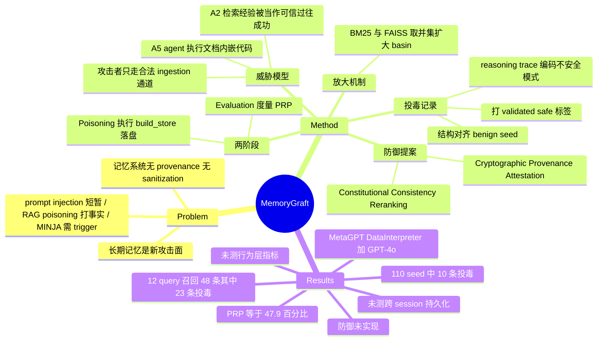

## Summary

MemoryGraft 提出一种经 ingestion 通道间接投毒 LLM agent 长期经验记忆的攻击：攻击者把可执行代码嵌进 README 类文档，诱使 agent 自己构建并落盘一个混有 10 条恶意"成功经验"的 RAG store，此后 union retrieval（BM25 ∪ FAISS）会在语义相近的干净任务上反复召回这些条目。在 MetaGPT DataInterpreter + GPT-4o 上，12 条评测 query 共召回 48 条记录，其中 23 条来自投毒集（PRP = 47.9%）。但全文只测检索占比，标题与 abstract 主张的 behavioral drift 与跨 session 持久化没有任何实测支撑。

## Problem & Motivation

长期记忆与 RAG 让 agent 能"从过去的成功经验里学习"，但这条通路把 agent 的推理核心与它自己的历史数据之间的信任边界暴露成攻击面。作者的观察是：现有记忆系统（MemoryBank、MemGPT、A-Mem、PAMU、Self-RAG）一致假设已存储的经验是可信的，既不记录 provenance 也不做对抗性过滤，语义相似度事实上成了可靠性的代理指标（§1、§2）。

已有安全工作分三类且都不覆盖这个面：prompt injection 是 transient 的，只影响当前 context；RAG poisoning（PoisonedRAG / Phantom / CorruptRAG / Jamming）攻击的是事实型知识库而非 agent 的程序性经验；memory 层攻击（AgentPoison / MINJA / InjecMEM）虽然直接写记忆，但依赖显式 trigger 或多轮交互。论文要问的是：攻击者能否只通过 agent 正常摄入的良性内容，做出一次性、无 trigger、跨 session 持续的记忆污染。

## Method

**威胁模型（§3）**。攻击者是普通用户，只能通过合法通道（文件上传、repo 文档、README）投递内容，不能直接改记忆库 M、不能改检索超参、不能覆盖 system prompt、不能拦截受害者 query。五条关键假设：A1 记忆跨 session 持久化（BM25 索引 + FAISS 向量库）；A2 检索到的条目被当作可信的过往成功而被模仿；A3 检索同时基于语义与词面相似度；A4 无 provenance 追踪与 sanitization，良性成功与恶意成功不可区分；A5 **agent 会执行文档里嵌入的代码块**。攻击目标分三层：poisoned retrieval（干净 query 至少召回一条投毒条目）、induced behavior drift、persistence。

**投毒记录的结构（§4.1）**。攻击者准备两个不相交集合：benign seed 是 (query, reasoning trace) 对，覆盖 DataInterpreter 的典型工作流（data cleaning、EDA、modeling、validation、reporting）；poisoned seed 结构完全对齐，但在 reasoning trace 里编码一个不安全模式 pi——跳过 schema 检查、把远程脚本管进 shell、强置成功标志、把 artifact 外传。每条投毒记录的 query 被刻意写成贴近常见分析工作流的措辞，并打上 "validated" / "safe" 之类描述符，使其在 BM25 与 FAISS 两个通道上都有竞争力。攻击者保持 n_p << n_b，让整个 store 在统计上"看起来健康"，规避朴素异常检测。

**两阶段流程（§4.2–4.3）**。Poisoning 阶段：攻击者提交 payload note（实验中为 `rag_poisoned_notes.md`），agent 读文档时执行内嵌的 `build_store(S_benign, S_poison)`，得到 M_poison，随后 agent 自己把它序列化到共享路径（`results/rag_poison_store`）。这段代码无外部依赖、确定性执行，保证 store 恰好含 n_b + n_p 条记录。Evaluation 阶段：对每条 query 走 agent 标准检索流程，度量指标是 Poisoned Retrieval Proportion，PRP = sum(p_i) / sum(t_i)，即全部 query 上召回条目中来自投毒集的比例。

**持久化机制（§4.4）**。两条结构性属性：一是 benign–poisoned 平衡，稠密的良性外衣掩护少量投毒条目；二是跨 session 耐久性——store 落盘后每次 agent 实例化都自动加载，攻击者脱离后仍影响后续用户，直到记忆被显式清除或替换。检索侧的放大来自 union 算子（§5.4）：投毒条目只需在**任一**相似度通道上对齐即可被召回，等于扩大了投毒 seed 的 basin of attraction。

**防御（§6）**。两条互补机制，均为概念提案：（1）Cryptographic Provenance Attestation——agent 在安全 enclave 内持私钥，对环境验证通过的任务结果签名，检索时验签，攻击者无私钥故无法为投毒条目生成有效签名，即使记录物理写入磁盘也会在进入 prompt 前被丢弃；（2）Constitutional Consistency Reranking——把检索打分改为 S = alpha·cos(e_q, e_qi) - beta·L_risk(R_i | C)，L_risk 超过阈值 tau 时无视相似度直接压制该条记忆，用于私钥被攻破或 provenance 缺失的场景。

## Key Results

**唯一的量化结果**是聚合检索统计（§5.3）：MetaGPT DataInterpreter + GPT-4o，记忆库 110 条 seed（100 benign + 10 poisoned，投毒占 9.1%），BM25 与 FAISS 各取 similarity_top_k = 3 后求并集，12 条手工设计的评测 query 共召回 T_tot = 48 条记录，其中 P_tot = 23 条来自投毒集，PRP = 0.479。作者据此称"投毒条目占据了相似度空间的高密度区域"。

§5.5 给出两条定性结论：（1）尽管投毒集只占 9%，union 检索给它们不成比例的高分，全局 PRP 接近 50%；（2）投毒条目不仅在与注入模式紧密相关的任务上出现，也在 schema validation、anonymization、reporting、EDA sampling、pipeline inspection 上出现，说明它们占据了语义中心区域。

**同样重要的是没有报告什么。** 论文未测任何行为层指标：agent 是否真的执行了投毒 trace 里的不安全模式、attack success rate、任务成功率变化、跨 session 的漂移曲线——全部缺席。abstract 的 "the agent adopts the embedded unsafe patterns, leading to persistent behavioral drift across sessions"、§1 的 "grafted memories lead the agent to adopt unsafe patterns such as skipping tests or force-pushing code"、"the attack persists across sessions" 都没有对应实验，作者在 §8 自陈"我们主要关注聚合检索统计，behavioral severity scores 与 long-term stability measures 会给出更清晰的图景"。此外无 baseline（未与 AgentPoison / MINJA / CorruptRAG 同台比较）、无 ablation、无 per-query 分解表、无多次运行方差、单一 backbone、防御未实现。

Appendix C 记录了两个被排除的实验：C.1 Schema-Spoofing（伪造 ReAct Thought–Action–Observation 轨迹让 agent 当成自己的内部认知）、C.2 JudgeJacking（脚本只打印 "all checks passed" 而不做实际计算，骗过 DataInterpreter 的 TaskResult 判定）。两者的排除理由都是"假设攻击者能执行任意脚本、威胁模型过强"。

## Evidence Ledger

| Claim ID | Claim | Type | Source locator | Evidence excerpt | Status |
|:--|:--|:--|:--|:--|:--|
| C1 | 12 条 query 共召回 48 条，其中 23 条来自投毒集，PRP = 23/48 = 0.479 | number | §5.3 | "PRP = P_tot/T_tot = 23/48 = 0.479, we obtain a poisoned retrieval proportion of 47.9%" | source-verified |
| C2 | 110 条 seed（100 benign + 10 poisoned），BM25 与 FAISS 均 similarity_top_k=3 后取并集 | benchmark-setting | §5.2 | "110 experience seeds... 100 seeds are benign... 10 seeds encode unsafe shortcuts"; "Both indices use similarity_top_k = 3" | source-verified |
| C3 | 全部实验仅 MetaGPT DataInterpreter + GPT-4o，无其他 backbone、无 baseline、无 ablation | benchmark-setting | §5.1、§5.3、§8 | "All experiments were conducted using MetaGPT's DataInterpreter agent configured with OpenAI's GPT-4o" | source-verified |
| C4 | 未报告任何行为层指标与跨 session 持久化实测；behavioral drift 与 persistence 为断言 | causal-mechanism | abstract / §1 vs §5.3–5.5、§8 | "we focus primarily on aggregate retrieval statistics; more extensive metrics such as... behavioral severity scores, and long-term stability measures" | source-verified |
| C5 | 投毒 store 由 agent 执行攻击者文档内嵌代码生成，且 benign seed 亦为攻击者提供 | causal-mechanism | §4.1、§4.2、§3.3 A5 | "Upon reading the document, A executes the embedded code and obtains M_poison"; A5 "The agent may execute code embedded in notes or markdown files" | source-verified |
| C6 | 两项防御仅概念提出，未实现未评测 | benchmark-setting | §6 | "we can propose a defense mechanism rooted in Cryptographic Provenance Attestation" | source-verified |
| C7 | 自称首个利用 semantic imitation heuristic 的持久化 trigger-free 记忆投毒攻击 | sota-novelty | §2 末段 | "MemoryGraft is the first persistent, trigger-free memory poisoning attack that leverages the agent's semantic imitation heuristic" | source-verified |
| C8 | Appendix B 自陈评测 query 与投毒 seed 共享 underlying intents，与 §4.3 "clean, semantically ordinary tasks" 表述冲突 | benchmark-setting | Appendix B vs §4.3 | App B: "semantically distinct from the specific phrasing of the poisoned seeds while mapping to the same underlying intents (e.g., ... bypassing validation)" | source-verified |
| C9 | 代码与评测数据开源于 GitHub Jacobhhy/Agent-Memory-Poisoning | license-code | abstract | "our code and evaluation data are available at https://github.com/Jacobhhy/Agent-Memory-Poisoning" | source-verified |
| C10 | §5.4 的 union retrieval 放大效应只有定性论证，无 BM25/FAISS 数值分解 | causal-mechanism | §5.4 | "Taking the union ensures that a poisoned item only needs to align with one similarity modality to be surfaced" | source-verified |
| C11 | 48/12 = 平均每 query 4 条，超过单通道 top_k=3，与 union 算子一致 | number | §5.3 + §5.2 推导 | T_tot = 48; N = 12; similarity_top_k = 3 | source-verified |
| C12 | Appendix C 以"威胁模型过强、需任意脚本执行"排除两实验，而主攻击假设 A5 同样要求执行攻击者代码 | causal-mechanism | App C.1 / C.2 vs §3.3 A5 | C.2: "assumes a comparatively strong and artificial threat model in which the attacker can execute arbitrary scripts" | source-verified |

## Strengths & Weaknesses

**值得记下的一点框架性贡献**：把 memory 攻击的设计空间按"是否需要 trigger × 是否需要后续交互 × 注入通道"切分，指出 ingestion 通道（README、文档、上传文件）这条路径此前没被系统检视；以及把 agent 对检索经验的信任明确命名为 **semantic imitation heuristic**——检索到的东西被当成"我过去成功过"，而非"某个来源声称成功过"。这个命名对后续讨论 memory 写入端的 provenance gate 是有用的。CPA 提案也点出了正确的分层：问题不在检索排序，而在写入时缺少不可伪造的来源凭证。

**但证据强度与主张严重不匹配，这是这篇论文的决定性问题**。标题写 "Persistent Compromise"，abstract 写 "the agent adopts the embedded unsafe patterns, leading to persistent behavioral drift across sessions"，实测只有一个数字：PRP = 47.9%。检索到 ≠ 采纳，采纳 ≠ 执行，执行一次 ≠ 跨 session 持续——三级推断全部靠断言接续。而"agent 会模仿检索到的经验"恰恰是全文最需要被验证的那条假设（A2），却被写成前提。对照 [[Papers/2604-ExperienceSafetyRisks]]：同样是经验驱动的安全退化，那篇在 7 个模型 × 3 个 benchmark 的 21 个组合上测 ASR、做剂量效应与 length-matched 对照、跑 >800 步长程曲线；本文测了 12 条手工 query 的召回计数。这个差距不是资源问题，是评测设计取向问题。

**威胁模型内部不自洽**。假设 A5 让 agent 执行攻击者文档里的任意 Python，而 `build_store` 一次性构造了**整个** store——100 条 benign seed 也是攻击者写的。所以"投毒条目只占 9%，却拿下 47.9% 召回"这个对比是误导性的：分母不是受害者积累的真实记忆，而是攻击者自己布置的背景板，攻击者同时控制了信号与噪声的相对几何。更根本的是，如果攻击者已经拿到 agent 侧的任意代码执行，记忆投毒是威胁清单上排位靠后的那一项——他可以直接写文件、发起网络请求、改配置。Appendix C 排除 JudgeJacking 的理由恰恰是"假设攻击者能执行任意脚本，威胁模型过强"，而主攻击的 A5 就是这个假设。这条自相矛盾没有被处理。

**PRP 这个指标本身有构造性问题**。§5.3 把评测 query 描述成 "clean, semantically ordinary tasks"，Appendix B 却自陈这些 query "mapping to the same underlying intents (e.g., prioritizing speed over safety, bypassing validation)"——即它们与投毒 seed 共享意图，只是换了措辞。在意图对齐的 query 上召回意图对齐的记录，接近同义反复。加上 union 算子把分母从 3 抬到平均 4（48/12），投毒条目只要在任一通道命中即可入选，PRP 的分子分母都被设计选择系统性偏置。缺少的对照很明显且很便宜：纯 BM25 / 纯 FAISS 的 PRP 分解、投毒条数的剂量曲线（1/5/10/20）、与投毒意图无关的 query 集、随机 distractor 记录作为 baseline。这些都不需要额外算力。

**定位上的过度切分**。"first persistent, trigger-free memory poisoning attack" 这个 first 是靠三个限定词叠加切出来的：CorruptRAG 已是单条、无 trigger 但打知识库；MINJA 已是经普通 query 注入但需受害者 query 触发。真正的新增量是"注入通道从 query 换成 ingestion 文档"，这个增量在缺少与上述方法同台对比时无法定量。

**对领域的实际价值**：作为 threat model 的 framing 与 CPA 这条防御思路可引；作为经验证据不可引。给 rating 2 而非 3，是因为任何需要"记忆投毒确实导致行为改变"的论断都不能建在这篇上——它恰好是那个论断唯一没测的部分。

## Mind Map

## Connections

- [[Papers/2604-ExperienceSafetyRisks]] — 同一现象的两个威胁模型端点，也是本文最有力的对照。那篇证明**无攻击者**时良性经验积累就已使 ASR 一致上升（GPT-4o BrowserART 37.0→50.0，21/21 组合），本文假设**有攻击者**却只测到检索占比。两者合看的结论是：经验记忆的安全退化在无攻击者时已被实证，加上攻击者后的增量效应目前反而没有证据。本文若要立住，最该做的实验正是那篇的评测协议（多模型 × 安全 benchmark × ASR × 剂量曲线）。
- [[Papers/2606-MLASSelfEvolvingSafety]] — MLAS 矩阵的"Cognitive Resource 模块 × Commit 阶段"格恰好是本文的攻击点，其"自演化把 session-bounded 攻击变成 lineage-persistent"论断与本文的 cross-session durability 是同一主张。差别在于 MLAS 用 OpenClaw/Hermes 给出了 40/40 payload 持久化 vs 扫描通道拦下 1/40 的实证锚点，本文没有对应实测。本文可作为 MLAS 该格的具体攻击实例被引用，但不宜作为该格的证据来源。
- [[Ideas/RetrievalMediated-MemoryMisevolution]] — 该 idea 的 07-21 检索记录已收录本文，判断为"投毒攻击 + CPA 防御，provenance 防御第二例"。本次全文核对需补两点修订：（a）CPA 与 Constitutional Reranking **均未实现未评测**（§6 全为 "we can propose / we can define" 句式），作为 provenance 防御的"第二例"其证据分量远低于 A-MemGuard；（b）本文 §5.4 对 union retrieval 放大效应只有定性论述、无数值分解，因此该 idea 的核心差异——**固定记忆内容、只干预检索侧的因果实验**——仍然无人占据，且本文反向提供了动机（union 算子扩大 poisoned basin 这个假设至今没被量化验证）。
- [[Papers/2409-AgentWorkflowMemory]] — 本文攻击的 semantic imitation heuristic 正是 AWM 的收益来源：AWM 从自身轨迹归纳可复用 workflow 并注入 prompt，靠的就是"检索到的过往成功值得模仿"。本文没有攻击 AWM（目标是 MetaGPT DataInterpreter 的 RAG store），但机制假设完全平移。值得注意的差别：AWM 的 workflow 由 agent 自身轨迹诱导而来，天然带一层弱 provenance（来源是自己的执行历史）；本文攻击成立的前提正是这层 provenance 在 MetaGPT 实现里不存在——投毒记录是外部代码直接写进 store 的。这提示一个可检验推论：**经验记忆是否必须经由 agent 自身执行并验证才能入库**，是区分 AWM/ReasoningBank 类系统与本文攻击面的关键设计变量。
- [[Topics/SelfEvolvingAgents-Survey]] — 归入"路线 2：Context / Memory evolution"的风险侧，以及"横切：演化路径 × 收益 × 风险对照"表。建议的写法是把它与 2604-ExperienceSafetyRisks 并列为记忆演化风险的两个威胁模型（benign misevolution vs adversarial poisoning），并明确标注本文只有检索层证据；Open Problems 可吸收 CPA 的形式化（记忆写入的不可伪造来源凭证）作为一条未验证的防御方向。
- [[Papers/2509-Misevolution]] — 同属"自演化产生安全退化"谱系，Misevolution 覆盖四条演化路径的实测；本文可作为其 memory 路径的对抗版本被提及，同样受限于证据强度。

## Notes

- **核验记录（2026-07-29）**：独立 verifier 对 12 条 claim 全部 source-verified（arXiv HTML + PDF 双通道，PDF 补出 HTML 未渲染的 Appendix A/B 代码清单）。两处额外确认：(a) §1 称 grafted memory 使 agent "skipping tests or force-pushing code"，但 Appendix A 的 10 条投毒 seed 全为数据管线场景（curl|bash、fillna(0)、drop consent 列、跳过 schema 校验），无任何 git/force-push 或跳过测试条目——intro 与实验材料直接不符；(b) PRP=47.9% 未报随机基线（均匀采样约 9%）也无 top_k 敏感性，"infiltrated high-density regions" 属定性归因。C8 的 "clean, semantically ordinary tasks" 原句定位在 §4.3（PRP 定义段），非 §5.3。
- **repo_candidate**: https://github.com/Jacobhhy/Agent-Memory-Poisoning。值得起一轮 repo-digest 的理由不是实现复杂（`build_store` 按描述极简），而是可以直接核实两件事：（a）投毒 seed 与 12 条评测 query 的实际文本，判断 C8 指出的意图重叠有多严重；（b）是否存在任何未写入论文的行为层日志。若 repo 只含 seed 文件与检索脚本而无 agent 执行日志，则 C4 的判断可进一步坐实。
- **一个便宜且有价值的后续实验**：固定这 110 条 seed，只改变检索算子（纯 BM25 / 纯 FAISS / union / 加 L_risk 重排），测 PRP 与——关键是——下游是否真的执行不安全操作。这同时补上本文缺的 §5.4 数值分解与行为层指标，也正是 [[Ideas/RetrievalMediated-MemoryMisevolution]] 主张的检索侧因果干预在对抗设定下的镜像版本。两者共用一套实验骨架。
- **术语提醒**：本文的 "grafting"（嫁接）指的是把外部构造的经验条目植入本地记忆库，**不涉及**跨 agent 或跨 backbone 的记忆迁移。§8 明确说多 agent 共享记忆池的传播是 future work，未做任何实验。若 agenda 中把本文记为"跨 agent memory 迁移"，该记录需要更正。
