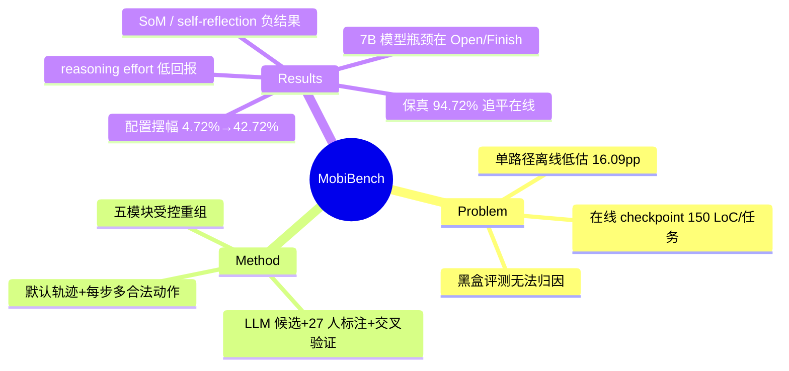

## Summary
MobiBench 用"单条默认轨迹 + 每步标注多个合法动作（branch）"解决离线 benchmark 单路径低估问题（与人类评审一致率 94.72%，与在线 AndroidWorld 持平），并把 mobile GUI agent 拆成 Screen Parser / History / Prompting / Reflection / LFM 五个可控重组模块——backbone 固定为 GPT-4.1 时，仅改模块配置 TSR 就从 4.72% 摆到 42.72%，证明模块层评测比端到端黑盒评测信息量大得多。

## Problem & Motivation
现有 mobile GUI agent 评测两难：离线 static benchmark（AITW 等）每步只有一条 "golden path"，而 mobile 任务每步平均有 2.95 个合法动作，偏离即判错，系统性低估能力（实测低估 16.09 pp，相对 49.9%）；在线 benchmark（AndroidWorld 等）支持多路径但 checkpoint 工程量巨大（AndroidWorld 116 任务需 17,458 行 checkpoint 代码、约 150 LoC/任务），app 更新随时静默失效，且只能覆盖少数简化的开源 app。此外所有 benchmark 都把 agent 当黑盒，无法区分性能来自模型还是 pipeline 中某个模块，导致不公平比较与"过时 heuristic 被盲目沿用"。

## Method
两个核心设计：
- **Multi-Branch Static Dataset**：不穷举所有轨迹（组合爆炸，估算需 6,533 页 vs 实际 991 页标注量），而是保留一条默认轨迹，在每步标注所有合法动作。agent 选中任一合法动作即该步正确，然后沿默认轨迹推进（history 按默认动作更新）。核心洞察：每步选合法动作 ≈ 走了一条正确路径，step-wise action validity 是任务成功的强代理。构建管线：从 LlamaTouch/MobileGPT/Meta-GUI/AndroidWorld 采样默认轨迹 → GPT-o3 + Gemini 2.5-Pro 生成候选动作 → 27 名非专家标注者增删 → 3 人交叉验证多数投票。最终 508 任务、66 app、4,173 截图、12,339 标注动作。
- **Modular Benchmark Architecture**：把 agent 分解为 Screen Parser（a11y-HTML / a11y-List / raw image / image+标注 / Hybrid-SoM / Hybrid-Raw+a11y）、History Generator（raw trace / pre-action / post-action 摘要）、Prompting Style（action-only / ReAct / few-shot）、Reflection（有/无）与 backbone LFM，逐模块增量调优做受控重组。

## Key Results
全部来自全文：
- **保真度**：MobiBench 与人类评审一致率 **94.72%**，与在线 AndroidWorld（94.90%）持平；单路径静态版仅 **50.15%**，低估 agent 能力 **16.09 pp（相对 49.9%）**。最优配置在单路径数据上也被低估 15.36 pp（42.72→27.36）。
- **模块配置的影响幅度**：GPT-4.1 固定，最差配置（raw image parser）TSR **4.72%** → 最优配置（Hybrid parser + post-action summary + action-only + 无 reflection）**42.72%**；GPT-4.1 mini 最优 32.68%（需 ReAct）；nano 全配置崩（≤3.74%），GUI 交互存在最低能力门槛。
- **无普适配置**：ReAct 给 mini +8.07 pp 但让 GPT-4.1 略降（42.72→40.94）；视觉输入给 mini 2.7 倍提升但 GPT-4.1 仅 +16%；post-action 摘要利好小模型。最优配置 model-specific，必须实测。
- **过时 heuristic 的负结果**：SoM 无明显收益，在小模型上反而不如简单的 Raw image+a11y 拼接（mini：10.63% vs 15.94%）；naive self-reflection 在所有模型上一致降分——GPT-4.1 被标记为错误的动作中仅 52.94% 真错，修正 80 个真错的同时误改了 127 个本来正确的动作，净负收益。
- **Fine-tuned 7B 模型的瓶颈定位**：GUI-OWL/UI-Genie/UI-TARS-1.5 整体 TSR 0-7.68%，但排除 Open App 和 Finish 两个动作后跳到 32-39%——失败高度集中于每任务只出现一次的首尾动作（训练数据不平衡所致），upsampling 这两类动作是明确的改进方向。
- **Test-time reasoning 收益有限**：GPT-5.1 reasoning effort None→High 仅 +3.74 pp（40.55→44.29%），代价是成本 +69%、延迟 +212%。作者推断 GUI 交互更依赖 System-1（直觉视觉 grounding）而非 System-2 深思。
- **成本优化**：Action Inference 用 GPT-4.1 + History 摘要 offload 给 mini，性能接近最优而成本 −52%。image-only 环境（iOS/webview 场景）最优 TSR 掉到 26.97%，凸显 a11y 文本结构信息的价值。

## Strengths & Weaknesses
**亮点**：
- Multi-branch 是"离线可复现 vs 在线多路径保真"两难的简洁解法：只标动作分支不标完整轨迹，标注量 6.6 倍缩减，保真度实测追平在线评测。94.72% vs 50.15% 的对比给"单路径评测不可信"提供了迄今最直接的量化证据。
- 受控重组设计让归因成为可能：4.72%→42.72% 的摆幅相当于 GPT-4.1 与 mini 的差距，直接说明大量论文里的"模型 A 比模型 B 强"可能只是 pipeline 差异。
- 一批高价值负结果（SoM 无效、self-reflection 净负、reasoning effort 低回报），且都给了机制层解释；fine-tuned 模型 Open/Finish 瓶颈的诊断具体可操作。
- 局限章节诚实：明确承认无法测错误恢复能力、默认轨迹有"最短路径"标注偏差导致 Complex 任务高估。

**局限**：
- Step-wise greedy 评测本质上不允许任何一步出错，也不允许绕路后返回——恰好把"error recovery"这一在线评测最有价值的维度排除在外；与 CoAct-1 等系统展示的反思纠错能力正交。
- 模块搜索用增量贪心（逐模块固定最优再调下一个），未覆盖模块间交互效应；五模块分解也不含 planning/memory 等非标准模块（作者自认）。
- 仅单 app 任务；multi-app 留待未来。
- 保真度验证只在 AndroidWorld 的 105 个任务、单一 agent（m3a + GPT-4.1）上做，multi-branch 与人类判断的一致性是否随 agent 类型变化未验证（推测存在风险）。

## Mind Map

## Notes
- 与 SeeAct 的 SoM 负结果互相印证（SeeAct: 网页截图上 SoM 幻觉严重；MobiBench: mobile 上 SoM 不如 raw+a11y 拼接），跨平台、跨两年模型代际的一致性让"SoM 对 GUI agent 无效"从单点观察升级为可信 pattern。
- "GUI 交互是 System-1 而非 System-2"的假设与 agentic-RL 路线（scaling domain-specific training）互为论据，可入 survey 的评测方法论章节。
- 模块化归因思路与 GUIDE（2604，层级诊断）目标相近，但 MobiBench 用受控重组（干预）而 GUIDE 用事后诊断（观察），方法论上更强。
