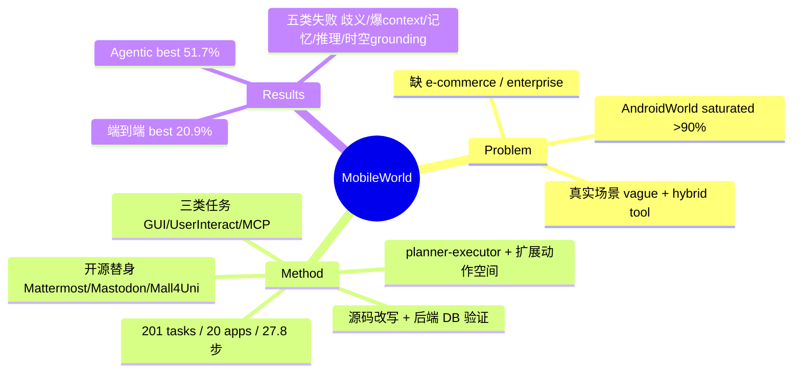

## Summary

针对 AndroidWorld 已饱和（顶尖 agent >90% SR）的问题，MobileWorld 提出一个更难的在线 mobile-use benchmark（201 tasks / 20 apps，均步 27.8 vs 14.3），用开源应用替身（Mattermost 换 Slack 等）换取可复现的后端数据库验证，并首创 agent-user interaction 与 MCP-augmented 两类任务；最优 agentic framework 仅 51.7% SR、端到端模型仅 20.9%。

## Problem & Motivation

作者的核心论断：**AndroidWorld 已经饱和**，近期 agent 在其上突破 90% SR，作为区分度基准已失效。他们进一步指出 AndroidWorld 的两个结构性缺陷：(1) 应用覆盖偏窄，缺少 e-commerce、enterprise communication 等关键品类；(2) 任务不反映真实手机使用场景——真实使用往往是**指令模糊**（vague instruction）且**混合工具**（GUI + 外部工具/API）。因此需要一个既保留 AndroidWorld"可复现环境 + deterministic evaluation"优点、又显著提高难度并贴近真实场景的后继 benchmark。

这个 problem formulation 抓得比较准：mobile agent 领域的评测确实长期在"单 app、指令明确、纯 GUI"的舒适区里，而 saturation 是 benchmark 该被淘汰的硬信号。

## Method

MobileWorld 本质是一个 **environment + task suite + 配套 agentic framework** 的组合。

**环境设计——用开源替身换可观测性。** 为了在"production-grade 真实感"与"可复现验证"之间取得平衡，作者不用真实商业 app（不可控、不可复现），而是部署工业标准的开源替代品：Mattermost 替 Slack、Mastodon 替 Twitter/X、Mall4Uni/Taodian 类电商替 e-commerce app。开源意味着可以改源码、直接访问后端数据库（PostgreSQL）。这带来一个关键性质：**fully observable & controlled environment**——评测时可以直接查后端数据库精确判断任务是否完成，而非靠截图或 LLM judge 猜测。约 95% 任务涉及第三方 app。

**任务构成——三类，强调长程与跨应用。** 共 201 tasks（据 Table 5）：
- GUI-Only：116（57.7%）——纯 GUI 操作。
- Agent-User Interaction：45（22.4%）——**刻意省略关键信息**，逼迫 agent 主动发起澄清对话，而不是幻觉补全。
- MCP-Augmented：40（19.9%）——把外部工具调用（Model Context Protocol）与 GUI 操作混合。

难度来源被明确量化：均步 27.8（AndroidWorld 14.3，近两倍），多应用任务占比 62.2%（AndroidWorld 9.5%）。任务由标注者围绕 e-commerce/communication/productivity 等域设计真实场景，并由人工验证者手动完成以确认可解性（最多 5 次重试后再修订）。

**验证——deterministic，不用 LLM judge。** 多路确定性校验："multi-faceted validation suite"：regex 文本答案匹配、PostgreSQL 后端查询、ADB 读取本地存储、app-specific callback。这一点延续 AndroidWorld 的 deterministic 精神，避免 LLM-as-judge 的噪声。

**配套 agentic framework——planner-executor + 扩展动作空间。** 为了让 agent 能处理新任务类型，作者提供一个 planner-executor 框架，把动作空间从纯 GUI 扩展到"发起用户交互"与"MCP 调用"两类新动作。

> Grounding：环境/任务/验证的整体设计与统计数字来自 abstract + 全文（Table 5 任务分布、Table 8 应用清单）的 WebFetch 提炼；planner-executor 框架的内部细节（如具体 prompt、planner 与 executor 的分工粒度）未逐字核验，属论文自述。

## Key Results

**主结论：相对 AndroidWorld 出现断崖式下跌，留有大量 headroom。**（据全文结果表提炼）

| 系统 | Overall SR | GUI-Only | User-Interaction | MCP |
|:--|:--|:--|:--|:--|
| GPT-5 + UI-Ins-7B（agentic framework） | 51.7% | 54.0% | 62.2% | 51.6% |
| Claude-4.5-Sonnet + UI-Ins-7B | 43.8% | 47.8% | 37.8% | 50.0% |
| Doubao-1.5-UI-TARS（端到端） | 20.9% | 26.3% | 32.4% | — |
| Qwen3-VL-235B | 9.5% | 12.8% | 4.4% | 5.4% |

- 最优 **agentic framework 51.7%**、最优 **端到端模型 20.9%**——与 AndroidWorld 上 >90% 形成鲜明对比，验证了 benchmark 的区分度。
- planner-executor 组合（GPT-5 + grounding 模型）显著优于端到端模型，说明当前端到端 mobile 模型在长程/跨 app/混合工具场景下仍远未成熟。

**五类失败模式（作者归纳）：**
1. **Ambiguity detection**：模型倾向幻觉补全缺失信息，而非请求澄清——直接打在 agent-user interaction 任务的软肋上。
2. **Context overflow**：MCP 工具返回内容过大，撑爆 agent 的 context window。
3. **Memory**：无法跨步追踪已完成的子任务。
4. **Reasoning gaps**：多步逻辑推理与精确数值计算薄弱。
5. **Context awareness**：缺乏对真实设备状态的时空 grounding。

## Strengths & Weaknesses

**Strengths**
- **Problem formulation 到位**：以"AndroidWorld 饱和"为切入点，量化了新 benchmark 的难度来源（步数、跨 app 比例），不是靠模糊的"更难"叙事。
- **"开源替身"是聪明的工程折衷**：同时拿到真实感（工业标准软件）、可复现（可部署）与精确验证（改源码 + 直连数据库），绕过了真实商业 app 不可控与 LLM-judge 不可靠两个坑。这是该 benchmark 最有价值的设计决策。
- **两类新任务确有 gap 意义**：agent-user interaction（考察主动澄清而非幻觉）与 MCP-augmented（考察 GUI 与外部工具混合编排）都指向真实 mobile 使用中被现有 benchmark 忽略的能力维度。
- deterministic 多路验证，评测可信度高于 LLM-judge 类 benchmark。

**Weaknesses / 存疑**
- **规模偏小**：201 tasks / 20 apps，绝对量不大；子类样本（MCP 40、User-Interaction 45）偏薄，细分 SR 的统计噪声需谨慎，跨模型比较可能不稳。
- **开源替身 ≠ 真实 app 分布**：Mattermost/Mastodon/Mall4Uni 的 UI 复杂度与交互模式可能系统性区别于 Slack/X/真实电商，泛化到真实 app 的结论需保留。
- **agentic framework 与 benchmark 强耦合**：官方 planner-executor 框架同时是"评测基础设施"与"最强 baseline"（51.7%），存在评测环境对特定 agent 架构友好的潜在偏置；端到端模型是否因动作空间/接口不适配而被低估，值得关注。
- **grounding 局限**：本笔记未获取论文 PDF 逐字全文，具体 prompt、per-app 难度分布、验证器实现细节等未核验；数字以 WebFetch 提炼为准。
- **无公开 code 链接**（截至抓取时论文未给出 GitHub），可复现性承诺的兑现待观察。

**对领域的影响**：作为 AndroidWorld 的直接后继与"下一代难度基准"，若被社区采用，会把 mobile GUI agent 评测从"单 app 明确指令"推向"长程 + 跨 app + 主动澄清 + 混合工具"。它与 A3、AndroidLab、OSWorld 等同属 online GUI benchmark 谱系，卖点是**真实场景任务类型的扩展**而非环境规模。可与 vault 中 MobileGym、AndroidDaily、OpenMobile 等 mobile benchmark 交叉对读。

## Mind Map

## Notes

- 与 AndroidWorld 的对照数字（27.8 vs 14.3 步、62.2% vs 9.5% 多应用）是这篇最有说服力的"难度锚点"，可直接引用做 mobile benchmark 演进的证据点。
- "开源替身换后端可验证性"这一 trick 值得记入 DomainMap：它是 online GUI benchmark 在"真实感 vs 可复现"张力上的一个通用解法，可推广到 desktop/web。
- 待核验（如后续拿到全文）：MCP context overflow 的具体触发阈值、agent-user interaction 的澄清轮次统计、planner-executor 与端到端模型接口是否公平。
- 归属：mobile GUI agent benchmark，canonical survey 为 GUIAgent-Survey，应记账待整合。
