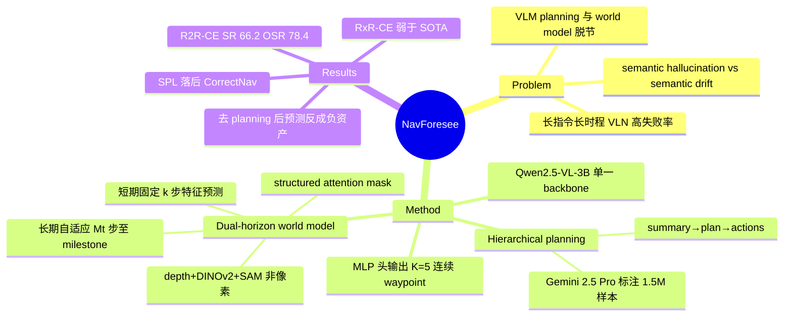

## Summary

NavForesee 用单个 VLM（Qwen2.5-VL-3B-Instruct）同时做显式的 hierarchical language planning（分解指令、追踪进度、生成 sub-goal）和隐式的 dual-horizon world model 预测（短期 k 步环境动态 + 长期自适应至下一 milestone 的高层特征），两者共享表示、交错训练，预测特征经 MLP 生成连续 waypoint 动作。仅用公开 R2R-CE/RxR-CE 数据（Gemini 2.5 Pro 标注的 hierarchical plan 数据集）训练，在 R2R-CE Val-Unseen 取得 SR 66.2 / OSR 78.4 / NE 3.94，SR/OSR/NE 超过此前方法但 SPL 落后于 CorrectNav。

## Problem & Motivation

长指令、长时程的 embodied navigation 中，现有 agent 有两类缺陷：(1) planning 与 memory 不足——部署级 VLM 的 context window 与规划能力有限，容易在环境中"迷路"；(2) 缺乏 predictive foresight——现有模型本质上是 reactive 的，不能预判未来环境状态来主动引导动作。

已有研究把这两条线分开推进：一边是 curated 数据 + CoT 增强 VLM 推理，一边是 world model 预测未来状态辅助规划。作者指出关键缺口在于二者的脱节：VLM-centric agent 会产生 semantic hallucination（plan 与视觉现实脱节），而没有语言引导的 world model 会产生 semantic drift（预测偏离指令目标）。NavForesee 的核心主张是：VLM planning 与 predictive foresight 应统一在一个 VLM 内互相强化，模仿人类"以 milestone 为锚、忽略路径细节"的分层导航方式。

## Method

**问题设定**：agent 每步接收 panoramic RGB 观测 $o_t$，维护过去 H 帧记忆，策略输出 K=5 个未来 waypoint（$w = [x, y, \sin\theta, \cos\theta, c]$，c 为 stop flag），无 depth/odometry 输入。

**1. VLM-driven hierarchical planning 数据集（Sec 3.2）**：用 Gemini 2.5 Pro 处理 R2R-CE（10k episodes）与 RxR-CE（20k episodes），把长指令分解为顺序 sub-instruction 并标出 keyframe milestone；每个采样 waypoint 配 planning label（navigation summary / future plan / language action）。产出约 1.3M（RxR-CE）+ 0.2M（R2R-CE）训练样本；清洗时移除最后 milestone 与终点错位的 case（16.7%），并对原占 61.79% 的直行（<30° 转角）样本下采样。

**2. 统一架构（Sec 3.3）**：backbone 为 Qwen2.5-VL-3B-Instruct，两类训练目标交错：
- *Hierarchical planning training*：文本 planning 数据直接走 Qwen 原生 encoder 做 auto-regressive 训练，输出 summary（已完成 sub-instruction）→ plan（下一 sub-instruction）→ actions。
- *World model training*：引入 position encoder（编码相对位姿）与两组 learnable **dream queries**（short-term $Q_S$、long-term $Q_L$，各自再分 depth/semantics 子 query）及 action query $Q_a$，拼接进多模态输入；lightweight convolutional decoder 把 dream embedding 解码为环境特征，MLP 头预测动作。

**3. Dual-horizon 预测（Sec 3.4）**：预测目标是 depth、DINOv2、SAM 等高层特征而非原始像素（借鉴 latent-space world model 与 DreamVLA，规避昂贵的像素生成）。短期预测固定 k 步（服务局部避障与动态理解）；长期预测自适应外推 $M_t$ 步——horizon 由"距下一 milestone 的进度"决定，sub-goal 意图经共享表示隐式编码进 planning-aware hidden state。**Structured attention mask**：long-horizon 预测依赖 short-horizon 预测作为 guidance（保证时序一致）；depth 与 semantics query 互相 mask（防跨模态泄漏）；action query 可 attend 全部信息。因果 mask 保证 short-term embedding 先生成、long-term 以其为条件。

**4. 动作策略与损失（Sec 3.5-3.6）**：action embedding $E_a$ 由 backbone 处理 action query 得到，inverse dynamics 模型 $M_{inv}$ 以 $E_S, E_L, E_a$ 为输入预测 $\hat{a}_{t:t+k}$。总损失 $L = \alpha L_d + \beta L_c + L_a$：depth 用 pixel-level SiLogLoss，semantics 特征与 action 用 MSE。训练细节在 supplementary（本次未获取）。

## Key Results

评测在 Habitat 仿真（R2R-CE：15° 最小转角、90° HFOV；RxR-CE：30° 最小转角、79° HFOV），仅用公开 R2R-CE/RxR-CE 数据训练。

- **R2R-CE Val-Unseen**（Table 1）：NE 3.94 / OSR 78.4 / SR 66.2 / SPL 59.7。相对此前最好方法（CorrectNav）SR +1.1、OSR +10.9、NE −0.30；但 **SPL 59.7 低于 CorrectNav 的 62.3**。
- **RxR-CE Val-Unseen**：NE 4.20 / SR 66.3 / SPL 53.2，低于 CorrectNav（4.09 / 69.3 / 63.3）。作者承认在 RxR-CE 上略差于 SOTA，归因于自己只用公开数据而其他方法用了更大规模多样数据（该归因无 controlled 实验支持）。
- **模块 ablation**（Table 2）：全模块 SR 66.2；去掉 VLM planning 骤降至 48.8（SPL 59.7→39.4）；去掉 long-term prediction 降至 58.6；三模块全关 52.6。注意**全关（52.6）反而高于只关 planning 保留双 horizon 预测（48.8）**——没有语言 planning guidance 时，world model 预测似乎是负资产（与作者动机中的 semantic drift 假设一致），但论文未讨论这一行。
- **短期 horizon**（Table 3）：k=5 最优（SR 66.2），k=4 → 64.1，k=3 → 56.5；作者归因于 k 与 action space（K=5 waypoints）匹配。
- 定性结果（Fig 4/5）：预测的 depth 偏粗糙但保留全局几何与空间布局；对转弯场景可泛化，能从对房间的一瞥推断床的形状位置与 depth 分布。

## Evidence Ledger

| Claim ID | Claim | Type | Source locator | Evidence excerpt | Status |
|:--|:--|:--|:--|:--|:--|
| C1 | R2R-CE Val-Unseen：NE 3.94 / OSR 78.4 / SR 66.2 / SPL 59.7 | number | Table 1, p.6 | "NavForesee(Ours) ... 3.94 78.4 66.2 59.7" | source-verified |
| C2 | 论文声称 R2R-CE val unseen 上相对 SOTA 提升 SR 1.1%、OSR 10.9%、NE 降 0.3m | sota-novelty | Sec 4.1, p.5 | "achieves SOTA performance by improving SR by 1.1%, OSR by 10.9%, and reducing NE by 0.3 m" | source-verified |
| C3 | R2R-CE 上 NavForesee SPL (59.7) 低于 CorrectNav (62.3) | comparison | Table 1, p.6 | "CorrectNav ... 62.3" (bold SPL) vs "NavForesee ... 59.7" | source-verified |
| C4 | RxR-CE 上 NavForesee (SR 66.3/SPL 53.2) 低于 CorrectNav (69.3/63.3)；作者归因于仅用公开数据训练 | comparison | Table 1 + Sec 4.1, p.5-6 | "performs slightly worse than SOTA methods on RxR-CE ... we train soly ... whereas other methods exploit diverse and large-scale datasets" | source-verified |
| C5 | backbone 为 Qwen2.5-VL-3B-Instruct | benchmark-setting | Sec 3.3, p.4 | "We adopt Qwen2.5-VL-3B-Instruct [3] as the backbone." | source-verified |
| C6 | Gemini 2.5 Pro 处理 R2R-CE (10k) + RxR-CE (20k) episodes，产出 ~1.3M (RxR-CE) + 0.2M (R2R-CE) 样本 | number | Sec 3.2, p.4 | "processed with Gemini 2.5 Pro ... approximately 1.3M training samples from RxR-CE and 0.2M from R2R-CE" | source-verified |
| C7 | 移除末 milestone 错位 case（16.7%）；下采样原占 61.79% 的直行样本（<30° 转角） | number | Sec 3.2, p.4 | "removed cases where the last milestone misaligns with the end goal (16.7% removed) ... 61.79% straight-motion cases (< 30° turn)" | source-verified |
| C8 | 预测 depth/DINOv2/SAM 高层特征而非像素（如 DreamVLA）；短期固定 k 步，长期自适应 M_t 步至下一 milestone | causal-mechanism | p.2 + Sec 3.4, p.5 | "forecasts ... high-level features—depth, DINOv2, and SAM ... as in DreamVLA"; "fixed horizon k whereas long-term predictions adaptively extrapolate over M_t steps" | source-verified |
| C9 | Structured attention mask：long-horizon 依赖 short-horizon；depth/semantics query 互 mask；action query attend 全部 | causal-mechanism | Sec 3.3, p.5 | "Long-horizon predictions naturally depend on short-horizon ... Mutual attention between depth and semantics queries is masked ... action query attends to all available information" | source-verified |
| C10 | Ablation：去 planning SR 66.2→48.8（SPL 59.7→39.4）；去 long-term 预测 →58.6；全关 →52.6 | number | Table 2, p.6 | Row2 "48.8 75.5 5.61 39.4"; Row4 "58.6 76.4 4.47 50.1"; Row5 "52.6 67.4 5.53 46.7" | source-verified |
| C11 | 三模块全关的 SR (52.6) 高于仅关 planning 保留双 horizon 预测的 48.8 | comparison | Table 2, p.6 | Row 5 (all ✗) SR 52.6 vs Row 2 SR 48.8 | source-verified |
| C12 | k=5 最优（SR 66.2），k=3 降至 56.5；归因于与 action space K=5 匹配 | number | Table 3 + Sec 4.2, p.6 | "k=5 66.2 ... k=3 56.5"; "matching the horizon to the action space (k = 5) is optimal" | source-verified |
| C13 | 论文声称 "achieves the highest OSR across both datasets"，但 Table 1 RxR-CE 部分仅报 NE/SR/SPL、无 OSR 列，该 claim 不可由论文内数据核对 | sota-novelty | Sec 4.1, p.5 + Table 1, p.6 | "it achieves the highest OSR across both datasets"；Table 1 RxR-CE 列仅 "NE↓ SR↑ SPL↑" | source-verified |
| C14 | 每步输出 K 个 waypoint（K×5 维），w=[x,y,sinθ,cosθ,c]（c 为 stop flag）；预测特征喂给 MLP action policy | benchmark-setting | Sec 3.1, p.3 + p.2 | "K future waypoints w ∈ R^{K×5} ... binary flag c ... fed to an action policy module which is simply an MLP" | source-verified |
| C15 | 总损失 L = αL_d + βL_c + L_a；depth 用 pixel-level SiLogLoss，semantics 与 action 用 MSE | benchmark-setting | Sec 3.6, p.5 | "L_d ... Scale-invariant Logarithmic Loss (SiLogLoss) at the pix-level ... L_c and action error L_a ... (MSE)" | source-verified |

注：C13 为关于论文自身表述与表格不一致的 meta-claim，"source-verified" 指其两个组成部分（正文原话 + Table 1 无 RxR-CE OSR 列）均在原文确认。

## Strengths & Weaknesses

**Strengths**

- **统一机制干净**：planning 与 world model 共享一个 backbone 并交错训练，long-term 预测的 horizon $M_t$ 由 planning-aware hidden state 隐式决定——"plan 引导预测、预测反哺动作"的闭环不是拼接两个模块，而是共享表示层面的耦合。这是对 "VLM 有 hallucination、world model 有 drift" 这一互补失效模式的直接回应。
- **Ablation 信息量大**：三模块逐一关断（Table 2）+ horizon 扫描（Table 3），且 Table 2 隐藏着一个作者没点破的反直觉 pattern（全关 52.6 > 只关 planning 48.8），反向印证了 world model 预测必须有语言 guidance 才有正贡献——这是全文最有信息量的一行数据。
- **数据 recipe 透明**：Gemini 2.5 Pro 标注管线、16.7% 清洗率、直行下采样比例都有交代；只用公开 R2R-CE/RxR-CE 数据取得 first-tier 成绩，可比性好。
- 预测高层特征（depth/DINOv2/SAM）而非像素，规避了 video-generation 类 world model 的推理开销，与 HNR、DreamVLA 一脉，适合部署侧。

**Weaknesses**

- **SOTA claim 有选择性**：SR/OSR/NE 领先但 SPL 落后 CorrectNav 2.6 pts（路径效率更差，与 OSR 大幅领先合看，可能是"探索更多、走得更绕"）；且 "highest OSR across both datasets" 的说法无法用论文内表格核对（RxR-CE 无 OSR 列），有 overclaim 风险。
- RxR-CE 上明显落后（SPL 差 10 pts），"训练数据规模"的归因没有 controlled 实验支持——也可能是 30° 粗转角 + 79° 窄 FOV 设定下 dual-horizon 预测本身失效，论文未区分。
- Hierarchical plan 的 ground truth 是 Gemini 2.5 Pro 生成的，标注误差如何传播到下游未量化；本质上是 VLM distillation + 世界模型辅助，planning 能力上限受教师模型约束（推测，论文未讨论）。
- 训练细节全在 supplementary（未获取）；无 code 链接；纯 Habitat 仿真、无真机实验，sim-to-real 未知。

**影响判断**：与 [[2603-PROSPECT]]、FutureNav 等构成 2025 末"world model 信号进 VLN policy"的 concurrent 一批；NavForesee 的差异化在显式语言 planning 与预测的联合，而非预测目标本身。同组（AMAP）后续的 [[2607-ABotN1]] 在 R2R-CE 上已全面超过它（仅 OSR 除外），本文更大的价值是机制 ablation 而非 leaderboard 位置。

## Mind Map

## Notes

- CVF Open Access 版：https://openaccess.thecvf.com/content/CVPR2026/html/Liu_NavForesee_A_Unified_Vision-Language_World_Model_for_Hierarchical_Planning_and_CVPR_2026_paper.html （proceedings pp. 32431-32440；除 watermark 外与录用版一致）。arXiv v1 2025-12-01，v2 2026-03-13（本笔记基于 CVF 录用版全文）。
- [[2603-PROSPECT]] 笔记把 NavForesee 归为"pixel/显式 modality 监督"并认为易 overfit texture/lighting——需要 nuance：NavForesee 的 RGB 侧预测的是 DINOv2/SAM 特征（非像素），仅 depth 解码到 pixel-level（SiLogLoss）；"latent vs explicit 预测目标"之争在两篇里都没有 controlled 对照，仍是 open question。
- Table 2 row 2 vs row 5 的 pattern（无 planning 时加 world model 反而更差）值得跨论文追踪：这是"预测信号必须被语言意图 condition 才有用"的少见直接证据，可与 WorldModel-Survey 中 world-model-for-policy 的条目对照。
- 观测仅 panoramic RGB（无 depth/odometry 输入），在 Table 1 的 observation 分类下属较轻输入配置；与离散 waypoint 方法（标 * 者）可比性有限。
