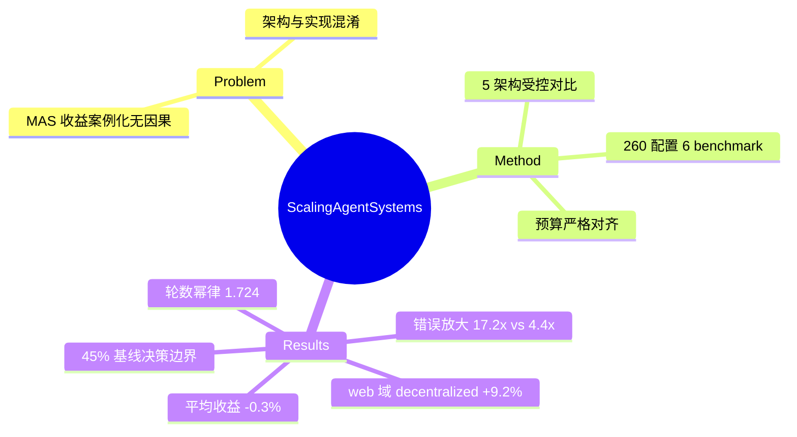

## Summary

对 multi-agent 系统何时优于单 agent 的首个大规模受控研究：260 个配置 × 6 个 agentic benchmark × 5 种架构（单 agent / independent / centralized / decentralized / hybrid）× 3 个模型家族，严格对齐 prompt/工具/token 预算。核心发现：MAS 平均收益 −0.3%（范围 +80.8% 到 −70.0%），架构-任务对齐决定成败；independent 并行的错误放大 17.2×，centralized 的验证瓶颈把它压到 4.4×；单 agent 基线 >45% 时加 agent 几乎必然负收益。

## Problem & Motivation

MAS 在静态 benchmark 上随团队规模单调提升的结论，在需要持续环境交互的 agentic 任务上不成立——但过往比较混淆了架构效应与实现选择（不同 prompt/工具/预算），无法做因果归因。本文问：哪些可测量的任务/系统属性决定协作是帮助还是伤害？

## Method

- **五种架构**（严格控制变量，总 reasoning token ~4,800/trial 对齐）：SAS（单推理位点）；Independent（n 个并行 agent 只做聚合，无通信）；Centralized（orchestrator 协调 r 轮）；Decentralized（全连接辩论 d 轮）；Hybrid（orchestrator + 有限 peer 边）。
- **6 个 benchmark**：BrowseComp-Plus（web 浏览）、Finance-Agent、PlanCraft（顺序规划）、Workbench、SWE-bench Verified、Terminal-Bench。
- 9 个模型（OpenAI/Google/Anthropic，Intelligence Index 42-71）；20 参数回归模型预测架构收益，交叉验证 R²=0.373（能力指数）/0.413（agentic 能力指数）。

## Key Results

- **错误放大谱系（trace 级）**：SAS 1.0× → Centralized 4.4× → Hybrid 5.1× → Decentralized 7.8× → **Independent 17.2×**。centralized 的 orchestrator 验证瓶颈把 independent 的灾难性传播压掉 74%——**无协调的并行是最危险的形态**。
- **何时有效**：可分解任务大赢（Finance centralized +80.8%）；**顺序依赖任务大输**（PlanCraft 全架构 −39~−70%）；高基线任务饱和（SWE-bench 全架构负收益）。
- **Baseline paradox**（β=−0.236, p=0.004）：单 agent 基线 >~45% 后加 agent 负收益；架构选择规则以 P_SA*≈0.45 为决策边界，held-out 预测最优架构准确率 87%（能力-only baseline 54%）。
- **web 任务（BrowseComp-Plus）**：decentralized +9.2%、centralized 持平、independent −35%；信息增益相关性 r=0.18（vs Finance 的 r=0.71）——顺序状态演化强的 web 导航中 agent 间可交换的有效信息很少。
- **通信开销幂律**：轮数 T = 2.72·(n+0.5)^1.724（R²=0.974），hybrid 6.2× 轮数、515% 开销；固定预算下 per-agent token 碎片化使工具重的任务效率坍缩 2-6×。
- 能力线性增益（β=0.126），无超线性涌现（二次项 p=0.977）。

## Strengths & Weaknesses

**Strengths**
- 第一个把"multi-agent 是否有效"从案例叙事变成受控回归的工作；错误放大 17.2×/4.4× 和 45% 决策边界是可直接引用的定量结论。
- "架构-任务对齐"框架有预测力（87% held-out 架构选择），且给出了机制解释：可分解性决定并行收益，验证瓶颈决定错误遏制。
- 对 GUI/web agent 的直接含义：web 导航属于高顺序依赖域，参考其 BrowseComp 结果，naive 并行 multi-agent 在此域收益有限甚至有害。

**Weaknesses / 边界**
- R²=0.373 留下 62.7% 未解释方差——预测相对排序可靠，绝对性能不行。
- 固定总 token 预算天然不利于 MAS（per-agent 容量随规模缩水），备选预算分配未测试；SWE/Terminal 只用 20 实例子集。
- 未覆盖 GUI/OS 桌面域（最接近的是 BrowseComp 文本 web 与 Terminal-Bench）；agent 间并行**探索**（分支搜索式协作）不在架构谱系内——它测的是任务分解式协作。

## Mind Map

## Notes

- 对"multi-agent = 并行原语"的流行叙事是一盆冷水：**并行的价值取决于任务可分解性与验证瓶颈**，GUI/web 的顺序依赖使其属于最难受益的域——与 [[2510-ScalingAgents]]（任务级并行 + 选优在 OSWorld 大赢）表面矛盾，实则区分了两种并行：bBoN 是同任务多副本（无需分解），MAS 是子任务分工（需要分解）。前者绕过了本文识别的失败模式。
- Independent 17.2× 错误放大为 [[Topics/AgentRuntimePrimitives-Survey]] 的并行瓶颈论断（"瓶颈不在生成而在评估"）补充了另一半：无验证的并行不仅选不出好轨迹，还主动放大错误。
- 45% 基线阈值可用于判断当前 GUI agent 是否到了 multi-agent 有益的区间：OSWorld SOTA 已过 60%，按此规则单 agent + test-time 搜索比加 orchestrator 更划算——与 [[2602-AgentAlpha]] 的路线选择一致。
