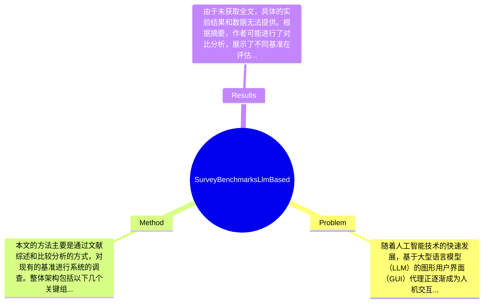

## Summary
本文对基于大型语言模型（LLM）的图形用户界面（GUI）代理的基准进行了全面调查，分析了现有的评估标准和方法，并提出了改进建议，以推动该领域的发展。

## Problem & Motivation
随着人工智能技术的快速发展，基于大型语言模型（LLM）的图形用户界面（GUI）代理正逐渐成为人机交互的重要工具。这些代理能够理解和生成自然语言，从而帮助用户更高效地与软件进行交互。然而，当前在这一领域缺乏统一和系统的基准测试，导致不同研究工作之间的可比性较差，进而影响了技术的进步和应用的推广。解决这一问题的现实意义在于，可以为研究者和开发者提供明确的评估标准，促进更高效的算法开发和应用落地。现有方法的局限性主要体现在以下几个方面：首先，许多研究缺乏系统的评估框架，导致结果的可重复性和可比性不足；其次，现有基准往往针对特定任务，缺乏全面性，无法全面反映代理的性能；最后，评估指标的选择往往不够合理，未能充分考虑用户体验和实际应用场景。基于这些问题，作者提出了对现有基准进行系统调查和分析的动机，旨在为未来的研究提供指导和参考。论文的关键洞察在于，通过对现有基准的全面评估，能够识别出当前评估方法的不足之处，并提出更为合理和有效的改进方案，以推动该领域的发展。 

## Method
本文的方法主要是通过文献综述和比较分析的方式，对现有的基准进行系统的调查。整体架构包括以下几个关键组件：

1. **文献回顾**：作者首先对现有的基于LLM的GUI代理的研究进行全面的文献回顾，识别出主要的研究方向和应用场景。这一部分的设计动机在于了解当前研究的全貌，为后续的基准分析奠定基础。与现有方法相比，文献回顾不仅关注技术实现，还考虑了应用背景和用户需求。

2. **基准分类**：作者对现有的基准进行了分类，主要分为任务导向和用户体验导向两大类。任务导向的基准主要关注代理在特定任务上的表现，而用户体验导向的基准则关注用户与代理交互的质量。这一分类方法的设计意图在于明确不同基准的侧重点，帮助研究者选择合适的评估标准。

3. **评估指标分析**：在这一部分，作者详细分析了现有基准中使用的评估指标，包括准确性、响应时间和用户满意度等。设计动机在于识别出哪些指标能够更好地反映代理的实际性能，并提出改进建议。与现有方法相比，作者强调了用户体验在评估中的重要性，提出应增加对用户交互质量的关注。

4. **案例研究**：作者还通过具体的案例研究，展示了不同基准在实际应用中的表现。这一部分的设计旨在通过实证数据支持理论分析，增强论文的说服力。与现有方法相比，案例研究提供了更为直观的比较视角。

5. **改进建议**：最后，作者提出了一系列针对现有基准的改进建议，包括增加多样化的评估指标、建立统一的评估框架等。这些建议的设计动机在于推动基于LLM的GUI代理的研究进展，提升评估的科学性和合理性。整体来看，本文的方法设计较为简洁，避免了过度工程化，重点突出，逻辑清晰。

## Key Results
由于未获取全文，具体的实验结果和数据无法提供。根据摘要，作者可能进行了对比分析，展示了不同基准在评估LLM-based GUI代理性能方面的表现。可能的benchmark包括特定的任务集和用户体验评估工具，指标可能涵盖准确性、响应时间和用户满意度等。对比分析可能显示了现有方法的不足之处，例如某些基准在准确性上优于其他基准，或者在用户体验评估中存在显著差异。消融实验的结果可能揭示了不同评估指标对整体性能评估的贡献程度。实验的充分性评价需要依赖于具体的实验设计和结果，未获取全文的情况下，无法全面评估实验的充分性和是否存在cherry-picking现象。

## Strengths & Weaknesses
方法亮点包括：
1. **系统性**：本文通过文献综述和分类分析，提供了对现有基准的全面理解，填补了该领域的研究空白。
2. **用户体验重视**：强调了用户体验在评估中的重要性，提出了更为合理的评估指标，推动了评估方法的改进。
3. **实证支持**：通过案例研究，增强了理论分析的说服力，使得研究结果更具实用价值。

局限性包括：
1. **缺乏实证数据**：由于未获取全文，具体的实验数据和结果无法验证，可能影响研究的可信度。
2. **适用范围**：所提出的基准可能在特定领域内有效，但在其他领域的适用性尚未得到验证。
3. **计算成本**：评估方法的复杂性可能导致计算成本较高，限制了其在实际应用中的推广。

潜在影响：本文对基于LLM的GUI代理的评估方法进行了系统性分析，可能为未来的研究提供重要参考，推动该领域的技术进步和应用落地。已知信息包括：作者对现有基准的分析和改进建议。推测信息包括：基于现有研究，可能会有更多研究者关注用户体验在评估中的重要性。未知信息包括：具体的实验结果和数据，未在摘要中提及。

## Mind Map

## Notes
<!-- 其他想法、疑问、启发 -->
