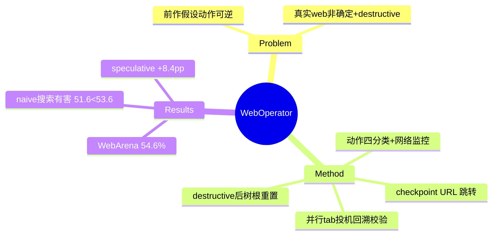

## Summary

WebOperator 修复了 tree search web agent 的核心隐含假设——既有方法（LM-TS/LATS/WebPilot/Branch-n-Browse/WebRollback）全部假设动作可逆，而真实 web 有不可逆的 destructive action。方案：动作按可逆性四分类（safe/destructive/terminating/invalid）+ checkpoint 跳转 + **speculative backtracking**（在并行 tab 里对照 snapshot 逐步校验重放可行性，失败则中止不污染主环境）+ 网络监控检测 destructive（POST/PUT/DELETE）。WebArena 54.6%（gpt-4o），同预算下大幅超过 WebPilot（37.2%）等 tree search 前作。

## Problem & Motivation

五个挑战：LLM 产低质/冗余候选动作；**真实 web 非确定**（异步更新、DOM mutation 使 naive 回溯不可靠）；destructive action 永久改变环境且会使已访问状态失效；穷举搜索开销大。本质：[[Papers/2407-TreeSearchLMAgents]] 的 reset+replay 回溯在真实环境不成立，需要 action-aware 的安全回溯。

## Method

- **动作四分类**：safe（只改临时状态：滚动/下拉/导航）/ destructive（改持久状态：表单提交/删除/登出）/ terminating / invalid。**双重检测**：pre-execution 启发式（按动作类型与按钮语义）+ post-execution 网络监控（GET=safe，POST/PUT/DELETE/PATCH=destructive）。
- **Action-aware best-first search**：动态动作空间（如仅有导航历史时才启用 go_back）、context variation 促生语义不同的候选、DOM/URL 预校验、语义等价动作合并；checklist 式 process reward model 用 token logits 免执行打分。
- **回溯机制（核心贡献）**：(1) **checkpoint 跳转**——刷新后观察稳定且 URL 异于父节点的状态标记为 checkpoint，回溯时先 URL 直跳最近 checkpoint 再重放最少 UI 操作；(2) **speculative backtracking**——在并行浏览器 tab 中重放，每步比对存储 snapshot，不可复现（动态内容/UI 漂移）即中止，成功才 commit 到主环境。
- **destructive 处理策略**：检测到执行后，**作废所有旧状态、把树根重置到当前状态**继续探索——承认不可逆、围绕它重组搜索。

## Key Results

- **WebArena 全集 54.6%**（gpt-4o）> ScribeAgent 53.0% > AgentSymbiotic 52.1% > AgentOccam 45.7% >> WebPilot 37.2% / Branch-n-Browse 35.8% / LM-TS 19.2%。同 backbone 同预算下，budget=10 时（42.7%）已超两个 baseline 的最终值。
- **WebVoyager 子集（真实网站）63.57%** vs AgentOccam 48.84%——安全回溯让 tree search 首次可用于 live 站点（BBC News 0%→50%）。
- **消融（WebArena-lite）最有信息量**：base ReAct 47.74% → +动作校验 53.55% → **+naive tree search 反降至 51.61%** → +selection heuristic 58.71% → +speculative backtracking **60.00%**。**朴素回溯是有害的**，必须配可行性校验。
- 回溯用量：~60% 成功任务无需回溯，~40% 至少一次，<3% 需 5+ 次。
- destructive 检测精度：pre-execution 标记中仅 ~37% 被 post-execution 确认——保守预过滤换效率。

## Strengths & Weaknesses

**Strengths**：把"动作可逆性"从隐含假设变成一等建模对象；speculative backtracking 的"并行 tab + snapshot 校验"是纯 agent 侧的 fork 模拟，工程聪明；naive-tree-search-有害的消融是对整个 search 路线的重要修正。

**Weaknesses / 边界**：
- 所有可逆性知识靠**启发式猜**（按钮文案、HTTP 方法），37% 确认率说明噪声大——这本应是环境元数据（环境明确知道哪个操作写库）。
- 高度动态站点上 speculative 回溯可能永远失败，退化为顺序搜索（自认）。
- 无法处理"已执行的 destructive 动作是错的"场景——重置树根等于接受既成事实，没有真正的 undo。
- 依赖 process reward model 精度；terminating 动作误选无保证。

## Mind Map

## Notes

- **对 AFE 的证据价值（回溯轴闭环）**：WebOperator 是"环境不给、agent 自己造"的最新最强版本——checkpoint/snapshot/可逆性标注全部在 agent 侧用浏览器技巧模拟。三条推论：(1) 回溯需求真实且值钱（+8.39pp）；(2) agent 侧模拟的天花板 = 启发式噪声（37% destructive 确认率）+ 动态站点失效；(3) 这些恰是环境端零成本掌握的信息（写操作、状态序列化）——**动作可逆性元数据 + 原生 checkpoint 应是环境 affordance**，与 [[Papers/2510-WebServ]] 引擎侧快照互补，与 [[Topics/AgentEnvironment-Survey]] Open Problem 2（fork 语义边界/动作可逆性显式建模）直接对应。
- "naive tree search 反而掉分"修正了 [[Papers/2407-TreeSearchLMAgents]] 的叙事：回溯的价值有前置条件（可行性校验），环境提供可靠 fork 时这个前置条件自动满足。
- destructive 后"树根重置"策略可对照 [[Papers/2605-GUIRobustEval]] 的 error-depth 恢复：前者绕开不可逆，后者训练面对它。
