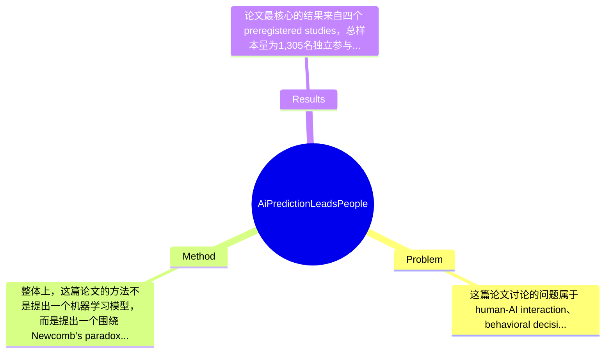

## Summary
该论文研究“AI预测”是否不仅影响人们做什么决策，还会改变人们如何决策；作者基于 Newcomb’s paradox 设计了4个 preregistered behavioral studies，在1,305名参与者中检验人们是否会因将AI视为具有 predictive authority 而放弃本可稳定获得的 guaranteed reward。结果显示，超过40%的参与者将AI视为可预测其行为的权威，这使其放弃 guaranteed reward 的 odds 相比 random framing 提高了3.39倍（95% CI: 2.45–4.70），并导致收益下降10.7%–42.9%，且该效应跨展示方式、任务情境与部分失败反馈仍然存在。

## Problem & Motivation
这篇论文讨论的问题属于 human-AI interaction、behavioral decision making 与 computational social science 的交叉领域，核心问题是：当人们相信AI能够预测自己的行为时，AI是否会改变其决策机制本身，而不仅仅是提供信息后影响最终选项。这个问题重要，因为主流关于AI辅助决策的理解，大多仍基于 Homo economicus 框架：人把AI当成一个信息源、建议器或预测器，用来优化既定目标下的选择。但论文指出，若用户把AI理解为“能看穿我将做什么”的 predictive authority，那么他们可能不再单纯比较行动的客观 payoff，而是会主动让自己的行为与预期中的AI预测保持一致，形成作者所说的 predictive binding。现实意义在于，这种机制可能出现在金融风控、教育评分、招聘筛选、医疗依从性、司法风险预测等场景中：一旦用户把系统预测误当成对自己未来行为的揭示，就可能提前自我约束，甚至放弃对自己更有利的行动。现有研究的局限主要有三点。第一，很多AI决策研究关注 recommendation accuracy、trust calibration、task performance，却默认人的偏好与决策逻辑是固定的。第二，关于 algorithm aversion/appreciation 的文献虽研究人是否采纳AI建议，但较少考察“预测被感知为决定性”时对选择架构的重塑。第三，社会困境或合作任务中观察到的非收益最大化行为，常可由公平、互惠、声誉等社会动机解释，难以孤立识别“纯粹因为预测而自我约束”的效应。作者因此采用 Newcomb’s paradox 这一没有社会激励、却能区分不同 reasoning schema 的经典范式，动机是合理的。论文的关键洞察是：AI不只是一个外部预测工具，它还可能通过被赋予 predictive authority，内生地改变个体对因果、自由选择和收益比较的理解，从而诱发系统性地放弃 guaranteed reward。

## Method
整体上，这篇论文的方法不是提出一个机器学习模型，而是提出一个围绕 Newcomb’s paradox 的 behavioral experiment framework，用来识别“AI prediction 改变决策方式”的因果证据。作者共进行了4个 preregistered online studies，覆盖经济决策任务、不同AI呈现方式、不同交互界面、情境化 vignette，以及 repeated interaction 场景，目标不是优化某个算法，而是系统检验 predictive binding 是否存在、是否稳健、是否可泛化、是否在预测失败后仍持续。

关键组件可以分为以下几部分：

1. 基于 Newcomb’s paradox 的核心决策任务
   该组件的作用是构造一个能够清晰区分两种推理方式的任务环境。参与者面对 Box A 与 Box B：Box A 永远有1美元，Box B 由AI对参与者行为的预测决定，若AI预测 one-boxing，则Box B有3美元；若预测 two-boxing，则Box B为0美元。参与者最终只能选择“只拿Box B”或“两个都拿”。设计动机在于，这个任务天然把 dominance reasoning 与“把预测当成自我实现线索”的 reasoning 分开：若按经典支配逻辑，two-boxing 总比 one-boxing 多1美元；若按 predictive binding 逻辑，参与者会把 Box B 内容视作已由“自己将会怎么选”所决定，于是倾向 one-boxing。与常见社会博弈不同，它没有合作、惩罚、他人评价等混杂动机，因此更适合识别AI预测本身的心理影响。

2. AI framing 与 random control 的对照设计
   该组件的作用是建立基线，从而判断行为变化究竟来自“AI预测”还是来自任务本身的悖论结构。作者在 Study 1 中将 AI prediction 条件与 random framing 条件比较：如果仅仅是面对不确定盒子，人们不应系统性放弃 guaranteed reward；若在 AI framing 下 one-boxing 显著增多，则表明“被AI预测”这一叙事对推理结构产生了额外影响。这样设计的关键动机是隔离 framing effect 中最核心的心理成分——不是奖励矩阵改变了，而是预测来源从随机变为AI。与许多只做单条件观察的行为实验不同，这个对照更接近因果识别。摘要给出的 OR=3.39 就是此对照的核心量化结果。

3. 不告知 predictive reliability 的设置
   这一点非常关键。作者明确指出，他们不向参与者提供AI预测准确率信息，目的在于观察参与者如何基于自身对AI能力的先验理解来行动。该设计的作用是最大程度触发现实中常见的“能力过度泛化”——即用户从“AI有时很准”跳到“AI知道我会做什么”。设计动机是检验 perceived authority，而非 calibrated trust。与传统 trust-in-AI 实验不同，这里不通过明确准确率操纵来调节依赖，而是让参与者自行填补“AI是否真能预测我”的认知空白。这个设计很聪明，但也带来解释上的代价：它更贴近现实中的模糊认知，却较难精确拆分是 anthropomorphism、algorithmic authority，还是宿命式理解在起作用。

4. 跨情境稳健性测试：界面、场景、重复交互
   Study 2 检查该效应在不同 interaction contexts 和 interfaces 下是否稳健；Study 3 用 vignette-based scenarios 测试是否能超出经济盒子任务而泛化；Study 4 研究 repeated interaction 中，即使AI预测失败，这种行为模式是否仍持续。该组件的作用是从内部效度走向外部效度：如果效应只存在于一个抽象悖论游戏，那价值有限；如果能跨表示方式与语境出现，就说明 predictive binding 不是偶然 artifact。尤其 Study 4 很重要，因为它在检验该现象是否只是一次性的 confusion，还是一种具有惯性的行为模式。

技术上，这篇论文的核心是 preregistration、对照实验、odds ratio 与 earnings reduction 的统计比较，而非复杂模型结构。就设计选择而言，使用 Newcomb’s paradox 是相对“必须”的，因为它天然允许“放弃 guaranteed reward”成为可观测指标；但AI呈现方式、是否告知准确率、奖励金额大小、本体是否真叫 AI，理论上都可以有替代方案。整体方法相当简洁，甚至可以说很优雅：用一个经典哲学-决策论范式，捕捉现代AI交互中的新心理机制。不过，它也有一定程度的“极简抽象”——优点是识别清晰，缺点是现实生态复杂性被压缩了。

## Key Results
论文最核心的结果来自四个 preregistered studies，总样本量为1,305名独立参与者。首先，在 Study 1 中，作者检验 AI prediction framing 是否相较 random framing 提高 one-boxing，也就是放弃 guaranteed 1美元、只拿 Box B 的倾向。摘要报告的总效应是：将AI视为 predictive authority 会使参与者放弃 guaranteed reward 的 odds 提高到 random framing 的3.39倍，95% CI 为2.45–4.70。这个效应量在人类行为实验里并不小，说明 framing 并非边缘性扰动，而是显著改变了参与者对任务的理解。

第二，论文报告超过40%的参与者把AI当作一种 predictive authority。这一点很关键，因为它不是说所有人都被AI“迷惑”，而是存在一个相当大的子群体会将AI预测理解为对自己未来行为的揭示。与之对应，收益层面出现了实际损失：参与者 earnings reduced by 10.7%–42.9%。这里的区间说明不同 study 或条件下损失程度不同，但方向一致，即相信AI预测并据此 one-boxing，会让参与者在客观 payoff 上吃亏。

第三，Study 2、Study 3 和 Study 4 主要支持稳健性与泛化性结论。论文摘要明确说，该效应出现在不同 AI presentations 与 decision contexts 中，并且即便在 predictions failed 的情况下也持续存在。这意味着该现象不只是某一种界面文案的偶然产物，也不是只在抽象经济盒子任务中有效；更重要的是，它不完全依赖于AI真的“准”，而与用户主观赋予AI的 authority 有关。

从 benchmark 角度看，这篇论文没有机器学习论文常见的公开 benchmark，而是以四个 behavioral experiment 作为评测平台，主要指标是 one-boxing rate、odds ratio、earnings change，以及不同条件下的行为稳定性。消融实验意义上，摘要只隐含给出“不同呈现方式/情境/预测失败后”的稳健性测试，严格说不属于模型消融。实验总体上是充分的，尤其 preregistered、多研究设计值得肯定；但也缺少一些关键补充，例如对参与者信念的更细粒度测量、对AI准确率显式操纵、以及与 human predictor/non-AI algorithm 的系统比较。就目前信息看，作者没有明显 cherry-picking 单一正结果，因为至少报告了多研究、一致方向和置信区间；但由于全文细节未完整提供，是否存在未报告的边缘条件或无效结果，论文节选中无法确认。

## Strengths & Weaknesses
这篇论文的亮点首先在于概念创新。它提出并实证化了 predictive binding：AI不只是改变 decision content，还可能改变 decision schema。这比“人是否听AI建议”更深一层，因为它涉及人对预测、因果与自我行为关系的重构。第二，实验范式选得很巧。Newcomb’s paradox 在这里不是哲学噱头，而是一个能把“放弃 guaranteed reward”转化为清晰可观测行为指标的工具，因此识别力强。第三，研究设计较扎实：四个 preregistered studies、总样本1,305、跨界面与情境复现，并考察 repeated interaction，使结果不至于停留在单次偶然发现。

但局限也很明显。第一，生态效度有限。Newcomb’s paradox 是高度抽象、低 stakes 的在线任务，现实中人们面对AI预测时通常还伴随制度约束、反馈循环、长周期后果和多重目标，因此这里观察到的行为强度能否映射到真实世界，仍需谨慎。第二，机制识别还不够干净。论文把现象归因于 belief in predictive authority，但这种信念可能混杂了 anthropomorphism、algorithmic prestige、宿命论、对实验者意图的猜测，或者对悖论结构的误解。没有更细的心理测量与替代解释排除，机制层面仍偏行为主义。第三，适用范围尚不明确。论文证明在特定任务中人会放弃 guaranteed reward，但不知道这种效应在高专业度用户、明确知道AI准确率有限的用户、或有真实重要后果的任务中是否仍然同样强。

潜在影响方面，这项工作对 HCI、AI governance 与 behavioral policy 都有启发：如果用户会因预测而自我约束，那么设计 predictive AI 系统时就不能只考虑 accuracy 和 usability，还要考虑其“规范性暗示”与行为塑形效应。

已知：论文明确报告了4个 preregistered studies、N=1,305、超过40%参与者将AI视为 predictive authority、OR=3.39、收益下降10.7%–42.9%、效应跨展示与情境存在并在预测失败后持续。推测：这种机制可能扩展到信用评分、教育平台、招聘等高影响场景，也可能与 algorithmic authority 或 self-fulfilling prophecy 文献相连接，但论文节选未充分展开。不知道：论文未提及各 study 的完整数值表、各条件具体 one-boxing 比例、人口统计异质性、不同AI类型之间的系统比较，以及长期追踪数据。

## Mind Map

## Notes
<!-- 其他想法、疑问、启发 -->
