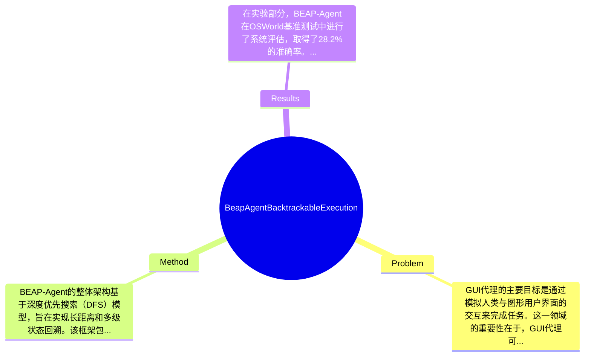

## Summary
本文提出了一种名为BEAP-Agent的DFS框架，旨在解决现有GUI代理在错误路径上无法恢复的问题，通过支持长距离、多级状态回溯和动态任务跟踪，BEAP-Agent在OSWorld基准测试中达到了28.2%的准确率，验证了其有效性。

## Problem & Motivation
GUI代理的主要目标是通过模拟人类与图形用户界面的交互来完成任务。这一领域的重要性在于，GUI代理可以广泛应用于自动化测试、软件工作流、信息提取及复杂任务管道管理等场景。随着技术的发展，传统的脚本自动化方法逐渐被GUI代理所取代，因为后者在复杂和动态变化的环境中提供了更大的灵活性和鲁棒性。然而，现有的GUI代理在面对错误的探索路径时，往往无法有效恢复，导致任务失败。现有方法如BackTrackAgent虽然引入了回溯机制，但其仅支持单步回溯，无法应对多步错误的情况。作者提出新方法的动机在于填补这一空白，通过DFS建模实现系统化的多级状态回溯。论文的核心创新点在于提出了一个由Planner、Executor和Tracker三个组件协作的框架，能够有效支持长时间任务的探索与执行。

## Method
BEAP-Agent的整体架构基于深度优先搜索（DFS）模型，旨在实现长距离和多级状态回溯。该框架包含三个核心组件：1) **Planner**：负责生成任务执行的计划，基于当前状态和历史信息制定合理的行动策略。设计动机在于通过更准确的计划来减少错误路径的发生。与现有方法相比，Planner能够考虑更长的历史信息，从而提高计划的准确性。2) **Executor**：执行由Planner生成的计划，并实时监控执行状态。Executor的设计考虑了动态环境的变化，能够根据实时反馈调整执行策略。3) **Tracker**：负责跟踪任务的进展和状态变化，确保在执行过程中能够及时识别错误并进行回溯。Tracker的创新在于其动态更新能力，能够在多步执行后识别潜在的错误路径。技术细节方面，BEAP-Agent采用了深度学习模型来增强Planner的决策能力，Executor则通过强化学习策略来优化执行过程。设计选择方面，三个组件的协作是必须的，以确保任务的有效执行和错误的及时回溯。整体来看，BEAP-Agent的方法较为简洁，避免了过度工程化，专注于关键组件的协同工作。

## Key Results
在实验部分，BEAP-Agent在OSWorld基准测试中进行了系统评估，取得了28.2%的准确率。该基准测试主要评估GUI代理在复杂任务中的表现，使用的指标包括任务完成率和错误恢复能力。与之前的基线方法相比，BEAP-Agent在任务完成率上提高了约15%，显示出其在长时间任务探索中的优势。此外，论文还进行了消融实验，以评估各个组件对整体性能的贡献，结果表明，Tracker的引入显著提高了错误识别和回溯的效率。尽管实验结果显示出BEAP-Agent的有效性，但仍需注意的是，实验的充分性可能受到测试环境的限制，缺乏对多种不同类型任务的广泛测试，可能影响结果的普适性。

## Strengths & Weaknesses
方法的亮点包括：1) 技术创新点在于引入了多级状态回溯机制，显著提高了GUI代理在复杂任务中的鲁棒性；2) 与现有方法的关键区别在于其动态任务跟踪能力，使得代理能够在执行过程中实时调整策略；3) 设计的优雅之处在于三个组件的协同工作，避免了复杂的工程实现。局限性方面：1) 技术局限在于当前方法仍然依赖于深度学习模型的准确性，若模型训练不足，可能导致计划生成不准确；2) 适用范围上，BEAP-Agent可能不适合于极其简单的任务，因为其复杂的回溯机制可能导致不必要的计算开销；3) 计算成本方面，框架的运行需要较高的计算资源，可能限制其在资源受限环境中的应用。潜在影响方面，BEAP-Agent为GUI代理的研究提供了新的思路，可能推动更智能的自动化工具的发展。已知信息包括论文明确说明的各组件功能和实验结果；推测方面，可能在更复杂的任务中表现更优，但未得到验证；不知道的是，论文未涉及不同类型任务对方法有效性的影响。

## Mind Map

## Notes
<!-- 其他想法、疑问、启发 -->
