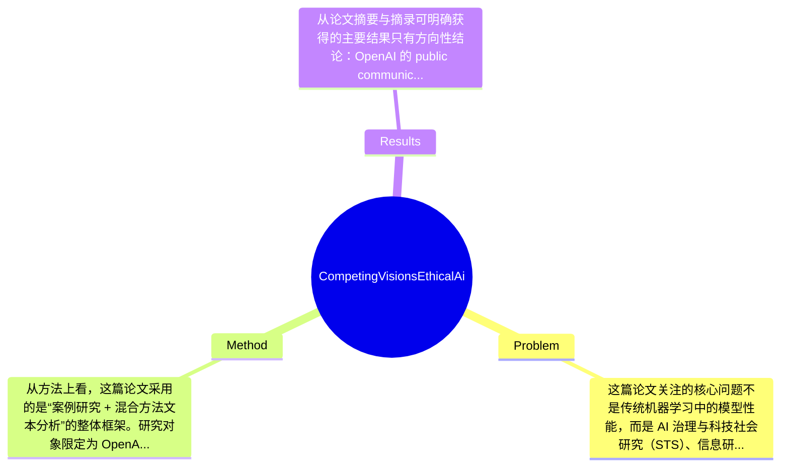

## Summary
本文以 OpenAI 为案例，研究其公开话语中“ethics”“safety”“alignment”等概念如何随时间被使用与重构；方法上结合定性内容分析与基于 NLP 的计算传播分析，对面向大众与面向学术受众的公开文档进行结构化语料比较；结论指出 OpenAI 的公开沟通中以 safety/risk 话语为主导，而较少采用学术界或倡议界更完整的 AI ethics 框架，并据此讨论治理含义与 ethics-washing 风险。

## Problem & Motivation
这篇论文关注的核心问题不是传统机器学习中的模型性能，而是 AI 治理与科技社会研究（STS）、信息研究、平台治理交叉领域中的“伦理话语 framing”问题：一家关键 AI 机构如何在公开叙事中使用 ethics、safety、alignment 等术语，以及这种用词变化反映了什么样的价值排序与治理立场。这个问题重要，因为当大型 AI 机构成为事实上的标准制定者时，它们如何命名问题，往往会先于正式监管塑造公众理解、政策议程和行业规范。现实层面上，如果企业把原本应包括公平、公正、劳工、环境、问责、权力分配等广义伦理议题，收缩为更窄的 safety/risk 叙事，那么监管与公众讨论也可能随之被“技术风险管理化”，从而忽略分配正义、组织责任和社会影响。

现有相关研究通常有几类不足。第一，一部分 AI ethics 讨论停留在规范性主张层面，强调“应该如何”，但缺少对企业实际公开文本的系统语料分析，难以验证机构究竟如何 operationalize 伦理。第二，一些产业研究聚焦单次声明、少数政策文件或媒体采访，样本碎片化，难以揭示长期时间演化。第三，纯定性研究往往能提供深描，但在语料规模扩大后不易处理跨年份、跨受众的稳定比较；纯 NLP 研究则可能只能看词频和 topic，却难以解释这些词在制度语境中的含义。作者提出新方法的动机总体合理：通过把定性编码与计算文本分析结合起来，对 OpenAI 的公开材料做纵向、分受众的案例研究，从而回答“企业说自己重视 ethics”与“它实际上如何 framing ethics”之间的差距。论文的关键洞察在于：在 OpenAI 的话语体系中，safety 与 risk 被显著优先化，而 ethics 作为一个更广义、更多元利益相关方参与的概念，反而没有成为公开沟通的中心词汇。这一观察为理解企业治理语言如何重塑 AI 伦理边界提供了经验材料。

## Method
从方法上看，这篇论文采用的是“案例研究 + 混合方法文本分析”的整体框架。研究对象限定为 OpenAI，数据来源是其公开文档；作者先构建一个结构化 corpus，并明确区分面向 general audience 的沟通材料与面向 academic audience 的材料，然后同时开展定性内容分析与定量计算文本分析，最后用可视化呈现总体趋势。这个框架的优点是能兼顾解释力与规模化观察，但它本质上仍然是单案例研究，因此解释边界需要谨慎。

1. 结构化语料库构建
   该组件的作用是为后续比较分析建立统一的数据基础。作者并不是把所有 OpenAI 文本混在一起，而是有意识地区分不同受众类型，这一点很关键，因为企业对公众、监管者、开发者、学术界常常使用不同叙事。设计动机在于：如果不区分 audience，最终只能得到“平均话语”，而看不到面向谁时使用何种伦理语言。与很多只抓取博客或新闻稿的研究相比，这种 corpus structuring 更强调传播情境。论文明确说语料来自 public documentation，但未在给定文本中详细说明纳入标准、文档数量、年份分布、排除规则，这使得复现虽然可能依赖代码仓库，但仅凭论文摘录还无法充分评估抽样偏差。

2. 定性内容分析：inductive + deductive coding
   该组件用于识别“伦理主题”本身，而不仅是词频表面现象。作者结合 inductively derived codes 与 deductively applied codes，意味着一方面从文本中归纳出现的议题，另一方面又使用已有 AI ethics 框架去检验 OpenAI 话语是否覆盖常见伦理维度。这样的设计动机很合理：纯归纳可能失去理论锚点，纯演绎则可能把文本硬塞进预设框架。与传统企业传播分析相比，这里更关注的是概念替代与框架迁移，例如 ethics 是否被 safety、alignment、risk 吸收或替换。不过论文摘录中没有给出 coding schema、coder 数量、inter-coder agreement、冲突解决流程，因此定性部分的信度目前只能算“方法上合理，证据披露不足”。

3. 计算内容分析与 NLP topic modeling
   该组件用于量化 rhetoric over time，并捕捉不同概念在长期话语中的变化。作者提到利用 NLP 建模 topics 和测量 rhetoric change，但没有在摘录中说明具体算法，例如是 LDA、BERTopic、dynamic topic modeling、embedding-based clustering 还是简单关键词趋势分析。设计动机是弥补人工阅读在规模与时间维度上的限制，使作者能够提出“安全/风险话语主导”的更系统证据。与仅做关键词计数的研究相比，topic modeling 理论上能挖掘更高层语义结构；但如果没有报告 topic coherence、参数设置、人工命名流程，那么 topic 的解释空间会较大，容易受研究者主观命名影响。

4. 时间变化与跨受众比较
   论文的一个关键设计选择是追踪概念随时间的变化，并比较不同 audience 的沟通差异。这一设计能回答的不只是“OpenAI 说了什么”，而是“何时开始更强调 safety/alignment，而较少谈 ethics”。这比静态截面分析更有价值，因为企业叙事通常会随产品发布、监管压力、舆论危机和组织战略而变化。遗憾的是，摘录未提供具体时间切分、年度统计或重大事件对齐分析，因此该设计虽重要，但证据呈现不足。

5. 可视化与可复现性
   作者强调 visualizations report aggregate results，并公开了代码仓库。公开代码是明显加分项，说明其不只是概念性评论，而是试图建立可复查的分析管线。设计上这是必要且正确的，尤其在 discourse analysis 这类易受解释偏差影响的研究中，可复现性非常重要。不过仅有代码并不等于可复现：若原始语料收集规则、版本快照、网页归档方式不明确，重复研究仍可能遇到困难。

整体评价上，这个方法框架相对简洁，不属于过度工程化。它的美感在于用一个清晰的混合方法 pipeline 来回答制度话语问题，而不是堆砌复杂模型。但它的脆弱点也很明显：结论的可信度高度依赖语料选择、编码定义和 topic 解释，而这些恰恰是当前摘录中披露最少的部分。

## Key Results
从论文摘要与摘录可明确获得的主要结果只有方向性结论：OpenAI 的 public communication and documentation 中，safety 与 risk discourse 占主导，而 academic and advocacy ethics frameworks or vocabularies 并未被充分采用。也就是说，作者认为 OpenAI 公开叙事更倾向于把“伦理问题”翻译成“安全、风险、alignment”问题，而不是使用更广义的 AI ethics 语言来讨论公平、偏见、权力、责任、劳动或社会正义等维度。

但必须强调，按你要求的“具体数字、benchmark 名称、提升百分比”标准，这篇论文在当前提供材料里几乎没有可提取的数值结果。论文不是典型 ML benchmark 论文，因此也不存在 ImageNet、MMLU、HELM 一类 benchmark；其“benchmark”更接近自建 structured corpus 上的文本分析任务。摘要提到 quantitative analysis leveraged NLP to model topics and quantify changes in rhetoric over time，也提到 visualizations report aggregate results，但没有给出文档总数、年份跨度、主题数、关键词占比、topic prevalence、显著性检验、效应量或 audience split 的统计结果。因此，如果严格遵守“不捏造信息”，只能写明：具体数值论文摘录未提及。

从结果结构推测，核心实验大致包括三类。第一，跨时间 rhetoric 变化分析：考察 ethics/safety/alignment/risk 等词或主题随时间如何变化。第二，跨受众比较：比较 general audience 与 academic audience 的公开文本 framing 差异。第三，主题级分析：通过 topic modeling 识别 OpenAI 文档中的主要议题簇，并判断 ethics 是否处于边缘位置。遗憾的是，这三类分析在摘录中都没有展示具体表格或图。论文似乎也没有在提供内容中出现消融实验；这在社会科学混合方法研究中并不罕见，但也意味着我们无法判断定性编码、关键词表、topic 数选择等设计对最终结论的敏感性。

实验充分性方面，这项工作至少在方法上尝试了定性与定量互证，优于只摘引几个案例的评论文章；但证据呈现仍显不足。缺失的关键实验包括：与其他 AI 公司（如 Anthropic、Google DeepMind、Meta）的对照；重大事件前后的断点分析；编码一致性指标；topic 模型稳定性分析；以及不同文档类型之间的更细粒度拆分。是否存在 cherry-picking？仅从摘要无法定论，但由于论文聚焦 OpenAI 单案例，且结论具有批判色彩，如果正文没有充分展示反例文本或中性时期材料，就存在选择性呈现的潜在风险。

## Strengths & Weaknesses
这篇论文的第一个亮点是研究问题切得很准。它没有把“企业是否重视 AI ethics”当成口号式问题，而是具体考察 OpenAI 如何在话语上重组 ethics、safety、alignment 的关系，这比泛泛的技术伦理评论更可检验。第二个亮点是混合方法设计合理：定性内容分析提供解释深度，NLP/计算内容分析提供时间趋势与规模化证据，两者结合比纯立场评论更扎实。第三个亮点是强调受众区分，这使研究从“企业自我表述”进一步推进到“企业如何针对不同受众策略性 framing”。

局限性也很明显。第一，单案例问题突出。OpenAI 具有极强的组织特殊性、品牌中心性和政治曝光度，因此其话语模式未必代表整个行业。若没有和 Anthropic、Google、Microsoft、Meta 等进行对照，论文很难判断这是 OpenAI 特有现象，还是 generative AI 企业普遍现象。第二，方法透明度在当前摘录下不足。论文虽称公开代码，但没有在摘要中给出 corpus 大小、文本筛选标准、编码本体、inter-coder reliability、topic model 参数等信息，导致结论虽有说服力方向，但不易独立审查。第三，话语分析与真实治理实践之间仍有距离。企业不使用 academic ethics vocabulary，并不自动等于其内部治理不存在相关考虑；反过来，频繁使用 ethics 术语也不代表真正负责。因此论文更能说明“公开 framing”，不一定能直接证明“组织伦理实质”。

潜在影响方面，这项研究对 AI governance、corporate accountability、policy communication 都有价值。它提醒研究者和监管者：不能只看企业是否谈“安全”，还要看它是否借 safety 话语窄化了伦理议题边界。对行业观察者而言，这也提供了识别 ethics-washing 的经验工具。

已知：论文明确指出 OpenAI 公开话语中 safety/risk 占主导，且未充分采用 academic/advocacy ethics frameworks；研究使用结构化语料、定性编码和 NLP topic modeling，并公开代码。推测：作者可能意在论证企业通过概念替换把广义伦理问题技术化、风险管理化，但这一点在摘录中只有间接支持。未知：语料规模、时间跨度、具体统计显著性、编码一致性、与其他公司对照结果、topic 模型细节，论文摘录均未提及。

## Mind Map

## Notes
<!-- 其他想法、疑问、启发 -->
