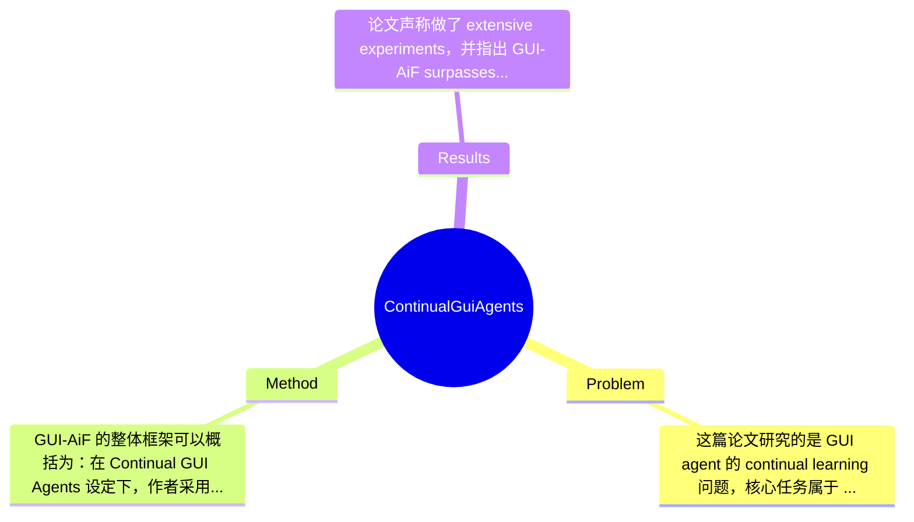

## Summary
该论文提出了 Continual GUI Agents 任务，研究 GUI agent 在界面域（mobile/desktop/web）和分辨率持续变化时的 continual learning 问题，并设计了基于 reinforcement fine-tuning 的 GUI-AiF 框架，通过 APR-iF 与 ARR-iF 两类 anchoring reward 稳定 grounding。论文声称该方法相比现有 SOTA baseline 在持续学习场景下取得更好的性能与稳定性，但摘要与给定片段中未提供完整 benchmark 数字，因此具体提升幅度论文片段未提及。

## Problem & Motivation
这篇论文研究的是 GUI agent 的 continual learning 问题，核心任务属于 multimodal agent / GUI grounding / embodied interaction 范畴。具体来说，agent 需要根据自然语言指令，在屏幕截图或界面环境中定位正确的交互点或区域，例如点击按钮、选择图标、打开菜单等。传统 GUI grounding 往往假设训练分布固定，即训练和测试都来自相似的 UI 域、布局风格与分辨率；但真实数字环境显然不是静态的：操作系统升级、应用界面改版、跨平台迁移、设备分辨率提升，都会导致数据分布持续漂移。这个问题的重要性在于，若 GUI agent 只能在静态 benchmark 上有效，就很难真正部署在现实系统中。

现实意义很直接。一个可持续学习的 GUI agent 可以服务于自动化办公、无障碍辅助、手机与桌面助手、网页流程自动执行等场景，尤其适用于经常更新 UI 的产品生态。现有方法的局限主要有三点。第一，SFT 类方法高度依赖静态标注分布，容易记住特定界面布局、固定坐标模式或元素尺度，一旦域或分辨率发生变化，grounding 会迅速退化。第二，已有 RFT 或 reward 设计多针对单一静态环境优化，奖励信号可能鼓励模型抓住“表面稳定线索”，如固定位置偏好，而不是学习真正可迁移的交互语义。第三，过往 GUI agent 研究大多只看单次训练后的测试性能，缺乏持续到达数据流上的遗忘、适应、稳定性评估。

作者提出新方法的动机总体是合理的：如果问题本质是分布持续漂移，那么训练机制就不能只追求当前任务最优，而要鼓励模型在 interaction point 与 interaction region 层面形成可迁移、可重锚定的 grounding 能力。论文的关键洞察是：在 GUI 场景中，持续学习失效并不只是一般性的 catastrophic forgetting，而是 grounding anchor 随域与分辨率变化而失稳；因此，应通过 reward 直接约束“点”和“区域”两个层次的 anchoring，而不是只依赖泛化的任务完成奖励。

## Method
GUI-AiF 的整体框架可以概括为：在 Continual GUI Agents 设定下，作者采用 reinforcement fine-tuning 而非单纯 SFT，让模型按照时间顺序接收新的 GUI 数据分布，并通过专门为“界面变化中的稳定 grounding”设计的奖励函数，引导 agent 在新域/新分辨率上适应时，仍保持对交互点与交互区域的鲁棒对齐。其核心不是改造一个全新的 backbone，而是在 RFT 流程中重写 reward，使优化目标从“当前分布命中”转向“变化环境中的稳定 anchoring”。

1. Continual GUI Agents 任务设定
- 作用：论文首先定义了一个新任务，而不只是提出一个训练技巧。任务包含两类演化场景：domain-in-flux（如 mobile 到 web/desktop）与 resolution-in-flux（如 1080p 到 4K）。
- 设计动机：作者认为 GUI agent 在真实世界部署时，最常见的变化正是域迁移与分辨率变化，这两种漂移会直接改变元素外观、布局密度、交互目标尺度与相对位置。
- 与现有方法区别：以往工作默认 train/test 静态同分布，或者最多做跨域泛化评测，但不强调按时间顺序到来的持续学习过程，也不系统研究旧知识保持与新知识适应之间的张力。

2. GUI-AiF：基于 RFT 的持续学习框架
- 作用：GUI-AiF 是主框架，使用 reinforcement fine-tuning 作为持续学习的优化方式。作者的论点是，相较 SFT 的强拟合，RFT 借助 on-policy reward 与 reference model 的 KL 约束，能以更“软”的方式更新参数，从而降低对旧能力的破坏。
- 设计动机：作者借用了近期 continual learning 中对 RFT 的看法，即其更新方向更偏向 reward-guided realignment，而不是监督信号下的硬性拟合，因此在顺序任务学习中可能更稳定。
- 与现有方法区别：区别不一定在 RL 算法本身，而在于把 GUI grounding 的持续学习问题显式地放进 RFT 框架，并围绕 grounding instability 定义专门奖励，而不是沿用通用 task reward。

3. APR-iF：Anchoring Point Reward in Flux
- 作用：APR-iF 面向 interaction point，对模型预测的点击点/交互点给予奖励，核心目标是在分布变化时仍保持点级别定位稳定性。
- 设计动机：作者观察到，不同 UI 域对交互点的统计特征差异很大，例如 mobile 可能更多文本按钮，web 可能更多 icon 驱动入口；若奖励只鼓励当前任务命中，模型可能过度依赖某些域特有坐标偏好。APR-iF 试图让模型学到“在变化中重新锚定正确点”的能力。
- 与现有方法区别：传统 reward 更像静态正确性信号，APR-iF 强调 flux 条件下的 anchoring；也就是说，它不是仅看点是否命中，还强调不要把 grounding 建立在不可迁移的静态 cues 上。具体数学形式在给定片段中未展开，论文片段未提及。

4. ARR-iF：Anchoring Region Reward in Flux
- 作用：ARR-iF 面向 element region，而不是单点。因为很多 GUI 元素具有可点击区域、边界框或语义区域，单点正确并不等于区域理解稳定。
- 设计动机：分辨率变化尤其会导致元素 scale、宽高比、边距发生变化。如果模型只记忆某类目标常出现在某个位置，或者只学习一个“平均点击点”，在高分辨率或重排布局中会很脆弱。区域级奖励能补足点级信号，使模型理解目标的空间范围与结构。
- 与现有方法区别：很多 GUI grounding 方法最终评估 click point，但在 continual setting 下，仅靠 point accuracy 不足以支撑鲁棒适应。ARR-iF 相当于引入更结构化的空间监督，减轻对固定尺度和绝对坐标的依赖。

5. 训练与设计选择评价
- 技术细节：从摘要与引言片段看，训练遵循 sequential continual learning 流程，数据随时间到达；优化采用 RFT，并结合 reference model 的 KL regularization。奖励由 APR-iF 与 ARR-iF 共同构成，目标是稳定 grounding。具体使用 PPO、GRPO 还是其他 policy optimization，给定片段未提及。
- 设计选择：我认为“RFT + anchoring reward”是必要设计，因为作者问题诊断就落在 reward misalignment 上；但点和区域是否必须分成两个 reward，可以讨论，也许可以用单一的 scale-invariant spatial reward 或匹配损失替代。另一个可替代设计是加入 replay、adapter、parameter isolation 等典型 continual learning 技术，论文片段未显示作者是否比较过。
- 简洁性评价：从概念上看，这个方法相对简洁，创新集中在任务定义与 reward 设计，而不是堆叠大量模块，这是一种优点。但如果最终性能主要来自 carefully tuned reward，而缺少更广泛的 continual learning 机制比较，那么方法也可能显得“局部优雅、整体不足”，即解决了 grounding stability 的一部分，却未必覆盖持续学习的全部挑战。

## Key Results
论文声称做了 extensive experiments，并指出 GUI-AiF surpasses state-of-the-art baselines，但给定文本只包含摘要、引言和部分方法动机，没有表格、数值或完整实验节，因此无法复原具体 benchmark 名称、指标与分数。根据引言描述，可以确定作者至少测试了两大类场景：一是跨 UI 域的 continual learning，即 domain-in-flux，例如从 mobile、desktop 到 web application 的顺序迁移；二是分辨率变化下的 continual learning，即 resolution-in-flux，例如从 normal resolution 到 high resolution，文中举例为 1080p 到 4K。可以合理推断评价指标会围绕 GUI grounding 成功率、click accuracy、区域命中或任务完成率展开，但具体指标名称论文片段未提及。

从摘要文字看，主要结论有三层。第一，现有方法在持续变化的数据分布下无法保持 stable grounding，这意味着 baseline 不仅在最终任务上落后，还可能在 sequential adaptation 中出现明显遗忘。第二，GUI-AiF 在 interaction point 与 region 两级奖励的帮助下优于 baseline，说明作者认为性能增益来自 reward 对 grounding anchor 的显式约束。第三，论文将这种收益归因于避免 over-adapt to static grounding cues，例如固定坐标或固定元素尺度。

关于消融实验，按照方法结构，最关键的消融应包括：仅使用 APR-iF、仅使用 ARR-iF、两者同时使用，以及去掉 flux-aware reward 后的普通 RFT。这类消融对于证明点级与区域级奖励互补是必要的，但给定片段未提供任何数字。实验充分性方面，这篇论文至少在问题设定上是新颖的，但当前公开片段暴露出两个风险：其一，如果只展示少数迁移顺序或少数应用域，可能存在 cherry-picking；其二，如果没有和 replay、EWC、LoRA-based continual tuning 等经典 continual learning baseline 比较，那么“RFT 更适合持续学习”的结论会偏弱。总体上，方向和实验问题都成立，但就目前提供材料而言，证据强度仍依赖完整正文中的定量结果。

## Strengths & Weaknesses
这篇论文的亮点首先在于问题定义。已知的是，作者明确提出了 Continual GUI Agents 这一新任务，把 GUI grounding 从静态 benchmark 推向真实部署更接近的动态环境，这是一个有意义的 framing。第二个亮点是方法的诊断较聚焦：作者不是泛泛谈 continual learning，而是指出 GUI agent 失败的核心在 grounding anchor 的失稳，并对应设计 APR-iF 与 ARR-iF 两类 reward，这种“问题—机制—解法”链条相对清晰。第三，方法本身概念上比较克制，没有明显堆砌大型模块，若完整实验成立，属于通过 reward re-design 解决真实瓶颈的工作。

局限性也很明显。第一，技术上它依然是 reward-centric 方法，能否真正缓解 catastrophic forgetting，还是只是提升了某类 spatial grounding robustness，目前未知。若底层参数更新仍对旧域知识造成侵蚀，仅靠奖励可能不足以解决长期序列学习。第二，适用范围可能有限。该方法明显依赖 GUI 元素存在相对清晰的 point/region 对齐信号；若任务是复杂多步交互、长程规划、文本输入、滚动查找或动态弹窗处理，仅靠 point/region anchoring 可能不够。第三，计算成本与工程代价可能高于 SFT。RFT 通常需要在线采样、reward 计算和更复杂的训练流程，对数据与算力都更敏感；但具体训练成本、样本效率、收敛稳定性，论文片段未提及。

潜在影响方面，这项工作对 GUI agent 社区的贡献在于把“持续变化环境”作为一等公民来讨论，可能推动后续研究从静态单次评测转向 streaming benchmark、忘却分析和 deployment-oriented evaluation。推测上，未来可以把该方法扩展到 computer-use agent、OS assistant、网页自动化甚至 robotic UI manipulation。已知：论文提出新任务与 GUI-AiF，并声称超越 SOTA。推测：其 reward 对 scale shift 和 layout shift 尤其有效，但对长链决策帮助有限。未知：具体提升幅度、训练成本、与经典 continual learning 方法的系统比较、失败案例分布、是否存在 domain order 敏感性。这些未知信息决定了它目前更像一篇“有参考价值的新方向论文”，而非已经无可争议的里程碑。

## Mind Map

## Notes
<!-- 其他想法、疑问、启发 -->
