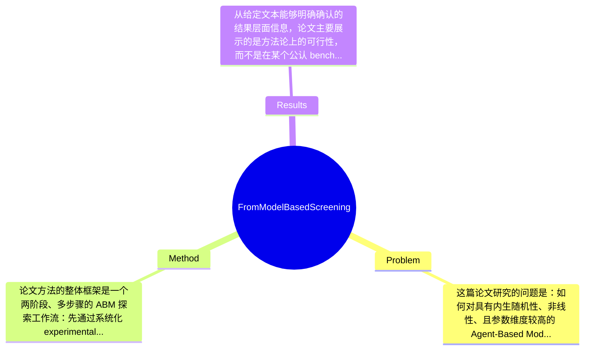

## Summary
该论文针对 stochastic Agent-Based Models 在高维参数空间下难以系统探索的问题，提出了一个从 model-based screening 到 data-driven surrogate 的多阶段分析流程：先用实验设计与线性/树模型筛查主导变量和不稳定区域，再用机器学习 surrogate 拟合复杂非线性交互。论文在一个 predator-prey ABM 案例上表明，这一流程能够自动识别高随机性、强交互的参数区域，为 sensitivity analysis 与 policy testing 提供更系统的工作流，但从给定文本中无法确认其是否在标准 benchmark 上取得显著数值型 SOTA 结果。

## Problem & Motivation
这篇论文研究的问题是：如何对具有内生随机性、非线性、且参数维度较高的 Agent-Based Models（ABMs）进行系统化探索与敏感性分析。该问题属于复杂系统建模、simulation-based analysis 与 uncertainty quantification 的交叉领域。ABM 的核心优势在于能显式表示个体异质性、局部交互、空间结构与随机性，因此被广泛用于生态系统、社会-环境系统、政策模拟等场景；但也正因为模型复杂，研究者往往只能展示少量仿真轨迹或局部参数扫描，难以回答“哪些参数真正重要”“哪些结论稳健”“哪些区域存在 regime shift 或 instability”等更关键的问题。现实意义非常直接：如果不能系统评估参数敏感性和随机波动来源，那么基于 ABM 的政策推演、情景分析与机制解释都可能缺乏可信度。

现有方法有几类明显局限。第一，one-at-a-time 或局部敏感性分析只能在某个参考点附近观察变化，无法捕捉多参数交互，尤其对 ABM 中常见的 threshold effect、phase transition、non-monotonic response 几乎无能为力。第二，方差分解类 Global Sensitivity Analysis 虽然理论上更全面，但通常依赖大量 Monte Carlo 采样，对运行缓慢且需要多次重复以平均 stochasticity 的 ABM 来说成本极高。第三，一些简化 screening 方法虽然便宜，但可能把真正由高阶交互驱动的现象误判为噪声，或者错误地低估某些变量的重要性。

论文的动机因此相当合理：作者并不试图一步到位地用单一方法解决所有问题，而是提出分阶段流程，先用相对轻量的 model-based screening 快速缩小问题空间，再在保留下来的复杂区域上训练 machine learning surrogates，以此兼顾计算效率、可解释性与非线性表达能力。其关键洞察是：对于 stochastic ABM，真正困难的不仅是“拟合平均输出”，更是识别那些由多变量非线性交互和随机性共同导致的不稳定区域；因此先分区、再建 surrogate，比直接全局黑盒拟合更合理。

## Method
论文方法的整体框架是一个两阶段、多步骤的 ABM 探索工作流：先通过系统化 experimental design 生成参数样本并重复仿真，以显式估计模型内生随机性；随后用线性模型与 tree-based 方法做自动 screening，识别主导变量、初步分割参数空间并定位高波动区域；最后在这些经过筛查后的空间上训练 machine learning surrogates，用于学习剩余的非线性关系、变量交互与输出不确定性。这个框架的重点不在于提出一个全新的单一算法，而在于把 design of experiments、screening、space segmentation 和 surrogate modeling 串成一个可复用的分析协议。

1. 系统化实验设计与重复仿真
该组件的作用是为后续分析提供覆盖较全面、且能区分“参数效应”和“随机噪声”的数据基础。对 stochastic ABM 来说，同一组参数可能因随机种子不同而产生不同结果，因此如果只跑单次 simulation，会把随机波动误当作参数影响。作者的设计动机是先在输入空间中有计划地采样，再对每个配置进行重复运行，以估计输出均值、方差或其他波动指标。与传统只做少量手工 sweep 的做法相比，这一步更规范，也更适合后续统计建模。论文从给定文本中未明确说明采用 Latin Hypercube、full factorial 还是其他具体采样方案；如果有精细采样策略，当前文本未提及。

2. 基于模型的 screening：线性与树模型结合
第二个核心组件是 automated model-based screening。其作用是快速判断哪些变量可能是 dominant variables，哪些区域表现稳定，哪些区域需要更深入分析。线性模型提供的是全局趋势与近似可解释的主效应视角，tree-based 方法则更擅长发现阈值、分段结构和非线性。设计动机很明确：单靠线性模型会漏掉 ABM 中的非线性 regime switch，但单靠复杂黑盒模型又不利于早期筛查和解释。与传统 Morris 或单一回归筛查相比，这里更强调“组合式”初筛——先用简单模型建立粗粒度理解，再用树结构做 parameter space segmentation。这个设计很实用，因为在高维空间中，先识别低复杂度结构再投入昂贵建模资源，往往比直接全局深度拟合更稳定。

3. 参数空间分割与不稳定区域识别
论文的一个重要设计是，不把参数空间视作均质整体，而是主动寻找 unstable regions，即输出高度依赖多变量非线性交互的区域。该组件的作用是把“哪里难分析”本身当作结果来挖掘。其设计动机来自 ABM 的典型特征：很多有趣行为只出现在局部参数区间，且可能伴随高方差、双峰分布或轨迹分化。tree-based segmentation 在这里不仅是预测工具，更是结构发现工具。与一般 surrogate 直接拟合全局平均响应不同，这种先分区再分析的思路更贴近复杂系统研究者真正关心的 regime structure。不过从现有文本看，作者如何形式化定义“unstable region”、是否使用输出方差阈值、异方差建模或分类标准，论文摘录中没有足够细节。

4. Machine Learning surrogate 建模非线性交互
在筛查后，作者训练 machine learning surrogates 来拟合剩余复杂关系。其作用是替代昂贵 simulator，学习输入参数到输出行为之间的非线性映射，并支持 sensitivity analysis、what-if reasoning 与 uncertainty-aware exploration。设计动机是：经过 screening 后，问题已经从“全局盲目搜索”变成“针对复杂区域的高效逼近”，这样 surrogate 更容易学到有意义的结构，也减少无谓算力消耗。与只用统计回归做敏感性分析不同，surrogate 阶段强调对 higher-order interactions 的表达能力。论文给定文本没有明确写出具体 surrogate 类型，例如 Random Forest、Gradient Boosting、Gaussian Process、MLP 或其他模型，因此不能捏造；只能确认作者采用了“Machine Learning models”。

5. 训练与评估逻辑，以及方法简洁性评价
训练层面，这个流程隐含了一个重要策略：先降维、再建模、再解释，而不是一上来对原始高维 stochastic simulator 做端到端黑盒拟合。这种 staged workflow 的好处是结构清晰、可迁移性强，也方便与领域知识结合。从设计选择看，“重复仿真估计随机性”和“先 screening 再 surrogate”几乎是该方法成立的必要条件；至于具体采用哪类树模型、哪类 surrogate、以及采用什么采样设计，则是可替换模块。整体上，该方法相对简洁，并不过度依赖新奇 architecture，更像是把已有统计学习工具组织成一个严谨流程。优点是实用和可复现，缺点是理论新意可能更多体现在 workflow integration，而不是单点算法突破。

## Key Results
从给定文本能够明确确认的结果层面信息，论文主要展示的是方法论上的可行性，而不是在某个公认 benchmark 上刷新性能。核心实验场景是一个 predator-prey with renewable resources 的 NetLogo toy model，用它来演示整个 workflow 如何识别 dominant variables、量化 intrinsic stochasticity、分割参数空间并发现 unstable regions。作者强调，该流程能够“automate the discovery of unstable regions where system outcomes are highly dependent on nonlinear interactions between many variables”，这说明主要结果之一是：相较于只看单轨迹或单因素扫描，所提方法能更系统地暴露高阶交互与高波动区域。

但需要严格指出：在用户提供的摘录中，没有给出具体 benchmark 名称以外的更广泛测试集，也没有看到明确的数值结果，例如 R²、RMSE、MAE、Sobol 指数估计误差、分类准确率，或者相对某个 baseline 提升了多少百分点。因此，若要求“具体数字”和“提升百分比”，目前只能标注“论文未提及/摘录未提供”。同样，文中提到 preliminary model-based screening 使用 linear and tree-based methods，后续训练 machine learning surrogates，但没有在现有文本中列出各模型名称、超参数、训练集规模、重复次数与统计显著性检验结果。

就实验设计而言，已知其至少包含以下几个层面：第一，系统实验设计与重复仿真，用于估计输出随机性；第二，screening 阶段识别主导变量与空间分区；第三，surrogate 阶段拟合复杂交互。然而，是否包含严格的消融实验，比如“去掉空间分割后 surrogate 性能下降多少”“只用线性模型 versus 线性+树模型差异多少”，摘录中没有体现。实验充分性方面，这篇论文在 workflow demonstration 上是完整的，但在外部有效性上仍显不足：目前只看到单一案例研究，且是 deliberately simple toy model。缺少跨多个 ABM、不同维度规模、不同 stochasticity 强度下的泛化实验；也缺少与标准 GSA 方法在精度/成本上的定量比较。是否存在 cherry-picking 也无法断言：已知作者选用了简单案例，这有利于说明机制，但也可能弱化对真实复杂模型的挑战性验证。

## Strengths & Weaknesses
这篇论文的亮点主要有三点。第一，它提出的不是单个孤立算法，而是一个从 experimental design、stochasticity quantification、screening 到 surrogate modeling 的完整工作流，这种 end-to-end protocol 对 ABM 社区很有价值，因为该领域长期缺少标准化、可复现的探索流程。第二，它抓住了 stochastic ABM 的关键难点：不是简单预测平均输出，而是识别由于非线性交互与内生随机性共同导致的 unstable regions。这比传统“找最重要参数”更贴近复杂系统分析的真实需求。第三，它在方法设计上兼顾了解释性与表达能力：前段用 linear/tree-based 模型进行可解释筛查，后段再上 machine learning surrogate 学复杂关系，属于较务实且工程上可落地的组合。

局限性也很明显。第一，技术上它更像 workflow integration 而非新的核心学习算法，因此其贡献高度依赖各阶段实现细节；如果 surrogate 模型选择不当、sampling 不充分、或 screening 误筛掉了重要变量，整个链条都可能受到影响。第二，适用范围上，论文虽然宣称方法可迁移，但目前展示的是一个 predator-prey toy ABM；对更高维、更慢、更强路径依赖、输出更复杂（如时序、多峰、分布式指标）的模拟器是否同样有效，证据不足。第三，计算成本未必低：虽然比全空间暴力 GSA 更节省，但该流程仍需要大量重复仿真来估计 stochasticity，再训练 surrogate；对于昂贵 simulator，前期数据收集可能仍是瓶颈。

潜在影响方面，这项工作有望推动 ABM 从“展示若干有趣轨迹”转向“系统分析参数空间结构”，特别适合生态模拟、政策模拟、制度设计和 what-if analysis。它也可能成为连接 ABM 与 uncertainty quantification / surrogate modeling 社区的桥梁。

已知：论文明确提出两阶段流程；使用 predator-prey case study；强调识别 dominant variables、outcome variability 和 unstable regions；代码与 NetLogo 模型开源。推测：tree-based segmentation 可能用于发现 regime boundary，surrogate 可能主要服务于非线性 sensitivity analysis 和替代仿真。论文未证实：具体 surrogate 类型、定量优于哪些 baseline、对多种 ABM 的泛化能力、以及在真实政策场景中的效果。总体来看，这是一篇有参考价值的方法型论文，但离“领域里程碑”还有距离。

## Mind Map

## Notes
<!-- 其他想法、疑问、启发 -->
