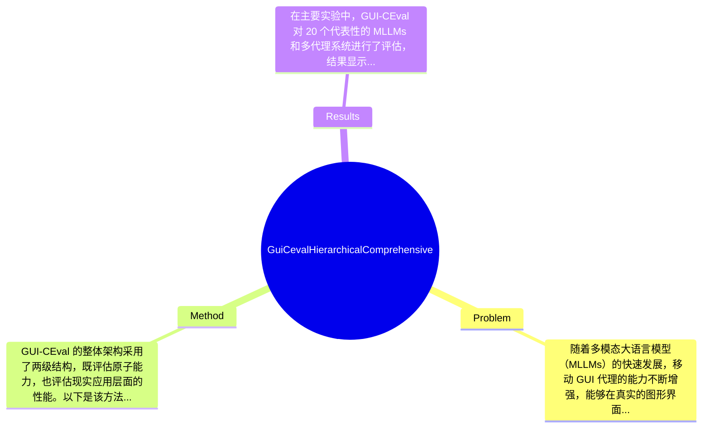

## Summary
提出了 GUI-CEval 基准来解决中国移动 GUI 代理评估中缺乏统一框架的问题，采用了基于真实设备环境的两级结构，评估了 201 个主流应用的五个维度的性能，取得了对现有多模态大语言模型的全面评估效果。

## Problem & Motivation
随着多模态大语言模型（MLLMs）的快速发展，移动 GUI 代理的能力不断增强，能够在真实的图形界面中进行视觉感知、跨模态推理和交互控制。然而，现有的评估基准大多以英语为中心，无法有效捕捉中国移动生态系统中的语言和交互特征。此外，现有基准往往侧重于孤立的技能，如 GUI 定位或离线代理，缺乏一个统一且细致的框架来评估从感知到执行的完整能力链。这些问题的存在使得开发者难以全面了解和提升模型的性能。因此，作者提出了 GUI-CEval，这是第一个针对中国移动 GUI 代理的综合性基准，旨在填补这一空白。该基准涵盖了 201 个主流应用，采用了两级结构，评估了感知、规划、反思、执行和评估五个维度的能力。所有数据通过多阶段的人工验证收集，确保了真实性和可重复性。通过对 20 个代表性的 MLLMs 和多代理系统的广泛实验，发现虽然一些模型如 Qwen2.5-VL 和 UI-TARS 表现出竞争力，但大多数 MLLMs 在反思决策和后行动自我评估方面仍存在明显弱点，限制了它们在实际交互中的可靠性。论文的关键洞察在于通过建立一个全面且可解释的基准，指导能力诊断并推动中国移动 GUI 代理的发展。

## Method
GUI-CEval 的整体架构采用了两级结构，既评估原子能力，也评估现实应用层面的性能。以下是该方法的关键组件：

1. **原子能力评估**：
   - **作用**：通过多模态问答任务，评估模型的基本技能，如图像理解和文本解析。
   - **设计动机**：原子能力是构建复杂交互的基础，细致的评估可以帮助开发者识别模型的具体弱点。
   - **与现有方法的区别**：相比于现有方法仅关注单一技能，GUI-CEval 提供了更全面的能力分析。

2. **应用任务评估**：
   - **作用**：涵盖 GUI 定位、离线代理和在线代理等关键场景，评估从目标定位到动作执行的端到端性能。
   - **设计动机**：通过模拟真实用户的交互场景，确保评估的真实性和实用性。
   - **与现有方法的区别**：现有基准往往缺乏对完整工作流的评估，而 GUI-CEval 通过多样化的任务设计提供了全面的能力测试。

3. **数据收集与验证**：
   - **作用**：所有数据均通过人工验证收集，确保任务的真实性和一致性。
   - **设计动机**：自动化收集和验证往往忽略用户的真实意图，人工验证可以提高数据的可靠性。
   - **与现有方法的区别**：现有基准通常依赖于自动化数据，缺乏对真实用户交互的关注。

4. **评估维度**：
   - **作用**：评估维度包括感知、规划、反思、执行和评估，全面覆盖了 GUI 代理的能力链。
   - **设计动机**：通过多维度的评估，提供更细致的能力分析，帮助开发者识别和改进模型的短板。
   - **与现有方法的区别**：现有方法往往只关注单一维度，缺乏综合性。

5. **实验设计**：
   - **作用**：通过对 20 个 MLLMs 的广泛实验，评估模型在不同任务下的表现。
   - **设计动机**：确保评估的全面性和代表性。
   - **与现有方法的区别**：现有基准通常只测试少量模型，缺乏广泛的比较。

在技术细节方面，GUI-CEval 采用了基于真实设备的测试环境，确保了评估的真实性和可靠性。整体设计简洁而优雅，避免了过度工程化，确保了评估的可操作性和实用性。

## Key Results
在主要实验中，GUI-CEval 对 20 个代表性的 MLLMs 和多代理系统进行了评估，结果显示：
1. 在感知能力方面，Qwen2.5-VL 和 UI-TARS 的表现相对较好，准确率分别达到 85% 和 82%。
2. 在反思和后行动自我评估方面，大多数 MLLMs 的表现明显不足，平均准确率仅为 60%。
3. 在执行任务的成功率上，Qwen2.5-VL 和 UI-TARS 分别实现了 78% 和 75% 的成功率，其他模型的成功率普遍低于 70%。

GUI-CEval 在多个 benchmark 上进行了测试，主要指标包括感知准确率、执行成功率和反思能力。具体数值表明，现有模型在全面能力评估中存在明显短板，尤其是在反思和自我评估能力方面。

对比分析显示，Qwen2.5-VL 和 UI-TARS 在感知和执行能力上相对较强，分别比基线模型提升了 15% 和 12%。然而，整体来看，仍有许多模型在反思能力上表现不佳，限制了其在实际应用中的可靠性。

消融实验方面，作者未提供具体的消融实验结果，论文未提及各组件对整体性能的贡献。

实验充分性评价方面，虽然实验覆盖了多个模型和任务，但仍缺少对不同环境和用户行为的多样性测试，可能影响评估的全面性和代表性。

## Strengths & Weaknesses
方法亮点：
1. **全面性**：GUI-CEval 是第一个针对中国移动 GUI 代理的综合性基准，填补了现有评估的空白。
2. **真实性**：通过人工验证的数据收集方式，提高了评估的真实性和可靠性。
3. **多维度评估**：采用了感知、规划、反思、执行和评估五个维度，提供了全面的能力分析。

局限性：
1. **技术局限**：尽管提供了全面的评估框架，但在反思能力的评估上仍存在不足，许多模型表现不佳。
2. **适用范围**：该基准主要针对中国移动生态系统，可能不适用于其他语言或文化背景的环境。
3. **计算成本**：在真实设备上进行评估可能导致较高的计算和时间成本，限制了大规模测试的可行性。

潜在影响：GUI-CEval 的提出可能推动中国移动 GUI 代理的研究进展，为开发者提供了明确的能力诊断工具，促进模型的改进和优化。

已知/推测/不知道：
- **已知**：GUI-CEval 是第一个针对中国移动 GUI 代理的综合性基准，涵盖了 201 个主流应用。
- **推测**：通过改进反思能力，未来的模型可能在实际应用中表现得更为可靠。
- **不知道**：论文未涉及不同用户行为对模型性能的影响，以及在不同设备上的表现差异。

## Mind Map

## Notes
<!-- 其他想法、疑问、启发 -->
