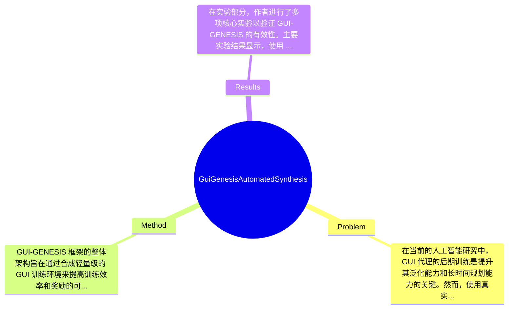

## Summary
提出了 GUI-GENESIS 框架来解决在互动环境中训练 GUI 代理的高延迟和不可验证奖励问题，通过重建轻量级的网络环境并嵌入可验证的奖励机制，取得了显著的训练效率提升和性能优化。

## Problem & Motivation
在当前的人工智能研究中，GUI 代理的后期训练是提升其泛化能力和长时间规划能力的关键。然而，使用真实世界应用进行训练面临着高延迟、低可重复性和依赖于噪声视觉代理的不可验证奖励等问题。这些问题不仅限制了训练的效率，还影响了代理在复杂任务中的表现。首先，真实应用通常需要用户登录并依赖于远程后端同步，这增加了训练过程中的不确定性和计算负担。其次，真实应用中的奖励往往缺乏精确性和可验证性，导致训练过程中需要依赖视觉语言模型（VLM）作为代理评估者，这不仅增加了推理成本，还可能引入视觉幻觉和对齐错误等噪声。因此，解决这些效率和验证性挑战是当前研究的迫切需求。为此，作者提出了 GUI-GENESIS 框架，旨在通过合成轻量级应用并嵌入奖励机制来同时解决这些问题。该框架的核心创新在于利用多模态代码模型重建真实应用，并通过代码本地奖励来提供确定性的奖励信号，从而消除视觉估计噪声。这一方法不仅提高了训练效率，还为代理的自我改进提供了新的可能性。

## Method
GUI-GENESIS 框架的整体架构旨在通过合成轻量级的 GUI 训练环境来提高训练效率和奖励的可验证性。该框架主要包括以下几个关键组件：

1. **Trace-Driven Context Acquisition**: 该组件负责从真实应用中获取上下文信息，通过追踪用户的操作和系统反应，构建出真实应用的行为模型。这一设计的动机在于确保合成的环境能够真实反映用户的交互模式，从而提高训练的有效性。与现有方法相比，该组件能够更准确地捕捉复杂的用户行为，减少了环境合成的偏差。

2. **Hierarchical Code Synthesis**: 该组件利用元提示（meta-prompting）技术进行系统设计的代码合成，并采用计划-执行的实现方式。这种分层的代码合成方法使得环境的构建更加模块化，便于调整和优化。与传统的单一代码生成方法相比，这种设计能够更灵活地应对不同的应用场景。

3. **Code-Native Reward Injection**: 通过将奖励机制嵌入到合成的代码中，提供可执行的断言作为奖励信号。这一设计的动机在于消除依赖视觉代理的噪声，确保奖励的准确性和可验证性。相比于传统方法，该组件能够提供更稳定的奖励反馈，促进代理的有效学习。

4. **Automated Self-Verification**: 该组件包括静态自反思和动态 Playwright 测试，确保合成环境的正确性和稳定性。通过自动化的自验证机制，能够及时发现和修正环境中的问题，提高训练过程的可靠性。

在技术细节方面，GUI-GENESIS 采用了多模态代码模型进行环境合成，并通过强化学习管道进行训练。设计选择上，组件的模块化设计使得系统具有良好的扩展性，而在奖励机制的设计上，作者选择了代码本地奖励而非视觉代理，确保了训练过程的高效性和准确性。整体而言，GUI-GENESIS 的设计既简洁又高效，避免了过度工程化的问题。

## Key Results
在实验部分，作者进行了多项核心实验以验证 GUI-GENESIS 的有效性。主要实验结果显示，使用 GUI-GENESIS 训练的代理在 held-out 的真实世界任务上，性能提升了 14.54%，相较于基线模型的表现更为优越。此外，与真实应用训练相比，GUI-GENESIS 将环境延迟降低了 10 倍，训练成本减少了超过 $28,000 每个周期。这些实验在多个基准（benchmark）上进行，具体包括 RL 任务的成功率和训练效率等指标。通过消融实验，作者分析了各个组件对整体性能的贡献，结果表明，代码本地奖励的引入显著提高了代理的学习效率和任务完成率。尽管实验结果令人鼓舞，但仍需注意的是，作者未详细说明某些实验的具体设置和参数，可能影响结果的可重复性。此外，是否存在 cherry-picking 的情况尚未明确，需进一步验证。

## Strengths & Weaknesses
GUI-GENESIS 的方法亮点主要体现在以下几个方面：
1. **技术创新**: 通过合成轻量级的 GUI 环境并嵌入可验证的奖励机制，解决了传统方法中存在的效率和验证性问题。
2. **模块化设计**: 各个组件的分层设计使得系统具备良好的扩展性和灵活性，能够适应不同的应用场景。
3. **高效性**: 实验结果表明，GUI-GENESIS 在训练效率和成本方面均有显著提升，能够有效支持大规模的训练需求。

然而，该方法也存在一些局限性：
1. **技术局限**: 尽管合成环境在效率上有优势，但在某些复杂场景下，合成的环境可能无法完全模拟真实应用的复杂性，影响代理的学习效果。
2. **适用范围**: 该框架主要针对 GUI 代理的训练，可能不适用于其他类型的代理或任务，限制了其应用范围。
3. **计算成本**: 尽管训练成本有所降低，但合成环境的构建仍需一定的计算资源，可能对资源有限的研究者造成负担。

潜在影响方面，GUI-GENESIS 对于推动 GUI 代理的研究具有重要贡献，可能在自动化测试、用户交互设计等领域找到应用方向。已知信息包括框架的基本结构和实验结果；推测方面，合成环境的复杂性可能会影响代理的学习能力；而对于框架在不同任务中的适用性，论文未涉及，因此仍需进一步探索。

## Mind Map

## Notes
<!-- 其他想法、疑问、启发 -->
