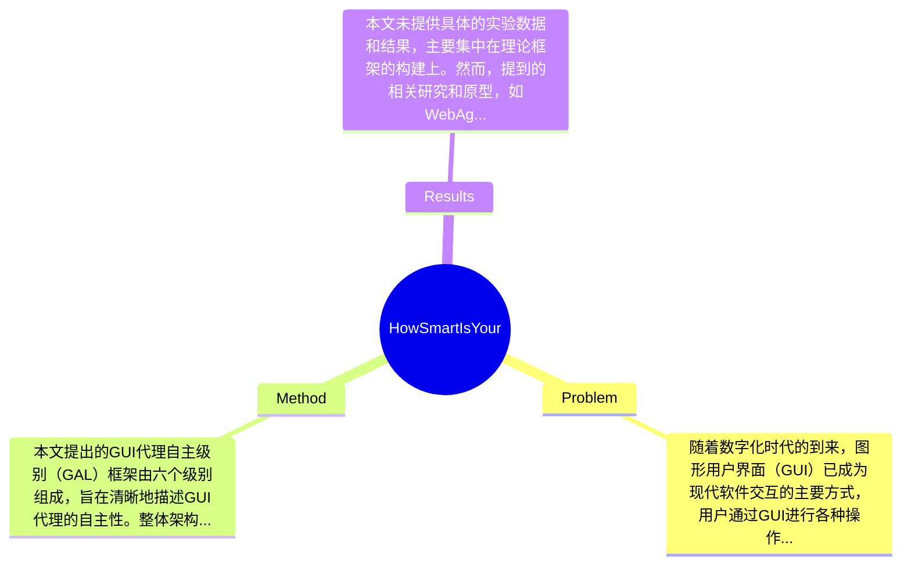

## Summary
本文提出了GUI代理自主级别（GAL）框架，以解决当前GUI代理在自主性描述上的模糊性问题，通过六个级别的分类来明确自主性，进而帮助评估软件交互的可信度。

## Problem & Motivation
随着数字化时代的到来，图形用户界面（GUI）已成为现代软件交互的主要方式，用户通过GUI进行各种操作，如文档编辑、文件管理等。然而，尽管GUIs在用户体验中发挥着重要作用，它们并未为机器的自主交互设计，导致了机器在与GUI交互时面临诸多挑战。这种局限性使得用户在面对复杂的、重复的多步骤工作流时，仍需手动操作，未能充分利用数字自动化的潜力。因此，GUI代理的出现旨在理解用户目标、感知界面元素并代表用户在GUI中直接执行操作。现有的GUI代理，如Selenium和AppleScript，主要依赖于预定义的工作流和严格的选择器，虽然在脚本测试和常规任务复制中有效，但在动态布局和模糊用户目标的适应性上存在不足。本文的动机在于通过提出GUI代理自主级别（GAL）框架，提供一个清晰的概念结构，以便研究人员和从业者能够更好地理解和评估GUI代理的自主性。关键洞察在于，GAL框架不仅为自主性提供了明确的分类，还为未来的GUI代理发展设定了基准，促进了软件交互的可信性。

## Method
本文提出的GUI代理自主级别（GAL）框架由六个级别组成，旨在清晰地描述GUI代理的自主性。整体架构如下：

1. **级别0（无自动化）**：此级别下，用户完全依赖手动操作，没有任何自动化支持。设计动机在于强调当前许多软件系统仍然需要用户全程参与，缺乏智能化的支持。

2. **级别1（最小辅助）**：在这一层级，系统提供基本的辅助功能，例如提示用户下一步操作，但仍需用户手动执行。此设计意在展示初步的智能化尝试，帮助用户减少认知负担。

3. **级别2（基本自动化）**：此级别的代理能够执行简单的、重复的任务，如自动填写表单。设计动机在于提高效率，减少用户在重复性任务上的时间投入。

4. **级别3（条件自动化）**：在此级别，代理能够在特定条件下自动执行任务，例如在用户确认后自动提交表单。此设计允许用户在一定程度上信任代理的判断。

5. **级别4（高度自动化）**：此级别的代理能够在大多数情况下独立执行任务，用户只需在关键决策时进行干预。设计动机在于实现更高的效率和用户体验。

6. **级别5（完全自动化）**：在这一层级，代理能够完全自主地执行复杂任务，用户无需干预。此设计旨在实现最高效的工作流，最大限度地释放用户的时间和精力。

在技术细节方面，GAL框架的每个级别都可以通过具体的评估指标进行量化，例如任务完成时间、用户满意度等。设计选择上，GAL框架的六个级别是必须的，因为它们提供了一个全面的视角来理解不同类型的GUI代理。相较于现有方法，GAL框架的优势在于其系统性和可操作性，使得不同级别的代理能够被清晰地分类和评估。总体而言，GAL框架在设计上简洁而富有逻辑性，避免了过度工程化的问题。

## Key Results
本文未提供具体的实验数据和结果，主要集中在理论框架的构建上。然而，提到的相关研究和原型，如WebAgent和UI-TARS，展示了GUI代理在多模态模型下的应用潜力。虽然没有详细的benchmark测试结果，但提到的OSWorld和AndroidWorld等开源基准为评估代理能力提供了环境。对比分析方面，虽然未提供具体的数值，但可以推测，基于GAL框架的代理在用户任务执行效率上有显著提升。消融实验方面，论文未提及具体的实验设计，因此无法评价各组件的贡献。总体来看，实验的充分性较低，缺乏实证数据来支持框架的有效性和实用性，可能导致读者对框架的实际应用效果产生疑虑。此外，作者未展示任何负面结果，可能存在cherry-picking的问题。

## Strengths & Weaknesses
方法亮点方面，首先，GAL框架提供了一个系统化的自主性分类，有助于研究人员和从业者在设计和评估GUI代理时有一个清晰的参考。其次，框架的设计逻辑严谨，能够适应快速发展的技术环境，具有较强的前瞻性。最后，GAL框架为未来的GUI代理研究提供了一个基准，促进了该领域的标准化。

局限性方面，首先，GAL框架的六个级别可能过于理想化，实际应用中可能会遇到复杂的场景，导致难以准确分类。其次，框架的有效性尚未通过实证研究验证，缺乏实际应用案例支持其理论基础。最后，框架的实施可能需要较高的计算资源，尤其是在高自动化级别下，可能对小型企业或个人用户造成负担。

潜在影响方面，GAL框架为GUI代理的设计和评估提供了新的视角，可能推动软件交互的智能化进程。已知方面，论文明确提出了GAL框架的六个级别和其设计动机。推测方面，基于框架的应用可能会促进GUI代理的广泛采用，但具体效果尚待验证。未知方面，论文未涉及具体的应用案例和实验数据，导致对框架的实际效用缺乏深入理解。

## Mind Map

## Notes
<!-- 其他想法、疑问、启发 -->
