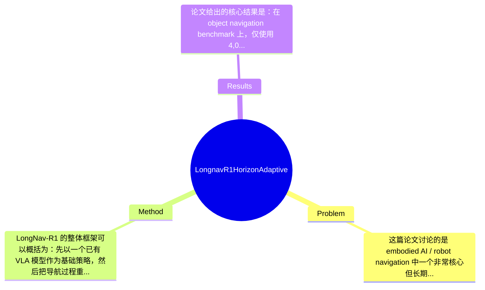

## Summary
LongNav-R1 针对长时程 Visual-Language-Action (VLA) 导航中单步监督学习难以进行长期 credit assignment 和鲁棒恢复的问题，提出了一个将导航重构为策略与环境持续多轮交互的 multi-turn reinforcement learning 框架，并进一步设计 Horizon-Adaptive Policy Optimization 来处理不同轨迹长度下的 advantage 估计。论文报告称，在 object navigation benchmark 上，仅用 4,000 条 rollout 轨迹就将 Qwen3-VL-2B 的 success rate 从 64.3% 提升到 73.0%，同时在长时程真实世界 zero-shot 导航中表现出一定泛化与鲁棒性。

## Problem & Motivation
这篇论文讨论的是 embodied AI / robot navigation 中一个非常核心但长期未被彻底解决的问题：如何让 VLA 模型在长时程（long-horizon）导航任务中，不仅“看懂”和“听懂”指令，还能持续做出一连串彼此依赖的动作决策，直到最终找到目标物体或到达目标区域。该问题的重要性很高，因为现实机器人执行家庭服务、仓储拣选、办公室巡检、辅助照护等任务时，往往都不是一步决策即可完成，而是需要跨越多个房间、经历探索、纠错、重规划和长期目标保持。若策略只能在局部感知下预测下一步动作，就会在真实环境中频繁迷失、陷入循环，或者在早期走错后无法恢复。

论文对现有方法的批评是有针对性的。第一，许多已有导航方法采用 single-turn imitation learning 或 SFT 范式，把每一步动作预测看成近似独立的 supervised token prediction，这会弱化时序因果结构，导致模型难以理解“前期探索虽然暂时偏离目标，但可能为后期成功提供必要信息”。第二，模仿 expert trajectory 容易造成 behavioral rigidity：模型学到的是“像示范那样走”，而不是“为了成功而优化”，因此面对 distribution shift、感知噪声或历史失误时恢复能力较弱。第三，长轨迹下 reward 稀疏、序列长短不一，标准 RL 的 temporal credit assignment 容易失真，导致训练不稳定甚至策略坍塌。

作者提出新方法的动机总体是合理的：如果导航本质上是一个持续交互决策过程，那么训练范式也应从静态单步监督转向多轮在线优化。其关键洞察有两层：一是把 VLA 导航建模为 policy 与 embodied environment 的“连续对话”，从而让模型显式吸收历史交互；二是在 RL 优化时引入 horizon-adaptive advantage estimation，使不同长度轨迹上的奖励分配更公平、更稳定。这个洞察并不只是“把 PPO 搬到导航上”，而是试图解决长时程 VLA 场景中特有的训练失配问题。

## Method
LongNav-R1 的整体框架可以概括为：先以一个已有 VLA 模型作为基础策略，然后把导航过程重构为 policy 与环境之间的 multi-turn interaction rollout，在在线采样得到的长轨迹上执行 RL 更新；为避免长短轨迹混合时 advantage 估计失真，论文进一步提出 Horizon-Adaptive Policy Optimization，对 temporal credit assignment 做显式校正。整个方法的目标不是单步动作模仿，而是直接优化长期导航成功。

1. 多轮交互式 VLA rollout
- 作用：这是整篇论文最基础的建模转换。作者不再把每一步动作当作孤立样本，而是把一整个导航 episode 看成连续多轮“观察-语言上下文-动作”交互序列。这样模型在当前决策时能够访问历史视觉观测、过去动作以及任务目标，从而形成更长上下文内的策略推理。
- 设计动机：单步 supervised learning 的根本问题在于训练目标与测试场景不一致。测试时模型必须连续闭环控制，但训练时却只拟合局部专家动作。multi-turn rollout 让训练和部署形式更接近，减少 exposure bias。
- 与现有方法区别：相较于 single-turn SFT，这里核心不是把 action token 预测做得更准，而是显式依赖 trajectory-level online interaction 生成训练数据。论文强调这种方式能鼓励探索不同可行轨迹，而非复制单一专家路径。

2. Multi-turn RL formulation of VLA policy
- 作用：作者把 VLA 导航策略形式化为 reinforcement learning 问题，策略输出动作，环境返回新观测与 reward，优化目标是最大化长期回报。这样可以直接围绕“是否成功到达目标”训练，而非间接依赖示范标签。
- 设计动机：长时程导航中的关键能力，例如绕障、回溯、纠错、探索未知区域，本质上都依赖 delayed reward。只有 RL 才能自然处理“早期次优动作换来后期更高成功率”的情况。
- 与现有方法区别：区别不在于使用 RL 本身，而在于将 RL 与 VLA 的序列建模统一起来，形成 end-to-end 的优化框架。论文摘要暗示该方法是对现有 Qwen3-VL-2B 等基础模型进行优化，而不是重新设计一个完全独立的导航器。

3. Horizon-Adaptive advantage estimation
- 作用：这是方法中的关键技术点。由于不同导航 episode 的 horizon 长度不同，若直接采用统一 advantage 估计，长轨迹可能出现 credit dilution，短轨迹可能 reward scale 偏大，从而造成训练不稳定。作者提出 horizon-adaptive 机制，在 advantage estimation 时显式考虑 horizon 差异，以实现更准确的 temporal credit assignment。
- 设计动机：长时程任务里，reward 往往晚到且稀疏，标准估计器容易把成功归因过度集中到尾部动作，或者让前期关键探索动作几乎拿不到梯度信号。horizon-aware 设计的目的就是让“早期正确探索”也能得到合理奖励。
- 与现有方法区别：相较于直接套用标准 PPO / GAE，这里强调长度自适应，而不是假设所有 episode 的时间尺度一致。该点是论文最核心的算法创新。

4. Training strategy
- 作用：论文提到 SFT implementation details、RL implementation details，以及 online token pruning algorithm，说明训练并非从零开始，而可能采用“先监督初始化、再在线 RL 微调”的两阶段策略，并通过 token pruning 控制长上下文训练成本。
- 设计动机：纯 RL 从随机策略起步在 VLA 场景代价高、样本效率低，因此先用 SFT 保持基本 action prior，再用 RL 学长期行为，属于务实选择。token pruning 则显然是为缓解多轮视觉语言上下文带来的显存和推理成本。
- 与现有方法区别：论文更强调 sample efficiency，说明训练设计并非单纯追求最终分数，而是在有限 rollout 数量下取得收益。

5. 设计选择与简洁性评价
- 必要设计：multi-turn formulation 和 horizon-adaptive optimization 基本是论文成立的两根支柱，前者解决任务建模失配，后者解决长序列 credit assignment 失真。没有这两点，方法会退化为“普通 VLA + RL fine-tuning”。
- 可替代选择：advantage 校正未必只能用 horizon-adaptive 方式，也可考虑 return normalization、per-step reward shaping、hierarchical RL、option-based credit assignment 或 transformer-based value decomposition。论文在当前材料中未证明其方案是唯一最优。
- 简洁性评价：从概念上看，方法是相对统一且顺畅的——问题重构为 multi-turn RL，再针对长时程特性补一个 horizon-adaptive 优化器，逻辑闭环较完整，不算明显过度工程化。但如果 online token pruning、SFT warm-start、RL tricks 较多，则实现层面可能仍有较重工程依赖；由于全文细节未完全给出，这一点只能保留判断。

## Key Results
论文给出的核心结果是：在 object navigation benchmark 上，仅使用 4,000 条 rollout trajectories，LongNav-R1 将 Qwen3-VL-2B 的 success rate 从 64.3% 提升到 73.0%，绝对提升 8.7 个百分点，相对提升约 13.5%。从摘要措辞“significantly outperform state-of-the-art methods”来看，作者声称其在样本效率和最终性能上都优于已有 SOTA，但当前提供的摘录中并未列出完整 baseline 名单、全部 benchmark 名称、评价指标定义或方差区间，因此很多对比细节仍是“论文未提及”。

已知的 benchmark 类型至少包括 object navigation，而且论文还有 long-horizon real-world navigation 的 zero-shot 测试，用于证明泛化性与鲁棒性。这里的关键指标明确出现的是 success rate；至于 SPL、distance-to-goal、trajectory length、collision rate、success weighted metrics 等导航常见指标，当前材料中论文未提及。若正文完整实验包含这些指标，那会更能证明模型不是靠更长、更冒险的轨迹换成功率。

关于对比分析，当前最明确的是对基础模型 Qwen3-VL-2B 的前后提升，而不是对其他方法的完整表格比较。因此我们能确认“RL 微调有效”，但还不能严格判断其相对其他 contemporary VLA navigation 方法到底领先多少。论文目录中包含 Comparison with SOTAs 和 Ablation studies，说明作者大概率做了系统对比与消融，但在当前提取文本中没有给出具体数字。可以合理推断消融会覆盖：multi-turn RL 相对 single-turn SFT 的收益、horizon-adaptive advantage estimation 的单独贡献、以及 rollout 数量对性能的影响；但具体增益幅度论文摘录未提供。

实验充分性方面，这篇论文至少覆盖了仿真 benchmark、消融研究、case study、real-world zero-shot，结构上是完整的，这是优点。但不足也明显：第一，缺少当前材料中的误差条、随机种子方差和统计显著性；第二，尚不清楚真实世界实验规模是否足够大；第三，若只强调 success rate 提升，可能掩盖路径效率或安全性退化。就 cherry-picking 风险而言，作者确实展示了最亮眼的 64.3%→73.0% 提升与 real-world zero-shot 结果，但在未见完整失败案例分布之前，无法排除存在选择性呈现的可能。

## Strengths & Weaknesses
这篇论文的亮点首先在于问题建模切得很准。它并没有把贡献停留在“换个更大 backbone”或“加更多数据”，而是直接指出 single-turn imitation learning 与长时程导航之间的结构性错配，并用 multi-turn RL 去对齐训练目标与部署需求。这一点在 embodied navigation 里是有实质价值的。第二个亮点是 Horizon-Adaptive Policy Optimization。长短轨迹混合下的 advantage 失真确实是长时程 RL 的痛点，作者把它上升为核心方法设计，而不是把训练不稳定简单归因于超参数问题，这体现了比较清晰的算法意识。第三个亮点是样本效率叙事：只用 4,000 条 rollout 就能让 Qwen3-VL-2B 从 64.3% 到 73.0%，若这一结果在完整实验中稳定成立，说明方法具有实际可用性，而非纯理论改进。

局限性也很明确。第一，技术上它仍然高度依赖在线 rollout 和 RL 微调，这意味着训练成本、环境交互成本以及工程调参负担可能显著高于纯 SFT；尤其 VLA 模型本身推理昂贵，多轮长上下文进一步放大了成本。第二，方法的适用范围可能主要集中在 reward 可定义、成功信号较明确的导航任务；若任务目标更开放、评价更主观，horizon-adaptive advantage 是否仍有效，论文当前材料未证明。第三，论文强调多样轨迹与抗 collapse，但尚不清楚这种探索是否会带来安全性问题，例如更长路径、更多碰撞或不稳定行为。

潜在影响方面，这项工作可能推动 embodied VLA 从“看一步走一步”的 imitation policy 转向真正 trajectory-level optimization，对家庭机器人、巡检机器人、仓储移动平台都有启发。更广义地，它也可能影响其他长时程 embodied decision making，如 mobile manipulation、instruction following、web-agent 式多轮决策。

已知：论文明确提出 multi-turn RL 框架、Horizon-Adaptive Policy Optimization，并报告 Qwen3-VL-2B success rate 从 64.3% 提升到 73.0%，且有 real-world zero-shot 结果。推测：训练流程很可能是 SFT warm-start + RL fine-tuning，并辅以 token pruning 提高长上下文效率；该方法对长轨迹 credit assignment 的改进应是主要性能来源之一。论文未提及：完整 baseline 数字、各 benchmark 的详细名称与规模、训练算力、推理延迟、安全性指标、失败模式统计、不同环境复杂度下的退化曲线。综合来看，这是一篇有参考价值的工作，但尚不足以在当前信息下判断为里程碑级别必读。

## Mind Map

## Notes
<!-- 其他想法、疑问、启发 -->
