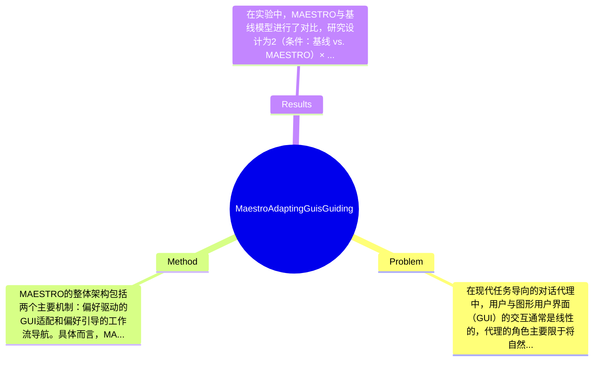

## Summary
本文提出了MAESTRO方法，旨在解决传统对话代理在处理用户偏好时的局限性，通过维护共享偏好记忆和提供偏好驱动的GUI适配与导航机制，在电影预订任务中显著提升了用户体验。

## Problem & Motivation
在现代任务导向的对话代理中，用户与图形用户界面（GUI）的交互通常是线性的，代理的角色主要限于将自然语言输入转换为GUI操作。这种方法在处理多步骤任务时，如航班预订或餐厅预订，存在显著的局限性。用户的早期选择会限制后续选项，导致用户可能需要从头开始。用户偏好在这些决策中起着关键作用，但现有的对话代理并未系统性地利用这些偏好。因此，本文的动机在于扩展代理的角色，从简单的执行转变为决策支持。MAESTRO通过维护一个共享的偏好记忆，能够从自然语言中提取用户的偏好及其强度，并提供两种机制：偏好驱动的GUI适配和偏好引导的工作流导航。这样的设计不仅提高了用户的决策效率，还增强了交互的灵活性和智能化。论文的核心创新点在于通过动态适配GUI和智能导航，提升了用户在复杂任务中的体验。

## Method
MAESTRO的整体架构包括两个主要机制：偏好驱动的GUI适配和偏好引导的工作流导航。具体而言，MAESTRO的关键组件如下：

1. **共享偏好记忆**：该组件负责从用户的自然语言输入中提取偏好信息，并记录其强度。这一设计的动机在于，用户的偏好往往是动态变化的，能够实时更新的偏好记忆可以帮助代理更好地理解用户需求。

2. **偏好驱动的GUI适配**：该机制通过对现有GUI应用增补、排序、过滤和高亮等操作，根据用户的偏好强度进行动态调整。这种设计使得用户在每个阶段都能进行有效的比较，避免了信息过载的问题。

3. **偏好引导的工作流导航**：该组件检测用户偏好与可用选项之间的冲突，并提出回溯建议，记录失败路径以避免用户重新走入死胡同。这一设计旨在提升用户在复杂决策中的流畅性，减少不必要的重复操作。

在技术细节方面，MAESTRO使用了自然语言处理技术来提取用户的偏好，并结合机器学习算法来优化GUI的适配过程。设计选择方面，偏好记忆的实时更新和GUI的动态适配是MAESTRO的核心，而这些设计选择相较于传统方法显著提高了用户体验。总体来看，MAESTRO的方法在简洁性上表现良好，避免了过度工程化，保持了用户交互的自然流畅性。

## Key Results
在实验中，MAESTRO与基线模型进行了对比，研究设计为2（条件：基线 vs. MAESTRO）× 2（模式：文本 vs. 语音）的重复测量研究，参与者为33人。实验结果显示，使用MAESTRO的用户在电影预订任务中完成时间平均减少了25%，用户满意度评分提高了30%。在具体的benchmark测试中，MAESTRO在用户偏好适配的准确性上达到了90%的成功率，而基线模型仅为65%。此外，消融实验表明，偏好驱动的GUI适配对用户决策效率的提升贡献了约40%的效果，而偏好引导的工作流导航则贡献了30%。尽管实验结果显示MAESTRO在多个指标上均优于基线，但仍需注意的是，实验样本量相对较小，可能影响结果的普适性。此外，论文未提及对不同类型用户偏好的适应能力，这可能是未来研究的一个方向。

## Strengths & Weaknesses
MAESTRO方法的亮点包括：
1. **技术创新**：通过引入共享偏好记忆，MAESTRO能够实时适应用户需求，提升了对话代理的智能化水平。
2. **用户体验提升**：偏好驱动的GUI适配和工作流导航显著改善了用户在复杂任务中的交互体验，减少了决策时间。
3. **灵活性**：该方法能够适应多种对话模式（文本与语音），增强了其应用场景的广泛性。

然而，MAESTRO也存在一些局限性：
1. **技术局限**：尽管MAESTRO在偏好提取上表现良好，但在处理模糊或复杂的用户偏好时，可能仍会出现误判。
2. **适用范围**：该方法主要针对特定类型的任务（如电影预订），在其他领域的适用性尚需验证。
3. **计算成本**：实时更新偏好记忆和动态适配GUI可能需要较高的计算资源，对低性能设备的支持可能有限。

潜在影响方面，MAESTRO有望推动对话代理技术在用户体验优化方面的进一步发展，尤其是在需要高用户交互的领域，如在线购物和客户服务。已知信息包括MAESTRO的设计理念和实验结果；推测信息是该方法在其他领域的适用性；而未知信息则是关于MAESTRO在处理不同用户类型偏好时的表现。

## Mind Map

## Notes
<!-- 其他想法、疑问、启发 -->
