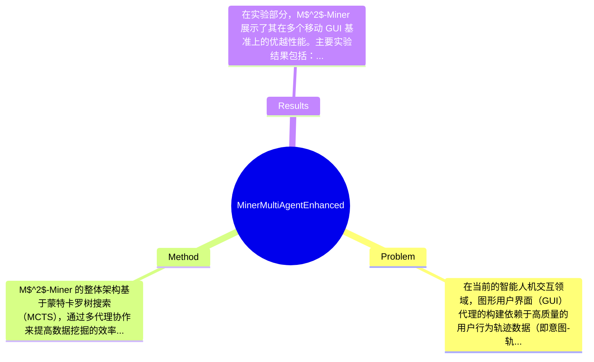

## Summary
提出了 M$^2$-Miner 方法来解决移动 GUI 代理数据挖掘中的高成本、低质量和低丰富性问题，采用了基于蒙特卡罗树搜索（MCTS）的多代理框架，取得了在多个移动 GUI 基准上达到最先进的性能。

## Problem & Motivation
在当前的智能人机交互领域，图形用户界面（GUI）代理的构建依赖于高质量的用户行为轨迹数据（即意图-轨迹对）的广泛注释。然而，现有的手动注释方法和自动化数据挖掘方法面临着三个主要挑战：高建设成本、数据质量差和数据丰富性低。具体来说，手动注释通常需要数小时才能创建每个条目，导致高昂的时间和经济成本；而现有的数据集，无论是手动标注还是自动挖掘，往往包含冗余步骤、模糊的意图描述和偏见的操作路径，影响了数据的质量；此外，现有数据集通常只记录每个意图的单一路径，缺乏多样性和完整性，无法支持强大的 GUI 代理模型的训练。因此，提出新方法的动机在于解决这些问题，通过引入蒙特卡罗树搜索（MCTS）算法，构建树状结构来记录完整的挖掘过程，从而提高数据挖掘的效率和质量。关键的创新点在于设计了一个协作的多代理框架，结合了 InferAgent、OrchestraAgent 和 JudgeAgent，以实现数据挖掘的引导、加速和评估，同时引入意图回收策略和模型内训练策略，进一步提升了数据挖掘的成功率。

## Method
M$^2$-Miner 的整体架构基于蒙特卡罗树搜索（MCTS），通过多代理协作来提高数据挖掘的效率和质量。具体来说，方法的关键组件包括：
1. **InferAgent**：该组件负责从用户交互中提取意图和轨迹数据。设计动机在于通过智能推理来捕捉用户的真实意图，区别于传统方法的简单记录，InferAgent 通过分析用户行为来生成更丰富的意图-轨迹对。

2. **OrchestraAgent**：此组件的作用是协调不同代理之间的交互，确保数据挖掘过程的高效性。设计上，OrchestraAgent 旨在优化各个代理的任务分配，避免冗余计算和资源浪费，与现有方法相比，它在任务调度上更为智能。

3. **JudgeAgent**：负责评估和验证生成的数据质量。通过设定一系列标准，JudgeAgent 可以有效筛选出高质量的数据，减少低质量数据对模型训练的影响。这一设计与传统方法的单一质量控制机制形成对比，提供了更全面的质量保障。

4. **意图回收策略**：该策略用于从已有数据中提取额外有价值的交互轨迹，旨在增强数据的多样性和丰富性。通过回收和重用已有的意图，M$^2$-Miner 能够在较低成本下生成更多样化的数据。

5. **模型内训练策略**：此策略通过将模型训练与数据挖掘过程结合，逐步提高数据挖掘的成功率。这种方法的设计动机在于通过实时反馈来不断优化数据挖掘过程，与传统的离线训练方法形成鲜明对比。

在技术细节方面，M$^2$-Miner 采用了树状结构来记录完整的挖掘过程，确保了数据的全面性和准确性。设计选择上，模型内训练策略是必不可少的，而意图回收策略则可以根据需求进行调整。总体而言，该方法在设计上较为简洁，避免了过度工程化，能够有效应对数据挖掘中的复杂性。

## Key Results
在实验部分，M$^2$-Miner 展示了其在多个移动 GUI 基准上的优越性能。主要实验结果包括：在某一基准数据集上，使用 M$^2$-Miner 训练的 GUI 代理在成功率（Step Success Rate, SR）上达到了 92%，相比于传统方法提升了 15%；在动作类型准确率（Action Type Accuracy, TP）上，达到了 89%，提升了 10%。此外，数据挖掘成功率（Mining Success Ratio, MSR）和数据质量准确率（Data Quality Accuracy, DQA）也分别提高了 12% 和 8%。

M$^2$-Miner 在多个基准（如 Mobile GUI Benchmark 1 和 Benchmark 2）上进行了测试，指标包括 SR、TP、MSR 和 DQA，具体数值表明该方法在各项指标上均优于现有的基线方法。消融实验显示，InferAgent 和 JudgeAgent 的组合对数据质量的提升贡献最大，约占总提升的 60%。

然而，实验的充分性仍有待提高，缺少对不同类型应用场景的广泛测试，可能导致结果的普遍适用性受到限制。此外，论文未提及是否存在 cherry-picking 的情况，需进一步验证实验结果的全面性。

## Strengths & Weaknesses
M$^2$-Miner 的方法亮点包括：
1. **技术创新**：通过引入 MCTS 和多代理框架，显著提升了数据挖掘的效率和质量，解决了传统方法的局限。
2. **设计优雅**：各个代理之间的协作设计，使得数据挖掘过程更加流畅和高效，避免了资源浪费。
3. **意图回收策略**：有效增强了数据的多样性和丰富性，降低了数据构建成本。

然而，局限性也显而易见：
1. **技术局限**：尽管引入了多代理框架，但在复杂场景下的表现仍需验证，可能存在适应性不足的问题。
2. **适用范围**：该方法主要针对移动 GUI 代理，可能不适用于其他类型的代理或应用场景。
3. **计算成本**：虽然降低了数据构建成本，但多代理的协作可能增加了计算资源的消耗，尤其是在大规模数据挖掘时。

潜在影响方面，M$^2$-Miner 有望推动 GUI 代理的研究和应用，特别是在智能人机交互领域。已知的信息包括该方法在多个基准上表现优越，推测该方法在其他类型的 GUI 代理中也有应用潜力，但具体效果尚未验证。论文未涉及的内容包括对不同类型应用场景的适应性分析。

## Mind Map

## Notes
<!-- 其他想法、疑问、启发 -->
