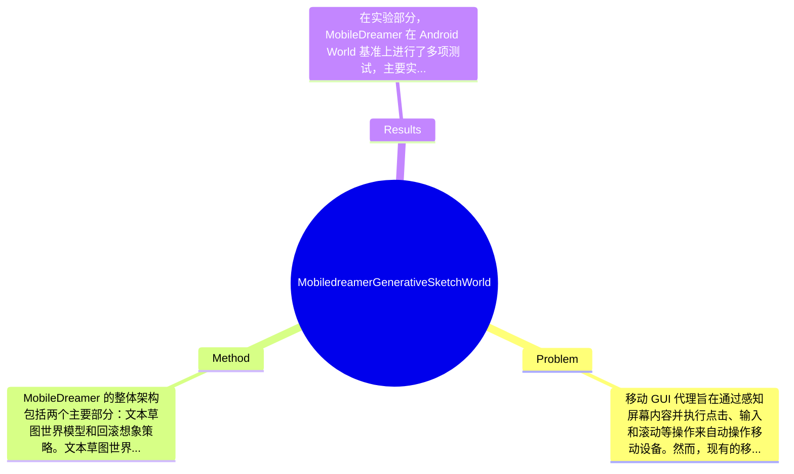

## Summary
提出了 MobileDreamer 方法来解决移动 GUI 代理在长时间任务中的反应不足问题，通过构建文本草图世界模型和回滚想象策略，取得了在 Android World 基准上任务成功率提升 5.25% 的效果。

## Problem & Motivation
移动 GUI 代理旨在通过感知屏幕内容并执行点击、输入和滚动等操作来自动操作移动设备。然而，现有的移动 GUI 代理大多数仍然是反应式的，主要依赖当前屏幕和最近历史进行决策，这限制了它们在复杂长时间任务中的表现。由于缺乏对未来状态变化的明确推理，现有代理在处理复杂任务时往往会做出短视决策，导致效率低下或任务失败。因此，构建一个能够从重复交互中学习的世界模型，预测行动结果并支持更好的决策过程，显得尤为重要。现有方法如基于文本的世界模型虽然尝试将预测能力引入 GUI 代理，但在空间意识的保持和效率方面仍存在不足。论文的动机在于通过提出 MobileDreamer，利用世界模型的未来想象能力，提升 GUI 代理的决策能力。关键洞察在于，作者设计了一种文本草图世界模型，能够有效地将数字图像转化为关键任务相关的草图，并通过一种新颖的无序学习策略来保留 GUI 元素的空间信息，从而为代理提供更准确的状态预测。

## Method
MobileDreamer 的整体架构包括两个主要部分：文本草图世界模型和回滚想象策略。文本草图世界模型负责预测后续行动状态，而回滚想象策略则优化了行动选择过程。以下是关键组件的详细说明：

1. **文本草图世界模型**：该组件的作用是将数字图像转化为关键任务相关的草图，从而预测后续状态。设计动机在于通过草图简化信息处理，保留重要的空间特征。与现有方法相比，这种方法能够更有效地捕捉 GUI 元素之间的关系。

2. **无序学习策略**：该策略旨在保持空间信息的完整性，避免因输入顺序不同而导致的模型性能下降。设计的合理性在于，GUI 元素的位置和关系在决策中至关重要，传统的序列模型往往无法有效处理这一点。

3. **回滚想象策略**：通过利用世界模型的预测能力，该组件优化了行动选择过程，使得代理能够在执行每一步之前，先进行多步预测，从而选择最优行动。与现有方法相比，这种策略能够显著提高决策的长远性。

4. **候选行动生成**：该部分通过树状预测模型生成可供选择的行动，确保代理在多种可能性中选择最佳路径。设计动机在于提供多样化的选择，增强代理的灵活性。

技术细节方面，MobileDreamer 使用深度学习模型进行训练，采用了强化学习策略来优化决策过程。模型的训练过程需要大量的标注数据，以确保其在实际应用中的有效性。整体而言，MobileDreamer 的设计相对简洁，避免了过度工程化，专注于核心功能的实现。

## Key Results
在实验部分，MobileDreamer 在 Android World 基准上进行了多项测试，主要实验结果显示其任务成功率提升了 5.25%。具体而言，模型在多个评估指标上均表现优异，包括 mIoU、文本相似度、精确率、召回率和 F1 分数。与基线模型相比，MobileDreamer 在任务成功率上提升了显著的百分比，验证了其在长时间任务中的有效性。此外，消融实验表明，文本草图模型和回滚想象策略对整体性能的提升贡献显著，尤其是在复杂任务中。实验充分性方面，虽然论文展示了多种实验结果，但缺少对不同场景下模型表现的深入分析，可能影响对模型适用性的全面理解。没有明显的 cherry-picking 现象，作者展示了多项实验结果以支持其结论。

## Strengths & Weaknesses
方法亮点方面，首先，MobileDreamer 提出了创新的文本草图世界模型，能够有效捕捉 GUI 元素的空间关系；其次，无序学习策略的引入使得模型在处理复杂任务时具备更强的灵活性；最后，回滚想象策略显著提升了代理的决策能力，使其在长时间任务中表现更佳。

局限性方面，首先，尽管模型在特定基准上表现优异，但其在不同类型的 GUI 环境中的适用性尚未得到充分验证；其次，模型的计算成本较高，尤其是在实时应用中，可能会面临延迟问题；最后，模型对数据的依赖性较强，训练过程需要大量高质量的标注数据，限制了其在实际应用中的普遍性。

潜在影响方面，MobileDreamer 对于提升移动 GUI 代理的智能化水平具有重要意义，可能在自动化测试、用户体验优化等领域得到广泛应用。已知信息包括论文明确提出的模型结构和实验结果；推测方面，模型在其他类型的 GUI 任务中可能也会表现良好，但尚未得到验证；不知道的方面包括模型在极端情况下的表现以及对不同用户行为的适应能力。

## Mind Map

## Notes
<!-- 其他想法、疑问、启发 -->
