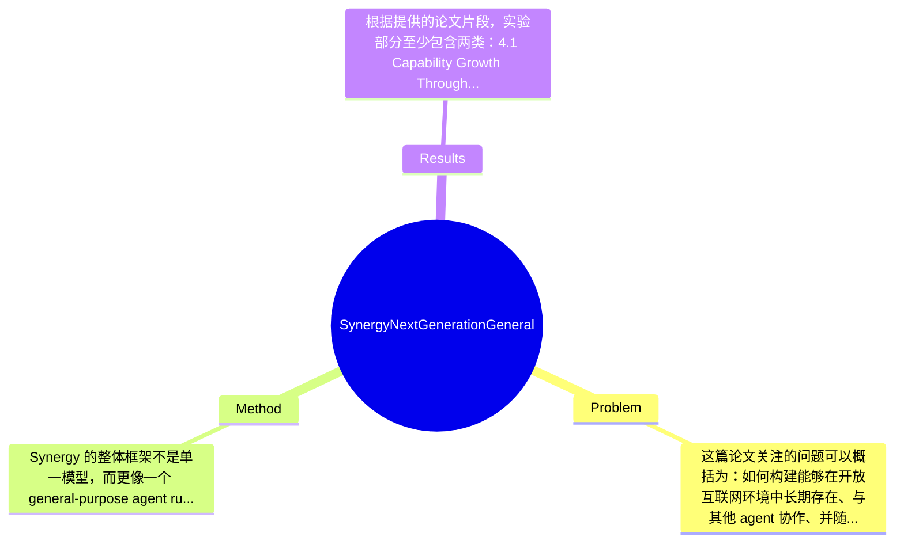

## Summary
论文提出了 Synergy，一个面向 Open Agentic Web 的通用 agent 架构与运行时框架，试图解决现有 agent 只能在封闭工具链中工作、缺乏持久身份与持续进化能力的问题；其核心方法是把开放协作、持久身份和经验驱动学习统一到同一套 session-native orchestration、repository-backed workspace 与 typed memory 体系中。根据摘要与目录可知，作者重点展示了经验积累与经验迁移能带来能力增长，但由于提供的正文不完整，很多具体 benchmark、指标与数值论文片段未提及，无法确认其相对 SOTA 的精确提升幅度。

## Problem & Motivation
这篇论文关注的问题可以概括为：如何构建能够在开放互联网环境中长期存在、与其他 agent 协作、并随时间持续改进的通用 AI agent。它属于 AI agent systems、multi-agent collaboration、agent infrastructure 与 lifelong learning 的交叉领域。作者提出的 Open Agentic Web 概念，本质上是在讨论当互联网上不再只有人和服务，还会出现海量自治 agent 时，系统架构该如何升级。这个问题重要之处在于，今天很多 agent 虽然已经能写代码、操作浏览器、管理云资源，但大多仍是一次性任务执行器：调用结束就“失忆”，缺少稳定身份，也很难与陌生 agent 在开放环境中完成可靠协作。

现实意义非常直接。如果未来 agent 真会进入办公、消费、设备控制、企业自动化和个人数字助理场景，那么它们必须能处理跨平台任务分工、权限边界、社会化沟通与长期偏好维护。例如一个个人 agent 需要长期理解用户习惯，与企业服务 agent、安全审计 agent、支付 agent 等协同工作；如果没有持久记忆和身份，它就只能反复从零开始，效率、可信度和可追责性都很差。

现有方法的局限，论文的批评基本有三类。第一，许多 agent framework 仍停留在 closed orchestration，即在单一组织或单一 runtime 内编排工具调用，缺乏开放网络中的 agent-to-agent 协作机制。第二，大多数方法把 agent 设计成 stateless function call，记忆浅、身份弱，无法形成稳定 social relationships 或个人风格。第三，现有学习方式往往偏重离线微调或 task-specific optimization，缺少一种把日常执行经验持续沉淀并在推理时主动调用的机制。

因此论文动机是合理的：如果互联网真的会进入 agent 大规模共存阶段，单纯提升单个大模型能力不够，更需要设计一种“能在社会中存活”的 agent 操作系统。论文的关键洞察在于把“开放协作”“身份人格化”“终身进化”视为同一问题的三个面：协作需要可追踪会话和共享工作区，身份需要结构化长期资产，进化则需要把过去成功轨迹转化为未来推理时可检索、可复用的经验。

## Method
Synergy 的整体框架不是单一模型，而更像一个 general-purpose agent runtime harness。它把 agent 视为长期运行的数字实体：一方面通过 session-native orchestration、delegation 和 shared workspace 参与开放协作；另一方面通过 typed memory、notes、agenda、skills 与 social graph 维持稳定自我；再通过 experience-centered learning 在推理时召回被奖励的历史轨迹，实现持续演化。换言之，它想统一“执行层”“身份层”“学习层”。

1. Execution Capsules、Delegation 与 Traceability
该组件负责把复杂任务拆成可委派、可追踪的执行单元。作用是让 agent 不只是自己调用工具，还能把子任务交给其他 agent 或其他执行环境，并保留清晰的 session 与 trace。这样设计的动机在于开放网络中的协作必须可审计、可回溯，否则一旦多 agent 分工，责任边界和错误来源会迅速模糊。与传统 ReAct 或简单 tool-use agent 不同，Synergy 强调 delegation 不是附属功能，而是原生执行机制。从系统角度看，这更接近 workflow runtime 而不是单回合 prompt agent。论文片段未给出完整算法，但从章节名看，traceability 应该贯穿任务分发、消息往返和结果归并全过程。

2. From Messaging to Shared Workspaces
作者明确反对只靠 message passing 的弱协作方式，转而引入 repository-backed workspace。这个组件的作用是让多个 agent 围绕同一任务共享文件、状态、文档、代码和中间产物，从“对话协作”升级到“工件协作”。设计动机非常合理：真实任务往往不是几句文本可解决，而需要可编辑、可版本化、可持续维护的外部工作空间。与现有多 agent 系统常见的聊天式黑板相比，repository-backed workspace 更接近软件工程、知识工作和项目管理场景中的真实协作基础设施。它的潜在优势是支持异步协作与长期任务，但代价是系统复杂度、权限管理与一致性问题会显著增加。

3. Layers of Selfhood and Persistent Assets
这是论文最有辨识度的部分之一。Synergy 不把 memory 视为单一向量库，而是分层维护 typed memory、notes、agenda、skills 和 persistent social relationships。其作用是让 agent 拥有跨任务持续存在的“人格与状态”，而不是任务结束就重置。设计动机是：开放 Agentic Web 中的 agent 需要被他人识别、信任和预期，因此身份连续性是基础能力。与现有许多 memory agent 只存对话摘要不同，这里强调资产类型化（typed）和社会关系持久化，这意味着记忆不仅服务当前问答，还服务自我管理、他人协作和长期目标执行。论文未提及这些 memory 的精确 schema、存储后端和冲突解决机制，因此实际落地细节仍不透明。

4. Time, Maintenance, and Ongoing Presence
作者显然意识到 persistent agent 不只是“有记忆”，还要有持续运行和自我维护机制。该组件的作用可能包括 agenda 管理、周期性维护、长期任务跟进和状态更新，使 agent 具有 ongoing presence。设计动机是让 agent 更像长期在线的 participant，而不是被动唤醒的 API。与传统 request-response 范式相比，这种设计更贴近 personal assistant 或 autonomous operator，但也引入调度、资源占用、异常恢复和过度自主的问题。论文片段没有给出具体 scheduling policy 或 maintenance loop 机制，属于关键但未完全公开的部分。

5. Experience Learning via Dialogue-Derived Reward
这是方法中的学习核心。根据摘要，Synergy 采用 experience-centered learning mechanism，在 inference time 主动召回 rewarded trajectories。其作用是把历史成功执行经验转化为未来任务中的策略提示或案例先验，从而不必每次重新探索。设计动机是避免昂贵且慢速的频繁微调，而采用更轻量的经验积累与在线利用。与标准 RAG 检索知识不同，这里检索的是“轨迹经验”而非静态事实；与 RL 不同，它似乎更像 reward-conditioned retrieval / case-based adaptation，而非直接更新策略参数。这里最值得关注的是“dialogue-derived reward”——奖励可能从交互结果、用户反馈或任务完成信号中提取，但具体奖励定义、噪声控制和 credit assignment 论文片段未提及。

整体看，Synergy 的设计雄心很大，优点是把 agent runtime、memory、workspace、social relation 和经验学习整合在一个统一叙事中，架构层面较完整；但也存在明显的系统工程色彩，方法更像一套 platform blueprint 而非简洁单算法。哪些设计是必须的？我认为 delegation trace、shared workspace、persistent memory 是核心；而 selfhood 的具体分层方式、奖励来源设计、维护循环形式，则可能有许多替代实现。简洁性上，它不是“优雅的小方法”，而是“问题定义驱动的大系统方案”，价值更偏基础设施与产品级架构。

## Key Results
根据提供的论文片段，实验部分至少包含两类：4.1 Capability Growth Through Experience Accumulation，以及 4.2 Immediate Gains from Transferred Experience。这说明作者主要想验证两件事：第一，Synergy 能否随着经验积累而持续提升；第二，已有经验能否迁移到新任务并在推理时立即带来收益。可惜当前提供的正文并未包含实验表格、benchmark 名称、样本规模、评价指标或具体数值，因此任何精确结果都无法可靠复述，必须明确标注为论文未提及。

从结构上推断，4.1 很可能比较 agent 在无经验、少量经验、较多经验状态下的任务成功率、完成时间或交互轮数变化；4.2 则可能评估 transferred experience 对冷启动任务的 immediate gains，例如首轮成功率提升或平均步骤数下降。但这些都只是合理推测，不是论文明示事实。当前已知的只有：作者把“经验累积带来能力增长”与“经验迁移带来即时提升”作为主要实证主张。

如果从批判性角度评价实验充分性，现有片段暴露出几个问题。第一，benchmark 透明度不足：没有看到具体测试环境，无法判断是 web agent、code agent、computer-use 还是 synthetic collaboration tasks。第二，缺少与强 baseline 的明确对比，例如是否对比无持久记忆版本、仅 message-based 协作版本、无经验召回版本，或者与 AutoGen、OpenHands、Devin-style agent runtime 等系统比较。第三，尚不清楚作者是否评估了 failure cases，如错误经验检索、错误 delegation、身份记忆污染、长期运行漂移等。

关于是否存在 cherry-picking，目前无法下结论。已知的是作者实验标题天然偏向展示正面结果；不知道的是是否也报告了任务失败率、迁移失效案例、经验污染风险或长期维护开销。如果正式论文只展示“增长”与“提升”，却不展示成本、鲁棒性和边界条件，那么说服力会有限。总结来说，论文的实验方向与方法主张高度对齐，但就当前可见信息而言，定量证据严重不足，无法验证其真实优势幅度。

## Strengths & Weaknesses
这篇论文的亮点首先在于问题 framing 很强。作者没有把 agent 仅仅看成更聪明的 LLM wrapper，而是提出“Agentic Citizens”这一更社会化的目标，强调开放协作、身份连续性和终身演化三位一体。这种视角对 agent 系统研究是有启发性的，因为它把单体能力问题提升到了网络生态与制度层面。第二个亮点是架构整合度高。Synergy 将 session orchestration、repository-backed workspace、typed memory、social relationships 和 experience retrieval 统一到一个运行时中，这比许多只做某个局部模块优化的工作更接近真实部署需求。第三个亮点是经验学习思路实用。相比频繁参数更新，基于 rewarded trajectories 的推理时主动召回更轻量，也更适合在线系统。

局限性也很明显。第一，技术上它更像系统蓝图而非可严格归因的算法论文。若没有强消融和统一 benchmark，很难知道性能提升到底来自 persistent memory、workspace 设计，还是更强 prompt engineering。第二，适用范围可能偏向复杂知识工作、软件协作和开放任务编排；对于低延迟、高安全、高确定性的场景，例如金融风控、工业控制、医疗执行，这种开放 delegation 与持续自主演化机制可能风险较高。第三，计算与运维成本可能不低。持久身份、长期 memory、共享仓库、轨迹检索、维护循环都会增加存储、调度和治理成本；在多 agent 网络中还会带来权限、信任和安全攻击面扩张。第四，数据依赖与反馈质量是潜在瓶颈。如果 dialogue-derived reward 噪声很大，经验库可能会被低质量成功案例污染，导致错误模式被持续强化。

潜在影响方面，如果该体系真正可行，它对开放 agent infrastructure、personal AI operating system、多 agent software engineering、企业级 agent collaboration 都有参考价值。它的贡献更可能体现在“如何组织 agent 社会”而不是“如何单点提升模型分数”。

已知：论文明确提出了 Open Agentic Web、Agentic Citizens 的三项要求，以及 Synergy 的三层设计支柱——协作、身份、进化；也明确说明了使用 session-native orchestration、repository-backed workspaces、typed memory、persistent social relationships 和 experience-centered learning。推测：经验学习很可能依赖案例检索而非参数更新；共享工作区可能采用类 git/repository 的版本化机制；系统目标包含跨 agent 的任务委派与可追责执行。不知道：具体基座模型、训练数据、奖励函数定义、benchmark 细节、确切数值、失败案例统计、安全机制、部署成本，这些在提供片段中均未涉及。

综合评分给 3 分：有参考价值。原因是它在研究问题定义和系统架构视角上具有启发性，适合作为 agent infrastructure 与开放协作方向的概念性和设计性参考；但从当前可见内容看，定量实验证据与可复现技术细节仍不足，尚未达到“必读里程碑”的程度。

## Mind Map

## Notes
<!-- 其他想法、疑问、启发 -->
