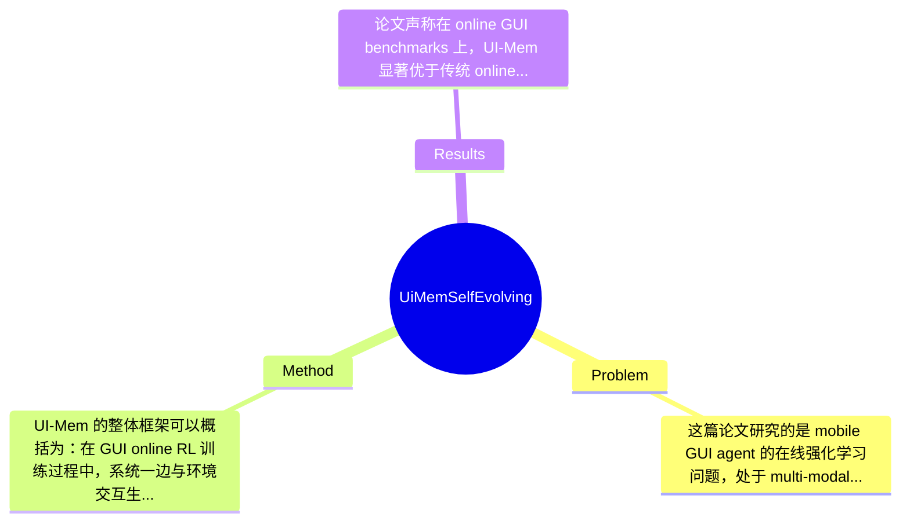

## Summary
该论文针对 mobile GUI agent 在线强化学习中长时程任务 credit assignment 困难、跨任务重复犯错且缺乏经验迁移的问题，提出了带有 Hierarchical Experience Memory 的 UI-Mem，通过参数化模板记忆、高低层经验抽象、memory-guided exploration 与 self-evolving update loop 来增强在线 RL。论文声称在在线 GUI benchmark 上显著优于传统 online RL baseline 与静态经验复用策略，并且对未见应用具有较强泛化能力，但当前给定材料未提供完整数值表格，因此具体提升幅度仅能部分确认，若需精确数字需查原文实验表。

## Problem & Motivation
这篇论文研究的是 mobile GUI agent 的在线强化学习问题，处于 multi-modal GUI agents、LLM/VLM agents 与 reinforcement learning 的交叉领域。具体来说，智能体需要根据用户目标理解屏幕截图、规划一系列点击/输入/滑动动作，并在真实或仿真的移动应用界面中完成长时程任务。这个问题的重要性非常高，因为它直接关系到通用手机助手、自动化测试、无障碍交互、企业流程自动化等真实应用场景。与网页或文本环境相比，移动 GUI 环境具有状态空间复杂、视觉布局变化大、动作后果延迟、任务成功通常只在最后给出稀疏反馈等特点，因此标准 online RL 很容易在长序列试错中陷入低效学习。

论文指出的现实痛点是合理的：第一，长时程任务中的 credit assignment 很差。即使前面多个步骤是正确的，只要最后一步失败，整条 trajectory 可能只收到负反馈，导致正确中间行为无法被强化。第二，GUI 任务中很多失败模式会跨任务重复出现，例如弹窗处理、页面跳转、权限授权、表单确认等，但普通 online RL 缺少把这些经验抽象并迁移到新任务的机制。现有方法的局限主要包括：其一，标准 online RL 只能依赖当前任务 rollout，缺乏结构化跨任务 transfer；其二，experience replay buffer 虽能提升 sample efficiency，但存的是原始轨迹片段，不具备抽象模板化知识，跨应用复用能力弱；其三，dense reward 或 reward shaping 能缓解稀疏反馈，但通常针对单任务局部 credit assignment，不能系统性避免相似错误重复发生。

因此作者提出新方法的动机是：让 agent 不只是“记住数据”，而是“积累可复用经验”，并把成功 workflow、subtask skill 和 failure pattern 组织成可检索、可迁移、可随训练演化的 memory。这个动机总体上是合理且有现实针对性的。论文的关键洞察在于，把在线 RL 中零散的成功/失败轨迹提升为层次化、参数化的经验模板，并在 rollout 期间以不同强度注入 guidance，使策略既能利用 memory，又不完全依赖 memory，从而逐渐把外部经验内化到 policy 中。

## Method
UI-Mem 的整体框架可以概括为：在 GUI online RL 训练过程中，系统一边与环境交互生成 trajectories，一边从成功与失败经历中抽取高层 workflow、低层 subtask skill 以及 failure pattern，存入一个 Hierarchical Experience Memory；随后在新的 rollout 中，通过 memory retrieval 为当前任务提供不同粒度的 guidance，并结合专门设计的 exploration 与 reward shaping 机制提升学习效率；最后再将新产生的经验持续抽象、筛选、更新回 memory，形成 self-evolving loop。这个框架试图把“在线学习”和“经验积累迁移”统一起来，而不是像传统 replay buffer 那样仅保存样本。

关键组件可以分为以下几部分：

1. Hierarchical Experience Memory
- 作用：这是全文核心。它不只是缓存轨迹，而是存储结构化经验，包括 high-level workflows、subtask-level skills 与 failure patterns。前者更像任务级计划，后两者更像局部操作知识与诊断知识。
- 设计动机：作者认为 GUI 任务存在明显层次性，例如“打开设置-进入通知页-关闭某权限”是 workflow，而“处理确认弹窗”“点击搜索框并输入关键词”是可复用 subtask。若记忆只保留原始序列，很难跨任务复用；若抽象成层次化结构，则更容易 transfer。
- 与现有方法区别：不同于 experience replay buffer 的实例级存储，这里强调抽象后的模板化知识；也不同于静态 demonstration 库，因为 memory 会随训练演化。

2. Memory Representation / Abstraction into Templates
- 作用：把从轨迹中抽取的经验表示成 parameterized templates，以支持跨任务、跨应用检索和复用。
- 设计动机：GUI 表面元素经常变化，但操作模式可能相似。参数化模板的意义在于保留结构不变部分，同时把 app 名称、页面文本、控件属性等可变部分参数化，这样同类经验可在不同任务中复用。
- 与现有方法区别：传统记忆系统常做 nearest-neighbor 检索，而这里更像“抽象规则库”。这提高了泛化潜力，但也依赖抽象质量。
- 技术细节：材料显示附录中有 Experience Parameterization、Experience Ranking Mechanism、Memory Retrieval Algorithm、Memory Update Algorithm，但当前给定文本未提供完整公式，因此具体字段设计、相似度函数、检索打分细节论文节选未提及。

3. Memory-Guided Exploration
- 作用：在 rollout 阶段把 memory guidance 注入探索过程，避免纯盲目试错。
- 设计动机：如果所有轨迹都被强 guidance 主导，策略可能依赖 memory 而缺乏探索；如果完全不指导，则 online RL 学得太慢。作者因此设计折中方案。
- 子模块一：Stratified Group Sampling。它在同一 rollout group 内注入不同程度 guidance，让部分轨迹更受 memory 引导，部分轨迹保持较自由探索。这样既保留 outcome diversity，又让 unguided policy 能通过相对优化目标吸收 guided 行为模式。这个设计与 GRPO 很契合，因为 GRPO 本来就是 group-based relative comparison。
- 子模块二：Dynamic Dropout Curriculum。根据训练阶段动态调整 guidance 强度，早期依赖更多 memory，后期逐步 dropout，让 policy 从“被扶着走”过渡到自主执行。这类似 curriculum learning。
- 子模块三：Guidance-Aware Reward Shaping。材料表明作者将 guidance 信息纳入奖励设计，以缓解稀疏反馈并改善 credit assignment；但具体 shaping 公式、系数与是否保证 policy invariance，当前节选未提及。

4. Self-Evolving Loop
- 作用：持续从新 trajectories 中抽取经验、诊断错误并更新 memory，使记忆与不断变化的 policy 对齐。
- 设计动机：静态经验库会过时，尤其当 policy 能力提升后，旧经验可能粗糙、错误或已不再关键。自演化 loop 旨在保持记忆新鲜度并减少陈旧偏差。
- 与现有方法区别：区别于一次性离线构建知识库，这里 memory 是训练过程中的在线产物，而且包含失败模式，不只收集成功样本。

5. 与 GRPO 的结合
- 作用：论文附录明确给出 Group Relative Policy Optimization 预备知识，说明训练主体应建立在 group-based online RL 上。memory guidance 不是替代 RL，而是与 GRPO 联用。
- 设计动机：group rollout 天然适合比较不同 guidance 强度下的轨迹结果，有助于把受引导样本转化为对未引导策略的相对学习信号。

从设计选择看，层次化 memory、模板化抽象以及 self-evolving update 更像“必须设计”，因为它们构成论文主张的核心；而具体采用 Stratified Group Sampling、Dynamic Dropout Curriculum、reward shaping 则属于较强但未必唯一的工程实现，也可能存在替代方案，例如 retrieval-conditioned policy、value decomposition、option discovery 或 model-based planning。整体上，这个方法思路相对完整，概念上比单纯加 replay buffer 更有新意；但模块较多，包含抽取、抽象、检索、采样、课程学习、奖励塑形、更新机制，存在一定“系统工程化”倾向。是否简洁优雅，取决于这些模块是否在实验中都被证明不可或缺；从论文结构看作者确实提供了 component analysis，但仅从当前节选无法完全判断其必要性强弱。

## Key Results
论文声称在 online GUI benchmarks 上，UI-Mem 显著优于传统 online RL baselines 与 static reuse strategies，并且在 unseen applications 上也有较强 generalization。这一结论与方法目标是一致的，尤其因为论文专门设置了 Main Results、Comparison with RL Training Paradigms、Component Analysis、Cross-Application Generalization、Impact of Memory-Guided Exploration 等实验模块，说明作者不只测试最终成功率，还试图验证 memory 机制本身的贡献。

但需要明确指出：当前用户提供的是论文节选目录、摘要和引言片段，没有附上实验表格、具体 benchmark 名称列表、指标定义和数值结果，因此无法严格复现“主要实验及数字、baseline 提升百分比、具体 benchmark 分数”。根据摘要与引言，我们已知的事实只有“significantly outperforms traditional RL baselines and static reuse strategies, with strong generalization to unseen applications”；至于到底是在何种 benchmark 上提升多少 success rate、平均 step reward、pass@k 或 episode return，论文节选未提及。按照不捏造信息的原则，这部分具体数字必须标注为论文节选未提供。

从实验设计覆盖面看，作者至少包含以下四类关键验证：第一，主结果实验，比较 UI-Mem 与标准 online RL、经验回放或静态复用方法；第二，RL paradigm comparison，说明仅靠 dense reward 或 replay 不足以实现 cross-task transfer；第三，component ablation，验证 hierarchical memory、memory-guided exploration、self-evolving update 等模块的重要性；第四，cross-application generalization，检验参数化模板是否真的能跨 app 迁移。这些实验方向是充分且合理的，比只报一个总体成功率更有说服力。

批判性来看，实验仍可能存在三点隐忧。其一，如果 benchmark 任务高度同质化，那么 cross-application generalization 可能被高估；需要看 unseen apps 与训练 apps 的 UI 结构差异有多大。其二，若 memory retrieval 依赖较强的经验抽取器或 reward model，则最终提升未必完全来自 RL 本身。其三，当前未看到 failure rate、平均 token/action 开销、训练稳定性等指标，可能存在 cherry-picking 风险：作者主要展示成功率提升，但未展示内存规模增长、检索错误、错误 guidance 导致的负迁移等不利结果。总结来说，实验设计方向是加分项，但具体数值证据在当前材料中缺失。

## Strengths & Weaknesses
这篇论文的主要亮点有三点。第一，技术定位准确。它抓住了 GUI online RL 两个真正关键的痛点：长时程稀疏奖励下的 credit assignment，以及跨任务重复错误带来的低效学习。相比单纯追求更强 base model，这个问题切入点更接近系统瓶颈。第二，方法创新体现在“经验抽象”而非“样本堆积”。Hierarchical Experience Memory 把 workflow、subtask skill、failure pattern 统一纳入一个可演化记忆体系，这比 replay buffer 更接近人类使用经验的方式，也更有跨任务迁移潜力。第三，memory-guided exploration 的设计比较巧妙。Stratified Group Sampling 与 GRPO 的 group rollout 配合自然，既允许 guidance 提高成功轨迹比例，又避免所有轨迹都被模板锁死，思路上比硬编码 demonstration imitation 更柔性。

局限性同样明显。第一，方法复杂度较高。系统包含经验抽取、模板参数化、检索、分层记忆、动态 dropout、reward shaping、记忆更新等多个环节，任何一个模块出错都可能影响整体收益。这意味着工程维护成本和调参成本可能不低。第二，方法可能高度依赖经验抽象质量。如果成功/失败模式被错误抽象或过度泛化，memory retrieval 反而会给出误导 guidance，产生负迁移。尤其在 UI 差异较大、视觉元素命名不统一时，参数化模板的鲁棒性值得怀疑。第三，适用边界尚不清晰。它更适合具备重复操作模式、共享交互原语的 mobile GUI 环境；对于一次性任务、强开放世界任务、或界面变化极大的场景，memory 模板的收益可能快速下降。此外，论文节选未说明 memory 随训练增长后的存储成本、检索延迟、以及在真实设备上的运行开销。

潜在影响方面，这项工作对 GUI agents 领域是有参考价值的，尤其可能启发后续把 RL 与长期外部记忆结合起来，应用于手机助手、RPA、自动化测试、数字员工等场景。它也可能影响 broader agent research：即让 agent 在 online interaction 中形成可迁移的“结构化经验库”，而不是每次都从头试错。

严格区分三类信息：已知：论文明确提出 hierarchical memory、stratified sampling、self-evolving loop，并声称显著优于 baseline 且可泛化到 unseen applications。推测：参数化模板可能提升跨 app transfer，但其效果大小取决于抽象器质量；reward model 和经验抽取器可能在总体收益中占重要比例。 不知道：具体 benchmark 名称、各模型具体数值、训练资源消耗、memory 容量增长曲线、失败案例占比、以及是否在真实手机设备上做过完整部署，当前节选均未提供。

综合评分上，我给 3 分：有参考价值。它提出了一个值得关注的方向，方法组合也有新意，但从当前材料看还不足以确认其是否达到领域里程碑级别；如果你的研究与 GUI agents、agent memory、online RL 直接相关，值得细读原文实验与附录。

## Mind Map

## Notes
<!-- 其他想法、疑问、启发 -->
