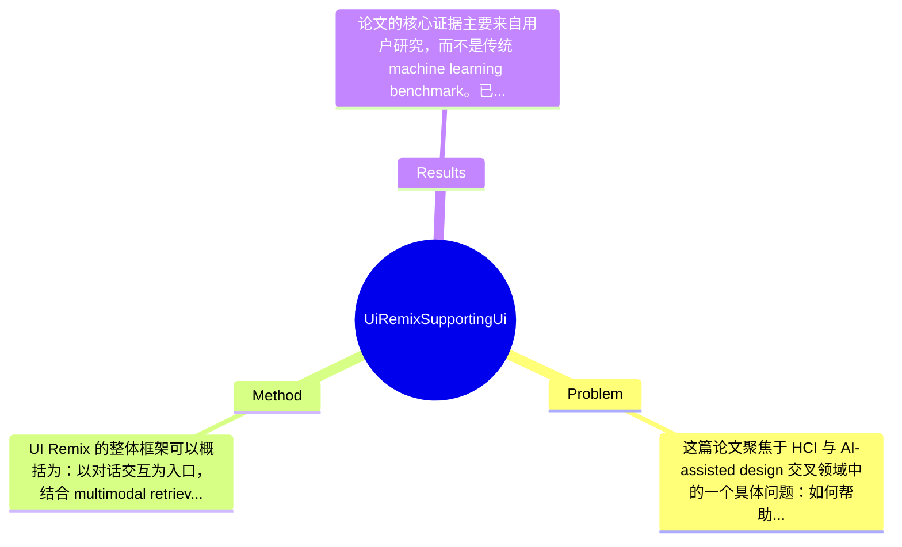

## Summary
该论文针对非专业用户在移动端 UI 设计中“难以表达设计意图、难以信任 AI 生成结果、容易在探索中偏离目标”的问题，提出了一个基于 multimodal retrieval-augmented generation (MMRAG) 的交互式系统 UI Remix，通过全局界面级与局部组件级的 example retrieval 和 remix 支持迭代式设计。论文通过一项包含 24 名终端用户的用户研究表明，该系统能够显著提升用户达成设计目标的能力，促进更有效的迭代，并通过 source transparency cues 增强用户对设计选择的信心。

## Problem & Motivation
这篇论文聚焦于 HCI 与 AI-assisted design 交叉领域中的一个具体问题：如何帮助缺乏专业设计经验的终端用户完成移动 UI 设计。问题本质并不只是“自动生成界面”，而是如何在设计过程中支持用户逐步表达意图、比较方案、做出可解释且可接受的设计决策。UI 设计在产品原型、个人项目、作品集制作、创业 MVP 开发等场景中都非常关键，因此如果能降低非专业用户的设计门槛，现实应用价值很高，尤其适用于独立开发者、学生、内容创作者和轻量级产品团队。

论文指出，现有 example-based UI 工具存在两类典型不足。第一类工具强调大量浏览和开放式探索，虽然能带来灵感，但也容易造成信息过载，用户被过多样例牵着走，最终出现 design drift，即设计逐渐偏离原始目标。第二类工具则让用户围绕单个 example 做修改，这虽然降低了选择复杂度，却容易导致 design fixation，用户被单一范例束缚，难以形成多样化方案。除此之外，当前许多 GenAI 设计工具更关注“一次性生成”，缺乏对中间设计理由、来源依据与可信度的支持，用户往往不知道为什么某种设计被推荐，也难判断是否值得采纳。

作者提出 UI Remix 的动机总体是合理的：他们不是把 AI 视为替代设计师的黑盒生成器，而是把它设计成一个围绕“示例检索—筛选—局部/全局改编”的协作系统。核心洞察在于，真实世界中的 UI example 不仅是灵感来源，也可以成为用户表述意图、建立信任、限制搜索空间并进行局部组合的媒介。特别是将 global remix 与 local remix 结合，使用户既能在整体风格层面探索，也能在组件层面做有控制的定向修改，这比纯生成式方法更贴近实际设计流程。

## Method
UI Remix 的整体框架可以概括为：以对话交互为入口，结合 multimodal retrieval-augmented generation (MMRAG) 模型，在真实 UI 示例库中检索与当前设计目标相关的界面或组件，再由生成模块依据用户选择的示例执行全局或局部改编，并将结果实时呈现在可编辑 canvas 中。系统并不追求从零直接生成最终界面，而是将设计过程拆分为“表达目标—检索参考—选择可信示例—执行 remix—继续迭代”的闭环，从而支持 progressively articulated design。

1. 整体交互架构
该系统由三个主要面板构成：Conversation Panel、Example Gallery 和 Editable Canvas。Conversation Panel 提供 Chat、Search、Apply 三种模式，分别对应描述需求/细化目标、检索灵感、以及将选中的示例应用到当前设计。Example Gallery 用于展示检索到的真实 UI 样例，并附带 source transparency cues。Editable Canvas 则承载当前 UI 预览与后续编辑。这种架构的作用是把“语言表达”“案例比较”“设计结果”并置，避免用户在多个工具之间切换。与常见单轮 prompt-to-UI 系统不同，这里强调的是交互过程中的可回溯与可比较性。

2. Global Remix：界面级示例检索与重组
Global remix 面向整个移动界面层级，支持用户基于多个整页 UI example 获取灵感并重构当前设计。其作用是在早期设计阶段帮助用户快速建立整体布局、视觉层次与页面组织。设计动机是：仅看大量案例容易分散注意力，而只改一个完整模板又限制创造性，因此系统通过“检索+多例选择+改编”来平衡探索与聚焦。与现有模板复制式方法的区别在于，它不是固定套用一个模板，而是允许用户从多个检索结果中挑选并融合特征，理论上可以减少 fixation。

3. Local Remix：组件级检索与定向替换
Local remix 是论文一个很关键的设计，它允许用户针对特定 UI component 进行检索和改编，例如只替换按钮区、卡片样式、导航模块等。其作用是支持目标导向的精细迭代，尤其适合用户已经有一个初步界面、但想局部优化时。设计动机来自作者对 design drift 的关注：如果每次都重生成整个界面，用户很容易丢失已有成果；局部 remix 则能把修改限制在目标区域。与许多 end-to-end UI generation 系统相比，这种局部控制更符合真实设计工作流，也更容易建立用户控制感。

4. 检索与生成模块
技术上，系统建立在 retriever + generator 的 MMRAG 架构上。根据论文目录与摘要可知，它使用 multimodal retrieval，从 UI 数据源中基于文本和可能的视觉/结构信息检索候选 example，再借助生成模块完成重写或改编。论文明确提到使用 MMR 与 MMRAG，但具体 encoder、reranker、generator backbone、prompt 细节在给定材料中未完整展开，因此不能捏造。可以确定的是，检索不是附属模块，而是系统核心：生成步骤建立在选中的真实样例上，而不是完全自由采样。这样的设计有两个明显好处：一是增强结果与用户意图的对齐，二是提供可追溯的来源依据。

5. Source Transparency Cues
系统在 Example Gallery 中展示 ratings、download counts、developer information 等来源透明性线索。该组件的作用不是提升模型性能，而是提升用户对示例可信度和采用理由的判断能力。设计动机非常 HCI：当用户知道某个设计来自什么应用、受欢迎程度如何、由谁开发时，更容易形成“我为什么应该参考它”的心理模型。与多数 AI 设计工具只展示输出结果不同，UI Remix 试图把“证据”一并呈现，这是一种面向 trust calibration 的设计。

从设计选择看，global/local 双层 remix 与 transparency cues 大概率是该方法中最必要、最有辨识度的部分；而具体 retriever 或 generator 的实现则可能有多种替代选择，例如不同的 multimodal encoder、reranking 策略、或仅用 retrieval without generation。整体上，这个方法在系统层面较为清晰，不算过度工程化；不过它更像是一个 carefully integrated HCI system，而不是在算法上提出全新的基础模型，因此其创新重心主要体现在交互式 workflow 设计与人机协同机制，而非底层模型突破。

## Key Results
论文的核心证据主要来自用户研究，而不是传统 machine learning benchmark。已知他们进行了一个包含 24 名 end users 的 empirical study，并设置了 two experimental conditions，但在给定材料中，对照条件的具体实现仅能从附录标题推测可能包含 GPT-Canvas baseline，完整配置细节与主文中的统计表格未提供，因此部分结果只能基于论文摘要与章节结构进行保守总结。

主要实验方面，论文声称 UI Remix “significantly improved participants’ ability to achieve their design goals, facilitated effective iteration, and encouraged exploration of alternative designs”。这说明至少在任务完成感知、设计迭代质量或探索行为指标上，相比对照条件存在统计显著优势。根据第 4 节目录，研究采集了 post-task questionnaires、semi-structured interviews、usage logs、task completion time 以及 expert evaluation，这意味着评估是多维的，不仅看主观满意度，也看时间和专家评分。但遗憾的是，在当前提供文本中，没有给出具体问卷分数、p-value、效应量、任务耗时均值、专家评分数字，因此无法列出精确数值，只能明确标注为“论文摘要宣称显著提升，具体数字在给定材料中未提及”。

Benchmark 详情方面，这不是在 Rico、PixelHelp 或 CIDER 一类标准 benchmark 上做算法对比，而是在人类参与的设计任务中评估系统有效性。指标包括：设计目标达成能力、迭代有效性、探索替代方案的意愿、信任与信心，以及可能的任务完成时间和专家评价。对比分析上，作者特别强调 source transparency cues 提升了参与者对示例改编的信心，这说明透明性设计在感知层面产生了正向效果。不过这类结果更偏 HCI 证据，而不是性能 benchmark。

关于消融实验，目录中出现了“Technical Evaluation”，理论上可能包含检索器、生成器或 MMR 策略的技术测试，但给定材料没有具体内容，因此不能断言存在标准意义上的 ablation study。批判性来看，实验的优点是贴近真实使用情境，能检验 design workflow 的价值；不足是样本量只有 24 人，外部效度有限，且缺少更客观的下游指标，例如长期保留率、设计质量跨任务泛化、不同熟练度人群差异等。是否 cherry-picking 目前无法确定，但从摘要和结果章节标题看，作者主要强调正向发现，对失败案例、错误检索、糟糕 remix 结果的量化披露较少，存在一定只展示成功故事的风险。

## Strengths & Weaknesses
这篇论文的主要亮点有三点。第一，它把 example retrieval 与 UI generation 真正整合成一个交互式设计流程，而不是把 retrieval 当作装饰性功能。global remix 与 local remix 的双层机制很有价值：前者支持整体探索，后者支持局部定向修改，这比单次 prompt 生成更符合真实设计行为。第二，论文抓住了 AI 设计工具中常被忽视的 trust 问题。通过展示 ratings、download counts、developer information 等 source transparency cues，系统把“推荐依据”显性化，这种设计并不提升模型能力本身，但提升了人对结果的接受度与可辩护性。第三，从 HCI 视角看，作者没有把用户当成被动接受者，而是强调 progressive articulation，即用户通过与示例互动逐步明确自己真正想要什么，这一点很契合开放式创作任务的本质。

局限性也比较明显。首先，技术创新更多体现在系统集成与交互设计，而不是底层算法突破；如果脱离具体界面与工作流，MMRAG 本身的新颖性可能有限。其次，适用范围目前集中在 mobile UI design，尚不清楚对 web dashboard、复杂多页面流程、企业软件界面或高保真设计系统是否同样有效。第三，系统高度依赖高质量 example corpus；如果示例库覆盖不足、风格单一、元数据不完整，检索与透明性机制都会受到影响。再者，透明性线索虽然提升信任，但也可能带来 popularity bias：用户可能更偏向高下载量应用的设计，而不一定更适合自己的目标。

潜在影响方面，该工作对 AI-assisted design、end-user development 和 example-based creativity support 都有贡献。它提示未来系统不应只追求更强生成能力，也要支持基于证据的设计推理、局部可控编辑和逐步收敛的协作流程。

严格区分信息来源：已知——论文明确提出 global/local remix、MMRAG、source transparency cues，并完成了 24 人用户研究且报告显著正向效果。推测——系统可能通过多模态编码结合文本与视觉结构进行检索，并可能以 GPT 类模型作为生成后端；透明性线索可能在实验中对主观信任评分有显著影响。论文未提及——具体模型参数、训练数据规模、精确统计结果、失败案例比例、系统计算成本、对不同用户群体的分层效果。因此在评价时应避免把它当作通用 UI 自动设计解决方案，它更像一个值得借鉴的交互范式原型。

## Mind Map

## Notes
<!-- 其他想法、疑问、启发 -->
