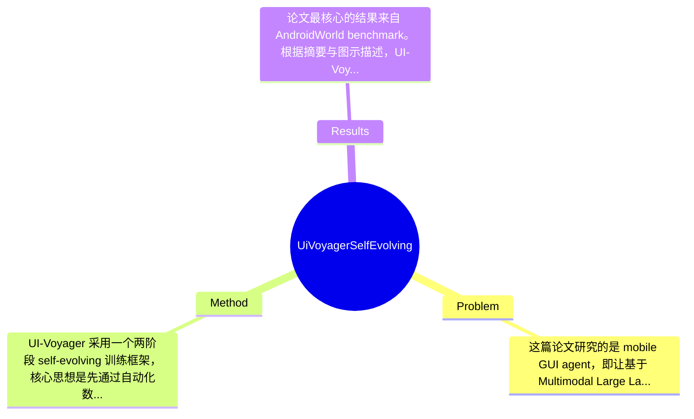

## Summary
该论文针对移动端 GUI agent 在长程任务中“失败轨迹利用率低”和“稀疏奖励下 credit assignment 模糊”两大问题，提出了一个两阶段自进化框架 UI-Voyager：先通过 Rejection Fine-Tuning (RFT) 自动收集和筛选高质量交互轨迹，再通过 Group Relative Self-Distillation (GRSD) 从成组 rollout 中定位 fork points，并用成功轨迹为失败轨迹构造稠密步级监督。在 AndroidWorld 上，其 4B 模型达到 81.0% Pass@1，超过多种近期基线，并宣称超过 human-level performance。

## Problem & Motivation
这篇论文研究的是 mobile GUI agent，即让基于 Multimodal Large Language Models (MLLMs) 的智能体直接感知手机屏幕、理解任务目标，并通过点击、滑动、输入等动作自主完成 Android 应用操作。这属于 embodied agent / GUI automation / multimodal decision making 的交叉方向。问题的重要性很高，因为手机已经是最普遍的数字交互终端之一，若 agent 能稳定执行复杂 GUI 任务，将直接影响个人助理、自动化测试、无障碍交互、企业流程自动化等多个场景。相比网页或桌面 GUI，移动界面更困难：屏幕视野受限、状态切换快、个性化布局多、长程任务中错误一步会导致后续全盘失败。

论文指出现有方法至少有三类具体不足。第一，失败轨迹大量存在但通常只被当作“负样本”粗糙丢弃，导致训练数据利用率低，尤其在难任务上，真正有价值的信息往往恰好隐藏在“几乎成功但在关键节点出错”的轨迹里。第二，许多 RL 风格方法只拿到成功/失败这类 trajectory-level sparse reward，无法定位具体是哪一步造成失败，因此 credit assignment 非常模糊，长程 GUI 任务训练不稳定。第三，人工标注 GUI 操作轨迹成本很高，难以覆盖真实环境中的多样页面和动态变化，因此依赖人工演示的路线扩展性差。

基于这些问题，作者提出新方法的动机是合理的：如果能让模型在无需昂贵人工标注的条件下，自主收集经验、筛选更优轨迹，并从失败经验中提取局部纠错信号，那么移动 GUI agent 的训练效率与泛化能力都有可能提升。论文的关键洞察在于把“失败经验”从无用噪声转化为可学习对象：通过 group rollouts 找到共享状态下成功与失败分叉的位置，再把成功轨迹中的后续决策当作对失败轨迹的局部教师信号。这比单纯做 trajectory-level preference 或 outcome supervision 更贴近 GUI 长程决策的本质。

## Method
UI-Voyager 采用一个两阶段 self-evolving 训练框架，核心思想是先通过自动化数据闭环不断提升数据质量与模型能力，再进一步利用成组交互轨迹中的成功/失败对照关系，构造更细粒度的 step-level supervision，以解决长程 GUI 任务中的稀疏奖励与 credit assignment 问题。整体上，它不是单一新模型结构，而是围绕 GUI agent 训练流程设计的一套数据生成、筛选、蒸馏和自进化机制。

1. 第一阶段：Rejection Fine-Tuning (RFT)
- 作用：RFT 用于在无人工标注条件下，自动收集 agent 与环境交互得到的轨迹，并通过筛选机制保留高质量样本，再回流用于模型微调。
- 设计动机：移动 GUI 环境中轨迹质量高度不均衡，直接把所有 rollout 都拿来训练会引入大量噪声；而完全依赖人工演示又成本极高。RFT 试图在“自主探索”和“质量控制”之间取得平衡。
- 与现有方法区别：相比传统 supervised fine-tuning 依赖人工演示，或 RL 依赖环境奖励直接优化，RFT 更像 outcome-guided data curation：先跑、再筛、再学，形成 model-data co-evolution 闭环。
- 技术上，论文摘要与引言表明其会“iteratively collects, filters, and refines GUI interaction trajectories”，但更细的筛选规则、阈值、采样策略在提供文本中未完整展开，属于论文未提及的细节。

2. 第二阶段：Group Relative Self-Distillation (GRSD)
- 作用：GRSD 是全文最核心的技术点，用来处理 sparse reward 下的 credit assignment 问题。它并不只看某条轨迹最终是否成功，而是把多条 rollout 放在一起分析，找到它们共享的状态以及开始分歧的关键 fork points。
- 设计动机：在 GUI 长任务中，很多失败轨迹并非从一开始就错，而是在某个关键决策点偏离正确路径。如果能对齐多条轨迹的共同前缀，就能更准确地判断“哪一步出问题”。
- 与现有方法区别：传统 RL 多用 trajectory-level return，最多做 token-level loss；GRSD 则利用成功轨迹对失败轨迹进行局部校正，属于一种相对式、组内比较式的 self-distillation。

3. Fork point identification 机制
- 作用：识别共享状态和分叉点，是把稀疏成功/失败标签转化为局部监督的前提。
- 为什么这样设计：只有当成功轨迹和失败轨迹在前面经历了相同或相似的 GUI state 时，后续不同动作才具有可比较性。否则直接拿成功样本指导失败样本，可能会引入错误监督。
- 区别：这比简单按任务级别聚合同类轨迹更精细，因为它要求状态对齐，而不是只按任务名称分组。
- 论文在提供内容中说明其“identifies shared states (fork points) among group rollouts)”，但状态相似度如何判定、是基于 DOM、截图 embedding、动作历史还是 OCR 结果，文本未完整给出。

4. 从成功轨迹构造 dense step-level supervision
- 作用：一旦定位 fork point，成功轨迹后续动作就可作为失败轨迹在该局部决策处的“教师信号”，从而把二值结果奖励变成更丰富的步级学习信号。
- 设计动机：GUI agent 训练最难的是局部错误难以追责。dense supervision 能提高学习稳定性，并更有效利用失败经验。
- 区别：不同于 DPO/偏好学习只知道 A 比 B 好，GRSD 更进一步告诉模型“在这个具体状态下，哪个动作分支通向成功”。这更接近行为纠错而不是全局排序。

5. 自进化训练闭环
- 作用：模型能力提升后会生成更高质量的 rollout，进一步喂给下一轮训练；新的训练又会提升模型，形成自增强循环。
- 设计动机：移动 GUI 场景开放性强，单轮静态训练数据很快过时；闭环式 self-evolving 更符合真实 agent 的持续学习需求。
- 设计评价：这一框架在概念上相对统一，主线明确，尤其 GRSD 抓住了失败经验利用这一关键痛点，具有一定优雅性。但也存在潜在工程复杂度：需要维护 rollout 分组、状态对齐、成功失败对照和数据筛选管线，因此实现上并不算极简。换言之，它的方法论是清晰的，但系统层面更偏“训练流程创新”而非单一轻量模块创新。

## Key Results
论文最核心的结果来自 AndroidWorld benchmark。根据摘要与图示描述，UI-Voyager 的 4B 模型在 AndroidWorld 上达到 81.0% Pass@1 success rate，这是全文最重要的定量结论。作者进一步声称该结果“outperforming numerous recent baselines and exceeding human-level performance”，说明其不仅超过现有 GUI agent，也超过论文中采用的人类参考水平。不过，提供文本中未给出 human-level 的具体百分比，也未完整列出所有 baseline 名称及各自数值，因此这些细节只能标注为论文节选未提及。

从 benchmark 维度看，论文明确使用 AndroidWorld，指标是 Pass@1 success rate。这是移动 GUI agent 领域一个有代表性的长程任务评测环境，适合衡量 agent 在真实安卓操作链路上的一次通过成功率。81.0% Pass@1 对于 4B 规模模型而言相当亮眼，因为图注明确提到其“outperforming larger models”，这意味着作者试图证明方法改进带来的收益大于单纯扩模型规模。遗憾的是，节选中没有给出 larger models 的准确参数规模及对应分数，因此无法进一步量化相对提升百分比。

论文还提到进行了 ablation 和 case studies，并称“further verify the effectiveness of GRSD”。这意味着作者至少做了组件级消融，验证第二阶段的贡献，而不是只报告最终最佳系统结果。但从当前提供内容看，缺少消融表中的具体数字，例如去掉 GRSD 后性能下降多少、仅用 RFT 的结果是多少、fork point 机制本身贡献多少，这些都是判断方法真实性能来源的关键证据，目前无法展开。

从实验充分性上看，现有信息足以支持“方法有效”的初步结论，但仍不算完全充分。第一，只有 AndroidWorld 被明确提及，跨平台或跨设备泛化尚不清楚。第二，缺少对长任务长度、任务类型、界面个性化程度的细分结果。第三，若声称超过 human-level，理应清楚说明人类测试协议。是否存在 cherry-picking 目前无法定论：作者至少报告了 benchmark 主结果和消融的存在，但在节选文本中，失败案例、鲁棒性分析、训练成本等负面结果展示不足。

## Strengths & Weaknesses
这篇论文的亮点首先在于，它没有把失败轨迹简单当成无用数据，而是把“失败经验利用”上升为方法核心。GRSD 通过成组 rollout 中的 fork point 定位，把 success/failure 的粗粒度信号转化为局部 decision correction，这一思路很契合 GUI 长程任务的本质，比只做 outcome-level learning 更有针对性。第二，RFT + GRSD 组成了一个完整的 self-evolving pipeline，兼顾数据生成、数据筛选和步级蒸馏，体现出较强的系统设计意识。第三，从结果看，4B 模型达到 81.0% Pass@1，若实验设置可信，则说明该方法在参数效率上也有可取之处，不是单纯靠更大模型取胜。

局限性也很明显。第一，技术上，GRSD 高度依赖“共享状态/分叉点”可被可靠识别，但真实手机 GUI 常有动画、弹窗、个性化布局和隐式状态变化，若 state alignment 不稳，构造出的 dense supervision 可能带偏模型。第二，适用范围上，该方法似乎更适合有明确定义成功终止条件的任务；对于开放式、多解式、主观目标任务，成功轨迹未必能自然作为失败轨迹的标准答案。第三，计算成本可能不低：要产生 group rollouts、执行多轮 self-evolving 训练、再做蒸馏筛选，这比单轮 supervised fine-tuning 更耗环境交互与训练资源，但论文节选未给出具体成本。

潜在影响方面，这项工作对 GUI agent 训练范式有一定启发意义：它提示研究者不仅应扩大演示数据，更要系统性挖掘失败轨迹中的可学习结构。若这一思想能扩展到 Web agent、desktop agent、甚至 embodied navigation，都可能产生影响。

已知：论文明确提出 UI-Voyager、包含 RFT 和 GRSD 两阶段、在 AndroidWorld 上达到 81.0% Pass@1，并声称超过多种基线和 human-level。推测：GRSD 的有效性很可能在长程、分叉多、稀疏奖励强的任务上最明显；该方法可能对高质量状态对齐模块较敏感。不了解：具体 baseline 数值、消融表详情、训练资源消耗、状态对齐实现、跨 benchmark 泛化、不同任务类别上的 failure case，当前节选均未完整提供。

## Mind Map

## Notes
<!-- 其他想法、疑问、启发 -->
