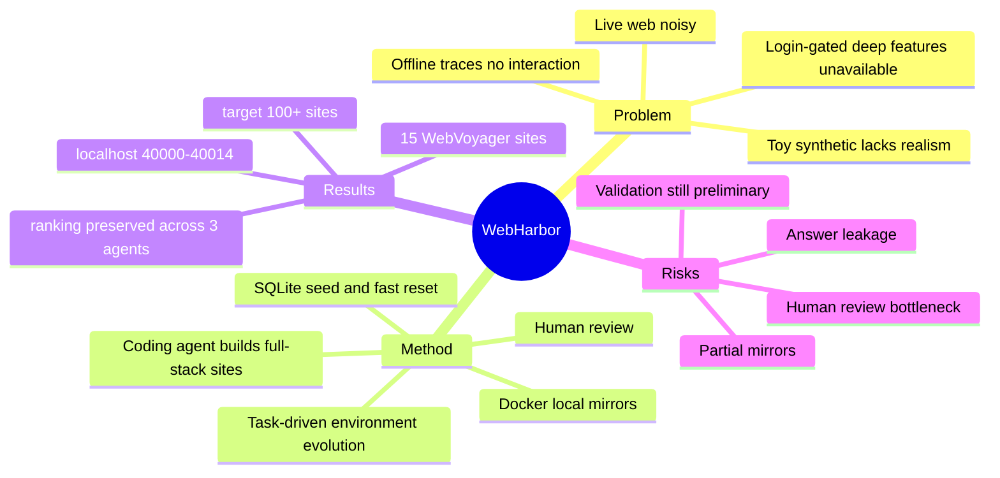

## Summary

WebHarbor 试图把真实网站“dock”成本地 Docker mirror：保留真实站点的视觉、多模态内容、账号/购物车/checkout 等深层功能，同时获得稳定、可 reset、可用于 RL rollout 的环境。它的核心价值不是一个新 agent，而是一个 web-agent 环境构建范式：用 coding agent 生成真实网站镜像，human review 保证 fidelity 和 task quality，环境随着 agent 能力提升继续扩展。

## Problem & Motivation

现有 web agent 评测在 realism 与 controllability 之间两难。Live-web benchmark（如 WebVoyager、Online-Mind2Web）有真实网页，但会被 reCAPTCHA、geo-block、网络波动、内容漂移和登录墙影响，很多任务只能停留在表层信息查找。Offline trace（如 Mind2Web）没有真实交互、状态和错误后果，只适合 supervised pre-training。Synthetic/self-hosted web 环境更稳定，但常常网站数量少、视觉多模态贫乏、功能深度不够，且 reset 慢，不适合 RL-scale rollout。

WebHarbor 的 problem formulation 是：web agent 的瓶颈不只是 agent 能力，而是缺少稳定、多模态、深功能、可演化的 web 环境。这个判断和 SaaS-Bench / CUA-Gym 的共同点是把环境本身作为 CUA 研究的一等对象。

## Method

**核心机制：local Docker mirrors**

WebHarbor 将真实网站重建为本地 mirror。第一版覆盖 WebVoyager 的 15 个网站：Allrecipes、Amazon、Apple、ArXiv、BBC News、Booking、GitHub、Google Flights、Google Maps、Google Search、Hugging Face、Wolfram Alpha、Cambridge Dictionary、Coursera、ESPN。官方提供一个 Docker image，可把这些网站映射到 `localhost:40000-40014`，另有 control plane 支持 `/reset/<site>` 和 `/reset-all`。

**环境构建流程**

1. **Coding agent builds**：coding agent 抓取真实网站结构、assets、catalog，并生成 full-stack mirror：SQLite database、REST/backend routes、frontend templates、auth/CRUD flows。
2. **Human-in-the-loop review**：人工检查 visual fidelity、functional correctness、data quality。作者明确承认当前 coding agent 会走捷径，例如 placeholder images、跳过复杂 layout、页面看起来对但交互坏。
3. **Task-driven scoping**：不试图完整克隆 Amazon 这种超大网站，而是用任务定义 mirror 必须支持哪些功能。任务通常来自 WebVoyager / Online-Mind2Web 或 LLM 生成。
4. **Environment evolves**：当现有任务被 agent 掌握后，再加入更深功能和更难任务，环境随能力提升扩展。

**贡献和 review 协议**

贡献新网站时，WebHarbor 要求 scaffold `sites/<site>/`，包括 `app.py`、`seed_data.py`、`_health.py`、templates、static assets、seed database 和 `tasks.jsonl`。每个网站建议 15-20 个任务，覆盖功能 breadth，而不是只测一个 feature。

Review pipeline 包含：

- mechanical checks：所有站点返回 200；reset 后 `instance/<site>.db` 与 `instance_seed/<site>.db` md5 一致；parallel reset 可用。
- visual + functional checks：和真实站点 side-by-side 检查 layout、images、typography、auth、search、CRUD、detail pages。
- task quality audit：检查 answer leak、distractor density、difficulty。作者特别强调任务不能让答案直接出现在 card title/search result 等表层字段里。

## Key Results

**第一版规模**：

- 15 个 WebVoyager 网站 mirror。
- 单 Docker image 运行，端口 `40000-40014`。
- SQLite reset 支持 sub-second database reset，面向 RL rollout。
- 目标扩展到 100+ 网站，覆盖 Online-Mind2Web 的 147 个站点。

**Validation**：

WebHarbor 报告在 WebHarbor-WebVoyager 上评估 3 个 VLM web agents，模型相对排序与 3 个 live-web benchmarks 一致：`Qwen3-VL-4B-Thinking < Qwen3-VL-235B-A22B-Thinking < Orchard-GUI-4B`。作者把这作为 local mirror 能保持 live-web 排名信号的初步证据。

需要注意：目前网页公开的 validation 更像 project-level sanity check，而不是完整 paper 级实验。它验证了 relative ranking，但还不足以证明 absolute difficulty、任务覆盖或 long-horizon reliability 与真实 web 完全等价。

## Strengths & Weaknesses

**Strengths**：

- **环境问题抓得准**：live web 不稳定，trace 不可交互，toy synthetic 不真实。WebHarbor 直接把研究问题转向“构建可演化的真实网站 mirror”。
- **面向 RL 的系统设计**：Docker + SQLite seed DB + sub-second reset 明确服务大规模 rollout，比 live-web benchmark 更适合训练。
- **强调 human review 和 leak audit**：作者没有假设 coding agent 自动生成的环境可靠，而是把 placeholder、功能断裂、answer leak、single-item catalog 等失败模式写进 review protocol。
- **社区扩展路径清晰**：Track A/Track B 的贡献机制让它有机会变成持续增长的环境库，而不是一次性 benchmark。

**Weaknesses**：

- **不是完整真实网站**：task-driven scoping 是必要折中，但也意味着 mirror 只覆盖任务要求的功能。agent 可能学到 mirror 的局部规律，而非真实网站长尾行为。
- **人工审核是硬瓶颈**：高质量 visual/functional fidelity 目前离不开 human review；扩展到 100+ 网站时一致性和质量控制会很难。
- **programmatic verifier 信息较少**：公开页面更多强调任务支持和环境 reset，但不像 CUA-Gym / OpenComputer 那样系统展开 reward/verifier 生成与校验机制。
- **validation 仍偏初步**：只报告模型 ranking preserved，缺少 task-level correlation、failure mode alignment、human success rate、reset/throughput 等更硬指标。

**Impact**：

WebHarbor 适合作为 web-agent 环境构建的实用路线：用 local mirrors 获得稳定性和深功能，用 human review 控制质量，用 task-driven evolution 逐步扩展。它和 CUA-Gym 的差别是：WebHarbor 更像“真实网站 mirror + benchmark 环境库”，CUA-Gym 更像“自动合成 verifiable RLVR training tuples”。两者可以互补：WebHarbor 的 mirror 若接入更强的 state API / reward generation，就可能成为 web RLVR 数据生成底座。

## Mind Map

## Notes

- 和 [[Papers/2605-SaaSBench|SaaS-Bench]] 的区别：SaaS-Bench 选择真实开源 SaaS，重在真实 backend 和专业 workflow；WebHarbor 选择 mirror popular live websites，重在把 live web 的表层真实和深功能变成本地可控环境。
- 和 [[Papers/2606-CUAGym|CUA-Gym]] 的区别：CUA-Gym 的 mock web app 有统一 state API 和 reward.py，目标是 RLVR training data；WebHarbor 更强调 visual/multimodal fidelity 与真实网站相似度。
- 研究启发：Web agent benchmark 需要显式检查 answer leak。很多“看起来困难”的任务，如果答案在 search result/card title 暴露，就会变成单步 extraction，而不是 web navigation。
