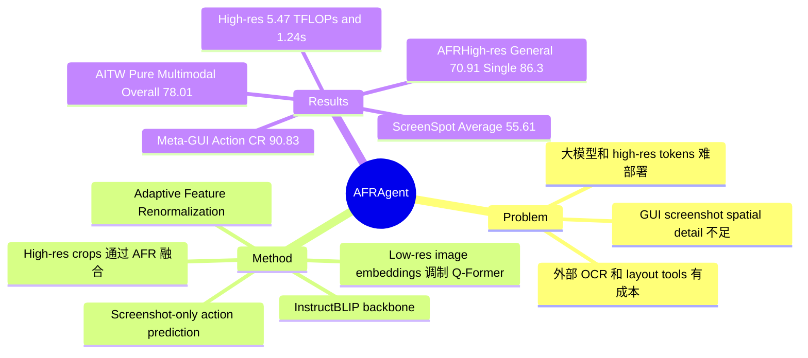

## Summary

AFRAgent 针对 mobile GUI automation 中 VLM spatial features 分辨率不足和大模型部署成本高的问题，在 InstructBLIP 上加入 Adaptive Feature Renormalization (AFR)：用 image embeddings / high-resolution crops 生成 token-level affine scale/shift，调制 Q-Former query features 后交给 LLM 预测下一步 action。已知结果显示，4B 模型在 Meta-GUI、AITW 和 ScreenSpot 上整体强于或接近更大的 GUI agents，同时保持低于 CogAgent / MobileVLM 的 FLOPs 与 latency；但论文没有给出系统性 failure-case taxonomy 或真实 edge-device 部署验证。

## Problem & Motivation

GUI automation 的核心输入是 screenshot、task instruction 和历史 action，模型需要预测下一步 `click/type/scroll/swipe/press/task complete` 等 UI action。作者认为现有路线有三类瓶颈：一是 OCR / icon detector / layout extractor 这类外部工具会带来长输入、额外推理和信息转换误差；二是 CogAgent、SeeClick、CoCo-Agent 等强 baseline 参数量较大，难以满足 mobile UI 场景的隐私与低延迟需求；三是 GUI screenshot 中小图标、密集文字和目标控件依赖高分辨率细节，而直接把更多 high-resolution tokens 送入 LLM 会显著增加计算量。

这篇论文的问题 formulation 比较明确：不是重新设计 planner，而是提升 screenshot-only VLM 的 action prediction 表示质量，尤其是把低分辨率全局语义和高分辨率局部细节更便宜地融合进 LLM input。它的直接研究价值在于 GUI agent 的 grounding / action matching，而不是长程任务规划或在线环境探索。

## Method

AFRAgent 以 InstructBLIP 为 backbone，包含 image encoder、Q-Former 和 LLM。输入为当前 screenshot `S_t`、任务 `T` 和 action history `H_t`；image encoder 把 screenshot 切成 patch embeddings，Q-Former 用 learnable query tokens 结合 task/history 表示提取 instruction-aware visual representation，最后投影到 LLM embedding space 预测下一步 action。

核心新增模块是 **Adaptive Feature Renormalization (AFR)**。AFR 接收 `F_enrich` 和 `F_target` 两组特征，用 `F_enrich` 经过两个 FFN 生成 token-level 的 `alpha` 和 `beta`，再对 `F_target` 做 affine modulation：`F_enriched = alpha * F_target + beta`。作者的已知 claim 是：这种 scale/shift 调制可以把 image embeddings 的信息注入 Q-Former features，同时不显著增加 LLM token 数；这比直接拼接高分辨率视觉 token 更省计算。

具体有两层融合：

1. **Low-resolution enrichment**：用低分辨率 screenshot 的 image embeddings 作为 `F_enrich`，用 Q-Former query outputs 作为 `F_target`，得到 `E_Q^Image`。
2. **High-resolution enrichment**：把 screenshot 横向切成 4 个 crops，经过同一个 vision encoder 和 Q-Former 得到 high-resolution query representation，再通过 AFR 调制已经融合低分辨率信息的 `E_Q^Image`，得到 `E_Q^High`。
3. **训练设置**：模型使用 257 query tokens、Q-Former hidden size 768、256 image patches、LLM hidden size 2048、8 个历史 actions；训练 12 epochs，Adam learning rate `5e-5`，实验使用 8xA100 80GB。作者特别声明 AFRAgent 没有使用 CogAgent / SeeClick / SphAgent 那类 prior GUI grounding pretraining。

## Key Results

**Meta-GUI**：AFRAgent 4B 在 Table 1 达到 Action (CR) 90.83、Item Acc. 95.06、Act. Type 93.28、Input (F1) 97.94、Input (EM) 94.44、Utter. BLEU 67.6。相比 CoCo-Agent 7.3B 的 Action (CR) 88.27、Item Acc. 91.72、Act. Type 92.59，AFRAgent 在 action completion 和 item accuracy 上更高；但 Direction Acc. 为 97.02，低于 CoCo-Agent 的 98.39，所以不是所有指标都胜出。

**AITW**：在 Pure Multimodal Setting，AFRAgent 4B Overall 78.01，高于 CogAgent 18.3B 的 76.88、SphAgent 7B 的 76.28、SeeClick 9.6B 的 76.2、InstructBlip 4B 的 76.11。分项上 AFRAgent 为 General 70.67、Install 80.89、GoogleApps 74.16、Single 91.06、WebShop 73.27；其中 Single 仍低于 CogAgent 的 93.49。在 Structured Layout Setting，AFRAgent Overall 78.92，接近但略低于 CoCo-Agent 的 79.05，说明它在 screenshot-only setting 的优势更清晰。

**ScreenSpot**：在跨 Mobile / Desktop / Web 的 click accuracy 上，AFRAgent Average 55.61%，高于 SeeClick 53.4% 和 CogAgent 47.4%。细分指标为 Mobile Text 78.52%、Mobile Icon/Widget 53.14%、Desktop Text 72.62%、Desktop Icon/Widget 31.44%、Web Text 64.51%、Web Icon/Widget 33.44%。论文也承认 CogAgent 在部分 text inputs 上更强，归因于更大模型和更充分 pretraining。

**Efficiency**：Table 4 中 AFRAgentLow-res 为 3.2 TFLOPs / 0.78s，AFRAgentHigh-res 为 5.47 TFLOPs / 1.24s；对比 MobileVLM 8.82 TFLOPs / 2.16s、CogAgent 11.86 TFLOPs / 3.42s，AFRAgent 的计算开销明显更低。需要注意的是 InstructBlip baseline 为 3.19 TFLOPs / 0.63s，说明 AFR 的低分辨率版本开销接近 backbone，但 high-resolution 版本仍有额外成本。

**Ablation / fusion comparison**：Table 5 在 AITW General / Single 子集比较融合策略。Residual 为 69.61 / 85.13，MoE 为 69.75 / 85.25，AFRLow-res 为 70.2 / 85.37；highResProj 为 69.74 / 86.17，Qwen2-VL AnyRes 为 70.15 / 85.21，AFRHigh-res 为 70.91 / 86.3。这个 ablation 支持 AFR 优于 residual / MoE / direct high-res projection，但提升幅度是 0.x 到 1.x points 级别，应视为有效但不属于压倒性增益。

## Strengths & Weaknesses

**已知**：
- 方法切中 GUI agent 的一个真实瓶颈：高分辨率 UI 细节对 action prediction 重要，但直接增加视觉 token 会带来成本。
- 论文覆盖 Meta-GUI、AITW、ScreenSpot，并同时报告效果、FLOPs、latency 和 fusion ablation；对一个架构改动来说，证据链比只给 main table 更完整。
- 4B screenshot-only 模型在 AITW Pure Multimodal Overall 78.01 超过多个更大 baseline，这对 on-device / privacy-sensitive GUI automation 有参考价值。

**推测**：
- AFR 的更一般意义可能是：对 GUI 这类高密度视觉输入，feature modulation 比 token concatenation 更适合作为 high-resolution adapter。但论文只在 GUI automation 和有限子集 ablation 上验证，不能直接推广到通用 VLM reasoning。
- Grad-CAM 可视化显示 AFRAgent 更关注 task-relevant UI elements，这与方法动机一致；但 Grad-CAM 只能作为解释性证据，不能单独证明 causal mechanism。

**不知道 / 局限**：
- 论文没有给出系统性 failure-case taxonomy。我们不知道 AFRAgent 失败主要来自小图标、文字 OCR、scroll direction、history reasoning，还是 action serialization。
- 没有真实手机或 edge device 部署实验；Table 4 的 latency 有参考价值，但不足以证明 mobile on-device 可用。
- ScreenSpot cross-platform 实验在测试前使用 SeeClick data pretraining，因此不能直接解读为零样本跨平台泛化。
- AITW / Meta-GUI 主要是 offline action matching，不等价于 live environment 中可恢复的 long-horizon task success；对 planning、state recovery、error correction 的贡献仍未被证明。
- 高分辨率 AFR 的收益相对 modest：General 70.2 -> 70.91、Single 85.37 -> 86.3，需要更多高密度 GUI benchmark 才能判断它是否稳定解决 high-resolution bottleneck。

## Mind Map

## Notes

- 与 lightweight GUI grounding 路线互补：AFRAgent 仍是 4B VLM，但用 feature fusion 降低 high-resolution 开销；GoClick 类方法则把 grounding 模型压到更小规模。一个自然组合是 lightweight grounding verifier + AFRAgent-style high-res action model。
- 这篇更像 architecture paper，而不是 agent system paper。它没有引入新的任务分解、memory、tool use 或 online recovery 机制；对 GUI agent 的启发主要在视觉表示层。
- 后续值得追问：AFR 是否能作为 plug-in adapter 接到更强 VLM 上？如果换成 Qwen2.5-VL / InternVL 系列，增益来自 AFR 本身还是 InstructBLIP 的 Q-Former bottleneck 被缓解？
