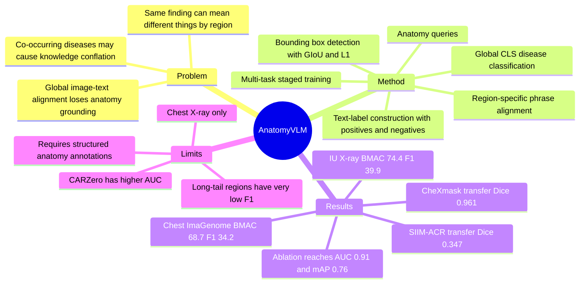

## Summary
Anatomy-VLM 试图把 radiologist 的 anatomy-first workflow 写进 medical VLM：先定位 29 个 anatomical regions，再做 region-specific alignment，最后结合 global disease classification。它在 chest X-ray zero-shot classification、segmentation transfer 和 region-wise validation 上显示出细粒度 anatomy supervision 的价值，但证据范围主要限于胸片和 Chest ImaGenome 风格的 anatomy/finding 标注。

## Problem & Motivation
现有 medical VLM 常把整张影像和文本做 global image-text alignment，这会把同一医学概念在不同 anatomical regions 中的含义混在一起。论文用 chest X-ray 举例：`consolidation` 出现在 upper lobe 或 lower lobe 的临床含义不同；`cardiomegaly` 和 `pulmonary edema` 常共现，但对应不同器官和病理过程。作者的核心动机是让模型显式建模 radiologist 的流程：识别 anatomy、做 region-specific assessment、检测 abnormality，再综合成诊断判断。

## Method
**Anatomical Region Detection.** Anatomy-VLM 在 ViT backbone 中加入 `M` 个 learnable anatomy queries，每个 query 对应一个 clinically relevant anatomical structure。检测监督使用 set-prediction formulation，loss 由 GIoU 和 L1 bounding-box regression 组成，让 anatomy token 学会定位对应 anatomical region。

**Region-specific Alignment.** 模型使用固定的 medical pre-trained text encoder，把 clinical descriptions 或 disease categories 映射到与 visual embeddings 同一空间。patch tokens 经 average pooling 得到 global representation，再与各 bounding-box token 拼接，形成 enriched anatomical representations；随后用 anatomy-level InfoNCE / cross-entropy 目标，把 region representation 与对应的 clinical phrase embedding 对齐。

**Anatomy-Level Similarity Label Generation.** 训练时从 Chest ImaGenome 的 bounding-box findings 构造 contrastive pairs。流程包括：对非空 finding 随机选一个 sub-sentence 作为 positive；以 20% 概率对 positive 做 negation / rephrase perturbation；对无 finding 的 box 用 attribute-based negative 或 hard negative 填充；最后对重复文本同步 label。

**Image-level Disease Classification.** `[CLS]` token 负责 holistic diagnostic representation，并与 disease label embeddings 做 multi-label contrastive / sigmoid cross-entropy classification。最终训练目标是三项加权和：`Lanat`、`Lfine`、`Lglobal`；实现中按 detection-only、global joint、all losses 三阶段训练，text encoder 固定，优化 visual encoder、anatomy queries 和 linear layers。

## Key Results
- **Chest ImaGenome in-distribution zero-shot disease classification**：Anatomy-VLM 在 20 个 fine-grained disease classes 上平均 **BMAC 68.7 / AUC 81.2 / F1 34.2**。相比之下，BioViL 为 **66.1 / 66.1 / 23.3**，CARZero 为 **65.8 / 85.3 / 30.8**，supervised ViT-B 为 **67.0 / 78.5 / 33.4**；因此 Anatomy-VLM 的 BMAC/F1 最强，但 AUC 不如 CARZero。
- **IU Chest X-ray (OpenI) out-of-distribution zero-shot classification**：在 340 studies、5 个 disease classes 上，Anatomy-VLM 平均 **BMAC 74.4 / AUC 83.4 / F1 39.9**。BioViL 为 **74.2 / 80.0 / 39.1**，CARZero 为 **65.4 / 96.5 / 38.7**，ViT 为 **68.3 / 77.7 / 35.9**；这里同样是 BMAC/F1 更强，但 AUC 不是最高。
- **CheXmask heart segmentation**：用相同 U-Net decoder 评估 frozen encoder 时，Anatomy-VLM 达到 **Dice 0.946 / mIoU 0.945**；full fine-tuning 后达到 **Dice 0.961 / mIoU 0.960**。同表中 MedKLIP frozen 为 **0.934 / 0.934**，BioMedCLIP frozen 为 **0.920 / 0.920**。
- **SIIM-ACR pneumonia segmentation**：frozen encoder 达到 **Dice 0.243 / mIoU 0.554**，transfer setting 达到 **Dice 0.347 / mIoU 0.603**。frozen setting 下 MedKLIP 为 **0.202 / 0.541**、CLIP Dice 为 **0.000**；transfer setting 下 next-best Dice 是 CLIP 的 **0.301**。
- **Ablation**：global-only supervision 为 **AUC 0.82**；detection-only 给出 **mAP 0.71**；global + detection 为 **AUC 0.90 / mAP 0.73**；加入 fine-grained anatomy-level contrastive learning 后提升到 **AUC 0.91 / mAP 0.76**。
- **Region-wise anatomy-to-finding validation on Chest ImaGenome**：29 个 anatomy regions 的平均 **BMAC 94.8 / AUC 96.1 / F1 30.3**。高频或清晰结构如 cardiac silhouette **F1 98.2**、spine **F1 96.4** 很强，但 long-tail / under-represented regions 明显弱，例如 cavoatrial junction **F1 0.4**、right atrium **F1 1.3**、carina **F1 2.3**、left hemidiaphragm **F1 2.8**。

## Strengths & Weaknesses
**Strengths.**

1. **问题 formulation 清楚。** 论文没有只追求更大的 medical VLM，而是抓住 global image-text alignment 在 anatomy grounding 上的结构性问题，并把 radiologist workflow 转成可训练模块。
2. **方法简单且可解释。** anatomy queries、bbox detection、region-specific contrastive alignment、global `[CLS]` classification 的组合相对直接，和医学任务的空间结构匹配。
3. **实验覆盖了三类证据。** classification 证明 disease-level zero-shot 能力，segmentation transfer 检查 encoder 是否保留 localization 信息，region-wise validation 直接测 anatomy-to-finding matching。
4. **Ablation 支持核心 claim。** 从 global-only 到 global+detection，再到 fine-grained alignment，AUC 和 mAP 都逐步提升，说明 anatomy localization 与 phrase-level alignment 都有增益。

**Weaknesses / Limitations.**

1. **最强结论仍主要限于 chest X-ray。** 论文讨论说 modular design 可扩展到其他 imaging modalities 和 clinical tasks，但实验只覆盖 Chest ImaGenome、IU X-ray、CheXmask、SIIM-ACR 这一类胸片相关数据。
2. **AUC 不是全面领先。** 在 Chest ImaGenome 和 IU Chest X-ray 上，CARZero 的 AUC 分别为 85.3 和 96.5，高于 Anatomy-VLM 的 81.2 和 83.4；作者强调 BMAC/F1 更适合 class imbalance，这个 argument 合理，但不能说所有指标都 SOTA。
3. **long-tail anatomy 仍明显失败。** region-wise 表格里 cavoatrial junction、right atrium、carina、left hemidiaphragm 的 F1 很低；论文将其与 limited training examples / long-tail distribution 相关联。
4. **数据与标注 pipeline 依赖强。** 方法需要 anatomy bounding boxes、report-derived findings、NER/parser linking 和 29-region normalization；这会限制迁移到没有类似结构化 annotation 的医学影像数据。
5. **不知道 clinical deployment 是否可靠。** 论文没有提供 clinician reader study、实际诊断工作流中的安全评估、跨医院部署分析，也没有看到 code link；因此不能把 zero-shot/segmentation 结果直接等同于临床可用性。

**推测.** 对 GUI-agent / screen understanding 的启发是：类似 anatomy queries 的 region tokens 可以对应 GUI elements 或 screen regions，再和 task-relevant textual concepts 做局部对齐。但这是跨域类比，论文没有实验证明它能迁移到 GUI grounding。

## Mind Map

## Notes
- **我的判断**：rating=3。它不是 GUI-agent / embodied 的直接核心论文，但对 fine-grained VLM、region-token alignment、解释性医学视觉表示有参考价值。
- **最值得借鉴的点**：把 human expert workflow 拆成 localization -> regional evidence -> global decision，而不是只在 loss 或 prompt 层面说模型“可解释”。
- **需要后续查证**：是否有公开代码、是否有更完整的 WACV camera-ready metadata / DOI、以及该方法在非胸片 modality 上是否能保持同样的 anatomy-level alignment 收益。
