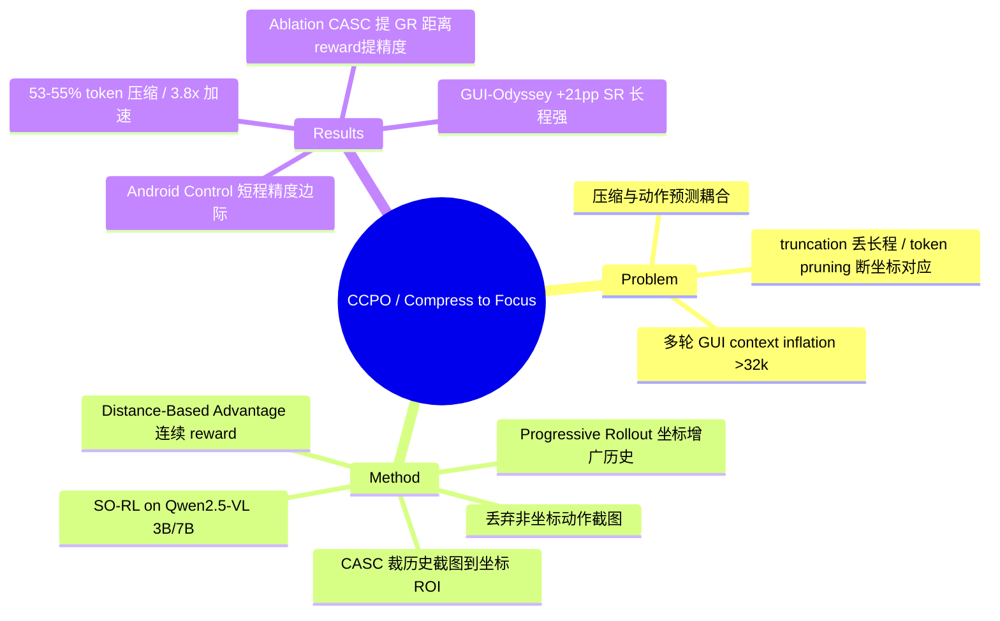

## Summary
CCPO 通过把多轮 GUI agent 历史里的截图裁剪到"各轮点击坐标聚合出的 ROI"（并直接丢弃非坐标动作的截图），把视觉历史压缩进 RL 训练循环，在四个 benchmark 上以约 53–55% token 压缩、最高 3.8× 训练加速的代价维持/略升准确率。核心卖点是效率而非精度 SOTA。

## Problem & Motivation
多轮 GUI agent 随交互历史累积产生严重的 context inflation——论文称上下文轻易超过 32k token，带来显存与延迟压力。现有两条路都不理想：直接 truncation 保留视觉保真但受 context window 限制、丢弃长程信息；token pruning 压缩上下文但"破坏 action 与其空间信息的对应"，引入歧义、损害精确定位。作者点出两个错配：(1) 空间局部性 vs 时序依赖——真正需要跨轮保留的是 action 轨迹而非每步整屏；(2) 压缩与动作预测是耦合优化问题——压缩需要知道 action 相关区域，而准确动作预测又依赖压得好的上下文。CCPO 想在 RL 训练里同时解这两件事。

## Method
CCPO（Coordinate Compression Policy Optimization）在 Semi-online RL（SO-RL，沿用 Lu et al. 2025c）框架上加三个组件：

1. **Progressive Rollout Trajectory**（Sec 3.2）：从当前 policy 采样 N 个 rollout，维护"坐标增广"的历史（每轮记录预测坐标 + 标注坐标），使压缩边界能跨 rollout 逐步收敛、refine。

2. **Coordinate-Aware Spatial Compression（CASC）**（Sec 3.3）：这是核心。被压缩的是**历史截图本身**，不是坐标。做法：把动作分为坐标类（click / long-press / select / scroll）与非坐标类（type / wait / open / complete）；把多个 rollout 里的历史坐标聚合成集合 C^hist，据此构造 ROI bounding box，对历史截图做 `Crop(S_t; C^hist)`，只保留坐标附近的 task-relevant 区域；非坐标动作的截图被**整张移除**。由此历史注意力被逐步收窄到 key visual areas。

3. **Distance-Based Advantage**（Sec 3.4）：把二值"对/错" grounding reward 换成随距离平滑变化的坐标精度 reward `r_acc`（归一化坐标欧氏距离 d_norm，落在 [τ_min, τ_max] 之间线性插值），提供 fine-grained 信号，声称同时提升 grounding accuracy 与压缩质量。总 reward `r = α·r_format + β·r_type + γ·r_acc`。

Base model 为 Qwen2.5-VL 3B / 7B（SFT + RL 两阶段）。"AO"（Action Observation，历史窗口长度）是关键超参，实验用 1AO–5AO。

## Key Results
> 以下 Android Control / GUI-Odyssey 主结果与效率数字经独立 verifier 对照原文表格核对；Mind2Web / AITW 及 Table 6/10 的次级数字来自会摘要的 WebFetch、未纳入独立核查，标注为"约"以示置信度较低。

- **效率（Table 4，已核）**：3AO 下 token 压到原始的 53.2%（7B）/ 54.9%（3B，对应 abstract 的"up to 55%"），训练加速 3.5×（7B）/ 3.8×（3B）。历史从 1AO 增到 3AO，SO-RL 的 token 长度增长 41%，而 CCPO 只增长约 4%。
- **GUI-Odyssey（Table 2，已核，长程任务）**：CCPO-3B-3AO 达 TM 90.6 / GR 88.5 / SR 80.9，对照 baseline **UI-S1-7B** 的 76.3 / 61.7 / 59.5，即 +14.3pp TM、+26.8pp GR、+21.4pp SR——这是全文最大增幅（15.4 步平均、长 horizon）。
- **Android Control（Table 2，已核，短程任务）**：CCPO-7B-3AO 达 SR 73.3 vs UI-TARS-7B 72.5（+0.8pp），但 GR 反而 79.7 vs 80.5（**-0.8pp**，低于 UI-TARS-7B）；TM 86.9 vs 83.7。可见短程任务上精度提升边际。
- **Mind2Web（Table 3，约）**：CCPO-7B-3AO 对 TongUI-7B 三个 split 约 +3.6~6.1pp（Cross-Task 59.5 vs 53.4、Cross-Website 53.7 vs 49.0、Cross-Domain 56.5 vs 52.9）。**AITW（约）**：整体约 +1.1%。
- **Ablation（Table 5，已核，Android Control）**：以 SFT 为基线，+CASC 使 GR 累计 +3.17pp（→79.12），再 +Distance-Based Reward 使 GR 累计 +3.76pp（→79.71）、SR 累计 +2.65pp（→73.25）。CASC 主要贡献 grounding，距离 reward 主要贡献整体精度。
- **压缩变体（Table 10，约）**：MAX-COMPRESS（只留坐标动作截图）53.2% 压缩 / 3.5×；MIN-COMPRESS 37.7% / 1.7×。**开销（Table 6，约）**：compute -44%（9.6→5.4 TFLOPS）、step latency -35%（297.1→194.5s）。

## Evidence Ledger
| Claim ID | Claim | Type | Source locator | Evidence excerpt | Status |
|:--|:--|:--|:--|:--|:--|
| C1 | 四 benchmark SOTA，最高 55% token 压缩 + 3.8× 训练加速 | sota-novelty/number | abstract | "SOTA ... across four benchmarks ... up to 55% token compression ... 3.8× training speedup" | source-verified |
| C2 | CASC 把历史截图裁到坐标聚合的 ROI，并整张移除非坐标动作截图（非单纯 token pruning/truncation） | causal-mechanism | Sec 3.3 | "ROI bounding boxes are used to crop the corresponding image regions"; "type, wait, open, complete ... remove their corresponding images" | source-verified |
| C3 | GUI-Odyssey：CCPO-3B-3AO 90.6/88.5/80.9 vs baseline **UI-S1-7B** 76.3/61.7/59.5（+14.3/+26.8/+21.4pp） | number/comparison | Table 2 | "UI-S1-7B ... 76.3 61.7 59.5"; "CCPO-3B-3AO ... 90.6 88.5 80.9" | source-verified（已纠正：baseline 是 UI-S1-7B 非 3B；初稿数字有误） |
| C4 | Android Control：CCPO-7B-3AO SR 73.3 vs UI-TARS-7B 72.5（+0.8），GR 79.7 vs 80.5（-0.8，低于 UI-TARS） | number/comparison | Table 2 | "UI-TARS-7B ... 80.5 72.5"; "CCPO-7B-3AO ... 79.7 73.3" | source-verified |
| C5 | Distance-Based Advantage 用连续距离 reward 替代二值 grounding 正确性 | causal-mechanism | Sec 3.4 | "coordinate accuracy reward ... smooth, distance-based supervision" (r_acc) | source-verified |
| C6 | Base model Qwen2.5-VL 3B/7B；建于 Semi-online RL (SO-RL) 框架 | benchmark-setting | Sec 3.1/4.3 | "Qwen2.5-VL-3B and Qwen2.5-VL-7B as our base models"; "Semi-Online RL (SO-RL)" | source-verified |
| C7 | Ablation：+CASC 累计 +3.17pp GR；+Distance reward 累计 +3.76pp GR / +2.65pp SR（均相对 SFT） | number | Table 5 | "+CASC ... +3.17 → 79.12"; "+Distance-Based Reward ... +3.76 → 79.71 / +2.65 → 73.25" | source-verified |
| C8 | 1AO→3AO：SO-RL token +41%，CCPO 仅 +4%；3AO 压缩 53.2%(7B)/54.9%(3B)，加速 3.5×(7B)/3.8×(3B) | number | Table 4 | "Semi-online RL grows by 41% ... our method maintains ... 4% increase"; 53.2%/54.9%, 3.5×/3.8× | source-verified |

## Strengths & Weaknesses
**亮点**
- 机制清晰且抓对了 GUI 特性：GUI action 的语义几乎完全由坐标决定，所以"把历史截图裁到坐标 ROI、丢弃非坐标动作截图"是一个 GUI-specific 且 simple 的压缩先验，比通用 token pruning 更贴合任务结构。
- 把压缩放进 RL 训练循环、用跨 rollout 坐标聚合动态定 ROI，回应了作者自己指出的"压缩与动作预测耦合"问题，这一 formulation 是有 taste 的。
- 效率数字扎实且对训练成本有真实意义：3.8× 加速、~4% vs 41% 的 token 增长曲线，说明该方法在长历史下 scale 更好。

**局限 / 存疑**
- **精度收益不均衡**：长程 GUI-Odyssey 增幅巨大（+21pp SR），但短程 Android Control 上 SR 仅 +0.8pp、GR 甚至低于 UI-TARS-7B。真正卖点是效率，不是精度 SOTA——abstract 的"SOTA across four benchmarks"需结合各表看，短程收益边际。
- **效率对照偏内部**：token 增长/加速主要对照论文自己的 SO-RL baseline，缺少与 truncation / token-pruning 方法在同等精度下的 head-to-head 效率对比。
- **stale evidence 未验证**：裁剪保留的是"坐标锚定的历史区域"，但没有机制验证保留的 crop 是否仍反映当前 UI 状态；若该 ROI 内 UI 已变化，压缩后的历史仍可能携带过期像素证据。
- **超参数据集依赖**：τ_min（0.04 通用 / 0.1 更难数据集）与 AO 长度都需按数据集调，且"AO 越长≠越好"，泛化性打折扣。未见 code 链接。
- 次级数字（Mind2Web/AITW/Table 6/10）来自会摘要的 fetch、易有个位数误差，未独立核对。

## Mind Map

## Notes
- 与本人 thesis（"action 必须可追溯到一个 belief source——pixels/structure/memory/prior——并留下可验证的状态改变；hybrid observation 会放大过期证据"）的关系：CCPO 某种意义上**部分操作化了 pixel belief source 的裁剪**——它精确保留每个历史 action 锚定的坐标像素区域、丢弃其余，从而 prune 掉大量 stale 视觉历史；但它锚定的是"action 发生在哪"而非"保留的 crop 是否仍等于当前状态"，因此只是**缓解**而非消除 thesis 警示的 hybrid/stale-evidence 放大问题。这提示一个 idea 缺口：在坐标锚定压缩之上再加一层"保留区域的状态改变校验"。
- 验证记录：独立 verifier 复核 8 条高风险 claim，7 条 source-verified，C3（GUI-Odyssey）初稿把 baseline 误写成 UI-S1-3B 且数字有误，已按原文表格纠正为 UI-S1-7B / 90.6·88.5·80.9。
- GUI canonical survey integration pending：本篇属 GUI 论文，下一轮应优先 survey-refresh GUIAgent-Survey。
