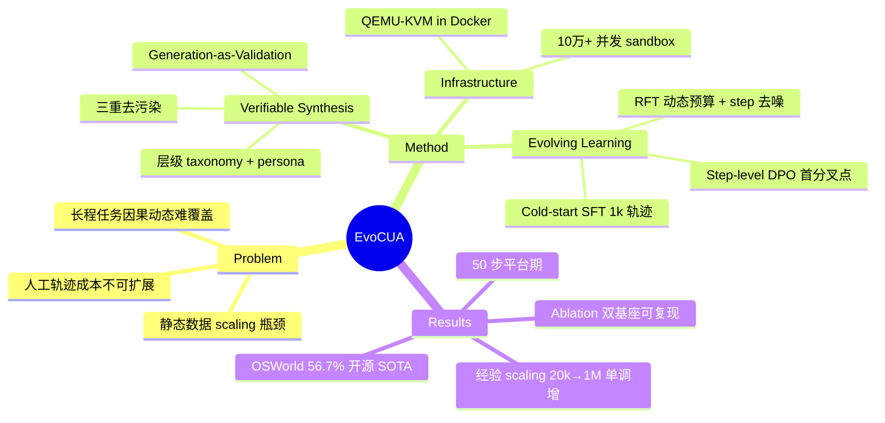

## Summary

EvoCUA（Meituan）提出用"可验证任务合成 + 大规模异步 sandbox rollout + 迭代进化训练（SFT→RFT→step-level DPO）"的自持循环替代静态数据模仿，训练 native computer-use agent；EvoCUA-32B 在 OSWorld-Verified 上达 56.7%（50 步），刷新开源 SOTA。

## Problem & Motivation

Native CUA 的能力被静态数据 scaling 卡住：被动模仿人工标注/静态数据集难以覆盖长程桌面任务中的因果动态（错误恢复、状态检查、边界情形），而人类演示轨迹的采集成本无法随任务多样性增长。作者主张把数据生成和策略优化合并为一个自持的进化循环——agent 自己在可验证环境中产生经验，再从经验中学习。瓶颈由此从"标注量"转为"可验证合成任务的规模与 sandbox 吞吐"。

## Method

三个组件构成闭环，基座为 Qwen3-VL-Thinking（8B/32B）与 OpenCUA（7B/32B/72B）：

**1. Verifiable Synthesis Engine（Generation-as-Validation）**
- ReAct 式 agentic workflow 按层级 domain taxonomy（浏览器/Excel/Word → 原子能力）+ 用户 persona 参数化生成任务指令 g，并**共生成确定性可执行 validator V_g**（代码级成功判据，非文本 reward），在真实 sandbox 中执行验证，失败反馈迭代修正直到可执行。
- 多样性：parametric 合成结构化文件（Word/Excel/PDF 变量化）+ 非 parametric 注入公网真实数据（图片/音频）。
- 质量控制：reference agent rollout 做一致性过滤；三重去污染（语义 / 环境初始化配置 / evaluator）防 benchmark 泄漏。产出数万量级可验证任务。

**2. Scalable Interaction Infrastructure**
- Docker 内嵌 QEMU-KVM 的混合虚拟化保证内核隔离与环境确定性（键盘映射 patch、字体缓存注入等校准）；异步 gateway + 分布式调度器一分钟内拉起数万 sandbox，稳定支撑 **10 万+ 并发**。

**3. Iterative Evolving Learning（三阶段）**
- **Cold-start SFT**：约 1k 高质量轨迹注入行为先验；统一 action space（mouse ∪ keyboard ∪ control，含 key_down/key_up 解耦的 stateful 操作）；结构化推理 schema（goal clarification / observation consistency / reflection / reasoning-augmented termination）；用 Hindsight Reasoning Generation 为已有动作回溯补写推理链。
- **RFT（rejection sampling fine-tuning）**：按任务难度动态分配 rollout 预算 K*；judge model 做 step-level 去噪（剔除冗余步）；失败轨迹只保留推理 + terminate=failure 信号。
- **Step-level offline DPO**：定位失败轨迹与成功参照轨迹的**首个分叉点**（等价状态下的关键错误步），构造两类偏好对——Action Correction（错步 vs 正确步）与 Reflection & Recovery（合成反思后恢复 vs 盲目继续），做 step 级 DPO。
- 关键经验：成功轨迹低噪但冗余（需激进去噪防 action aliasing / 循环重复）；失败轨迹高噪但高价值（转化为边界对齐数据）；强调 on-policy——off-policy 数据会破坏优化方向。

## Key Results

- **OSWorld-Verified**：EvoCUA-32B 56.7%（50 步）> UI-TARS-2 53.1%（100 步）> OpenCUA-72B 45.0%（100 步，前开源 SOTA，+11.7）；与 Claude-4.5-Sonnet 同 50 步约束下 58.1% 仅差 1.4。EvoCUA-8B 46.1%，以 8B 逼近 72B 级模型。基座 Qwen3-VL-32B 为 41.0%。
- **Ablation（32B）**：统一 action space +4.84、cold start +2.62、RFT +3.13、offline DPO +3.21、迭代循环 +1.90；在 OpenCUA-72B 上复现同方向增益，配方可跨基座迁移。
- **经验 scaling（RFT 轮次）**：20k 样本 +2.61 → 226k +6.79 → 1M +8.12，收益随合成经验量持续增长未见饱和。
- **步数 scaling**：15→50 步 +16.25%，50 步后平台期（训练数据缺少 >50 步轨迹所致）。
- 通用能力（MMMU/MathVista/OCRBench 等）在 OpenCUA 基座上保持，Qwen3-VL 基座上有小幅下降（归因于数据分布差异）。
- 后续（repo News）：零样本跨 OS 泛化到 WindowsAgentArena 56.48%（超基座 ~13.6）；独立安全评估（arXiv:2602.08235）中 unintended-behavior rate 最低（35.0%）。

## Strengths & Weaknesses

**Strengths**
- **把 reward 问题转化为生成问题**：任务与可执行 validator 共生成（Generation-as-Validation），绕开了 GUI 任务 reward model 不可靠的老大难，是整条 pipeline 能 scale 的根基。相比之下"用 VLM judge 打分"的路线始终受 judge 噪声上限约束。
- 经验 scaling 曲线（20k→1M 单调增益）是"合成经验换能力"论断的直接证据，比单点 SOTA 更有信息量。
- 对失败轨迹的处理有洞察：首分叉点定位 + Action Correction / Reflection-Recovery 两类偏好对，把高噪失败数据变成边界对齐信号，与只用成功轨迹的 rejection sampling 形成有效互补。
- Ablation 在两个基座上复现，配方可迁移性有证据支撑。

**Weaknesses / 边界**
- **仍是 offline 学习**：RFT + offline DPO 均离线，作者自己承认 trajectory-level online RL 存在训练-推理不一致，online step-level RL（STEPO）只是提出方向。"进化循环"的闭环速度受限于离线迭代轮次。
- 任务合成锚定在层级 taxonomy 上，覆盖面由人工定义的 app/能力分解决定；对 taxonomy 外的长尾任务（跨应用组合、模糊意图）能否泛化未验证。50 步平台期也说明合成器产不出足够长程的任务。
- 10 万+ 并发 sandbox 的基础设施是方法可行的前提，复现门槛极高——这更像工业界 recipe 而非通用方法论。
- 主结果集中在 OSWorld（Ubuntu 桌面），WAA 迁移是后补结果；mobile / web 场景未触及。

## Mind Map

## Notes

- ~~初次检索时误判"不存在 EvoCUA-1.5"~~：续作 **EvoCUA-1.5**（arXiv:2607.09773，2026-07-07）确实存在，见 [[2607-EvoCUA15]]——把本文 future work 的 STEPO 落地为完整 online RL 框架，OSWorld-Verified 63.2%。当时 web 搜索索引尚未收录该论文，教训：一周内新论文用 arXiv 直链验证，不能只依赖搜索引擎。
- 与 [[2604-StepLevelOptimization]] 呼应：都指向 trajectory-level RL 在 GUI 长程任务上的信用分配问题，EvoCUA 用 offline step-level DPO 回避，future work 的 STEPO 才是 online 解法。
- [[2605-OpenComputer]] 的效率测试中 EvoCUA-8B 延迟 9.7s/步；[[2605-CutVerse]] 用 EvoCUA-32B 作为被评模型（task 0.358）——本笔记补上了这两处引用的方法侧背景。
- 失败轨迹"首分叉点"定位与 Ideas 里的 mismatch triage 方向（[[Ideas/MismatchTriage-LongHorizonRecovery-GUI]]）直接相关：EvoCUA 只在训练时离线消费分叉点，推理时的在线 mismatch 检测仍是空白。
