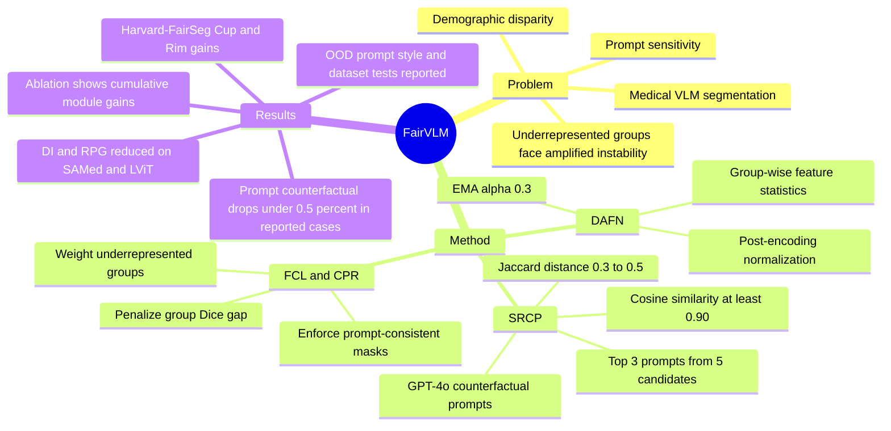

## Summary
FairVLM 针对 medical VLM segmentation 中 demographic bias 和 prompt sensitivity 交织的问题，把 Semantic-Retaining Counterfactual Prompting、Demographic-Aware Feature Normalization 和 Fairness-Calibrated Loss 组合到 SAMed/LViT 这类 segmentation VLM 上。论文在 Harvard-FairSeg 上报告了更高的 equity-scaled segmentation 指标和更低的 group disparity，同时在 prompt 改写、prompt-style OOD 和跨数据集设置中做了稳健性测试。

## Problem & Motivation
已知：作者关注的核心场景是用 radiology report prompt 指导 medical image segmentation，例如 optic cup/rim segmentation。现有 VLM 在临床部署中会同时遇到两类风险：不同 demographic groups 上的性能差异，以及语义相近 prompt 导致的输出不稳定。论文的关键判断是这两者不是独立问题：underrepresented groups 可能更容易受 prompt instability 影响，而 prompt instability 也会放大 subgroup disparity。动机成立的前提是 segmentation VLM 已经进入需要公平性和 prompt robustness 共同约束的高风险应用环境。

## Method
FairVLM 是一个加在现有 medical segmentation VLM 上的 model-agnostic framework，实验中主要接到 SAMed 和 LViT 两个 backbone 上。

**SRCP: Semantic-Retaining Counterfactual Prompting.** 对每个原始 clinical prompt，论文用 GPT-4o 生成 `m = 5` 个 counterfactual prompts。候选 prompt 需要同时满足 lexical diversity 和 clinical semantic consistency：Jaccard distance 被限制在 `[0.3, 0.5]`，prompt embedding cosine similarity 至少为 `0.90`。之后用 `Score(p_i') = lambda * D_i + (1 - lambda) * S_i` 排序，其中 `lambda = 0.4`，选 top `k = 3` 加入训练，以暴露模型于语义一致但表述不同的输入。

**DAFN: Demographic-Aware Feature Normalization.** 论文在编码后的 visual feature 和 prompt embedding 上维护 group-wise mean/std，并用 EMA 平滑 group 统计，`alpha = 0.3`。当一个样本属于多个 demographic groups 时，方法把相关 group 的 EMA statistics 平均后用于 feature normalization。作者强调 DAFN 是 post-encoding 模块，不要求改 backbone architecture。

**FCL and CPR losses.** Fairness-Calibrated Loss 用 group-wise Dice 的最高和最低差值 `Delta_gap` 约束 subgroup performance disparity，并用 entropy-based weights 提高 underrepresented groups 的贡献。Counterfactual Prompt Regularization 则对 counterfactual prompts 下的 segmentation outputs 加 Dice loss + BCE loss，鼓励语义等价 prompt 得到一致 mask。总目标为 `L_total = L_base + L_CPR + L_FCL`。

## Key Results
- **Harvard-FairSeg, Table 1, Cup region.** 在 SAMed backbone 上，FairVLM 把 ES-Dice 从 `84.53` 提到 `86.42`，Dice 从 `86.71` 提到 `87.25`，DI Dice 从 `1.17` 降到 `0.60`，RPG Dice 从 `5.61` 降到 `2.08`。在 LViT backbone 上，ES-Dice 从 `85.63` 到 `87.08`，DI Dice 从 `1.52` 到 `0.51`，RPG Dice 从 `8.26` 到 `2.34`。
- **Harvard-FairSeg, Table 1, Rim region.** SAMed+FairVLM 把 ES-Dice 从 `79.41` 提到 `81.03`，DI Dice 从 `2.03` 降到 `0.45`，RPG Dice 从 `9.09` 降到 `2.82`。LViT+FairVLM 把 ES-Dice 从 `80.19` 提到 `81.82`，DI Dice 从 `1.66` 降到 `0.44`，RPG Dice 从 `6.06` 降到 `2.67`。
- **Harvard-FairSeg low-resource groups, Table 2.** 对 Spanish `[154]` low-representation group，SAMed 的 Dice gap 为 `(8.12, 7.86)`，FairVLM(SAMed) 降为 `(0.78, 0.71)`；LViT 的 Dice gap 为 `(6.42, 5.61)`，FairVLM(LViT) 降为 `(0.68, 0.61)`。对 Hispanic `[9628]` high-representation group，SAMed Dice gap 从 `(2.67, 2.68)` 降到 `(0.49, 0.59)`。
- **Prompt robustness, Harvard-FairSeg, Table 3.** 在一个原始 prompt 和 3 个 counterfactual prompts 上，SAMed 的 Dice 从原始 `(89.64, 83.64)` 最低降到 `(86.89, 80.10)`，LViT 从 `(90.31, 85.41)` 最低降到 `(87.67, 81.22)`。FairVLM(SAMed) 在同组 prompts 上保持在 `(89.63-89.78, 83.59-84.01)`，FairVLM(LViT) 保持在 `(90.38-90.51, 84.82-85.12)`。
- **Ablation, Harvard-FairSeg, Table 4.** 从 baseline 到 full FairVLM，SAMed 的 ES-Dice 从 `(84.53, 79.41)` 到 `(86.42, 81.03)`，DI Dice 从 `(1.17, 2.03)` 到 `(0.60, 0.45)`；LViT 的 ES-Dice 从 `(85.63, 80.19)` 到 `(87.08, 81.82)`，DI Dice 从 `(1.52, 1.66)` 到 `(0.51, 0.44)`。逐步加入 SRCP+LCPR、DAFN、LFCL 都带来额外改善。
- **OOD prompt style and datasets, Tables 5-6.** Manual to GPT-generated prompt OOD 下，FairVLM(SAMed) 报告 ES-Dice `(86.53, 80.41)`、DI Dice `(0.87, 0.73)`；GPT-generated to Manual 下为 ES-Dice `(86.12, 80.24)`、DI Dice `(0.88, 0.76)`。跨数据集时，FairVLM(SAMed) 从 Harvard-FairSeg 到 MosMedData+ / QaTa-COV19 的 ES-Dice 为 `73.12` / `81.12`，FairVLM(LViT) 为 `73.11` / `81.56`。

## Strengths & Weaknesses
**Strengths.** 已知：论文把 fairness 和 prompt robustness 作为同一个训练目标的一部分，而不是分别 patch，这个 formulation 比单纯 group reweighting 或单纯 prompt smoothing 更贴近 medical VLM 的实际输入形态。实验覆盖两种 backbone、多个 fairness metrics、prompt counterfactual、low-resource subgroup、ablation 和 OOD 设置，至少证明了每个模块在作者设定的 benchmark 上有独立贡献。方法本身也比较轻量：SRCP 发生在 prompt augmentation 侧，DAFN 是 post-encoding normalization，FCL/CPR 是 loss-level 改动，因此有迁移到其他 segmentation VLM 的可能。

**Weaknesses.** 已知：主实验集中在 Harvard-FairSeg 的 optic cup/rim segmentation，论文结论不能直接外推到 broader clinical tasks、subgroup-specific medical conditions、multi-institutional 或 multimodal fairness，作者在 conclusion 也把这些列为 future work。SRCP 依赖 GPT-4o 生成 counterfactual prompts，但正文没有充分展开 LLM 选择、生成成本、prompt quality failure、以及当 GPT-generated prompt 自身带 bias 时的影响。跨数据集部分作者明确提到 raw Dice/IoU 相比 baseline 有 `1-2%` slight drop，因此 fairness-aware generalization 并不等价于所有 accuracy 指标都提升。

**不知道 / 需要谨慎。** 论文正文未给出该工作自己的 arXiv id、DOI 或更精确发表日期。正文多次引用 Appendix 来解释 dataset details、metric details、baseline details、prompt examples 和 `m = 5, k = 3` 的选择，但当前可见正文无法核查这些 appendix 证据。论文没有提供临床部署、人类医生评估或真实跨机构 prospective validation，因此“clinical reliability” 仍是基于离线 benchmark 的推断。

## Mind Map

## Notes
- **我的判断**：rating=3。它和 GUI-agent / embodied agent 没有直接关系，但对 VLM 的 prompt sensitivity、公平性约束和 benchmark-driven robustness 有参考价值，尤其适合借鉴“semantic-preserving prompt perturbation + subgroup-aware metrics”的评估思路。
- **和当前研究兴趣的连接**：如果把 GUI agent 的 natural language instruction 当作 prompt，把用户/任务分布差异当作 subgroup shift，这篇的核心启发是不要只看 average success rate，还要看 instruction paraphrase 和 subgroup/task-family 上的 worst-case gap。
- **需要后续查证**：appendix 中的 prompt 生成例子、`m/k/lambda/tau` sensitivity、外部数据集 raw Dice/IoU 表格、以及 GitHub 代码是否完整复现 Tables 1-6。
