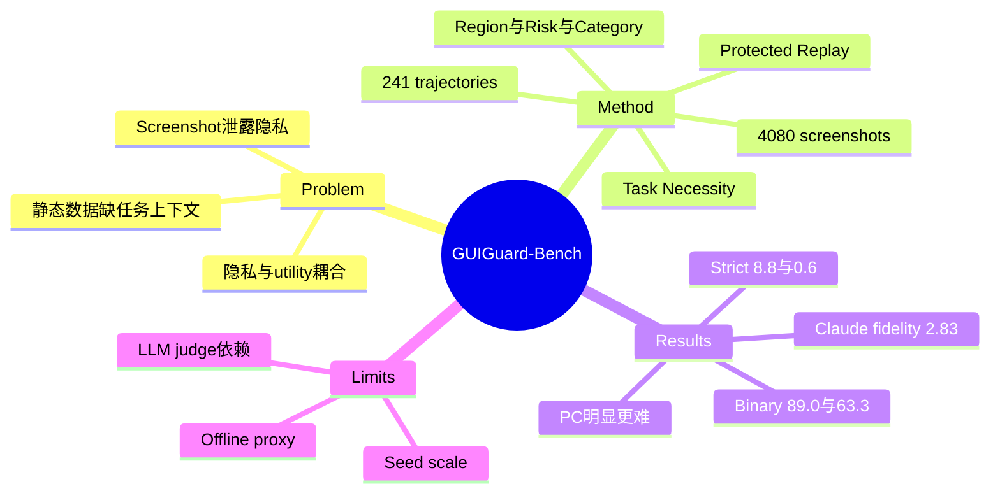

## Summary

GUIGuard-Bench 把 GUI privacy 从静态图像识别改写成 trajectory-conditioned 问题：241 条 Android/PC 真实 agent trajectories、4,080 张截图均标注 privacy region、风险等级、语义类别及 task necessity，并评估识别、保护后 planning fidelity 与 utility trade-off。实验揭示明显层级断裂：平均 binary privacy detection 在 Android/PC 为 89.0%/63.3%，但 strict full match 仅 8.8%/0.6%，说明“知道有隐私”远不等于能安全地最小化披露。

## Problem & Motivation

GUI agent 通常把连续 screenshot 发给远程 VLM，身份、账户、位置、行为轨迹等敏感信息会进入模型上下文。现有 GUI benchmark 主要测 task completion/grounding，传统 visual privacy 数据又多是孤立自然图像；两者都无法判断某段信息在当前 workflow 中是否必要，也无法测量遮挡后 agent 是否还能完成计划。

论文强调 privacy 是上下文属性：同一个联系人姓名可能在一步中只是偶然出现，在另一步却是完成任务的必要输入。没有 task goal、历史和 action trace，静态分类无法支持 data minimization。

## Method

Benchmark 保留 task instruction、step index、screenshot、planner state、semantic/raw action、feedback/reflection 与 completion signal。每个 privacy element 具有 bounding box、三档 risk level、六类 semantic category，以及 task-necessary 标签；数据跨 Android 与 PC，56 个任务涉及跨应用，52 个任务含多语言界面。

评估分三层：

1. **Privacy recognition**：输入 screenshot、trajectory context、OCR 与统一 taxonomy prompt。text match 容忍 OCR 差异，location 用 IoU 匹配；报告 screenshot-level binary accuracy、element recall、risk/category/necessity label accuracy，以及 detection 和三类标签同时正确的 strict full match。
2. **Protected planning fidelity**：对同一模型分别 replay 原图和 black mask、mosaic、random block、LLM text replacement 后的截图序列。移除真实 grounding/execution，以预录下一帧作为 outcome，用 GPT-5 judge 给两套 plan 的语义一致性打 0–4 分。
3. **Utility analysis**：改变 privacy coverage，观察 plan consistency 与 Android click grounding；附录还给出 MobileWorld online case study，但主结论明确限定在离线 proxy。

## Key Results

- 八个 VLM 的平均 binary detection：Android 89.0%，PC 63.3%；element recall 降到 52.9% / 13.5%；strict full match 进一步降到 8.8% / 0.6%。PC 的密集文字与多重 privacy cues 显著更难。
- Qwen3.5 的类别结果中，Inferences & Profiling 总 recall 仅 2.4%、strict accuracy 为 0；说明需要上下文推断的隐私最难识别。
- 保护后 planner consistency（0–4）中，Claude Sonnet 4.6 总分 2.83，Gemini 3.1 Pro 2.68，Qwen3.5 2.25；GUI-Owl-7B 为 1.78，UI-TARS-1.5-7B 仅 0.55。closed-source general VLM 比专用 GUI agent 更能在遮挡后保持 plan semantics。
- masking coverage 在约 60% 前导致 consistency 快速下降，之后趋平；random blocks 保持 utility 最好，但泄露也更多，直观展示 privacy-utility trade-off。
- 970 个 Android click samples 上保护会降低 grounding accuracy，但没有出现 open/closed 模型之间的清晰分界或灾难性崩溃，支持 remote planner + local grounding 的 split architecture 作为可行方向。

## Strengths & Weaknesses

**Strengths**

- 把 task necessity 与完整 trajectory 纳入标注，直接把 privacy 从“敏感类别识别”提升为“最小必要披露”的 agent 问题。
- 主动区分 planner fidelity proxy 与 end-to-end success，没有把离线 replay 过度包装成真实执行安全性。
- 指标呈现出 coarse detection、region localization、fine-grained judgment 的清晰 failure cascade，对系统模块定位很有用。

**Weaknesses**

- 241 trajectories / 4,080 screenshots 仍是 seed scale，类别、软件和用户分布不足以支持广泛安全结论。
- 主评估依赖 GPT-5 judge 比较自然语言 plan；同一语义不代表 action 可执行，judge bias 也可能放大 closed-model 风格优势。
- 保护方法主要是像素级遮挡/替换，未覆盖 trusted local model、encrypted inference、feature sanitization 等更强系统方案。
- static replay 固定下一张截图，隔离了 planning，却也消除了保护导致 action 改变、错误累积和恢复的真实动态。

**已知**：当前模型在 binary detection 上尚可，但 element-level strict correctness 极低，尤其 PC 和 inference/profiling 类别。**推测**：实际部署的首要瓶颈是 context-aware privacy recognition，而非选择哪一种 mask。**不知道**：benchmark 上的 planner consistency 能在多大程度预测真实 task success、privacy leakage 与用户可接受性。

## Mind Map

## Notes

对 GUI agent safety，最关键的 insight 是 privacy recognition 与 task execution 不应被当作两个独立 benchmark：task-necessary 标签把“能不能看”与“为什么要看”连接起来。后续更有价值的研究不是追求所有敏感框 recall=100%，而是学习 selective disclosure policy，并用反事实遮挡检验某个 region 对当前 action 是否真的必要。
