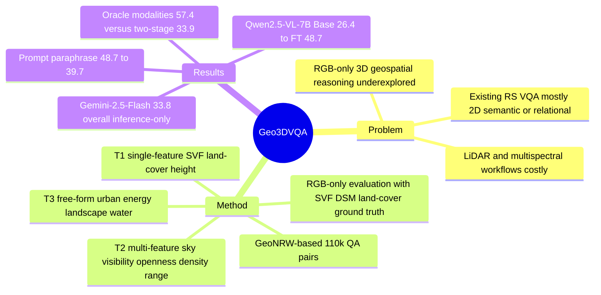

## Summary
Geo3DVQA 提出一个面向 aerial RGB imagery 的 height-aware 3D geospatial reasoning VQA benchmark，用 110k QA pairs、16 个任务类别和三层 task taxonomy 评估 VLM 能否从 2D RGB 线索推断 SVF、height、land cover 与组合空间属性。核心发现是现有 VLM 在 RGB-only 3D spatial reasoning 上仍弱：GPT-4o / GPT-4.1-mini 只有 31.0% overall short-answer accuracy，Gemini-2.5-Flash 为 33.8%，而 domain-specific instruction tuning 可把 Qwen2.5-VL-7B 从 26.4% 提升到 48.7%。

## Problem & Motivation
三维 geospatial analysis 对 urban planning、climate adaptation、environmental assessment 很重要，但传统流程依赖 LiDAR、multispectral sensors、DSM 等专业数据，成本和技术门槛高。RGB aerial imagery 更普遍，问题是：VLM 能否只从 RGB patterns 中做 coarse、decision-oriented 的 3D spatial reasoning，而不是完整 3D reconstruction？

已有 remote sensing VQA / instruction-following benchmark 如 RSVQA、HRVQA、VRSBench、RSIEval、GeoChat、TEOChat、DisasterM3 主要覆盖 2D recognition、captioning、grounding、temporal EO 或灾害评估；作者指出缺口在于从 2D RGB 输入推断 height-aware 3D 属性。Geo3DVQA 因此把任务聚焦在 RGB-to-3D geospatial reasoning：ground truth 用 SVF、DSM、land cover 等 reference modalities 生成，但模型评估时只看 RGB。

## Method
**Dataset construction.** Geo3DVQA 基于 GeoNRW，包含 North Rhine-Westphalia, Germany 的 orthorectified aerial imagery、LiDAR elevation models 和 semantic segmentation；原始 GeoNRW 有 7,783 image triplets，1 m spatial resolution，10 个 land cover classes。作者从 DSM 计算 SVF，并对齐 RGB、SVF、DSM、segmentation 生成 QA；最终 benchmark 包含 110k QA pairs，覆盖 multiple-choice、ranking、numeric estimation 和 open-ended questions。

**Task taxonomy.** 任务分三层：

1. **T1 single-feature inference**：从单一属性推断 SVF、land cover 或 height，包括 sun exposure、region ranking、regional SVF variability、mean SVF、landcover type、top land uses、height average、highest region。
2. **T2 multi-feature reasoning**：组合 SVF、DSM、land cover 得到 sky visibility、spatial openness、building density、visibility range 等 composite metrics。例如 sky visibility 用 SVF 加 building penalty / edge penalty，spatial openness 结合 SVF statistics、terrain flatness 和 building density。
3. **T3 application-level free-form**：面向 urban development、renewable energy、landscape analysis、water accumulation 生成带 observation / conclusion 的结构化回答。

**QA generation and validation.** T1/T2 用 category-specific templates 生成问题，答案和 distractors 来自 reference modalities 的统计量，选项随机化以降低 positional bias，并抽样人工验证 correctness 和 scientific validity。T3 先从 SVF、DSM、segmentation、RGB 提取 scene-level statistics，再由 GPT-4.1-mini 生成答案；这些答案经过 rule-based / LLM verifier 与 GPT-5 cross-check，再由 human experts 验证后进入评估集。训练与测试按 geographic splits 分离。

**Evaluation.** 作者评估 10 个 VLM：commercial models（o4-mini、GPT-4o、GPT-4.1-mini、Gemini-2.5-Flash）、remote sensing VLMs（TEOChat、GeoChat）和 open-source models（LLaVA-OneVision、InternVL3-8B、Qwen2.5-VL-3B、Qwen2.5-VL-7B）。Qwen2.5-VL-7B 还做 10K / 100K short-answer instruction tuning，并各混入 1K free-form QA。Short-answer 用 category accuracy；landcover type 用 Jaccard similarity >= 0.8；height average 使用 10 m quantization 和 magnitude-aware tolerance；free-form 用 GPT-4-family rubric scorer 给 1-5 分，并有人类抽样校验。

## Key Results
**Geo3DVQA short-answer benchmark (T1+T2, Table 2).** 在 RGB-only 输入下，Gemini-2.5-Flash 是最强 inference-only 模型，overall accuracy 为 **33.8%**；GPT-4o 和 GPT-4.1-mini 都是 **31.0%**；Qwen2.5-VL-7B Base 为 **26.4%**。Domain-specific tuning 后，Qwen2.5-VL-7B FT (10K) 达到 **40.4%**，FT (100K) 达到 **48.7%**，相对 base 提升 **+22.3 pp**；free-form Total / Conclusion 从 base 的 **2.04 / 2.23** 提升到 **2.89 / 3.11**。

**Category-level results (Tables 3-4).** Qwen2.5-VL-7B FT (100K) 在 major categories 上为 **SVF 44.61% / Height 41.07% / Land Use-LC 71.3% / Multi 45.45%**。最明显的提升包括 SVF value **6.8 -> 42.7**（+35.9 pp）、height average **9.9 -> 42.2**（+32.3 pp）、top land uses **29.1 -> 57.8**（+28.7 pp）、sky visibility **13.1 -> 55.3**（+42.2 pp）。但 visibility range 仍只有 **32.7%**，说明 coordinate-level / line-of-sight 类空间推理仍难。

**Ablations and baselines (Table 12).** 如果给模型 oracle-style ground-truth modalities 并用 necessary-only routing，整体准确率上限达到 **57.4%**，其中 Height inference **69.3%**、LULC **89.6%**、SVF inference **46.0%**、Multi **51.6%**。相比之下，两阶段 baseline（U-Net 先从 RGB 预测 DSM/SVF/segmentation，再由 agent-style inference 作答）只有 **33.9% overall**，Height inference 只有 **15.0%**；作者将差距归因于 upstream RGB-to-DSM/SVF 估计误差传播。

**Prompt robustness (Table 20).** GPT-4 paraphrased prompts 使 Qwen2.5-VL-7B FT (100K+free) 从 **48.7%** 降到 **39.7%**，整体下降 **9.0 pp**，但仍高于 Qwen2.5-VL-7B Base 的 **26.4%** 和最佳 inference-only 模型 Gemini-2.5-Flash 的 **33.8%**；format-error rate 保持在 **0.09%**。

**Format failures (Table 18).** o4-mini 的 overall invalid-output rate 为 **47.23%**，Gemini-2.5-Flash 为 **16.28%**；SVF value 上二者分别达到 **69.27%** 和 **81.18%**。作者把这类失败主要归因于 thinking conventions、token limit 和未能给出 final answer string，而不是普通 parser 不够宽松。

## Strengths & Weaknesses
**已知亮点。** Geo3DVQA 的价值首先是 benchmark formulation：它把 remote sensing VQA 从 2D semantic QA 推到 RGB-only height-aware spatial reasoning，并明确区分 single-feature、multi-feature、application-level 三层能力。ground truth 生成依赖 SVF、DSM、segmentation 等 reference modalities，而评估只给 RGB，这个设置能直接暴露 "从可见 2D cues 推断不可见 3D properties" 的难度。作者还给出了有信息量的 baseline：commercial VLM、remote sensing VLM、open-source VLM、domain-specific fine-tuning、oracle modalities、two-stage RGB-to-DSM/SVF pipeline、prompt paraphrasing robustness。

**已知局限。** 最强 RGB-only fine-tuned model 也只有 **48.7%** overall short-answer accuracy，论文自己明确说 best models 仍不足以 reliable deployment。评估只覆盖 North Rhine-Westphalia，不能证明跨地区、跨季节、跨传感器泛化；模型在 coordinate-level task 上仍弱，visibility range 只有 **32.7%**。free-form 评分使用 GPT-4-family evaluator，而问题/答案生成也使用 GPT-4.1-mini，作者承认可能存在 shared-family bias，因此 free-form 分数更适合作相对比较而不是绝对能力刻度。论文还提到 multiple-choice option order 的 dedicated sensitivity study 尚未完成，geospatial specialization 对 general VLM performance 的 trade-off 也没有评估。

**已知 ablation / failure signal.** Prompt paraphrasing 造成 **-9.0 pp** 的 overall drop，说明 fine-tuned model 一部分收益可能依赖 template distribution。两阶段 baseline 的 **33.9% overall / 15.0% height** 明显低于 end-to-end RGB FT 的 **50.1% overall / 44.1% height**，说明直接显式预测 DSM/SVF 再问答并不是免费更稳；上游估计误差会严重传导。Format-error 分析也显示某些 reasoning-style 模型在严格 VQA 输出格式下会重复问题或只输出 thinking，不给 final answer。

**推测。** 对 GUI-agent / embodied spatial reasoning 的启发不在 geospatial application 本身，而在 benchmark 设计：把不可直接观测的 3D / affordance / openness 属性用 reference sensors 生成 supervision，再只给 RGB 或 screen observation 评估模型，可能是一种构造 "implicit spatial reasoning" benchmark 的有效范式。

**不知道。** 论文没有证明 Geo3DVQA fine-tuning 是否会损伤 general VLM 能力，也没有给出跨地理区域的 zero-shot 或 few-shot 迁移结果。代码和数据在论文文本中描述为 publication 后 release，raw aerial imagery / DSM / segmentation 还受 GeoNRW license 限制，因此实际复现实验仍取决于发布包和数据许可。

## Mind Map

## Notes
这篇更像是一个强 benchmark paper，而不是一个已经解决 RGB-to-3D reasoning 的方法 paper。值得跟 GUI / embodied benchmark 关联起来看：Geo3DVQA 的关键设计是把 hidden state（SVF、height、land cover statistics）变成可验证 QA，而不是要求模型直接输出 dense reconstruction；这对 screen / robot 场景中评估 implicit spatial state、layout affordance、visibility / occlusion reasoning 有迁移价值。
