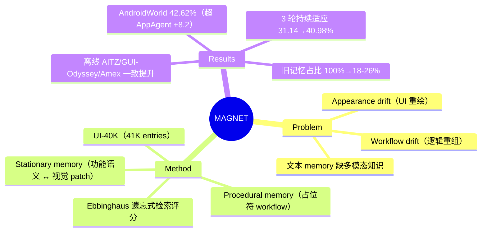

## Summary

针对移动 App 频繁更新导致 GUI agent 失效的问题（appearance drift + workflow drift），提出 MAGNET：双层记忆框架——stationary memory 把多样视觉外观绑定到稳定功能语义以支撑 grounding，procedural memory 用带占位符的抽象 workflow 复用任务经验，并用基于 Ebbinghaus 遗忘曲线的检索评分实现记忆动态演化。在 AITZ / GUI-Odyssey / Amex 离线与 AndroidWorld 在线评测上一致优于 memory-free 与 memory-augmented baseline。

## Problem & Motivation

移动应用持续更新造成两类 drift：**appearance drift**（UI 元素重绘但功能不变，如 Twitter → X 的图标变化）和 **workflow drift**（跨版本操作逻辑重组）。在固定数据集上训练的 GUI 模型会随 App 演化而过时。已有 memory-augmented 方法多依赖纯文本 workflow 描述，缺乏多模态知识，对视觉变化脆弱：AppAgent 依赖 XML 标识符，UI 结构一变即失效；Agent-S 侧重 workflow 但缺少 grounded UI 表示。核心问题是：如何让 agent 的知识随环境演化而更新，而非静态积累。

## Method

**双层记忆设计**：

- **Stationary memory**：存储 ⟨功能描述 d_i, 视觉 patch v_i⟩ 对（如 "click the search icon to start searching" 配多张外观各异的 patch），把多样视觉特征映射到稳定功能语义，使外观变化后仍能 grounding。构建管线三步：从数据集/交互中收集 ⟨o_t, a_t, o_{t+1}⟩ 三元组 → OmniParserV2 解析截图并按空间对齐定位被点击元素 → Qwen2.5-VL-32B 推断功能语义。产出 **UI-40K 数据集**：41,009 条多模态 entry、20,618 个唯一 functional intent。
- **Procedural memory**：存储带 categorical placeholder 的抽象 workflow（如 "Search and Install an App" 含 [AppName]、[SearchQuery] 槽位）。构建：收集 instruction-trajectory 对 → 指令 embedding 建相似度图、取 maximal clique 聚类 → LLM 蒸馏出共性 workflow。

**检索与动态演化**：两阶段检索——先语义相似度取 top-N，再按 retention score R_i = exp(−g_i/n_i)（g_i 为距上次访问的 inactivity gap，n_i 为检索次数）与创建时间戳排序取 top-K，模拟 Ebbinghaus 遗忘曲线：高频知识衰减慢、陈旧知识被降权。内容更新：新成功轨迹抽象入 procedural memory；新 grounding 动作生成新 ⟨d, v⟩ 对或为已有 entry 追加带独立时间戳的视觉 patch。

**基座模型**：Planner 用 Qwen2.5-VL-32B 或 Gemini-2.5-Pro；Actor 可同基座或换专用 grounding 模型（OS-Atlas、UI-Venus）——记忆通过 prompt 注入，框架与模型解耦。

## Key Results

- **离线**（Qwen2.5-VL-32B）：AITZ 43.50% SR、GUI-Odyssey 50.16% SR、Amex 62.84% SR，一致优于 memory-free COAT 与 Agent-S；Gemini-2.5-Pro 版本更高。
- **在线 AndroidWorld**：42.62% 任务完成率，比 AppAgent +8.2 pts、比 Agent-S +1.6 pts。
- **Ablation**（GUI-Odyssey, Qwen）：stationary 单独 +0.49% SR，procedural 单独 +1.59%，合并 +2.03%——两层互补但绝对增益不大。
- **异构组合**：QwenVL planner + OS-Atlas actor 时增益最大（+4.2% SR / +3.4% Grd.），说明记忆注入对专用 actor 补益更明显。
- **Distribution shift**（ID/template/app/domain 四种 split）：stationary memory 增益小而稳（+0.1~0.9%），procedural memory 方差更大（Gemini 上 +0.2~1.4%）。
- **持续适应**（AndroidWorld 3 轮迭代）：SR 31.14% → 40.98%；初始 Amex 来源的记忆占检索比例从 100% 降到 26%（procedural）/ 18%（stationary），验证遗忘机制确实在替换过时知识。

## Strengths & Weaknesses

**亮点**：
- 问题选得准——UI/workflow drift 是部署 GUI agent 的真实痛点，把"知识会过时"作为一等公民建模，比静态 experience replay 更接近 continual learning 的正确 formulation。
- Stationary memory 的"多外观 → 单一功能语义"设计直接对症 appearance drift；持续适应实验中记忆来源占比的衰减曲线是对遗忘机制最有说服力的证据（比 SR 提升本身更有信息量）。
- 框架与基座解耦（prompt 注入），异构 planner/actor 均可受益。

**局限**：
- Ablation 增益偏小（合并 +2.03% SR），distribution-shift 下 stationary memory 只有 +0.1~0.9%——"记忆解决 drift"的 headline claim 与实际增益幅度之间有落差。
- 作者自承：依赖成功轨迹构建记忆，在初始探索即失败的全新 domain 无效；clique 聚类的 workflow 抽取对高度多样的任务结构可能失灵。
- 冷启动依赖 UI-40K 离线构建（OmniParserV2 + Qwen2.5-VL-32B 标注），管线较重；未提及 code release，UI-40K 是否公开未知。
- 遗忘评分 R_i = exp(−g_i/n_i) 是启发式，频繁访问 ≠ 仍然正确——若 App 更新后旧知识仍被高频检索（因为没有替代），该机制可能强化过时知识；论文未讨论此 failure mode。

**推测**：该方向与 agentic memory / experience evolution 线（如 AgentFly、Memp）会合流；GUI 场景的特殊价值在于视觉层记忆，纯文本 memory 框架难以覆盖。

## Mind Map

## Notes

- 与 2601-EvoCUA 的 self-evolution 线对照：MAGNET 演化的是外部记忆（无参数更新），EvoCUA 演化的是模型本身；前者部署成本低但增益幅度也小。
- 值得追问：遗忘机制在对抗性场景（App 更新后旧路径高频但已失效）下是否会失灵——频率作为 reliability proxy 的边界条件。
