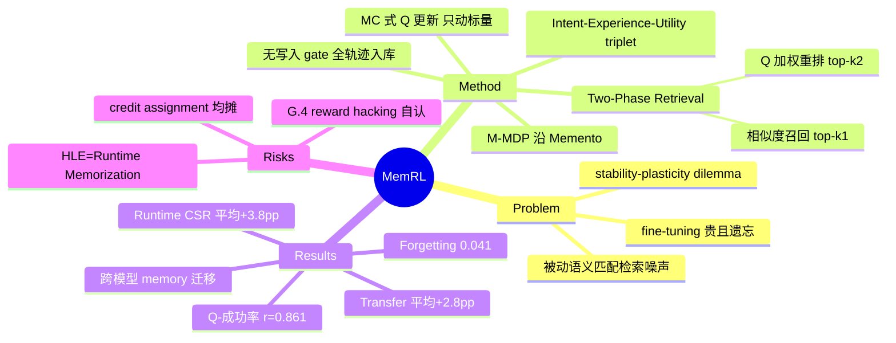

## Summary

MemRL 把 self-evolution 从模型权重移到 episodic memory 的检索打分层：每条经验附带一个标量 Q 值，由环境 reward 以 Monte Carlo 规则在运行时更新，检索时用 (1−λ)·语义相似度 + λ·Q 的复合分重排（Two-Phase Retrieval），在完全冻结 LLM 权重的前提下实现持续改进。在 HLE、BigCodeBench、ALFWorld、LifelongAgentBench 四个 benchmark 上，10-epoch runtime 学习平均 CSR 超最强 baseline Memp +3.8pp，held-out 迁移平均 +2.8pp。

## Problem & Motivation

Agent 部署后如何持续改进？现有两条路各有硬伤：fine-tuning 把经验写进权重，计算贵且有 catastrophic forgetting；RAG/memory 方法非参数化但检索是被动语义匹配——"similar implies useful" 的假设在 agentic 任务里经常不成立，语义相似的 distractor memory 反而引入噪声，且无法利用运行时反馈区分高价值策略。论文把这归结为 stability-plasticity dilemma：目标是 backbone 冻结保稳定（stability）、经验层可塑吸收反馈（plasticity），称为 Runtime Continuous Learning。核心 move：既然内容和模型都不动，就让"学习"发生在每条记忆的效用估计上——把 memory 检索形式化为 value-based 决策过程。

## Method

**问题形式化（§3）**：沿用 Memento（Zhou et al. 2025a, arXiv:2508.16153）的 Memory-Based MDP（M-MDP）框架 (S, A, P, R, γ, M)。state 是 user intent（query embedding），action space 是"从 memory bank 选哪条 m"，检索策略 μ(m|s,M) 是被优化对象，frozen LLM 的 p_LLM(a|s,m) 是固定的 Inference Policy。

**Intent-Experience-Utility triplet（§4.1）**：M = {(z_i, e_i, Q_i)}。z_i 是 intent embedding，e_i 是原始经验（如成功 solution trace 的 LLM 摘要），Q_i 是学到的效用——"applying experience e_i to intents similar to z_i 的期望回报"。

**Two-Phase Retrieval（§4.2, Eq. 6-7）**：
- Phase A（Similarity Recall）：余弦相似度 > δ 的候选取 top-k1；候选为空则不注入任何 memory，靠 frozen LLM 自行探索。
- Phase B（Value-Aware Selection）：按 score = (1−λ)·sim̂ + λ·Q̂ 取 top-k2 注入 context，ˆ 为 z-score 归一化。λ 平衡 exploration（相似度）与 exploitation（效用）。设计意图：滤掉"语义相似但历史效用低"的 distractor。

**Utility-Driven Update（§4.3, Eq. 4）**：执行后得环境 reward r（execution success 或 scalar score），只对实际注入 context 的条目更新 Q_new ← Q_old + α(r − Q_old)——把 Q-learning（Eq. 3）的 s' 设为 terminal state 的一步简化，Monte Carlo 式。同时每条 sampled trajectory 由 LLM summarize（做法引 Memp）后作为新 triplet (z, e_new, Q_init) 追加写入，Q_init=0。

**更新对象辨析**（Supervisor 关注点）：runtime RL 更新的**只有每条 memory 的标量 Q 值**——memory 内容写入后不再改写、检索函数形式固定（学的是打分里的 Q，不是参数化 retriever）、LLM 权重冻结。即演化发生在 read 侧的 selection 上，属 selection-based evolution；write 侧是无差别追加（成功与失败轨迹都写入，**无写入前验证 gate**），质量控制全部推迟到检索时（δ 阈值 + z-score + Q 加权）。

**理论（§4.4, Appendix A）**：在 frozen inference policy + 平稳任务分布两个假设下，Q 无偏收敛到 β(s,m)=E[r|s,m]，方差有界 limsup Var(Q_t) ≤ α/(2−α)·Var(r|s,m)。

**超参（Table 8）**：α=0.3、λ=0.5 全 benchmark 统一；δ 逐 benchmark 调（0.25-0.62）；k1=5-10、k2=3-5。

## Key Results

- **Runtime Learning（Table 1，10 epochs 迭代同一任务集）**：报 Last Epoch SR / CSR（CSR=至少解出一次的任务比例）。MemRL 平均 0.772/0.798，超最强 baseline Memp（0.736/0.760）平均 +3.8pp CSR；ALFWorld（GPT-5-mini，0.949/0.981）与 OS Task（GPT-4o-mini，0.788/0.804）各 +6.2pp，HLE（Gemini-3-pro，0.570/0.606）+3.6pp，BigCodeBench（GPT-4o，0.595/0.627）+2.5pp，DB 基本饱和（0.960/0.972 vs 0.960/0.966）。
- **Transfer（Table 2，memory 冻结后测 held-out）**：平均 0.794 vs Memp 0.766（+2.8pp）；ALFWorld 0.979 vs Memp 0.921。注意此设置下 RAG/Self-RAG/Mem0 在 ALFWorld 都到 0.950——泛化侧的领先幅度远小于 runtime 侧。
- **消融（Table 3, §5.3.3）**：cross-task 检索 vs 单任务反思（Reflexion 式）在 OS +9.0pp、ALFWorld +5.1pp；但 HLE 上单任务 0.610 与 MemRL 0.606 打平——论文归因于 HLE 内部语义相似度仅 0.186，跨任务迁移无从谈起。λ=0.5 最优，偏向纯相似度或纯 Q 都掉点（Figure 5）。
- **Q 值有效性（Figure 7, §5.4.1）**：Q 与实测成功率 Pearson r=0.861，最低 Q bin 成功率 21.5%、最高 88.1%；高 Q bin 保留约 12% failure memories，论文解释为"strategically useful near-misses"（Appendix H 有 case study）。
- **稳定性（§5.4.2）**：Forgetting Rate（曾成功转失败 / 当轮失败总数）MemRL 0.041 < Memp 0.051；去掉 z-score 归一化与 similarity gating 升到 0.073——检索侧过滤是稳定性的关键。
- **跨模型 memory 迁移（Table 5, Appendix C.1）**：Gemini-3-pro 在 HLE 训好的 memory bank 直接给其他模型零微调使用：Qwen3-235B 0.150→0.531（3 倍+）、Gemini-3-flash 0.347→0.583、GPT-5.2(High) 0.354→0.571。
- **成本（Appendix F）**：HLE 每题总 token 约 32K，与 Memp 相当（交互循环相同）；算法开销对 wall-clock 可忽略。
- **归因的诚实拆分（Appendix B.3）**：论文自己区分了两种收益来源——结构化域（OS/ALFWorld）靠 Positive Transfer（跨相似任务迁移 pattern），HLE 靠 **Runtime Memorization**（对同一 2,500 题重复暴露而记住具体解）。

## Evidence Ledger

| Claim ID | Claim | Type | Source locator | Evidence excerpt | Status |
|:--|:--|:--|:--|:--|:--|
| C1 | Runtime 平均 CSR 0.798 vs Memp 0.760（+3.8pp）；ALFWorld/OS 各 +6.2pp | number | Table 1, §5.2 | "surpassing the strongest baseline (MemP) by an average of +3.8% in Cumulative Success Rate" | source-verified |
| C2 | Transfer 平均 0.794 vs Memp 0.766；ALFWorld 0.979，RAG/Self-RAG/Mem0 均 0.950 | comparison | Table 2, §5.2 | "MemRL (ours) 0.508 0.746 0.942 0.979 0.794" | source-verified |
| C3 | RL 只更新被注入 context 条目的标量 Q：Q_new ← Q_old + α(r − Q_old)；不动权重不改内容 | causal-mechanism | §4.3, Eq. 4 | "For the memories actually injected into the input context, we update their utilities in triplets with a Monte Carlo style rule" | source-verified |
| C4 | 每条 trajectory 摘要后无 gate 追加写入 (z, e_new, Q_init)，Q_init=0 | causal-mechanism | §4.3; Table 8 | "use an LLM to summarize the experience, and write it back into the memory bank as a new triplet" | source-verified |
| C5 | Two-Phase Retrieval：相似度阈值召回 top-k1，再按 (1−λ)·sim̂+λ·Q̂ 选 top-k2（z-score 归一化） | causal-mechanism | §4.2, Eq. 6-7 | "score(s,z_i,e_i)=(1−λ)·sim̂(Emb(s),Emb(z_i))+λ·Q̂_i … denotes z-score normalization" | source-verified |
| C6 | reward 为环境反馈（execution success 或 scalar score） | causal-mechanism | §4.3 | "Executing a then yields an environmental reward r (e.g., execution success or scalar score)" | source-verified |
| C7 | Q 与成功率 Pearson r=0.861；bin 从 21.5% 到 88.1%；高 Q bin 约 12% failure memories | number | Figure 7, §5.4.1 | "Pearson r=0.861 confirms Critic's predictive power … Failure memories (~12%) in high Q-bins" | source-verified |
| C8 | Forgetting Rate：MemRL 0.041 < Memp 0.051；去掉归一化与 gating 升至 0.073 | number | §5.4.2, Appendix B.1 | "lowest mean forgetting rate (0.041), outperforming MemP (0.051) … causes the rate to spike to 0.073" | source-verified |
| C9 | 跨模型 memory 迁移：Qwen3-235B 0.150→0.531、Gemini-3-flash 0.347→0.583、GPT-5.2(High) 0.354→0.571 | number | Table 5, Appendix C.1 | "Qwen3-235B improves by over 3x (0.150→0.531)" | source-verified |
| C10 | 论文自陈 HLE 收益来自 Runtime Memorization；HLE 内部语义相似度 0.186 | benchmark-setting | Appendix B.3, §5.3.3 | "the gain in HLE stems from Runtime Memorization … 'memorize' specific solutions to difficult problems through repeated exposure" | source-verified |
| C11 | cross-task 检索 vs 单任务反思：OS +9.0pp、ALFWorld +5.1pp，HLE 打平（0.606 vs 0.610） | comparison | Table 3, §5.3.3 | "particularly on OS-Agent (+9.0%) … the single-task baseline (0.610) is tied with MemRL (0.606)" | source-verified |
| C12 | baseline 仅 No Memory/Pass@10/RAG/Self-RAG/Mem0/Memp；无 AWM/ReasoningBank/ExpeL 比较 | benchmark-setting | Table 1, Appendix D.1 | Table 1 方法列: "No Memory, Pass@10, RAG, Self-RAG, Mem0, MemP, MemRL (ours)" | source-verified |
| C13 | 理论：frozen policy + 平稳分布下 Q 无偏、方差 ≤ α/(2−α)·Var(r|s,m) | causal-mechanism | §4.4, Eq. 8-9 | "limsup Var(Q_t) ≤ α/(2−α)·Var(r_t|s,m)" | source-verified |
| C14 | G.4 承认 reward hacking 与 memory poisoning 风险，错误高 Q 会固化传播 | causal-mechanism | Appendix G.4 | "particularly vulnerable to 'reward hacking' if the verifier produces false positives … could rapidly diffuse pollution" | source-verified |
| C15 | α=0.3、λ=0.5 统一，δ 逐 benchmark 调 0.25-0.62；HLE 每题约 32K token | benchmark-setting | Table 8; Appendix F.1 | "δ Similarity Threshold 0.38 0.50 0.37 0.62 0.25 … approximately 32K" | source-verified |
| C16 | M-MDP 形式化沿用 Memento（arXiv:2508.16153） | sota-novelty | §3.1 | "We adopt the formulation of Memory-Based Markov Decision Process (M-MDP) (Zhou et al., 2025a)" | source-verified |

## Strengths & Weaknesses

**Strengths**

- **杠杆极简**：整个"学习系统"就是每条 memory 一个标量 + 一行 MC 更新，无 gradient、无参数化 retriever，还配了无偏性/方差界的理论（哪怕假设很强）。是 simple-scalable 品味的正面样本；token 成本与 Memp 持平说明收益不是靠加算力买的。
- **归因诚实**：论文自己把收益拆成 Positive Transfer（OS/ALFWorld）与 Runtime Memorization（HLE），没有把记忆化包装成泛化；forgetting rate、Q-成功率相关性（r=0.861）、高 Q failure memories 等分析给了机制证据而非只有 leaderboard。
- **G.4 的第一方风险承认**：明确写出 verifier false positive 会让错误 Q 值"quickly solidify and propagate erroneous behavioral patterns"、恶意注入可"rapidly diffuse pollution"——这是 value-based 检索正反馈风险的作者自认，对 misevolution 研究是重要的 primary source。
- **跨模型可迁移**：memory bank 作为可移植知识资产（Table 5）是 model-memory 解耦的直接红利，参数化方法做不到。

**Weaknesses**

- **主表混入记忆化成分**：Runtime Learning 协议是对同一任务集跑 10 epochs，CSR 天然奖励"记住这道题的解"。真正的泛化检验是 Table 2 transfer，那里平均领先缩到 +2.8pp，且 ALFWorld 上朴素 RAG 类都到 0.950。headline 数字读者需自行打折（推测：若只看 transfer，与 Memp 的差距在多数 benchmark 是 1-3pp 量级）。
- **跨模型迁移的 HLE 版本近乎解答搬运**：C.1 的 memory 在同一批 HLE 题上训练、又在同一批题上评测，Qwen3-235B 的 3 倍提升很大程度是"把强模型的答案通过检索喂给弱模型"，"weaker models inherit capabilities" 的表述有 overclaim 之嫌（个人判断；论文在 B.3 承认 HLE 是记忆化，但 C.1 未做此限定）。
- **比较对象缺口**：只比 RAG 变体 + Mem0 + Memp，未与 in-context 经验积累主线（AWM、ReasoningBank、ExpeL、Voyager）对比。写入侧（LLM 摘要）直接继承 Memp，novelty 集中在读出侧的 Q 打分——这恰是应该与 ReasoningBank（写入侧蒸馏、含失败经验）正面对比的地方，缺席使"value 检索 vs 内容蒸馏哪个杠杆更有效"悬置。
- **无写入 gate + 无遗忘机制**：所有轨迹无差别入库，memory bank 只增不减（G.1 把 consolidation 列为 future work），bank 规模动态与长期膨胀成本未报告；质量控制全押在检索侧过滤上，而 δ 需逐 benchmark 调（0.25-0.62 跨度大），暗示该过滤对阈值敏感。
- **冷启动依赖初始能力**：E.4 承认弱模型（HLE 上 ~4% SR 的 GPT-4o-mini）产生的反馈"被噪声主导"、无法稳定估计效用——self-evolution 有能力下限，"弱者靠经验变强"的叙事只在基座已够强时成立。
- **credit assignment 粗糙**：trajectory 级 reward 均摊给所有被注入的 memory（§6 自认 ambiguity），多条 memory 共同注入时功劳/责任无法区分。

## Mind Map

## Connections

- [[Papers/2409-AgentWorkflowMemory]] — 同为经验记忆但演化位点相反：AWM 在**写入侧**演化（induce workflow，检索仍纯相似度），MemRL 在**读出侧**演化（内容静态，学检索打分的 Q）。MemRL 未与 AWM/ReasoningBank 一系比较，"内容蒸馏 vs 效用选择"两条路线的正面对决仍空缺。
- [[Ideas/RetrievalMediated-MemoryMisevolution]] — 该 idea 已把 MemRL 列为 R6 条件（value-based 检索是否加剧 hacking 的正例对照）。本次全文消化的增量：(a) G.4 是**作者第一方承认**该正反馈机制（false-positive reward → 错误 Q 固化传播），比 idea 检索记录里的二手判断更硬；(b) MemRL 无写入 gate、质量控制全在检索侧，恰是该 idea 的干预位点；(c) 代码已开源（MemTensor/MemRL），可直接作 R6 的 testbed。
- [[Papers/2509-Misevolution]] — Misevolution 实证了自演化偏航路径；MemRL 的 forgetting rate 消融（去掉归一化/gating → 0.073）提供了一个可复现的"检索侧防线失效→不稳定"小样本，可作两文对读的量化锚点。
- [[Papers/2603-Memoir]] — 检索侧主导价值的判断与 MemRL 把全部学习集中于检索打分互为印证；差异在 Memoir 是分析性结论、MemRL 把它做成了可学习组件。
- [[Papers/2603-HybridSelfEvolvingStructured]] — GUI 域的 memory 演化走结构化组织（图结构 + 多跳检索）路线；与 MemRL 的标量效用路线正交，可组合（图组织候选、Q 值排序）。
- [[Papers/2600-UiMemSelfEvolving]] — GUI 侧 self-evolving memory 家族成员；对照 MemRL 可检验 value-based 检索在 GUI 轨迹（reward 更稀疏、verifier 更弱）上是否成立——G.4 的 false-positive 敏感性在 GUI 域会放大。
- [[Papers/2604-ExperienceSafetyRisks]] — 同批 digest：经验/memory 路径安全风险的机制实证，与 MemRL G.4 的自认风险直接对接。
- [[Papers/2606-ReSkill]] / [[Papers/2604-Skill0]] — 两笔记已提及 MemRL：前者批评其 skill 创建与 policy training 分离，后者把它归入"存 raw history"一类。本笔记可修正后者的粗分类：MemRL 存的是 LLM 摘要后的经验且带学习型效用标量，介于 raw history 与 distilled skill 之间。
- [[Topics/SelfEvolvingAgents-Survey]] — 并入 memory 演化家族：MemRL 代表"selection-based evolution"支线（内容不动、选择权重演化），与内容蒸馏（AWM/ReasoningBank）、结构演化（HyMEM）、参数演化（fine-tuning 系）构成演化位点谱系；其 G.4 自认条目同时挂到安全实证一节。

## Notes

- Supervisor 关注点小结：**更新对象** = 每条 memory 的标量 Q（选择层），非内容、非参数化 retriever、非权重；**reward** = 环境反馈（execution/task success），可验证性依 benchmark 而异，HLE 依赖 answer verifier 且 G.4 自认 false-positive 脆弱；**与 AWM/ReasoningBank 本质差异** = 演化位点在 read 侧 vs write 侧；**验证 gate** = 写入侧无、检索侧三重（δ 阈值/z-score/Q 加权）；**misevolution** = G.4 有明确第一方讨论（reward hacking + poisoning + 可修剪性辩护）。
- M-MDP 与"非参数 Q on memory"的框架直接沿自 Memento（2508.16153，vault 暂无笔记）；MemRL 的增量是把 Memento 的参数化 case-selection 换成逐条目标量 Q + two-phase 检索 + 稳定性理论与遗忘率分析。若后续要写 lineage，Memento 值得补一篇 digest。
- 正文用 ICML 模板（"Machine Learning, ICML" 关键词行），推测投 ICML 2026；v2 更新于 2026-02-12。
- "Gemini-3-pro / GPT-5-mini / GPT-5.2(High) / Qwen3-235B" 均照抄论文原文命名。
- 开源代码（MemTensor/MemRL）属方法+系统实现，若 Supervisor 要深挖（如 HLE 的 verifier 具体实现、reward 是否二值），可另起 repo-digest。
