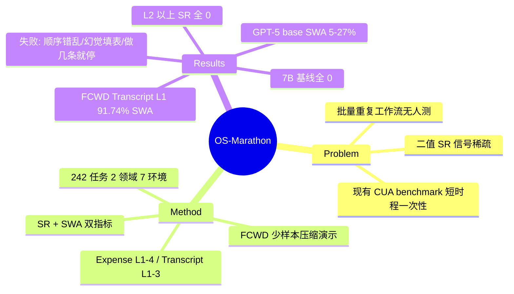

## Summary

OS-Marathon 是一个针对"长时程重复性"办公工作流的 CUA benchmark：242 个任务、2 个领域（Expense Report 报销单处理、Transcript 学分认证），agent 需在 Ubuntu 环境中对 N 条独立数据反复执行同一 sub-workflow。配套提出 Few-shot Condensed Workflow Demonstration（FCWD）——用少样本（n≪N）的关键步骤截图+动作对压缩演示工作流逻辑，把 AgentS2.5+GPT-5 在 Transcript L1 的 Sub-Workflow Accuracy 从 27.08% 拉到 91.74%（SR 0%→50%），但更高难度级别所有 agent SR 仍为 0。

## Problem & Motivation

- 现有 CUA benchmark（OSWorld、WebArena 类）任务短（几十步内）、一次性，测不出真实办公自动化的核心形态：**对一批数据重复执行同一套流程**（处理 30 张报销发票、评估一叠成绩单）。这类任务价值恰恰在"批量"——单条会做不等于批量做完。
- 二值 success rate 在这种任务上信号极稀疏：完成 28/30 条和完成 0 条都是 fail。需要按 sub-workflow 粒度衡量部分进度。
- 作者另一个动机是实用侧的：重复性任务的工作流逻辑是不变的，理论上给一次演示就该学会——但完整演示轨迹太长塞不进 context，需要压缩表示。

## Method

**Benchmark 构造**：
- 2 个领域、7 个执行环境（Ubuntu）：Expense Report（7 类票据：Flight/Hotel/Meals/Car Rental/Taxi/Parking/Fuel，提交到仿真 web 报销系统或 spreadsheet 模板）与 Transcript（14 个国家的学分认证，仿 WES / Scholaro 的 web 计算器）。
- 242 个任务 = 160 真实 + 82 合成（Expense 120+40，Transcript 52+30）。难度分级按数据量与文档复杂度：Expense L1–L4（5–30 张票据，含多页 PDF），Transcript L1–L3（单页到多页文档）。
- 形式化：任务 = 对独立数据集合 M={m₁,…,m_N} 逐条应用同一 sub-workflow 逻辑。

**评测协议**：
- 双指标：**SR**（二值任务成功）+ **SWA**（Sub-Workflow Accuracy = 正确完成的 sub-workflow 数 n/N，即"处理对了几条数据"）。
- Step budget 50/100/150/200，按人类基线校准（人类 150 步内完成 Expense L1–2，100 步内完成 Transcript L1）。
- 判分标签来自源数据 metadata 或 GPT 标注 + 人工校验；主文未写清 checker 是程序化状态比对还是逐字段比较（细节在附录 A.3.1）。

**FCWD（Few-shot Condensed Workflow Demonstration）**：
- 不给完整轨迹（超 context），而是把工作流抽象为 K 个语义关键步骤，按四阶段模板组织：Environment Comprehension → Global Planning → Data Extraction → Navigation & Execution。
- 每个关键步骤是一对（GUI screenshot，高层人类动作描述），只用 n≪N 条数据构造演示，agent 需把逻辑泛化到全部 N 条。
- 演示是 soft suggestion，无任何机制强制 agent 遵循 global plan。

## Key Results

- **基线全军覆没**：OpenCUA-7B、UI-TARS-1.5-7B 在所有设置下 SWA=0%、SR=0%——连一条数据都处理不完。
- **Expense Report（仅评 L1–2）**：AgentS2.5+GPT-5 SWA 仅 0–5%（web）/ 0–12.5%（spreadsheet）；+FCWD 升到 12.5–37.5% / 5–25%；**所有 agent（含 FCWD）SR 全部为 0%**。人类 SWA 30–95%（web）/ 35–97.5%（spreadsheet）。
- **Transcript L1（100 步）**：人类 100% SWA / 100% SR；AgentS2.5+GPT-5 27.08% SWA / 0% SR；+FCWD **91.74% SWA / 50% SR**。
- **Transcript L2（200 步）**：人类 86.1% SWA / 50% SR（人类自己也只有一半成功）；base 23.53% / 0%；+FCWD 42.05% / 0%。
- **三类失败模式**：① Logical incoherence——不理解 sub-workflow 逻辑，执行顺序错乱；② Hallucination——不先提取源数据就直接编造填写系统字段；③ Long-horizon inconsistency——**做完头几条数据后自行终止**，无法把同一流程坚持执行 N 遍。
- **环境脆性差异**：web 表单容错高；spreadsheet 一条命令写错即可"灾难性抹掉相邻单元格"，精度要求高得多。
- L3–4 因算力未评测，作为 stretch goal 保留。

## Strengths & Weaknesses

**亮点**：
- **任务形态选得准**："repetitive batch processing" 是真实办公自动化的主体形态，且天然自带进度刻度——SWA 的分母 N 是数据条数，partial credit 不需要人工设计 checkpoint 权重，比 LH-Terminal-Bench 手工分解 subtask 更干净。
- "做完头几条就停"这一失败模式是新的、具体的证据：错误不只来自单步执行失败，还来自 **agent 无法维持重复执行的意志/状态**——这跟单次任务 benchmark 测出的失败谱系不同。
- FCWD 的压缩演示思路简单实用，91.74% SWA 的提升幅度说明这类任务的瓶颈主要在 workflow 逻辑获取而非低层 grounding。

**局限**（已知事实推出）：
- **评测覆盖窄得离谱**：只有 3 个 agent 配置（两个 7B 开源模型 + AgentS2.5+GPT-5），没有 Claude / Operator / Gemini 等 frontier CUA；两个 7B 基线全 0 分，实际有信息量的对比只有一组。
- **无逐条退化曲线**：论文声称研究 error accumulation，但只报聚合 SWA，没有"第 1 条 vs 第 20 条数据的成功率"分析——重复任务最该出的图恰恰没有。
- **"cost-effective" 无成本数字**：FCWD 的标注成本、推理 token 成本均未量化。
- **SR=50% 暗示评测子集极小**（可能每级只有个位数任务），统计噪声大；242 个任务实际只用了 L1–2 子集。
- 两个领域都是"文档→表单/表格录入"型，结论对其他重复工作流（如批量图像处理、代码迁移）的外推性未知（推测）。

## Mind Map

## Notes

- 与 [[Papers/2607-LongHorizonTerminalBench]] 的对照：LHTB 的 dense reward 靠人工分解 weighted subtasks，OS-Marathon 的 SWA 靠任务天然的数据条数——后者更干净但只适用于重复型任务。两者共同证据：二值判分在 long-horizon 下把整个中间地带压成 0。
- 与 [[Papers/2605-SaaSBench]] 的对照：SaaSBench 测跨应用异质工作流（checkpoint 43.9% vs resolved 3.8%），OS-Marathon 测同质重复工作流；正交切面。
- 对 [[Ideas/MismatchTriage-LongHorizonRecovery-GUI]] 的价值："做完头几条 sub-workflow 就自行终止"是一种未被现有 recovery 文献覆盖的失败形态——它不是 mismatch 后恢复错误，而是**无 mismatch 时的过早放弃**（premature termination），可作为 recovery action space 中"Continue/不干预"操作符重要性的旁证。但本文没有逐条退化曲线，不能直接引用为 error accumulation 的定量证据。
