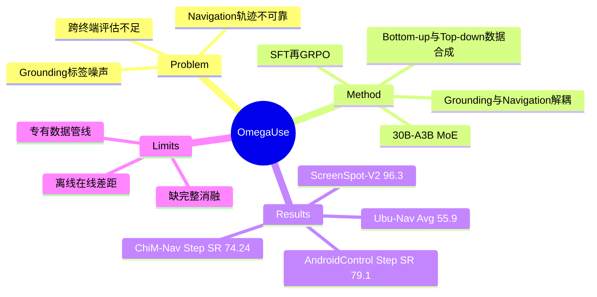

## Summary

OmegaUse 以 30B-A3B MoE 为骨干，把 GUI grounding 与 navigation 解耦为两个专门模型，并用高质量数据筛选、SFT、GRPO 依次建立跨 mobile/desktop 的感知和决策能力。其贡献更像一套完整的训练 recipe：ScreenSpot-V2 达 96.3%，AndroidControl step success 达 79.1%，同时发布覆盖中文 Android 与 Ubuntu 的 OS-Nav 离线 benchmark。

## Problem & Motivation

通用 GUI agent 的瓶颈不只在模型规模。自动从 HTML/A11y tree 提取的 grounding 标签常有渲染偏移，navigation 数据也会包含错误轨迹和冗余动作；直接把这些噪声用于训练会同时损伤空间感知与长时程规划。另一方面，mobile、desktop、web 的 action schema 与应用生态差异大，现有 benchmark 对中文移动应用和日常 Ubuntu workflow 覆盖不足，难以判断所谓“通用”能力是否真正跨终端。

作者因此把问题拆成三个相互约束的部分：如何清洗并扩充高质量 GUI 数据，如何分别优化低层 grounding 与高层 navigation，以及如何用跨操作系统的离线任务检查泛化。这个 framing 很工程化，但直接对应 GUI agent 当前的数据质量与评估覆盖问题。

## Method

OmegaUse 采用两个同源但职责分离的模型：OmegaUse-G 负责把文字指令定位到屏幕坐标，OmegaUse 负责多步规划与动作生成；两者都基于只激活约 3B 参数的 30B-A3B MoE backbone。

**Grounding pipeline** 从 Aguvis、UI RefExp、Widget Captioning、SeeClick、UGround、OS-Atlas 汇总约 1.66M 样本。作者估计近 40% 原始样本存在明显噪声，先规则去重/筛选到 300K，再人工校正偏移框、重写歧义指令并剔除模糊图像，最终保留 111K。训练先用 SFT 学坐标输出格式，再用 GRPO 的 format reward 与 Inside-of-Bounding-Box reward 提升空间精度。

**Navigation pipeline** 统一 click、drag、scroll、type、wait、finish 等共享动作，并加入 desktop hotkey/right-click、mobile back/home 等平台扩展。数据来自三路：(1) 审计开源 trajectory；(2) bottom-up DFS 探索 UI 后构建 state-transition graph，用 MLLM 聚类等价页面、抽取无环路径并生成目标；(3) top-down task taxonomy 生成至少五步的复杂任务，再由 expert model 执行和人类复核。另有跨终端 expert demonstrations，并由两名检查者独立验收。

训练同样分 SFT 与 GRPO。Navigation reward 同时检查输出格式、action type、坐标距离、scroll 方向、typed content token-F1 与 hotkey 精确匹配。OS-Nav 包含 ChiM-Nav（142 trajectories、991 steps、69 个中文 Android apps）和 Ubu-Nav（Ubuntu 日常 workflow），每步 reasoning 与 action 都经过人类修订。

## Key Results

- **Grounding**：OmegaUse-G 在 ScreenSpot-V2 平均 96.3%，高于 UI-Venus-Ground-72B 的 95.3%；但在更难的 ScreenSpot-Pro 仅 55.47%，低于 UI-Venus-Ground-72B 的 61.9% 和 GTA1-72B 的 58.4%。
- **AndroidControl**：Type Accuracy 87.6%、Step Success Rate 79.1%，分别超过 UI-Venus-Navi-72B 的 85.9% / 77.2%。
- **AndroidWorld online**：只用 screenshot、无外部 planner 或 A11y tree 时 success rate 为 55.7%，低于 UI-Venus-Navi-72B 的 65.9%，说明离线 action prediction 优势尚未完全转化为在线 task completion。
- **OS-Nav**：ChiM-Nav Type Accuracy / Step SR 为 87.78% / 74.24%；Ubu-Nav coordinate / non-coordinate / average accuracy 为 57.1% / 48.6% / 55.9%。

这些结果支持“高质量数据 + 分阶段 RL”能提高跨平台 action prediction，但并不能证明 MoE、数据清洗、自动合成和 GRPO 各自贡献多大：论文没有给出把这些组件逐一移除的完整消融。

## Strengths & Weaknesses

**Strengths**

- 从 1.66M 原始 grounding 样本压到 111K，明确把 data quality 置于 data scale 之前；这比只报告更大数据量更有研究价值。
- bottom-up state graph 与 top-down taxonomy 分别覆盖“环境可达路径”和“人类关心的任务”，组合逻辑清楚，并用人工复核控制自动合成噪声。
- 公开报告离线、在线以及自建跨终端 benchmark，ScreenSpot-Pro 和 AndroidWorld 的非最优结果也使能力边界更可见。

**Weaknesses**

- 关键 recipe 缺少系统消融，无法判断收益究竟来自 MoE backbone、111K 人工清洗、额外 demonstration，还是 GRPO。
- OS-Nav 是离线 next-action 评估，无法暴露错误累积、恢复和真实环境 drift；作者自建 benchmark 与训练 taxonomy 也可能共享分布偏置。
- AndroidWorld 55.7% 明显低于最强公开对手，表明高 step accuracy 并不自动等价于强长时程 agent。
- 训练数据大量依赖专有人工平台和 expert model，论文没有完整报告标注成本、合成失败率与计算预算，可复现性有限。

**已知**：OmegaUse 在 ScreenSpot-V2 与 AndroidControl 离线指标领先，并在 OS-Nav 上优于所列 baseline。**推测**：主要增益很可能由强数据筛选和 action-specific reward 共同驱动，而不只是 MoE。**不知道**：相同数据量下 dense backbone 的表现、各数据源的边际贡献，以及 OS-Nav 是否会被相似的合成 taxonomy 高估。

## Mind Map

## Notes

OmegaUse 最值得保留的不是单个 SOTA 数字，而是其数据构建 decomposition：先用 graph exploration 保证 environment coverage，再用 task taxonomy 保证 goal coverage，最后通过 human audit 把两路噪声压下去。对 Agent-Facing Environment 研究，这提供了一个可检验问题：能否让环境直接输出稳定的 state/action identity 与可验证 transition，从而减少昂贵的人工纠偏，而不是继续扩张后处理管线。
