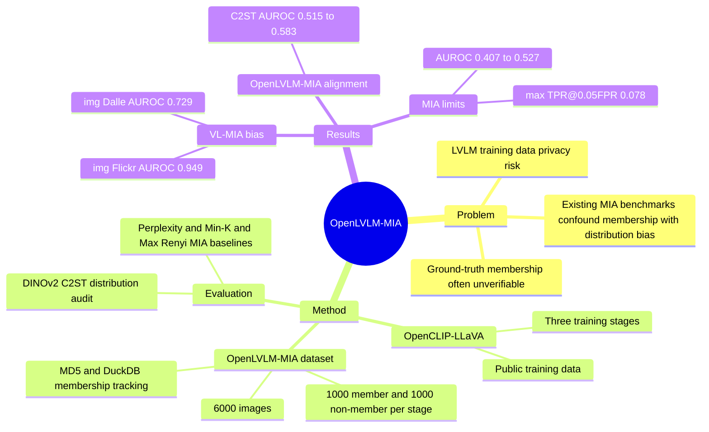

## Summary
OpenLVLM-MIA 提出一个受控的 LVLM membership inference benchmark，核心结论是：许多既有 MIA 高分可能测到的是 member / non-member 数据分布差异，而不是真实 membership signal。作者用公开训练数据构建 OpenCLIP-LLaVA 和 6,000 张三阶段样本，在 distribution-aligned 条件下发现现有 MIA 方法基本退化到 chance-level。

## Problem & Motivation
LVLM 训练依赖大规模 web-crawled image-text 数据，可能混入 medical images、personal photos、copyrighted works 等敏感或受保护图像；但许多模型（论文中特别提到 OpenAI CLIP）不公开训练集细节，因此外部主体无法直接确认自己的图像是否被用过。Membership inference attacks (MIA) 本来是衡量这类隐私风险的重要工具，但现有 LVLM MIA benchmark 存在两个结构性问题：member 和 non-member 往往来自不同时间或不同来源，membership ground truth 又因为私有训练数据无法验证。作者的核心问题是：已有高 attack success rate 到底是在识别模型记忆，还是在识别 dataset construction 引入的 distribution bias？

## Method
作者构建了一个透明 target model：OpenCLIP-LLaVA。它遵循 LLaVA-compatible architecture，使用 OpenCLIP ViT-B/32 作为 vision encoder，Vicuna-7B v1.5 作为 LLM，并只使用公开训练数据，以保证每张图像是否进入训练集可验证。训练阶段分为三段：Vision Encoder Pretraining 使用 LAION-2B-en（约 2.32B image-text pairs），Projector Pretraining 使用 LLaVA-Pretrain（558K image-text pairs），Instruction Tuning 使用 LLaVA-Instruct（665K conversation pairs）。

OpenLVLM-MIA dataset 共 6,000 张图像，每个训练阶段包含 1,000 member 和 1,000 non-member。member 数据从对应训练集抽取，并用 MD5 hashes + DuckDB index 跟踪训练使用情况；non-member 数据强调和 member 同时期、同领域：vision encoder / projector 阶段从 COYO-700M 抽取，instruction tuning 阶段从 LLaVA-Instruct validation split 抽取，并通过 MD5 hash-based deduplication 确认不与训练数据重叠。

评估分两步。Experiment 1 是 distribution audit：用 DINOv2-base 视觉 embedding，不使用语言特征或 LVLM 输出，通过 C2ST（L2-regularized logistic regression, stratified 5-fold cross-validation, out-of-fold predictions）衡量 member / non-member 是否仅凭图像表示就可分，同时报告 AUROC、pAUROC@0.05、TPR@0.05FPR、MMD 和 FID。Experiment 2 是 MIA benchmark：在 gray-box setting 下允许 attacker query model 并访问 output logits / generated text，比较 Perplexity、Min-K% Probability（K=0/10/20）和 Max Rényi（α=0.5/1.0, K=0/10/100），并在四类 logit slices（img、inst、desp、inst+desp）上报告 AUROC 与 TPR@0.05FPR。

## Key Results
**Target model 能力校验。** 在 LVLM benchmarks 上，OpenCLIP-LLaVA 得到 MME Bench 1570.9、MMMU Bench 28.9、MMVet Bench 21.7、LLaVA-Bench 76.1。对比表中 LLaVA v1.5 为 1510.7 / 35.7 / 32.9 / 61.8，MiniGPT-4 v1 为 968.4 / 23.6 / 15.6 / 45.1；因此作者认为该 target model 足以作为 LVLM MIA 研究对象，但它并不是在所有 benchmark 上都优于 LLaVA v1.5。

**Distribution audit 显示 VL-MIA 有强 bias。** 在 VL-MIA 上，仅用 DINOv2 visual embeddings 就能区分 member / non-member：img Flickr 的 C2ST AUROC = 0.949、TPR@0.05FPR = 0.813、MMD = 0.0188、FID = 0.428；img Dalle 的 AUROC = 0.729、TPR@0.05FPR = 0.240、MMD = 0.0061、FID = 0.157。这个结果支持作者的判断：VL-MIA 上的高 MIA 表现可能至少部分来自 temporal/source mismatch 或 DALL-E generated image 与 natural image 的差异。

**OpenLVLM-MIA 的 distribution alignment 明显更好。** 在 OpenLVLM-MIA 上，DINOv2 C2ST AUROC 分别为 Vision Encoder 0.554、Projector 0.583、Instruction Tuning 0.515；TPR@0.05FPR 分别为 0.063、0.095、0.053；MMD 最高只有 0.0022。作者报告 Vision Encoder 和 Projector 阶段差异在 p < 0.05 显著，但 Instruction Tuning 阶段 p > 0.05；这说明 alignment 不是完全无差异，但相比 VL-MIA 已大幅降低。

**现有 MIA 在 OpenLVLM-MIA 上接近随机。** Table 4 中十类 MIA 设置跨三阶段、四类 logit slices 的 AUROC 范围为 0.407-0.527；最佳为 Max Rényi 0% (α=0.5) 在 Instruction Tuning / desp 上的 0.527，最差为 Min-0% 在 Projector / inst 上的 0.407。按训练阶段看，Vision Encoder 为 0.450-0.526，Projector 为 0.407-0.513，Instruction Tuning 为 0.484-0.527。

**低 FPR 下攻击几乎不可用。** Table 5 中 TPR@0.05FPR 的最高值为 0.078（Max Rényi，Vision Encoder / Projector 的 inst slice），意味着在 95% specificity 下仍漏掉 92.2% 的 member samples；Projector 阶段超过一半条件低于 0.04，最低为 0.019（Min-0%, inst+desp）。作者据此说 practical MIA 在该受控 benchmark 中 essentially ineffective。

## Strengths & Weaknesses
**已知 Strengths.** 这篇论文的核心贡献不是一个更强 attack，而是把 evaluation problem 抠清楚：如果 member / non-member 可以只靠 DINOv2 image embedding 区分，那么 MIA score 不能被直接解释为 model memory。这个 framing 对 benchmark 研究很重要，因为它把隐私评估从“attack 数字高不高”前移到“数据构造是否允许公平测 attack”。

**已知 Strengths.** OpenLVLM-MIA 的设计覆盖 LVLM 的三个训练阶段，并且为每个阶段分别提供 member / non-member；这比只看 final model 更能定位 membership signal 可能来自 vision encoder pretraining、projector pretraining 还是 instruction tuning。它还公开 dataset、evaluation tools、trained models 和 code，有利于复现与后续方法比较。

**已知 Weaknesses / Boundaries.** 作者明确承认实验只覆盖 LLaVA-1.5 (7B)，没有评估 13B、70B 或 BLIP-2、Flamingo 等其他 architecture；因此“现有 MIA 接近随机”不能直接推广到所有 LVLM。数据也局限于 large-scale web-crawled images，没有显式包含 medical、passport、commercial photo 等高风险 sensitive domain。

**已知 Weaknesses / Boundaries.** attack setting 是 gray-box，使用 standard prompts，主要基于 output probabilities；white-box attacks、prompt engineering、更复杂的 multimodal probing 都不在范围内。论文也没有研究 continual learning / fine-tuning 后 membership 的变化，或 differential privacy 等 defense 对结果的影响。

**推测.** 对 VLM / GUI-agent 研究的启发是：web-scale 数据带来的隐私或数据溯源评估，必须先做 distribution audit，否则 benchmark 可能奖励的是采样 artifact detector，而不是目标能力本身。这个推测不来自论文实验直接验证，只是由它对 LVLM MIA benchmark 的分析外推到同样依赖 web-crawled visual data 的场景。

**不知道.** 不知道在更大模型、更强 vision encoder、closed-source commercial LVLM、或明确包含敏感领域数据的训练集中，membership signal 是否会更强。不知道若 attack 显式利用 image-text alignment、caption consistency、region-level sensitivity 或 prompt variation，能否突破本文测试的 chance-level 区间。

## Mind Map

## Notes
这篇更像 benchmark critique / methodology paper，而不是 privacy attack paper。最值得保留的 mental model 是：membership inference 的正例和负例必须先证明“除 membership 外尽量不可分”，否则 attack 可能只是一个 dataset shift classifier。

对后续阅读有两个检查点。第一，凡是声称能 audit LVLM / GUI-agent training data 的工作，都应看它是否做了 visual-only C2ST 或类似的 distribution pretest。第二，若未来出现更强 multimodal MIA，需要检查它的增益是否仍在 OpenLVLM-MIA 这类 controlled setting 上成立，而不是只在 source-mismatched benchmark 上成立。
