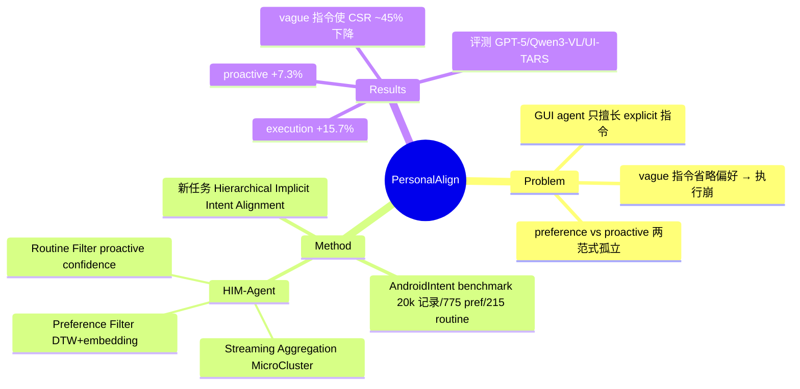

## Summary
PersonalAlign 提出 **Hierarchical Implicit Intent Alignment** 这一新任务：GUI agent 需以 long-term user records 作为持久上下文，既补全 vague 指令中被省略的偏好（preference execution），又基于用户状态预判 routine 主动提供帮助（proactive suggestion）。作者构建 AndroidIntent benchmark（从 20k 长期记录中标注 775 条 user preference 与 215 条 routine），并提出 HIM-Agent（维护持续更新的 personal memory，分层组织 preference 与 routine），报告 execution / proactive 分别提升 15.7% 与 7.3%。

## Problem & Motivation
现有 GUI agent 在 explicit / completion 指令下表现强，但真实部署要求对齐用户更复杂的 **implicit intent**。作者把用户意图分为三个层级：explicit（reactive 执行）、preference（vague 指令下需补全被省略的习惯性偏好）、routine（无指令时基于用户状态主动行动）。以往 preference execution 与 proactive suggestion 是两条**孤立范式**，缺少 daily、user-centric 的个性化研究；同时也缺乏能从长期记录出发、评测"补全模糊指令 + 主动建议"两种能力的 benchmark。这一空白正是本 niche（个性化训练语料 / 长期偏好适配，超越静态 benchmark）的核心。

## Method
- **新任务定义**：Hierarchical Implicit Intent Alignment，把 long-term user records 作为 persistent context，统一 preference execution 与 proactive suggestion 两条范式。
- **AndroidIntent benchmark（数据构建）**：源自 FingerTip20K（据全文抽取为 91 users × 60 days、190 apps）；用 hierarchical filtering-verification pipeline + 人工校验，从 20k 记录中标注 775 preference / 215 routine；vague 指令通过**刻意省略可恢复的偏好**构造；历史记录按 80% 训练(ℋ)/20% 评测(E) 划分。preference 交互覆盖 ~130 apps（entertainment ~33%、shopping ~12%），routine 覆盖 ~60 apps（sign-in ~15% 等）。
- **HIM-Agent（三模块）**：
  1. **Streaming Aggregation Module** — 以 Record Prototype 为记忆单元，用 MicroCluster 流式聚类每日聚合相似记录，得到持续更新的 personal memory。
  2. **Execution-based Preference Filter** — 语义相似（embedding + Jaccard）× 动作轨迹一致性（Dynamic Time Warping）→ 抽取 Preference Intent Memory。
  3. **State-based Routine Filter** — 用 state stability、record frequency、aggregation weight 组合的 proactive confidence 公式 → 抽取 Routine Intent Memory。

## Key Results
> 数字来源：abstract（逐字抓取，高置信）+ arxiv/html 全文页经抓取模型二次抽取（Table 3/5/6，未逐字核验，见 Evidence Ledger）。

- **Vague 指令的破坏性（Table 3）**：省略偏好后 type accuracy ~3% ↓、Step-wise Success Rate (SSR) ~20% ↓、Cumulative Successful Rate (CSR) ~45% ↓，证明模糊指令确实显著损害执行。
- **HIM-Agent 执行（Qwen3-VL 底座，Table 5）**：Type 52.0（+5.4）、SSR 24.0（+3.4）、CSR 42.3（+9.1）。
- **HIM-Agent 主动（GPT-5.1 底座，Table 6）**：semantic alignment 53.5%（vs 49.4%）、judgment alignment 36.3%（vs 32.0%）、F1 79.7%（vs 75.8%）、false-alarm 49.0%（vs 62.0%）。
- **汇总提升（abstract）**：execution +15.7%、proactive +7.3%。
- **评测覆盖**：GPT-5、Qwen3-VL、UI-TARS 等多种 GUI agent。

## Evidence Ledger
| Claim ID | Claim | Type | Source locator | Evidence excerpt | Status |
|:--|:--|:--|:--|:--|:--|
| C1 | 标注 775 preference + 215 routine，来自 20k long-term records | 数据规模 | Abstract | "annotated 775 user-specific preferences and 215 routines from 20k long-term records" | source-verified |
| C2 | HIM-Agent 使 execution / proactive 分别提升 15.7% / 7.3% | 主结果 | Abstract | "improves both execution and proactive performance by 15.7% and 7.3%" | source-verified |
| C3 | 评测覆盖 GPT-5、Qwen3-VL、UI-TARS | benchmark 可比性 | Abstract | "evaluate a range of GUI agents ... including GPT-5, Qwen3-VL, and UI-TARS" | source-verified |
| C4 | 接收于 ACL 2026 Main | venue | arxiv 页 comments | "Accepted to ACL26 Main" | source-verified |
| C5 | 数据源 FingerTip20K，91 users × 60 days，190 apps | 数据来源 | html 全文（抓取抽取） | "91 users across 60 days from FingerTip20K ... 190 apps" | not-checkable |
| C6 | Qwen3-VL 底座 CSR 42.3（+9.1）、SSR 24.0（+3.4）、Type 52.0（+5.4） | 数字 | html 全文 Table 5（抓取抽取） | "CSR: 42.3 (+9.1)" | not-checkable |
| C7 | 主动任务 F1 79.7% vs 75.8%、false-alarm 49.0% vs 62.0% | 数字 | html 全文 Table 6（抓取抽取） | "F1-score: 79.7% (vs 75.8%)" | not-checkable |

## Strengths & Weaknesses
**Strengths**
- 把 personalization 从"在静态 benchmark 上刷分"推进到"**long-term user records 驱动的 implicit intent 对齐**"，并首次把 preference execution 与 proactive suggestion 两条孤立范式统一到同一分层框架下——切中本 niche。
- Benchmark 基于真实 60 天多用户交互记录（FingerTip20K），生态效度高于合成 persona 类数据；memory 分层（preference vs routine）对应两类不同时间尺度的用户特征，设计上自洽。
- 用 DTW 做动作轨迹一致性 + state-based proactive confidence，把"偏好抽取"落到可计算的信号上，而非纯 prompt 工程。

**Weaknesses / 批判**
- **主动打扰代价未充分量化**：HIM-Agent proactive false-alarm 仍达 49%，主动建议在错误时的用户成本（打断、信任损失）没有纳入指标权衡。
- **"long-term" 名不副实**：实际为 60 天窗口，真正的终身偏好漂移（preference drift）与遗忘/更新机制未被评测。
- **规模与分布偏斜**：775+215 条标注、样本集中于 entertainment/shopping，向长尾 app、跨文化用户的泛化存疑。
- **绝对性能仍低**：提升多以相对百分比汇报，但 Qwen3-VL 底座绝对 CSR 仅 42.3，说明任务远未解决；提升幅度受 baseline 选择影响。
- **可复现性**：截至抓取未见公开 code/dataset 链接。

**对领域的意义**：对 CUA survey 的"个性化 / 长期偏好适配"子节，PersonalAlign 是从"benchmark"走向"corpus-driven adaptation + 主动性"的代表节点，可与 vault 内 PSPA-Bench（纯 personalized benchmark, 2603.29318）、MAESTRO（对话式 GUI 适配）形成三点对照。

## Mind Map

## Notes
- 与 vault 对照：`Papers/2603-PSPA-Bench...`（纯 personalized benchmark）、`Papers/2600-MaestroAdaptingGuisGuiding.md`（对话式 GUI 个性化适配）。本篇补上"corpus + 长期记忆 + 主动性"这一维度。
- 未入库的近邻代表作可作后续 digest 候选：Quick on the Uptake（2508.08645，从 human demonstration 抽 implicit intent 的 personalized mobile-use agent）、Mobile GUI Agent Privacy Personalization（2604.11259，隐私向 trajectory-induced preference optimization）。
- 待核验：全文页 Table 5/6 的具体数字由抓取模型二次抽取，入库前建议独立复核原文表格；institute 由作者背景推断（Liqiang Nie / Rui Shao 团队），arxiv 页未逐字给出。
