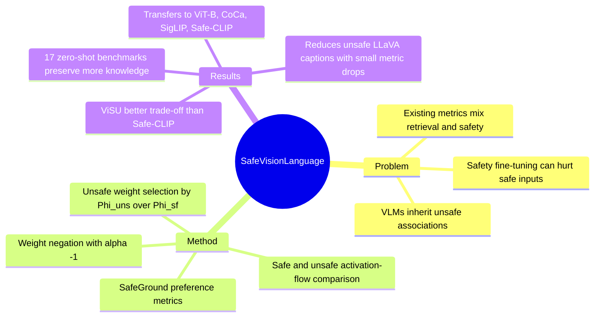

## Summary
这篇论文指出，现有 VLM safety alignment 的评估过度关注 unsafe inputs，可能掩盖模型在 safe inputs 上变得更不安全的问题。作者提出 SafeGround 指标组，并用 training-free 的 Unsafe Weights Manipulation (UWM) 定位并反转与 unsafe content 信息流差异最大的权重，在安全性和 zero-shot 知识保留之间取得比训练式 Safe-CLIP 更平衡的结果。

## Problem & Motivation
大规模 VLM 会从 web-scale 数据中继承 unsafe associations，后续的 image generation、captioning 或 multimodal agent 系统如果继续使用这些 backbone，unsafe signal 仍可能传递到下游。已有 Safe-CLIP 这类方法通过 fine-tuning VLM encoders 来提升 unsafe queries 上的安全性，但论文质疑：这种 training-based safety 是否会忘掉原模型中本来正确且 safe 的表示。

作者认为已有 retrieval-based safety metric 同时混合了 retrieval correctness 和 safety preference。例如模型可能总是更偏好 safe text，但没有检索到成对的正确 safe text，旧指标仍会给 0 分。因此需要把“模型是否偏向 safe alternative”和“是否检索正确实例”拆开评估。

## Method
论文有两个核心组件：SafeGround 评估和 UWM 权重操作。

SafeGround 使用 ViSU 形式的数据元组 `(safe image, unsafe image, safe text, unsafe text)`。它先定义四个 basic preference metrics：`P_ts`、`P_tu`、`P_vs`、`P_vu`，分别衡量给定 safe/unsafe text 或 image query 时模型是否更偏好 safe counterpart。然后组合成五个更粗粒度指标：`Txt_s`、`Img_s` 衡量 modality-specific safety，`PS`、`PU` 分别衡量 safe inputs 和 unsafe inputs 下的 safety，`GS` 是四个 preference 同时成立的 group score。

UWM 不训练模型，而是用 calibration set 比较 safe/unsafe content 通过各 linear layer 时的信息流。具体做法是：先用 saliency score 估计每个权重连接上的 activation-flow，再分别在 safe partition 和 unsafe partition 上计算 `Phi_sf` 与 `Phi_uns`，用二者比值 `Phi_uns / Phi_sf` 衡量权重对 unsafe behavior 的相对影响。对每层累积分数最高的一小部分权重，UWM 用系数 `alpha` 操作其数值；主实验固定 `alpha = -1`、`tau = 0.02`，等价于反转被选中权重的作用，而不是像 pruning 那样置零。

实现上，作者在 ViSU training set 中每个 unsafe concept 随机采样 400 个 tuple 作为 calibration set，并对 image/text encoder 独立执行权重定位，避免跨模态 scoring 干扰。Supplementary 的 layer ablation 显示，最终配置主要操作 text encoder 的 output projection layer 和 image encoder 的 Fc2；text encoder 加入 weight magnitude prior 有帮助，但同样的 prior 用在 vision encoder 会导致严重性能崩溃。

## Key Results
- **ViSU benchmark**：原始 CLIP 的 zero-shot mean accuracy 是 72.7，但 unsafe query safety 很低，`P_tu=5.2`、`P_vu=7.6`、`GS=1.2`。Safe-CLIP 在 unsafe queries 上最强，达到 `P_tu=19.0`、`P_vu=34.1`、`GS=6.4`，但 safe input safety 明显下降，`P_ts` 从 CLIP 的 73.1 降到 50.1，`P_vs` 从 87.4 降到 81.5，`PS` 从 67.5 降到 45.9，同时 zero-shot mean accuracy 降到 54.2。
- **UWM on ViSU**：UWM 将 CLIP 的 unsafe preference safety 提升到 `P_tu=11.7`、`P_vu=20.5`，`Txt_s=19.1`、`Img_s=10.8`、`PU=5.5`、`GS=4.5`；在 safe queries 上，它保持 `P_ts=71.2`、`P_vs=91.4`、`PS=67.8`，其中 `P_vs` 和 `PS` 都高于 Safe-CLIP。代价是 zero-shot mean accuracy 从 CLIP 的 72.7 降到 61.3，但仍高于 Safe-CLIP 的 54.2、G-Unsafe 的 43.3、G-Safe-CLIP 的 56.3。
- **17 个 zero-shot classification benchmark**：UWM 的平均 accuracy 为 61.3，是所有 safety mitigation 方法中最高；Safe-CLIP 为 54.2，G-Safe-CLIP 为 56.3，G-Unsafe 为 43.3，原始 CLIP 作为 knowledge upper bound 为 72.7。
- **Architecture transfer**：UWM 在 CLIP ViT-B16 上将 `P_tu` 从 4.0 提到 8.2、`P_vu` 从 8.3 提到 16.4、`Txt_s` 从 7.3 提到 14.8；在 CoCa 上 `P_vu` 从 8.7 提到 15.5、`GS` 从 1.3 提到 2.2；在 SigLIP 上 `P_tu` 从 3.5 提到 6.7、`Imgs` 从 3.1 提到 6.2、`GS` 从 1.0 提到 1.8。对已经 safety fine-tuned 的 Safe-CLIP，UWM 仍把 `P_vs` 从 81.6 提到 86.8、`P_vu` 从 34.2 提到 42.2、`GS` 从 6.4 提到 7.5。
- **LLaVA-1.5-13B captioning on ViSU unsafe images**：对原始 LLaVA vision encoder 使用 UWM 后，NSFW content 从 31.7 降到 21.9，toxicity 从 16.8 降到 13.4，Rouge-L 从 0.32 小降到 0.31。若先把 LLaVA 的 vision encoder 换成 Safe-CLIP，再加 UWM，NSFW 从 8.0 降到 3.5，toxicity 从 10.0 降到 9.0，Rouge-L 保持 0.32，BLEU 从 0.13 降到 0.12，Meteor 从 0.26 降到 0.24。

## Strengths & Weaknesses
**已知**：SafeGround 的主要价值是把 safety preference 从 retrieval accuracy 中拆出来，因此能发现 Safe-CLIP 在 unsafe inputs 上变安全的同时，在 safe inputs 上反而更不安全。这个 observation 对 VLM safety 很重要，因为很多实际系统的输入大部分是 benign/safe，alignment 不能只看 red-team 场景。

**已知**：UWM 的强项不是在 unsafe queries 上超过 Safe-CLIP，而是在不训练的前提下更少破坏原模型能力。ViSU 上 Safe-CLIP 的 `GS=6.4` 高于 UWM 的 `GS=4.5`，但 Safe-CLIP 的 zero-shot mean accuracy 是 54.2，UWM 是 61.3；这支持作者“trade-off 更好”的 claim，而不是“绝对安全性最强”的 claim。

**已知**：ablation 支持方法的关键设计。只用 `Phi_uns` 可把 `GS` 从 1.2 提到 4.6，但 `Vs-Ts` 从 39.8 降到 24.3；加入 `Phi_uns / Phi_sf` 可把 `GS` 提到 13.0，但 `Vs-Ts` 降到 16.2；再加入 adaptive selection 后，`GS=4.5`、`Vs-Ts=32.0`，牺牲一部分 safety gain 换回 knowledge preservation。`alpha` ablation 也显示，`alpha` 从 -1 接近 1 时 zero-shot 更好但 safety 回落，符合“反转 unsafe weights 会带来能力代价”的机制解释。

**局限**：UWM 仍然会损害原模型能力，且不能完全消除 unsafe behavior。Supplementary failure cases 显示，UWM 和 Safe-CLIP 在若干 unsafe queries 上都会保留 CLIP 的原始 unsafe retrieval；作者将其归因于 CLIP 本身对 unsafe content 的强偏好，例如 failure-case discussion 中给出 text modality 约 93.6%、image modality 约 95.3% 的 residual unsafe tendency。

**局限**：方法主要针对 contrastive-based VLM，作者明确把其他架构留给 future work。LLaVA 实验只是操作其 vision encoder，并不能证明 UWM 已经解决 instruction-following VLM 或 agentic system 的端到端 safety。

**推测**：对 GUI agent / computer-use agent 来说，UWM 更像一个 backbone-level safety patch 或诊断工具，而不是完整 agent safety 方案。它可能帮助降低视觉编码器把 unsafe visual concepts 强绑定到文本 action/description 的风险，但论文没有测试 GUI grounding、tool-use、multi-step action selection 或 adversarial UI 场景。

**不知道**：论文没有回答被反转的 unsafe weights 是否稳定跨数据分布、语言、文化语境或更细粒度 unsafe taxonomy，也没有证明这些权重与可解释的 human concepts 一一对应。因此，把 UWM 当作可解释 model editing 还需要更多证据。

## Mind Map

## Notes
这篇论文最有价值的不是 UWM 本身一定会成为标准 safety method，而是 SafeGround 揭示了一个容易被 benchmark 设计掩盖的问题：alignment 方法可能在 unsafe slice 上更好，却在 safe slice 上更差。后续读 VLM safety 或 agent safety paper 时，需要检查它是否同时报告 benign/safe input behavior、capability retention，以及 safety metric 是否和 task correctness 解耦。
