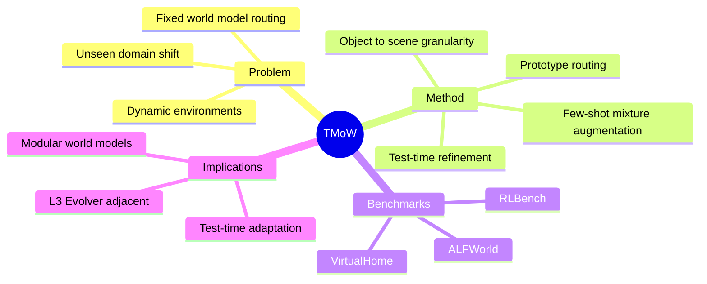

## Summary

> [未获取全文，仅基于 arXiv abstract]

TMoW 将 Mixture-of-Experts 思路迁移到 embodied agents 的 world model 组合：不同于部署后 routing 固定的 MoE，它在 test time 更新 world-model routing function，使 agent 能根据 unseen/evolving domain 重组已有模型，并用 few-shot data 扩展新模型。它在 VirtualHome、ALFWorld、RLBench 上评估 zero-shot adaptation 和 few-shot expansion。

## Problem & Motivation

> [未获取全文，仅基于 arXiv abstract]

LM-based embodied agents 在动态环境中的适应性有限。单一 world model 容易绑定训练域，遇到新的 object、scene 或 task composition 时失效；传统 MoE 虽然模块化知识，但 routing function 预训练后固定，部署时不能灵活适应 domain shift。

TMoW 的核心问题是：能否把 world model 变成可重组、可扩展的 test-time mixture，而不是训练完就固定的 monolith？

## Method

> [未获取全文，仅基于 arXiv abstract]

TMoW 包含三个组件：

1. **Multi-granular prototype-based routing**：根据 object-level 到 scene-level 的相似性，在不同粒度上混合 world models。
2. **Test-time refinement**：推理时将 unseen domain features 与 prototypes 对齐，动态更新 routing。
3. **Distilled mixture-based augmentation**：用 few-shot data 和已有 prototypes 高效构造新 world models。

这条路线与 [[Papers/2604-AgenticWorldModel]] 的 L3 Evolver 方向相关，但 TMoW 更具体：它不是让单个 world model 自我修正，而是通过 mixture routing 和 prototype alignment 适应新域。

## Key Results

> [未获取全文，仅基于 arXiv abstract]

- 在 VirtualHome、ALFWorld、RLBench 上评估。
- 展示 zero-shot adaptation 和 few-shot expansion 场景下的 strong performance。
- 论文已被 ICLR 2026 接收，abstract 未提供具体数值。

## Strengths & Weaknesses

**Strengths**:

- **test-time adaptation framing 有价值**：世界模型不可能一次覆盖所有动态环境，routing 自适应是务实路径。
- **多粒度 routing 合理**：object-level 和 scene-level shift 对 embodied agent 影响不同。
- **适合 agent memory 连接**：prototype 可以和长期环境记忆、skill library、task context 结合。

**Weaknesses**:

- **依赖已有 model pool**：如果所有专家都缺少某类动态，routing 不能凭空生成能力。
- **world model 语义可能偏离真实 transition**：abstract 未说明如何校验 mixture 后的 transition faithfulness。
- **不清楚与 retrieval / memory baseline 的差异**：prototype routing 需要与简单 nearest-neighbor retrieval 做强基线比较。

**Impact**:

TMoW 为 WorldModel-Survey 补充了一个重要方向：不是继续把单个 WM 做大，而是在 test time 用 mixture、prototype 和 few-shot expansion 管理 domain shift。这比纯 video WM scaling 更符合 simple/scalable/generalizable 的 taste。

## Mind Map

## Notes

- 与 [[Papers/2604-AgenticCache]] 的 plan locality 互补：AgenticCache reuse plans，TMoW reuse/recombine world models。
- 可以和 GUI runtime idea 类比：不同 app / website 可能需要 app-specific transition models，test-time mixture routing 也许能用于 UI world model selection。
