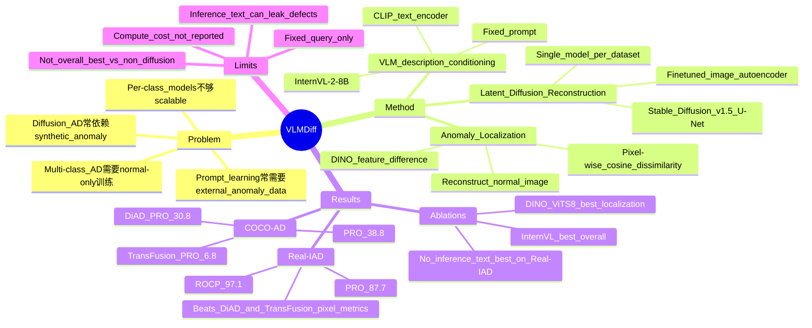

## Summary
VLMDiff 面向 unsupervised multi-class visual anomaly detection，把 VLM 生成的图像描述作为 latent diffusion reconstruction 的 text condition，以单个模型学习多类别 normality。它在 Real-IAD 与 COCO-AD 上明显强于 diffusion-based baselines 的 pixel-level localization，但并未全面超过 embedding / hybrid / reconstruction 类最强方法。对我们而言，这篇的价值主要在于展示 VLM descriptive prior 如何作为弱监督信号改造 reconstruction-based anomaly detection，而不是直接服务 GUI agent。

## Problem & Motivation
Visual anomaly detection 的核心困难是异常样本稀缺且类型多样，真实场景里通常只能可靠收集 normal images。现有 diffusion-based AD 多依赖 synthetic anomaly generation 或 per-class training：前者可能只覆盖特定 defect/domain，后者在大规模多类别数据集上不够 scalable。另一类 VLM/CLIP prompt-learning 方法会学习 normal/anomalous prompts，但通常需要外部 anomalous data，而且 pixel-level defect 很细时，prompt learner 不一定能可靠判断异常是否存在。本文的问题是：能否不用异常标注、不做 per-class model，也不依赖 synthetic defect，而用 VLM 的描述能力给 diffusion reconstruction 提供更强的 normal-image guidance。

## Method
VLMDiff 的训练输入只包含 normal images。每张图同时走两条路径：一条经 image encoder 得到 latent representation `z`；另一条送入 off-the-shelf VLM，用固定 query 生成图像描述，再由 CLIP text encoder 编码成 condition vector `c`。denoising U-Net 在 latent diffusion 过程中接收 `zt`、time step 和 text condition，学习预测噪声；整个模型按 dataset 训练单个 multi-class model，不使用 class labels。

具体实现上，image autoencoder 采用 LDM 的 autoencoder，并在 normal training images 上 finetune；denoising U-Net 初始化自 Stable Diffusion v1.5，并使用类似 ControlNet 的训练方式。VLM 使用 InternVL-2-8B 生成描述；Real-IAD 的训练 query 是 `Describe the main object in detail.`，但 inference 不使用 text condition，因为 defective test images 会让 VLM 直接描述 crack / dent 等异常，从而诱导 diffusion model 重建异常。COCO-AD 的 anomaly 是 unseen object class 而非局部 defect，因此训练和推理都使用 `Describe the visual features of image in detail.`。

推理时，输入图像经 diffusion 重建为 normal-looking image；随后用 self-supervised DINO 提取原图与重建图的 patch features，resize 到输入尺寸后计算 pixel-wise cosine dissimilarity，得到 anomaly map。这里的关键假设是：模型会把 anomalous input reconstruction 拉回 normal manifold，因此 input / reconstruction 的 feature difference 能定位异常区域。

## Key Results
**Real-IAD:** 在 large-scale industrial AD benchmark Real-IAD 上，VLMDiff 达到 **ROCI 78.0 / ROCP 97.1 / PRO 87.7**。相较 diffusion baselines，TransFusion 为 **78.6 / 84.2 / 61.6**，DiAD 为 **75.6 / 88.0 / 58.1**，因此 VLMDiff 的 pixel-level 指标提升很大，尤其 PRO 分别高 **+26.1** 与 **+29.6** points。但与非 diffusion baselines 相比，MambaAD 的 **ROCI 86.3 / ROCP 98.5 / PRO 90.5**、RD++ 的 **83.6 / 97.7 / 90.7** 仍更强，说明 VLMDiff 的主张应限制在 diffusion-based comparison 与 localization 改进上。

**COCO-AD:** 在 real-world COCO-AD 上，VLMDiff 为 **ROCI 59.1 / ROCP 69.0 / PRO 38.8**，高于 DiAD 的 **59.0 / 68.1 / 30.8** 和 TransFusion 的 **58.4 / 57.8 / 6.8**；其中相对 DiAD 的 PRO 提升为 **+8.0** points。整体比较中，CFLOW-AD 的 **PRO 47.7**、RD++ 的 **42.2**、MambaAD 的 **41.6** 仍高于 VLMDiff，因此它不是 COCO-AD 上的 overall best。

**Supplementary MVTec-AD / VISA:** 在 MVTec-AD 100/300 epochs 设置下，VLMDiff 为 **86.9/90.6 ROCI, 94.9/95.9 ROCP, 86.7/89.4 PRO**，pixel-level 指标高于 DiAD 的 **89.3/89.3 ROCP, 63.9/64.4 PRO** 与 TransFusion 的 **80.9/90.6 ROCP, 72.4/83.5 PRO**。在 VISA 上，VLMDiff 为 **79.0/80.9 ROCI, 96.0/97.0 ROCP, 77.0/81.0 PRO**，同样主要体现为 ROCP/PRO 优势，而 ROCI 低于 DiAD 与 TransFusion。

**Ablations:** Real-IAD 上，训练和推理都用 VLM description 的 VLMDiff 为 **72.6 / 95.9 / 84.0**，只在训练用 description、推理不用 text condition 则为 **78.0 / 97.1 / 87.7**，说明 inference-time defect descriptions 会伤害重建。VLM backbone 比较中，InternVL-2-8B 在 Real-IAD 达到 **78.0 / 97.1 / 87.7**，略高于 Blip2 的 **76.8 / 96.6 / 86.3** 和 DeepSeekVL-v3-1.3B 的 **77.2 / 97.0 / 87.5**；作者解释 Blip2 描述较短，尤其不适合 industrial objects。image autoencoder 不 finetune 时 Real-IAD 降到 **77.0 / 95.5 / 83.7**，PRO 少 **4.0** points；feature extractor 中 DINO ViTS/8 达到 **78.0 / 97.1 / 87.7**，而 DINO-v2 ViTS/14 只有 **61.4 / 58.3 / 16.1**，说明大 patch 对小缺陷 localization 很不利。

## Strengths & Weaknesses
**已知 Strengths**
- 方法动机清楚：用 VLM description 替代 synthetic anomaly guidance，同时避免 per-class diffusion model，直接针对 diffusion-based AD 的两个现实瓶颈。
- 设计相对简洁：固定 prompt、off-the-shelf VLM、CLIP text encoder、LDM reconstruction、DINO feature dissimilarity，没有引入需要异常标注的 prompt learning。
- 实验证据覆盖 industrial defect 与 natural-image AD：Real-IAD、COCO-AD 是 main benchmarks，supplementary 还给出 MVTec-AD 与 VISA。
- 论文给出了有信息量的 ablation：inference-time text condition 会在 Real-IAD 上引入 defect leakage；autoencoder finetuning 与 feature extractor patch size 对 pixel localization 很关键；纯 VLM 判别 Real-IAD 平均 **ROCI 54.5**，明显不如 VLMDiff。

**已知 Weaknesses / Caveats**
- VLMDiff 的优势主要是 pixel-level localization 和 diffusion-based baseline comparison；在 Real-IAD 与 COCO-AD 上，若把 embedding / hybrid / reconstruction baselines 一起比较，它不是 overall best。
- Real-IAD 上作者承认 background irregularities 会让 DiAD 和 VLMDiff 把一些正常区域判成异常，因此 image-level ROCI 偏低；VLMDiff 为 **78.0**，低于 MambaAD **86.3**、RD++ **83.6**，也低于 TransFusion **78.6**。
- 推理阶段是否使用 VLM condition 取决于 anomaly definition：局部 defect 场景会被 defect words 污染，unseen-object COCO-AD 又需要文本描述帮助。这说明方法不是一个无条件通用的 VLM-conditioning recipe。
- 固定 query 是作者主动承认的限制；论文没有系统搜索 prompt，也没有给出 dataset-specific query optimization 的结果。

**推测**
- 这篇对 GUI-agent 的间接启发在于：VLM 的语言描述可作为 reconstruction / state modeling 的 conditioning signal，用来学习“正常界面状态”或“任务相关视觉先验”；但论文没有做 GUI 或 agent interaction，不能直接推出对 GUI grounding 有效。
- VLM description 的收益可能来自把 object identity、material、shape 等 high-level semantics 显式注入 diffusion latent，而不是来自 anomaly reasoning 本身；Real-IAD 上纯 VLM anomaly 判断 ROCI 只有 **54.5** 支持这一点。

**不知道**
- 论文未报告训练/推理 latency、显存成本或 VLM caption 生成成本，因此不知道单模型 multi-class 的工程收益是否抵消了 VLM + diffusion pipeline 的开销。
- 不知道 prompt optimization、smaller VLM、或不同 text encoder 会如何影响结果；文中只比较了 InternVL-2、Blip2、DeepSeekVL-v3-1.3B 以及 COCO-AD 的 GT caption。
- 不知道在更接近 GUI 的异常定义下，例如 semantic UI inconsistency、layout drift、interactive state mismatch，这种 reconstruction-based anomaly map 是否仍然有效。

## Mind Map

## Notes
- 这篇可以放在“VLM as semantic conditioner for visual reconstruction”脉络，而不是 VLM reasoning 论文：VLM 没有直接做异常推理，主要提供 normal-image description。
- 对 GUI 方向的可迁移问题是：如果把 normal UI state reconstruction 当作 screen anomaly / inconsistency detection，text condition 应该来自页面 caption、task intent，还是 UI tree semantic summary？
- 需要避免过度引用它作为“VLM anomaly detection SOTA”：论文自己的表格显示它主要推进 diffusion-based methods 的 pixel-level metrics，overall comparison 仍有更强非 diffusion baselines。
