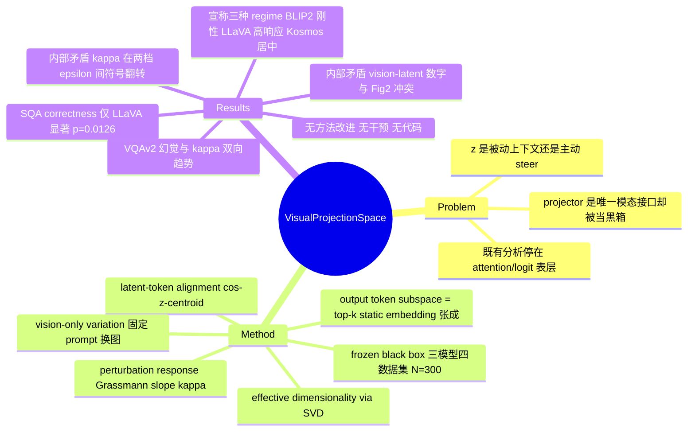

## Summary

这篇论文把 MLLM 的 projection 输出 `z = P(f_x)` 当作几何对象来探针：用 SVD 测 effective dimensionality、用 `cos(z, top-k token embedding 质心)` 测 latent–token alignment、用正交扰动后 output token subspace 的 Grassmann 距离斜率 `κ_t` 测 perturbation sensitivity，在 BLIP-2 / LLaVA / Kosmos-2 三个 frozen 模型上宣称存在三种 operating regime（BLIP-2 刚性低秩、LLaVA 高维高响应、Kosmos-2 居中），并把这些几何量与 SQA correctness、VQAv2 hallucination 等级做分组 t 检验。论文只做诊断、不做方法改进，而"几何 → 下游行为"这一步完全是观察性相关；更关键的是核心证据链存在多处内部矛盾——正文引以为据的 vision-latent 维度数字与它所引用的 Figure 2 直接冲突，perturbation sensitivity 结论在两档扰动幅度之间符号翻转。

## Problem & Motivation

主流 MLLM 的跨模态接口极简：frozen vision encoder 产生 `f_x`，一个轻量 projection module 把它映到 language embedding 空间得到 `z`，作为 pseudo-token 前置到 text prompt。作者的出发点是，这个模块虽然是"most MLLMs 里唯一的模态接口"，却长期被当黑箱对待——已有 interpretability 工作大多看 attention map 或 logit pattern，属于 surface-level 读数（模型看哪里、概率如何转移），很少把 token embedding space 本身当作有结构的几何对象来分析。

由此提出的问题是：`z` 究竟只是被动地给上下文打标签，还是主动 steer 生成——通过重塑每一步 decoding 时"可达"的 token embedding 区域？这个 problem formulation 本身是站得住的：projector 确实是 MLLM 里研究得最少的组件，而"表征可解码 ≠ 表征被使用"的问题在 VLM 领域已被反复触及（见 [[2607-VisualAccessBoundary]]）。问题在于论文给出的答案能承载多少重量。

## Method

框架把 MLLM 当 frozen black box，不做任何 fine-tune，只在 inference 时探针。四个核心构件：

**Output token subspace**。在 decoding step `t` 取 softmax 概率最高的 top-k 个 token，用它们的 **static** embedding `w_i` 张成子空间 `Y_t = span{w_i | i ∈ TopK_t}`。注意这里用的是 static input embedding 而非任何一层的 contextual hidden state——这既回避了"选哪一层"的问题，也让"模型下一步会用的词的方向"这个解释变成一个近似。

**Effective dimensionality**。把 latents 堆成矩阵做 SVD，报累计解释方差比；低 intrinsic rank 被解释为 projection 把图像压进一个窄 cone。

**Latent–Output Alignment**。`α_t = cos(z, μ(Y_t))`，`μ` 为 top-k（k = 10）token embedding 的均值。`α_t` 高被解释为 `z` 已经指向模型下一步最可能用的词。

**Perturbation Response**。注入正交扰动 `z' = z + ε·u`（`‖u‖ = 1`, `u ⊥ z`），测 `Δ_t(ε) = d_Gr(Y_t(z), Y_t(z'))`，对 `ε` 线性回归得斜率 `κ_t = ∂Δ_t/∂ε`，每个 `ε` 上对 `u` 平均 128 次随机抽样。`κ_t` 被称作 "steering sensitivity"。

此外还有一个 vision-only variation 实验：固定 prompt、只换图像，测不同图像诱导的 `Y_t` 两两 Grassmann 距离均值，衡量视觉差异是否真的传到 decoding space。

值得记一笔的是，作者自己在 3.4 节末尾的 "Interpretive linkage" 段落里把这些量明确降级为 "empirical indicators of directional control, rather than strict consequences of latent rank"——即他们知道低秩与方向控制之间不是蕴含关系。

**Setup 的边界**：三个 frozen 模型（BLIP-2、LLaVA、Kosmos-2，各一个 checkpoint）、四个数据集（MS-COCO、Flickr30k、VQAv2、SQA，N = 300），固定 prompt "Describe this image."，inference float16、分析 float32。论文没有给出任何 checkpoint 版本、LLM backbone 或 vision encoder（全文只有 BLIP-2 的 `d = 2560` 一个线索），也没有代码。因此"三种 projector 家族"的覆盖是 Q-Former / linear-MLP / resampler 各一个点，vision encoder 侧零变化——所有结论都条件在这三个未标识的具体 checkpoint 上。

## Key Results

**三种 operating regime**（论文主结论）。按 Table 1 的 output token subspace top-1 SVD 解释方差（%，COCO / Flickr / VQAv2 / SQA）：LLaVA 6.29 / 6.39 / 6.58 / 16.81，BLIP-2 18.66 / 35.07 / 19.06 / 26.56，Kosmos-2 16.61 / 15.75 / 16.76 / 19.71。论文 4.3.2 节称 latent–token alignment `α_t` 上 BLIP-2 众数约 0.68、LLaVA 与 Kosmos-2 分布宽且中心在 0.15–0.20 附近。

**Perturbation sensitivity**（Table 2，`ε ∈ {0.1, 0.2, 0.3}`）：LLaVA `κ_t` = 1.1895 / 2.0704 / 0.8563 / 0.7547，BLIP-2 = 0.0091 / −0.0038 / 0.0211 / −0.0397，Kosmos-2 = 0.9643 / 0.9151 / 0.9324 / 0.9272。作者据此宣称 LLaVA "strongly vision-driven"、BLIP-2 "locked"。

**几何与下游行为的关联**。SQA 按 correct / incorrect 分组，`κ_t` 只有 LLaVA 出现显著分离（0.059 vs −0.036，p = 0.0126）；BLIP-2 p = 0.983、Kosmos-2 p = 0.9801，两个模型完全没有分离。VQAv2 按自动判定的 hallucination 等级分组：BLIP-2 `κ_t` 从 0.0067（Hallu0）降到 −0.053（Hallu2）、Kosmos-2 从 0.0051 降到 −0.0498，而 LLaVA 反向升到 0.2612（Hallu2）。作者由此提出"欠敏感 → grounding 减弱、过敏感 → 放大幻觉"的双向解释——注意这个双向解释对每个方向各只有不到两个模型的支撑。

**Vision-only variation**（仅 COCO / Flickr）。LLaVA 的图像间 Grassmann 距离 2.34 ± 0.57 与 1.86 ± 0.68，高于 BLIP-2（1.41 ± 0.44 / 1.26 ± 0.46）与 Kosmos-2（1.37 ± 0.39 / 1.33 ± 0.35）。

**然后是自相矛盾的部分**。4.5.2 节用另一档 `ε` 重做同一个扰动实验，结论直接反过来：包括 LLaVA 在内，所有模型的 `κ_t` 分布都 "centered around zero"（LLaVA COCO −0.0183 ± 0.3290、Flickr 0.0765 ± 0.5425），作者自述 "small perturbations in z generally do not lead to large deviations in the decoding subspace"。LLaVA 在 COCO 上的 `κ_t` 于是同时是 1.1895 和 −0.0183——差 65 倍且符号相反。斜率本应对扰动尺度基本不变，论文既未察觉也未调和这一点。

**并且，被论文当作 regime 划分基础的 vision-latent 维度数字与它自己的图冲突**。4.3.1 节写 BLIP-2 首个主成分在 COCO 上解释 67.9%、Flickr 68.8%，但它引用的 Figure 2 上 BLIP-2 的 PC1 累计方差约为 0.24（COCO）与 0.445（Flickr）；67.9% / 68.8% 在全文其他任何地方都不出现。同一段接着说"VQAv2 (19.1%) 和 SQA (26.6%) 也类似地高"，这六个数字（19.1 / 26.6 / 6.6 / 16.8 / 16.8 / 19.7）逐一对应 Table 1 的 output-token-subspace 条目四舍五入，而 Table 1 量的是另一个东西。换言之，"BLIP-2 的 vision latent 低维"这条 regime 轴，唯一的数值支撑与图矛盾；"LLaVA 高维"则实际上建立在 Table 1（output subspace）而非 vision latent 上。

## Evidence Ledger

| Claim ID | Claim | Type | Source locator | Evidence excerpt | Status |
|:--|:--|:--|:--|:--|:--|
| C1 | 三个 frozen MLLM（BLIP-2 / LLaVA / Kosmos-2）× 四数据集，N = 300，固定 prompt "Describe this image."，inference float16、分析 float32 | benchmark-setting | p.4 col.2, Sec 4.2 | "Inference runs in float16, while analyses ... use float32. All experiments use the fixed prompt" | source-verified（论文未说明 N=300 是每数据集还是总计） |
| C2 | BLIP-2 vision latent 首个 PC 在 COCO 解释 67.9%、Flickr 68.8% | number | p.5 col.1, Sec 4.3.1 vs Fig. 2 | "the first principal component alone explains 67.9% on COCO and 68.8% on Flickr" | **contradicted**：Fig. 2 中 BLIP-2 PC1 约 0.24 / 0.445；该数字全文无第二处出处，不得引用 |
| C3 | Table 1 output token subspace top-1 SVD 解释方差十二个数值 | number | p.6 col.1, Table 1 | "Table 1. Top-1 SVD (%) explained variance of output token subspace trajectories" | source-verified |
| C4 | 4.3.1 节归给 Fig. 2 的 VQAv2/SQA 六个数字实为 Table 1 的 output-subspace 条目 | number | Sec 4.3.1 p.5；Table 1 p.6；Fig. 2 p.5 | "with similarly high values on VQAv2 (19.1%) and SQA (26.6%)" | source-verified（确认为串表，非巧合；Fig. 2 对应格子为 0.14–0.36） |
| C5 | Table 2 十二个 `κ_t`（LLaVA 0.7547–2.0704 / BLIP-2 −0.0397–0.0211 / Kosmos-2 0.9151–0.9643），`ε ∈ {0.1,0.2,0.3}` | number | p.6 col.1, Table 2 | "for perturbation magnitudes ϵ ∈ {0.1, 0.2, 0.3}. The final column reports the slope" | source-verified（但 Kosmos-2 VQAv2 行与自身数据不自洽，见 C21） |
| C6 | 4.5.2 节报告所有模型（含 LLaVA）`κ_t` 分布中心在零，与 Table 2 冲突 | number | p.7, Sec 4.5.2 | "the distributions were centered around zero ... small perturbations ... do not lead to large deviations" | source-verified（六个 mean±std 逐一对上；论文从未调和该冲突） |
| C7 | SQA 上 `κ_t` 仅 LLaVA 显著分离（p = 0.0126），BLIP-2 p = 0.983、Kosmos-2 p = 0.9801 | comparison | p.7 col.1, Table 4 | "BLIP-2 and Kosmos-2 showed no such separation" | source-verified（Table 3 就 `Δ_t` 却称"all models show significant differences"） |
| C8 | VQAv2 hallucination 分级 `κ_t`：LLaVA 0.0414/0.0525/0.2612，BLIP-2 0.0067/0.0184/−0.053，Kosmos-2 0.0051/−0.0682/−0.0498 | number | p.7 col.1, Table 4 | "VQAv2 LLaVA 0.0414 0.0525 0.2612 ... BLIP-2 0.0067 0.0184 -0.053" | source-verified |
| C9 | 组间差远小于组内 std 却报极显著：BLIP-2 VQAv2 Hallu0 1.9608 ± 0.1579 vs Hallu2 1.9532 ± 0.1554，t = 10.213，p = 0.0000 | number | p.6 col.1, Table 3 | "BLIP-2 Hallu0 vs Hallu2 1.9608 ± 0.1579 1.9532 ± 0.1554 10.213 0.0000" | source-verified（全文无 effect size、无样本量、无多重比较校正） |
| C10 | vision-only variation：LLaVA 2.34 ± 0.57 / 1.86 ± 0.68 高于 BLIP-2 与 Kosmos-2 | number | p.7 col.1, Sec 4.5.1 | "a mean Grassmann distance of 2.34 ± 0.57 on COCO and 1.86 ± 0.68 on Flickr" | source-verified（仅 COCO/Flickr，无 VQAv2/SQA） |
| C11 | 论文不提出任何 projector 改动、训练目标或修复，也无任何 benchmark 增益实验 | sota-novelty | 全文；Sec 1 / 5 / 6 | "This setup allows direct comparison ... without fine-tuning" | source-verified（Discussion 里的"actionable guidance"无任何实验支撑） |
| C12 | 干预只存在于"扰动 z → output subspace 几何"；"几何 → correctness/hallucination"仅 t 检验，无干预 | causal-mechanism | Sec 3.3 p.3；Tables 3–4 p.6–7 | "To test causal influence, we inject a small orthogonal perturbation" | source-verified（下游关联全部基于既有标签的分组比较） |
| C13 | 作者主动降级 Fig. 5 的 3D 形状为 "illustrative hypotheses"、"speculative"，并把 `κ_t` 称为 empirical indicator | causal-mechanism | Sec 5 p.8；Sec 3.4 末段 p.4 | "not definitive geometries but illustrative hypotheses ... these shapes are speculative" | source-verified |
| C14 | 数据集 "SQA" 引用 [36]，而 [36] 是 RecipeQA (EMNLP 2018)；全文从未展开 SQA 缩写 | benchmark-setting | Sec 4.2 p.4；References [36] | "Semih Yagcioglu ... RecipeQA: A challenge dataset for multimodal comprehension of cooking recipes" | source-verified（且 4.2 称 SQA "constrained answer spaces"、4.5.2 称其 "open-ended questions"，自相矛盾） |
| C15 | 打分规则给了（exact match），但答案的 elicitation 协议没给：4.2 称所有实验用固定 caption prompt | benchmark-setting | Sec 4.2 p.4；Sec 4.5.1 p.7 | "responses are grouped only by correctness (exact match vs. otherwise)" | source-verified（论文从未说明是否把 SQA/VQAv2 的问题喂给模型，correctness 不可复现） |
| C16 | 无 checkpoint 版本、无 LLM backbone、无 vision encoder（仅 BLIP-2 `d = 2560`）、无代码 | license-code | Sec 4.2 p.4；全文 | "We evaluate frozen MLLMs—BLIP-2 [18], LLaVA [21], and Kosmos-2 [26]" | source-verified（全文文本层对 github / checkpoint / vit / clip / 7b 等零命中） |
| C17 | `ε` 取值三处互不相同：3.4 节 `{0.01,0.05,0.10}·‖z‖`、回归句 `{0.1,0.2,0.3}`、4.2 节 `{0.01,0.03,0.05}` | benchmark-setting | Sec 3.4 p.3–4；Sec 4.2 p.5 | "ϵ ∈ {0.01, 0.03, 0.05} (and {0.1, 0.2, 0.3} for BLIP-2, d = 2560)" | source-verified（且只有 3.4 节的 `ε` 是相对量） |
| C18 | 参考文献 [33] 为未填的 BibTeX 占位符且被正文引用；Kosmos-2 重复列为 [26]/[27]、LLaVA 重复列为 [20]/[21]，作者列表均不实 | license-code | References p.9 | "Firstname Wang, Anothername Coauthor, and . . . . Alignscore: [insert part of the title here]" | source-verified |
| C19 | VQAv2 幻觉等级由 "MiniGPT-based evaluation" 自动判定为 Hallu0/1/2 | benchmark-setting | Sec 4.2 p.5 | "hallucination is measured by MiniGPT-based evaluation with three levels: Hallu0 (none), Hallu1 ..." | source-verified（judge 无引用、无 prompt/rubric、无人工一致性验证、无各级样本数） |
| C20 | probe 元参数（k = 10 / top-k = 100 / rank-r = 10 / 128-D PCA / ℓ2 归一化 / static embedding）无任何敏感性分析，无多 seed | number | Sec 3.3 p.3；Sec 4.2 p.4–5 | "Grassmann distance between rank-r = 10 token subspaces derived from the top-k = 100 tokens" | source-verified（全文无 "ablation" / "seed" / "robustness"；唯一平均是对 128 次 `u` 抽样） |
| C21 | Table 2 的 Kosmos-2 (VQAv2) 行与自身三个 `Δ_t` 均值不自洽：由 (0.1, 0.0982)、(0.2, 0.2581)、(0.3, 0.7993) 最小二乘拟合得斜率 3.506，表中印 0.9324 | number | p.6 col.1, Table 2 | "Kosmos-2 (VQAv2) 0.0982 ± 0.3704 0.2581 ± 0.5673 0.7993 ± 0.5679 0.9324" | source-verified（其余十一行拟合误差均在 ±0.0003 内，仅此行不成立） |
| C22 | latent–token alignment 分布：BLIP-2 众数约 0.68，LLaVA / Kosmos-2 中心在 0.15–0.20 | number | Sec 4.3.2 p.5；Fig. 3 | "BLIP-2 maintains high alignment (modes around 0.68 across all datasets)" | not-checkable（数值为直方图上的众数读数，本轮未独立复核；论文未给表格值） |

## Strengths & Weaknesses

**值得肯定的部分**。问题选得对：projector 确实是 MLLM 里最少被当作研究对象的组件，把它的输出当几何对象、而不是又画一张 attention map，是有价值的视角切换；用 Grassmann 距离度量 output token subspace 的旋转，比 logit 差分更能刻画"方向性"这个直觉。跨 projector 家族的横向对比（Q-Former / linear-MLP / resampler）也比大量只跑一个 LLaVA 变体的分析论文走得远一点。作者还在若干处主动给自己的解释降级——Fig. 5 的三个 3D 形状自称 "illustrative hypotheses" 与 "speculative"，3.4 节末尾把 `κ_t` 称作 empirical indicator 而非 latent rank 的严格后果——这种自觉在 interpretability 论文里不算常见。

**但作为证据，这篇论文撑不住它的标题。** 问题按严重程度排：

*核心数字与自身图表冲突。* "BLIP-2 vision latent 低维"这条 regime 轴唯一的数值支撑是 67.9% / 68.8%，而它引用的 Figure 2 显示的是约 0.24 / 0.445（C2）；同一段落随后又把 Table 1 的 output-subspace 数字当成 Figure 2 的 vision-latent 数字来叙述（C4）。这意味着 abstract 里"BLIP-2 rigid low-rank / LLaVA flexible high-dimensional"的对比，在 vision latent 这一侧实际上没有可用证据。

*主结论对超参数敏感且符号翻转。* Table 2 说 LLaVA `κ_t` 在 COCO 上是 1.1895，4.5.2 节说是 −0.0183 ± 0.3290，二者差 65 倍且符号相反（C5/C6）。斜率本应对扰动尺度近似不变，出现这种翻转要么说明 `Δ_t(ε)` 在小 `ε` 下淹没在噪声里、要么说明大 `ε` 已经跑出线性区——无论哪种，"LLaVA 高度 vision-driven"都不是一个稳健的签名。论文对此毫无觉察。

*统计显著性与效应量脱节。* Table 3 里 BLIP-2 VQAv2 的 Hallu0（1.9608 ± 0.1579）与 Hallu2（1.9532 ± 0.1554）相差 0.0076，不到组内标准差的 5%，却报出 t = 10.213、p = 0.0000（C9）。全表没有 effect size、没有样本量、没有多重比较校正，也没有任何多 seed 的 run-to-run variance（C20）。Table 2 里 LLaVA COCO 的 `Δ_t = 0.2443 ± 0.3769` 更是标准差大于均值。Table 2 的 Kosmos-2 (VQAv2) 一行甚至与自身三个数据点拟合不出所印的斜率（C21）。

*"几何解释行为"这一步没有干预。* 扰动实验确实是 intervention，但它只证明"改 `z` 会改 output token subspace 的几何"——对一个把 `z` 前置进序列的模型来说这几乎恒真。真正要撑起 abstract 里 "reduced or excessive sensitivity predicts unreliable grounding" 的，是"改几何 → 改幻觉率"，而这一步只有基于既有标签的分组 t 检验（C12）。而且这个双向解释里，"欠敏感 → grounding 弱"由 BLIP-2 与 Kosmos-2 支撑，"过敏感 → 放大幻觉"只有 LLaVA 一个点；SQA 上 BLIP-2 与 Kosmos-2 的 p 值分别是 0.983 和 0.9801，即三分之二的模型上关联根本不存在（C7）。对照 [[2607-VisualAccessBoundary]] 用 attention hard-masking 做 causal sweep 建立 necessity，这里的证据等级明显低一档。

*实验身份不清。* 模型侧没有 checkpoint、backbone、encoder（C16）；数据集侧 "SQA" 引用的是 RecipeQA，全文从未展开缩写，而且 4.2 节称其"constrained answer spaces"、4.5.2 节称其"open-ended questions"（C14）。更要命的是 4.2 节说所有实验都用固定 prompt "Describe this image."，那 SQA 的 exact-match correctness 是怎么产生的、VQAv2 的答案从哪来，全文没有交代（C15）；幻觉标签依赖一个未引用、未给 rubric、未做人工一致性验证的自动 judge（C19）。

*probe 的元参数一个都没做敏感性分析。* k、rank-r、128-D PCA、ℓ2 归一化、以及用 static input embedding 而非 contextual hidden state 来代表"下一步会用的词的方向"——每一个都会实质影响 anisotropy 与子空间距离的读数，论文既没做 ablation 也没给出选择理由（C20）。这正是这类几何 probe 最容易被质疑的地方。

*工程与文献质量。* 无代码、无 artifact。参考文献最新只到 2024 年初，未讨论最贴近的先行工作——Verma et al. (ACL 2024, arXiv:2402.16832) 恰恰论证 cross-modal projection 并不真的把视觉属性投到文本空间，Yu & Ananiadou (arXiv:2411.10950) 做 LLaVA 的机制可解释性，Venhoff et al. (arXiv:2506.11976) 研究视觉表征到语言特征空间的映射。参考文献 [33] 是一条未填的 BibTeX 占位符且被正文引用，Kosmos-2 与 LLaVA 各被重复列出两次且作者列表均与真实论文不符（C18）；Related Work 有一整段近乎逐字重复，Sec 5 开头有一句语法破碎的句子。这些不改变论文的科学内容，但足以说明这篇稿子没有经过认真的自审。

**对领域的影响**。视角提示是有的，证据不是。真要立住，最小的补实验很清楚：直接沿几何量的方向干预 `z`（强行抬高/压低 `α_t`，或人为压缩 effective rank），观察幻觉率与 correctness 是否随之变化——把观察变成干预。在此之前，"geometry as a diagnostic lens" 只是一个尚未被检验的提法。

## Mind Map

## Notes

- 这篇的主要价值可能在反例：它完整演示了 interpretability 论文最常见的滑坡——测到几个几何量、测到下游指标、跑 t 检验，就写成 "geometry predicts unreliable grounding"。可以和 [[2607-VisualAccessBoundary]] 并列作为"观察 vs 干预"的对照样本；后者用 hard-masking 建立 necessity，前者只有相关。
- 一个可能真有内容的残留观察（**推测，论文未做此区分**）：BLIP-2 的 `Δ_t` 绝对值（约 1.8–2.4）远大于 LLaVA（约 0.24），但斜率近零。这更像是 Q-Former 输出已经把 output subspace 推到某个饱和区，而不是论文所说的"locked / 不敏感"。饱和与不敏感是两回事，前者甚至可能意味着 BLIP-2 的 `z` 影响更大而非更小。这一点值得单独查。
- 待查：如果 SQA 真的全程用 caption prompt，那 correctness 的分组可能来自数据集自带标签而非模型输出，那么 4.4 节整节的解读都要重写。这是论文里最应该优先澄清的一处。
- 元数据：未检索到对应的 arXiv preprint（arXiv API 按标题短语与作者两路查询、WebSearch 定向查询、Crossref 全库均无命中；只找到 WACV 2026 的 poster 页 https://wacv.thecvf.com/virtual/2026/poster/559）。Crossref 记录 issued 日期为 2026-03-06，pp. 6049–6058；本笔记按 vault 中 WACV 2026 的既有惯例用 `2601-` 前缀与 `date_publish: 2026`。
- 与 [[2606-RethinkingTokenReduction]] 的连接点很弱但存在：两者都关心 visual token 在 LLM 侧到底被怎么用，只是后者从 pruning 的实用角度切入并给出可测的 accuracy-efficiency trade-off，前者停在描述性几何量上——对比之下更能看出"可操作的诊断"和"只是一个读数"的差别。
