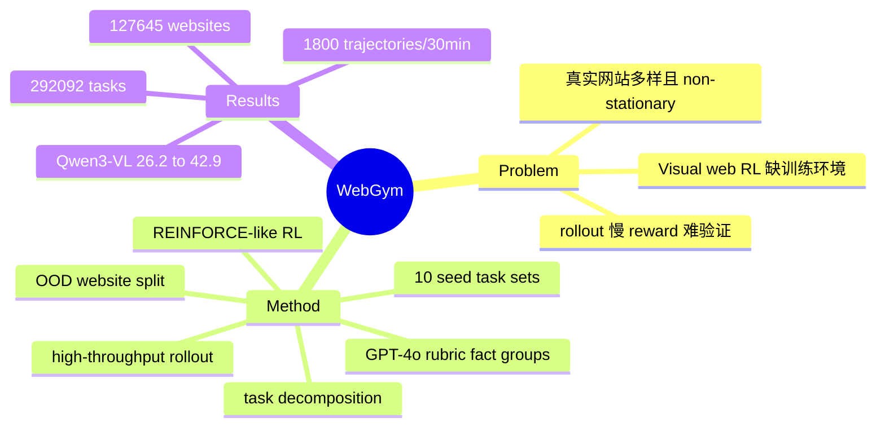

## Summary

WebGym 提出大规模 visual web agent 训练环境：近 300K 个真实网站任务 + rubric-based evaluator + 高吞吐 rollout system，用简单 online RL 将 Qwen3-VL-8B-Instruct 在 OOD test split 上从 26.2% 提升到 42.9%。它的核心价值不是新模型，而是证明 web agent 能通过任务集 breadth/depth/size 和 rollout throughput scaling 获得稳定泛化增益。

## Problem & Motivation

Visual web agent 的训练瓶颈不只是模型能力，而是缺少足够大、足够多样、带可用 reward 的训练环境。真实网站 non-stationary 且多样，现有 benchmark 往往要么是小规模人工评测集，要么是短 horizon / 低难度任务，无法支撑 robust policy learning。相比文本任务，visual web rollout 慢、截图处理重、reward 难验证，因此 online RL 很难 scale。

作者的核心 framing 是：web agent 要像人一样基于 screenshot 与 rendered interface 行动，因此训练环境需要覆盖真实网页的视觉 affordance 和长尾任务，而不仅是 accessibility tree 或离线 HTML replay。

## Method

WebGym 包含两个主要贡献：大规模任务集构建，以及专门面向 visual web agent 的高吞吐 rollout system。

### 任务集构建

WebGym 从 10 个已有 web agent benchmark / training set 聚合 seed tasks，包括 InSTA-v3、PAE-WebVoyager、AgentSynth-Web、BrowseComp、TravelPlanner、Mind2Web-Live、Online Mind2Web、DeepShop、Mind2Web-2、GAIA-Web 等。作者没有直接用现成 benchmark split，而是重新做 task / website-level split，避免不同 benchmark 之间 website、domain、task pattern 泄漏。

每个 task 被 GPT-4o 标注为结构化 evaluator rubric，rubric 由若干 **fact groups** 组成；task difficulty 定义为 rubric 中 facts 总数。若原任务包含足够复杂的 fact groups，系统会通过选择 fact group 子集自动分解出较低难度的新任务，从而同时扩展 breadth 和 depth。最终 WebGym 包含 **127,645 websites / 292,092 tasks**，并显式覆盖不同 difficulty。

### Evaluator / Reward

每条 trajectory 使用 rubric-based evaluation 而不是只看 task description。评估时先选取 evidence-bearing screenshots / keypoints，过滤 detours、ads 等无关页面，再按 rubric 逐项检查。只有满足所有 criteria 才给 binary reward。这种设计减少了模糊任务描述导致的 false positive，也给 RL 提供跨 domain 一致的奖励信号。

这里的 reward 仍然主要是 LLM/rubric judge，而不是 MobileGym 那种程序化 state verifier。这是它和 MobileGym 最大的范式差异。

### Rollout System

WebGym 的系统侧目标是提高 visual rollout throughput。论文报告其异步 rollout system 可在 **128 CPUs + 24 H100** 下 30 分钟收集 **1,800 trajectories**，平均 trajectory 长度 13.2 steps，相比传统 synchronous rollout 有 **4-5x speedup**。

训练采用 Qwen3-VL-8B-Instruct / Thinking 作为 base，action 形式支持 coordinate-only 和 set-of-marks，使用 REINFORCE-like online RL。超参包括 temperature 1.0、top-p 0.99、top-k 2、lr 1e-5/5e-6/1e-6、cutoff length 4096/8192/16384 等。

## Key Results

### 任务规模

| Source | # Websites | # Tasks |
|:--|--:|--:|
| InSTA-v3 | 146,348 | 146,441 |
| PAE-WebVoyager | 13 | 128,499 |
| AgentSynth-Web | 328 | 2,086 |
| Mind2Web-Live | 76 | 542 |
| Online Mind2Web | 139 | 300 |
| WebGym | **127,645** | **292,092** |

### RL 训练效果

在 WebGym OOD test split 上，Qwen3-VL-8B-Instruct：

- Base：**26.2%**
- RL w/ WebGym：**42.9%**
- GPT-4o agent：**27.1%**
- GPT-5-Thinking agent：**29.8%**

这个提升很关键：test set 只包含训练中未见过的网站，因此结果支持“任务多样性 + online RL”确实带来 OOD generalization，而不是只记住网站模板。

### Scaling 结论

作者分别研究 task set breadth、depth、size，结论是三者都能带来性能提升。也就是说，WebGym 的贡献不只是“任务更多”，而是把任务来源、评价 rubric、difficulty decomposition 和 rollout throughput 放到同一个可扩展 pipeline 中。

## Strengths & Weaknesses

**Strengths:**

1. **训练环境而非纯 benchmark**：WebGym 明确面向 RL training，不只是发布一个 evaluation set。近 300K tasks + 高吞吐 rollout 是它区别于 WebArena / Mind2Web-Live 的关键。
2. **严格 OOD split**：按 task / website 重新划分，避免 benchmark-level held-out 的伪泛化。
3. **Rubric-based evaluator 有实际价值**：显式 criteria 比只给 task description 更保守，减少误判成功。
4. **系统吞吐被提升为一等问题**：visual web RL 的瓶颈常常是浏览器 rollout 和截图处理，而不是 trainer step。WebGym 把这个工程瓶颈说清楚了。

**Weaknesses:**

1. **reward 不是 deterministic verifier**：相比 MobileGym / OpenComputer，WebGym 主要依赖 rubric + LLM-style evaluator。它能 scale，但 reward fidelity 和 judge bias 仍是核心风险。
2. **不是 functional transition simulator**：WebGym 更像真实网站任务集合与训练系统，而不是显式建模 UI / backend state transition 的环境规范。它没有回答“哪些 transition 必须模拟、哪些视觉细节可忽略”的问题。
3. **任务构建依赖 GPT-4o**：rubric 生成、task decomposition、website/domain 推断都靠 GPT-4o，错误会系统性进入训练任务和 reward。
4. **资源门槛高**：128 CPUs + 24 H100 的 rollout setup 对一般实验室不友好。虽然比 naive 快，但仍是重系统。
5. **real websites 的 non-stationarity 双刃剑**：真实网站带来泛化价值，也带来可复现性、反爬、内容漂移、地区差异等问题。

**Impact:** WebGym 是 web agent RL scaling 的重要基础设施工作。它证明 web agent 可以沿着 “任务集规模 + rollout throughput + simple RL” 路线提升，但它没有完全继承 MobileGym 的“functional modeling / deterministic state transition”思想。对我们更有启发的是：WebGym 暴露了 web 侧缺少 **verifier-grounded transition-faithful simulator** 的空白。

## Mind Map

## Notes

- 与 [[2605-MobileGym]] 的差异非常重要：MobileGym 是 controlled functional simulator，WebGym 是 real website task scaling。前者强调 deterministic state transition / state forking / programmatic reward，后者强调 broad real-world task distribution / rollout throughput / rubric reward。
- 如果要做 Web 版 MobileGym，不能简单复制 WebGym。更好的切口是：对有限但真实的 web app family 建模 frontend state + backend DB state + browser/session state 的 transition，并证明 functional transition fidelity 足以迁移到 live websites。
- WebGym 的 evaluator 选择是最大隐患。它适合大规模训练，但如果 reward 有系统性偏差，RL 会直接放大奖励漏洞。

