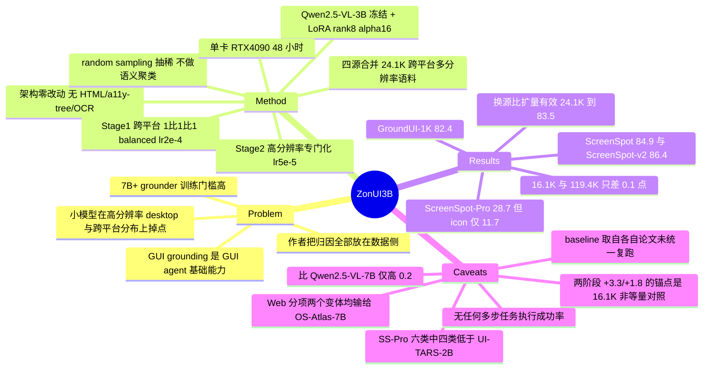

## Summary
ZonUI-3B 把 GUI grounding 的改进变量从模型规模换到数据构成与训练日程：冻结 Qwen2.5-VL-3B、只训 LoRA（rank 8、α=16），用 24.1K 跨平台多分辨率样本做两阶段微调，单张 RTX 4090 上 48 小时内训完，得到 ScreenSpot 84.9%、ScreenSpot-v2 86.4%、GroundUI-1K 82.4%、ScreenSpot-Pro 28.7%。最有信息量的不是主结果而是数据消融——ShowUI-Web 的 16.1K 子集与 119.4K 全集在 ScreenSpot 上只差 0.1 个点（82.8 vs 82.9），说明同源 GUI 截图的边际信息量接近零。"单张消费级 GPU 完成训练"只覆盖两个 LoRA 适配阶段，不含 Qwen2.5-VL-3B backbone 本身的预训练开销。

## Problem & Motivation
GUI grounding——给定指令和截图定位目标 UI element 的坐标——是 GUI agent 的基础能力，但 7B+ 规模的强 grounder 训练门槛高。ShowUI 已证明 2B 量级可行，作者要问的是更窄的一个问题：在不改架构、不加外部模块的前提下，仅靠数据配方和训练日程，3B 模型能被推到什么位置。

论文把小模型的泛化短板归到三个数据侧因素：现有数据集 resolution diversity 不足、GUI 结构与元素风格方差大、以及平台不均衡（尤其高分辨率 desktop 样本相对稀缺）。三条归因都指向数据而非容量，这决定了全文的实验设计——所有对照都在数据构成和训练阶段上做，没有任何架构变量。

## Method
**架构：零改动。** backbone 是公开的 Qwen2.5-VL-3B，因其原生支持 dynamic input resolution 与 absolute coordinate grounding。适配用 LoRA（rank 8、α=16，作用于选定 transformer 层），基座权重冻结，推理时 LoRA 可合并因而不增加 latency。全程不使用 HTML、accessibility tree、OCR module 或任何外部视觉工具。这个克制是有方法论收益的：性能变化只能归因到数据与日程。

需要注意论文内部有一处措辞不一致：§3.1 称 3B 的体量"enables full fine-tuning on mainstream hardware"，abstract 称模型"can be fully trained on a single consumer-grade GPU"，但实际执行的是冻结基座上的 LoRA，不是 full-parameter fine-tuning。

**数据：合并后抽稀，而非扩量。** 语料由 ShowUI-Web、ShowUI-Desktop、UGround-WebHybrid、AMEX 四个公开源合并而成，覆盖 Android / iOS / web / desktop。UGround 分量贡献 448×448 到 1344×1344 的多分辨率、多长宽比 web 截图（含模拟移动端布局的渲染），补 ShowUI 缺的 resolution depth；ShowUI/AMEX 补 UGround 缺的跨平台覆盖。作者观察到同一站点/应用的截图之间只有 transient text 或轻微布局位移的差异，学习信号高度冗余，于是直接用 random sampling 抽稀——不做人工过滤，也不做 semantic clustering。最终训练集 24.1K。

**训练：两阶段。** Stage 1 cross-platform fine-tuning，mobile/web/desktop 混合、按 1:1:1 balanced sampling 抬高 desktop 曝光，lr 2e-4，目标是先建立 text button / icon / menu 一类通用 GUI 语义。Stage 2 high-resolution specialization，在 UGround web-hybrid 的高分辨率/多分辨率子集上继续微调，lr 降到 5e-5 以在密集视觉输入上稳定。硬件与预算：单张 RTX 4090（24GB），DeepSpeed ZeRO-2 + FlashAttention(SDPA)，FP16，batch size 1、gradient accumulation 48，每个 epoch 122 步，Stage 1 + Stage 2 合计 48 小时内完成。

## Key Results
- **ScreenSpot / ScreenSpot-v2（Table 1）**：ZonUI-3B 在原始 ScreenSpot 上 **84.9% avg**（mobile 88.9 / desktop 84.0 / web 81.8），在修正标注后的 ScreenSpot-v2 上 **86.4% avg**（mobile 91.3 / desktop 84.4 / web 83.4）。相对同表最强 sub-4B 的 UI-TARS-2B（82.3 / 84.7）分别 +2.6 与 +1.7。
- **平均分的来源是 mobile 与 desktop，不是 web**：在两个 ScreenSpot 变体的 Web 分项上 ZonUI-3B 都不是第一——81.8 < OS-Atlas-7B 的 82.5，83.4 < OS-Atlas-7B 的 83.9（表中 Web 列加粗的是 OS-Atlas-7B，ZonUI-3B 为下划线次优）。
- **"rivals 7B" 的实际幅度很薄**：ScreenSpot avg 84.9 相对 Aguvis-7B 的 84.4 是 +0.5，相对同族未微调的 Qwen2.5-VL-7B 的 84.7 只有 +0.2。同族 Qwen2.5-VL-3B 基线是 55.5，因此训练带来的绝对增益（+29.4）远大于它对 7B 的领先幅度。
- **GroundUI-1K（Table 3）**：**82.4% total**（web 82.0 / desktop 78.6 / mobile 86.6），高于 R-VLM 74.1、Iris 71.3、SeeClick 61.1。
- **ScreenSpot-Pro（Table 2）**：**28.7% avg**，高于 UI-TARS-2B 的 27.7、Qwen2.5-VL-7B 的 26.8、OS-Atlas-7B 的 18.9。但这 +1.0 的平均领先由两个类别撑起：六个类别 avg 中 ZonUI-3B 只赢 CAD（27.9 vs 14.6）和 Office（50.0 vs 42.6），在 Development（15.7 vs 26.4）、Creative（26.9 vs 27.6）、Scientific（38.9 vs 39.8）、OS（14.2 vs 14.3）四类上均低于 UI-TARS-2B。text/icon 拆分为 text avg **39.2%**、icon avg **11.7%**。
- **数据消融（Table 5）**：同源扩量几乎无效——ShowUI-Web 16.1K 得 82.8，119.4K 得 82.9（+0.1）；换源反而有效——UGround + ShowUI-Web 合计 24.1K 得 83.5，高于任一单源。
- **两阶段消融（Table 6）**：论文正文宣称两阶段带来 desktop **+3.3%**、web **+1.8%**，但表中这两个 delta 的锚点是 16.1K 的 "ShowUI-Web only"（80.7 / 80.0）。与等数据量（24.1K）的单阶段 "+UGround" 行（81.0 / 80.9）相比，真实增量是 desktop **+3.0**、web **+0.9**——web 一侧几乎减半。
- **balanced sampling（Table 4）**：ScreenSpot 81.9 → 82.8（+0.9），SS-Desktop 79.4 → 80.7（+1.3）。

## Evidence Ledger

| Claim ID | Claim | Type | Source locator | Evidence excerpt | Status |
|:--|:--|:--|:--|:--|:--|
| C1 | ScreenSpot 84.9（88.9/84.0/81.8）、ScreenSpot-v2 86.4（91.3/84.4/83.4） | number | p.962 Table 1 | "ZonUI-3B(Ours) 88.9 84.0 81.8 84.9 91.3 84.4 83.4 86.4" | source-verified |
| C2 | GroundUI-1K 82.4 total，高于 R-VLM 74.1 / Iris 71.3 / SeeClick 61.1 | number | p.963 Table 3 | "ZonUI-3B(Ours) 82.0 78.6 86.6 82.4" | source-verified |
| C3 | ScreenSpot-Pro avg 28.7 vs UI-TARS-2B 27.7，但六类中四类低于后者，仅 CAD/Office 胜出 | comparison | p.963 Table 2 | "UI-TARS-2B ... 26.4 ... 27.6 ... 14.6 ... 39.8 ... 42.6 ... 14.3 ... 27.7" | source-verified |
| C4 | ScreenSpot-Pro text avg 39.2、icon avg 11.7 | number | p.963 Table 2 | "ZonUI-3B(Ours) ... 39.2 11.7 28.7" | source-verified |
| C5 | 实为冻结基座上的 LoRA，非 full fine-tuning；论文措辞与之不一致 | causal-mechanism | p.961 §3.1 + p.959 abstract | "LoRA ... introduces trainable low-rank matrices into frozen transformer layers" vs "enables full fine-tuning on mainstream hardware" | source-verified |
| C6 | 单 RTX 4090 / 48 小时只覆盖 Stage 1+2 微调，不含 backbone 预训练 | benchmark-setting | p.963 §4.1 | "The complete two-stage fine-tuning process (Stage 1 + Stage 2) finishes within 48 hours on this setup." | source-verified |
| C7 | 24.1K 语料来自 ShowUI-Web/Desktop、UGround-WebHybrid、AMEX 四个公开源 | number | p.960 §2.1、p.964 Table 5 | "merges samples from ShowUI-Web and UGround-WebHybrid ... AMEX ... ShowUI-Desktop" | source-verified |
| C8 | 论文所称两阶段增益 +3.3%/+1.8% | number | p.964 Table 6 + §4.3 | "2-Stage Training (Ours) 24.1K 84.0% (+3.3%) 81.8% (+1.8%)" | **contradicted（已在正文更正）**：delta 锚点是 16.1K 的 ShowUI-Web only（80.7/80.0），非等数据量的 24.1K "+UGround"（81.0/80.9）；等量对照下为 +3.0 / +0.9 |
| C9 | 16.1K 82.8 vs 119.4K 82.9，且该对比在 ShowUI-Web 内部而非合并语料的子采样 | number | p.964 Table 5 | "Only ShowUI-Web (small set) 16.1K 82.8 / (large set) 119.4K 82.9" | source-verified |
| C10 | balanced sampling：81.9→82.8，desktop 79.4→80.7 | number | p.964 Table 4 | "Joint-Training (no balancing) 81.9 79.4 / Balanced Sampling (1:1:1 ratio) 82.8 80.7" | source-verified |
| C11 | ScreenSpot-Pro 的 baseline 数字取自各自论文与 leaderboard，未由作者在统一 harness 复跑 | benchmark-setting | p.963 Table 2 caption | "Most results are collected from official papers and leaderboard [11]" | source-verified（caption 只说 "Most"，且全文未描述复跑协议） |
| C12 | "surpassing all prior models under 4B parameters"，但 Table 1 中的 sub-4B 对照仅四个模型 | sota-novelty | p.959 abstract、p.962 Table 1 | "surpassing all prior models under 4B parameters" | source-verified（Table 1 内 sub-4B 只有 Qwen2.5-VL-3B 55.5、ShowUI-2B 74.9、UGround-V1-2B 77.7、UI-TARS-2B 82.3；OS-Atlas-4B 只出现在 Fig 1/Table 2） |
| C13 | Web 分项在两个 ScreenSpot 变体上均低于 OS-Atlas-7B（81.8<82.5、83.4<83.9） | comparison | p.962 Table 1 | "OSAtlas-7B[15] 82.9 77.2 82.5 82.4 85.4 77.1 83.9 84.1" | source-verified（Web 列加粗者为 OS-Atlas-7B，ZonUI-3B 为下划线次优） |
| C14 | Table 1 多个 baseline 行不完整：Aguvis-7B 无任何 ScreenSpot-v2 数字；Qwen2.5-VL-7B 无任何 per-platform 分项，仅有 SS avg 84.7 | benchmark-setting | p.962 Table 1 | "Qwen2.5-VL-7B [4] – – – 84.7 – – – –"；"Aguvis-7B [16] 86.6 80.4 81.7 84.4 – – – –" | source-verified |
| C15 | 全部评测为单步坐标 grounding，无任何多步 GUI agent 任务执行成功率 | benchmark-setting | p.963 §4.1（全文检索） | "Success is defined by whether the predicted coordinates fall within the annotated bounding box." | source-verified（"success rate of 28.7%" 指 ScreenSpot-Pro grounding accuracy，非在线任务成功率） |
| C16 | 论文正文不含任何 code/checkpoint URL，只承诺发布整合数据集 | license-code | 全 8 页含 abstract/脚注/PDF 链接注解 | "We release the integrated dataset to foster reproducibility and support future research on GUI grounding." | source-verified（PDF 无任何 http/github 字符串与 URI 注解；frontmatter 的 GitHub 链接为站外获取） |
| C17 | 训练超参：Stage 1 lr 2e-4 / Stage 2 lr 5e-5，bs 1 + grad accum 48，FP16，ZeRO-2，FlashAttention(SDPA)，122 步/epoch | number | p.962-963 §4.1 | "A learning rate of 2e-4 is used ... A reduced learning rate of 5e-5 is used in this stage" | source-verified |

## Strengths & Weaknesses
真正站得住的贡献只有一条，但这一条有价值：**同源 GUI 截图的边际信息量接近零**。16.1K 与 119.4K 在 ScreenSpot 上差 0.1 个点，而换一个数据源（UGround）后 24.1K 就到 83.5，这把"GUI grounding 数据该往哪个方向扩"的答案说清楚了——扩 source diversity 和 resolution coverage，不是扩 screenshot 张数。这个结论对任何要建 GUI 数据 pipeline 的人都直接可用，也解释了为什么 [[2604-GoClick]] 的 Progressive Data Refinement（10.8M → 3.8M）能在砍掉三分之二数据后不掉点。加分项是变量控制干净：架构零改动，所有对比都落在数据与日程上。

其余部分都要打折。

**"competitive" 的可比性是弱的，且方向和标题暗示的相反。** 24.1K 是从 ShowUI 和 UGround 已经建好的语料里抽出来的子集，所以"比 UGround 少两个数量级样本"这句话的正确读法是：在别人已经付出大规模采集成本之后，下游微调只需要很小一份。它是 data-efficiency 结果，不是 data-independence 结果。同时所有 baseline 数字取自各自论文与 leaderboard，未在统一 harness 复跑，Table 1 里 Aguvis-7B 整个 ScreenSpot-v2 列和 Qwen2.5-VL-7B 的全部分项都是 "–"，"rivals 7B" 因此建立在不完整的行上。真放到同族对照里看：ZonUI-3B 的 84.9 只比未经任何 GUI 微调的 Qwen2.5-VL-7B 的 84.7 高 0.2。

**"sub-4B SOTA" 是投稿时点的，camera-ready 时已经过期。** Table 1 里的 sub-4B 只有四个模型。arXiv v1 是 2025-06-30，而 [[2500-FerretUiLiteLessons]]（Apple，同为 3B，2025-09-30）在 vault 笔记转述中报 ScreenSpot-V2 91.6、ScreenSpot-Pro 53.3——分别比 ZonUI-3B 高 5.2 和 24.6 个点。（Ferret-UI Lite 的数字来自 vault 二手笔记，未一手核验，仅作量级参照。）在同尺寸档位上，ZonUI-3B 现在是一个便宜的 baseline，不是前沿。

**高分辨率这条路，训练期数据曝光是个弱杠杆。** ScreenSpot-Pro 上 28.7 的 +1.0 平均领先靠 CAD 和 Office 两类撑起，另外四类反而不如 UI-TARS-2B；icon avg 只有 11.7，说明专业软件的图标语义几乎没被解决。更关键的对照来自 [[2504-ScreenSpotPro]] 原文：在同一个 OS-Atlas-7B 上，训练免费的 crop-and-reground（ReGround）就把 18.9 拉到 40.2，加上 planner 的 ScreenSeekeR 到 48.1。也就是说，推理期缩小搜索空间带来的增益（+21.3 / +29.2）远大于 ZonUI-3B 靠 Stage 2 多分辨率曝光相对 OS-Atlas-7B 拿到的约 +9.8。瓶颈更像 token/分辨率预算而非训练分布，而 ZonUI-3B 恰好选了较弱的那个杠杆。这与 [[2608-GUILens]] 走推理期 coarse-to-fine 的路线形成对照。

**只有静态点定位，没有传导性证据。** 全部四个 benchmark 都是"预测坐标是否落在 bbox 内"，没有任何多步执行成功率。这不是不可补的空白——[[2505-Jedi]] 已经证明 grounding 提升能直接抬 OSWorld 端到端成功率——所以这里是作者没做，而非做不了。

**"单消费级 GPU 完成训练"的措辞需要拆开读。** 48 小时单卡覆盖的是两个 LoRA 阶段；Qwen2.5-VL-3B 基座的预训练成本被完全外置。abstract 的 "fully trained" 与 §3.1 的 "full fine-tuning" 在字面上都与实际的冻结基座 + LoRA rank 8 不符。论文没有把这当成隐瞒（§3.1 和 §4.1 都写明了 LoRA），但标题和摘要的可传播版本确实比方法节更强。

**去冗余的机制解释停在观察层。** random sampling 有效说明冗余大，但没做 semantic clustering 或 coverage 分析，所以"diversity > volume"是一个有实验支持的经验规律，不是一个可外推的判据——换一个冗余结构不同的语料会怎样，论文答不了。

**rating 从 4 下调到 3**：数据冗余消融值得引用，但主结果的比较基线不完整、sub-4B 领先已被同尺寸工作超越、且缺乏向下游任务的传导证据。作为 lightweight SFT baseline 和数据配方参考仍有价值，够不上"重要"。

## Mind Map

## Notes
**在 vault 中的定位。** 这是 grounding cluster 里"数据配方"一支的代表，与 [[2604-GoClick]]（230M encoder-decoder + 数据精炼）、[[2500-FerretUiLiteLessons]]（3B 端侧、真实+合成数据 + RL）、[[2605-LiteGUI]]（2B、蒸馏 + GRPO）同属"小模型 grounding"证据链；四者共同支撑 [[CUA-Survey]] 的判断"grounding 可小模型化、long-horizon 仍是短板"。ZonUI-3B 在这组里是唯一一个纯 SFT、无 RL、无架构改动的对照点，因此适合当 recipe-only 的下界基线。与 [[2506-ShowuiOneVisionLanguage]]（token pruning）、[[2410-OSAtlas]]（跨平台 action model）的关系是：ZonUI-3B 直接消费它们的语料，并主张不需要它们的架构改动。

**最值得复用的一个反问。** 如果同源截图的边际信息量真的接近零，那么现有 GUI grounding 语料的"有效规模"可能比标称规模小一到两个数量级。这对所有以"我们收集了 N 百万样本"为卖点的工作都是个可检验的质疑——而检验方法 ZonUI-3B 已经给了：随机抽 1/7 再跑一遍。值得在 [[2511-GroundCUA]]、[[2505-Jedi]] 这类大规模数据工作上复现这个消融。

**留待验证的对照。** 论文没做、但一天能做完的实验：把 ZonUI-3B 接上 [[2504-ScreenSpotPro]] 的 ReGround crop-and-reground，看 28.7 能到哪。如果推理期裁剪就能把 3B 模型推到 40+，那 Stage 2 的高分辨率专门化在成本收益上就不划算——这直接决定"分辨率鲁棒性该在训练期还是推理期解决"。

**元数据。** arXiv v1（2025-06-30）标题为 "ZonUI-3B: A Lightweight Vision-Language Model for Cross-Resolution GUI Grounding"，WACV camera-ready 改为现标题，内容为同一工作；frontmatter 保留 WACV 标题与 venue。DOI 10.1109/WACV61042.2026.00100（Crossref，proceedings pp.959-966），IEEE Xplore 文档号 11492668。code 字段的 GitHub 链接来自站外检索（仓库自标 "[WACV 2026]"），论文正文本身不含任何 URL。
