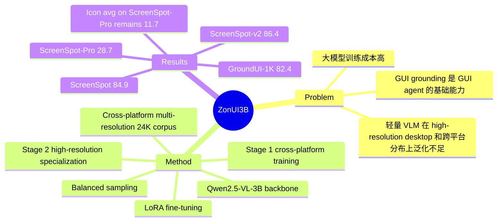

## Summary
ZonUI-3B 研究 GUI grounding 中“小模型能否靠数据配方和训练策略接近大模型”的问题，以 Qwen2.5-VL-3B 为 backbone，通过跨平台/多分辨率数据整合、冗余采样和两阶段 LoRA fine-tuning，在单张 RTX 4090 上训练出 3B GUI grounding VLM。核心贡献不是新架构，而是证明 24K 多样化样本 + Stage 1 cross-platform training + Stage 2 high-resolution specialization 可以在 ScreenSpot、ScreenSpot-v2、GroundUI-1K 和 ScreenSpot-Pro 上达到强竞争力。

## Problem & Motivation
GUI grounding 是 GUI agent 的基础能力：给定自然语言指令和屏幕截图，模型需要定位正确 UI element 的坐标。已有 7B+ VLM / GUI-specific models 在 benchmark 上较强，但训练成本高；轻量模型如 ShowUI-2B 已证明小模型可行，却仍容易在 high-resolution desktop、dense layout、web/mobile/desktop 跨平台分布变化下泛化不足。作者把问题归因于三个因素：已有数据的 resolution diversity 不足、GUI layout/style 变化大、desktop high-resolution 样本相对少。论文的动机是：与其继续扩大模型规模，不如验证更小模型能否通过数据多样性、平台平衡和分辨率专门化来补足 grounding 鲁棒性。

## Method
ZonUI-3B 基于 Qwen2.5-VL-3B，使用 LoRA 做 task-specific adaptation；架构保持不变，不引入 HTML、accessibility tree、OCR module 或额外 visual tool。这个选择使论文的变量更集中：性能提升主要来自数据与训练 recipe，而不是新模块。

数据侧，作者整合 ShowUI-Web、UGround-WebHybrid、AMEX 和 ShowUI-Desktop，构造覆盖 Android、iOS、web、desktop 的 cross-platform multi-resolution corpus。UGround 提供从 448x448 到 1344x1344 等不同 resolution / aspect ratio 的 web screenshots，ShowUI/AMEX 则补充跨平台和移动端分布。作者还观察到 GUI screenshots 存在大量重复 pattern；随机采样约 16.1K 样本即可在 ScreenSpot 达到 82.8%，几乎等同于 119.4K full set 的 82.9%，因此最终强调 diversity 和 information density，而不是盲目扩数据量。

训练分两阶段。Stage 1 是 cross-platform fine-tuning：混合 mobile、web、desktop 数据，并用 balanced sampling 提高 desktop exposure，目标是先学习通用 GUI semantics，如 text button、icon、menu 与 instruction 的对应关系。Stage 2 是 high-resolution specialization：在 UGround web-hybrid 的 high-/multi-resolution subset 上继续微调，用较低 learning rate 适配 dense visual conditions、小 clickable targets 和不同 viewport。训练设置为单 NVIDIA RTX 4090 24GB，DeepSpeed ZeRO-2、FlashAttention/SDPA、FP16、LoRA rank 8、alpha 16、batch size 1、gradient accumulation 48；完整两阶段 fine-tuning 在 48 小时内完成。

## Key Results
- **ScreenSpot / ScreenSpot-v2**：ZonUI-3B 在 ScreenSpot 上达到 **84.9% avg**，分项为 mobile **88.9%**、desktop **84.0%**、web **81.8%**；在 ScreenSpot-v2 上达到 **86.4% avg**，分项为 mobile **91.3%**、desktop **84.4%**、web **83.4%**。对比 sub-4B baseline，UI-TARS-2B 为 ScreenSpot **82.3%**、ScreenSpot-v2 **84.7%**，ZonUI-3B 分别高 **+2.6** 和 **+1.7** points。
- **GroundUI-1K**：ZonUI-3B 达到 **82.4% total**，web **82.0%**、desktop **78.6%**、mobile **86.6%**；表中 R-VLM 为 **74.1% total**，Iris 为 **71.3% total**，SeeClick 为 **61.1% total**。
- **ScreenSpot-Pro**：ZonUI-3B 在专业高分辨率 GUI grounding 上达到 **28.7% avg**，高于 UI-TARS-2B 的 **27.7%**、Qwen2.5-VL-7B 的 **26.8%** 和 OS-Atlas-7B 的 **18.9%**；但 text/icon breakdown 仍显示明显困难，ZonUI-3B 的 text avg 为 **39.2%**，icon avg 仅 **11.7%**。
- **Ablation**：balanced sampling 在 Stage 1 将 ScreenSpot accuracy 从 **81.9%** 提到 **82.8%**，desktop 从 **79.4%** 到 **80.7%**；16.1K ShowUI-Web small set 与 119.4K large set 分别为 **82.8%** 和 **82.9%**，说明单纯扩大同源数据收益很小；最终 two-stage training 在 24.1K 数据上达到 **84.9% ScreenSpot**，其中 desktop **84.0%**、web **81.8%**，相对 single-stage +UGround 的 desktop **81.0%**、web **80.9%** 更高。

## Strengths & Weaknesses
亮点在于问题 formulation 很务实：ZonUI-3B 没有把 GUI grounding 的进步完全绑定到更大模型或复杂 agent framework，而是把变量压到数据构成、采样和训练 schedule 上。对当前 GUI-agent / VLM 研究很有参考价值的是，论文给出了一个可复用的经验判断：resolution diversity、platform balancing 和 staged specialization 可能比继续堆重复截图更有效。ScreenSpot-Pro 上的结果也说明，3B 模型并非只能服务 mobile/web 简单 UI，在专业桌面环境中也能有一定鲁棒性。

局限也很清楚。第一，方法创新偏 recipe，架构上完全沿用 Qwen2.5-VL-3B + LoRA；这使结论更干净，但也意味着论文主要贡献是训练与数据工程，而非新的 grounding mechanism。第二，ScreenSpot-Pro 的 **28.7%** 仍远未解决专业高分辨率 GUI，尤其 icon avg 只有 **11.7%**；这提示 high-resolution specialization 缓解了分辨率问题，但没有真正解决专业 icon semantic gap。第三，评估集中在 static point grounding，论文没有展示多步 GUI agent execution success，也没有证明坐标准确率提升能稳定转化成长程任务成功率。第四，数据去冗余采用 random sampling，没有做 semantic clustering 或更细的 coverage analysis；因此“diversity > volume”的结论是有实验证据支持的，但机制解释仍偏粗。

已知：论文明确报告了四个 benchmark 的数值、训练硬件、数据来源、LoRA 设置和两阶段消融。推测：ZonUI-3B 的收益主要来自让小模型在训练中见到更多 screen scale / platform combination，而不是学到新的视觉推理能力；这个推测符合 ablation，但论文没有直接量化 representation change。不知道：论文正文没有给出 code/checkpoint URL，也没有给出比 WACV 2026 更精确的发布日期；dataset release 被声明会发布，但正文未给出具体下载链接。

## Mind Map

## Notes
这篇论文的直接启发是：multi-resolution training 与 staged specialization 已经有较强 empirical support，但 ZonUI-3B 的做法仍停留在数据暴露和阶段训练，没有引入 explicit scale-invariant architecture。后续若比较“数据 recipe”与“架构机制”两条路线，可以把 ZonUI-3B 当作轻量但强势的 supervised fine-tuning baseline；关键诊断应放在 high-resolution small-target、icon-heavy 和跨平台 distribution shift 上，因为这些正是论文结果中仍未完全解决的部分。
