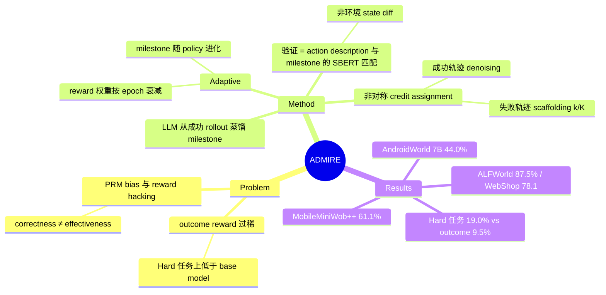

## Summary
针对 GUI agent RL 的 temporal credit assignment 问题，ADMIRE 用 LLM 从 agent 自身的成功 rollout 中蒸馏出有序 milestone 列表，训练中按语义匹配给 step-level 奖励，并对成功/失败轨迹做非对称 credit assignment；在 AndroidWorld 上使 Qwen2.5-VL-7B 达到 44.0%（超过 GPT-4o 34.5% 和 Claude-Sonnet-4 41.0%）。

## Problem & Motivation
GUI agent 的 multi-turn RL 面临两难：outcome-only reward 把长轨迹压缩为 binary 信号，无法区分"差一步成功"和"完全跑偏"，难任务上信号过稀（论文 Fig 3：outcome reward 在 AndroidWorld Hard 任务上 9.5%，反而低于 14.3% 的 base model）；而 LLM-as-Judge 式 process reward 提供 dense 信号但引入 systemic bias 与 reward hacking——判 "correctness" 不等于判 "effectiveness"，奖励可执行但无用的动作会把 policy 困在次优解。核心诉求：dense、可验证、且不依赖 promptable LLM scorer 的 step-level 信号。

## Method
**Milestone 生成（自举，无需专家数据）**：对每条指令 G，从 online RL 过程中环境判定成功（O(τ)=1，AndroidWorld 环境自带 task validator）的 rollout 中筛选轨迹，用 GPT-4o 把 exemplar 成功轨迹抽象为有序的 milestone 列表（如 "Search button clicked"）：`M_G^(0) = Φ(τ*, G, P_init)`。

**"Adaptive" 的含义（两层）**：
1. **Milestone 随 policy 共同进化**：训练中发现更高效的成功轨迹时，GPT-4o 对照现有 milestone 做增量 refine（`M_G^(i+1) = Φ(τ_new, M_G^(i), G, P_update)`）；
2. **Milestone reward 权重随训练衰减**：`λ(t) = λ_0 · γ^E`（E 为 epoch），后期回归 outcome 主导。

**Milestone 验证（关键设计，注意锚定对象）**：不是环境 state diff，也不是 LLM judge 打分，而是把 **agent 自己输出的 action description 文本**与当前目标 milestone 文本做 Sentence-BERT cosine 相似度匹配，超过阈值 δ=0.75 记为命中；用指针 p_t 强制 milestone 顺序匹配、禁止跳跃。原文："we verify the current action description a_t against a candidate milestone m_k by computing their semantic cosine similarity"。

**非对称 credit assignment**：
- 成功轨迹（denoising）：只有命中 milestone 的 step 得 reward，其余为 0——过滤冗余动作；
- 失败轨迹（scaffolding）：连续 progress reward k/K（已完成 milestone 比例）+ 命中 bonus ζ·r^mil（ζ=0.5）——打破 all-or-nothing。

**整合**：`R_total(t) = R_outcome + η·R_format + λ(t)·R_mil`（η=0.5），接入 GRPO，advantage 在 batch 内所有 step 上归一化。跨 GRPO / RLOO / DAPO 三种算法验证。

## Key Results
- **AndroidWorld（116 任务/20 app）**：Qwen2.5-VL-3B：base 18.1% → outcome 26.7% → process 27.5% → **ADMIRE 31.0%**；Qwen2.5-VL-7B：base 32.8% → outcome 39.7% → process 36.2% → **ADMIRE 44.0%**（超 GPT-4o 34.5%、Claude-Sonnet-4 41.0%）。
- **MobileMiniWob++**：7B outcome-only 训练反而从 57.6% 掉到 51.1%，ADMIRE 61.1%；3B ADMIRE 57.6%。
- **难度分层（Fig 3）**：Hard 任务上 outcome reward 9.5%（低于 base 14.3%），process reward 无改善，ADMIRE 19.0%——sparse 信号在难任务上有害的直接证据。
- **Ablation（Fig 4）**：去掉失败轨迹的 progress reward（k/K）退化最大——从失败中学习是主要增益来源；去掉 reward decay 无损甚至略升（MobileMiniWob++ 62.0%），说明 adaptive milestone 全程质量尚可。
- **跨域泛化**：ALFWorld 87.5%、WebShop 78.1（DAPO），在三种 RL 算法下均优于 outcome/process reward。
- 注意口径：abstract 说的 "over 10% absolute" 是相对未训练 base model（+12.9/+11.2）；相对 outcome-only RL，AndroidWorld 上实际增益约 +4.3 个点，MobileMiniWob++ 上 7B 为 +10 个点（主要因为 outcome-only 本身退化）。

## Strengths & Weaknesses
**Strengths**：
- **问题诊断与 [[2607-EvoCUA15]] Fig 7 的 PRM 陷阱完全对上**：process reward 判 correctness 不判 effectiveness、会被 hack。ADMIRE 的 grounding 链条有一半是扎实的——milestone **内容**只从环境 validator 判定成功的轨迹中蒸馏，reward 的"教材"锚定了真实成功。
- 非对称设计是全文最有信息量的部分：ablation 显示失败轨迹的 progress reward 贡献最大增益，即 milestone 的主要价值是给失败轨迹部分学分（scaffolding），而非给成功轨迹加密信号。
- 自举式（无需人工 demo / 专家数据），milestone 随 policy 进化避免过时；跨 3 算法 + 4 环境的泛化验证比多数 reward-shaping 论文扎实。
- 难任务分层分析（outcome reward 低于 base model）是对 sparse reward 失效的干净实证。

**Weaknesses**：
- **验证环节没有锚定环境状态**（已知，原文明确）：milestone 命中判定 = agent 自己生成的 action description 与 milestone 文本的 SBERT 相似度。这是 self-reported progress——policy 原则上可以学会"把动作描述写得像 milestone"而不真正执行，论文完全没有讨论或测试这条 hacking 通道。它移除了 promptable LLM judge（不可被 prompt-hack），但把裁判换成了被优化对象自己写的文本，只是把 hacking 面从 judge 侧挪到了 policy 输出侧。
- **冷启动依赖**（推测，论文未讨论）：milestone 按指令 G 蒸馏，base model 从未成功过的任务没有 milestone，只能退回 outcome-only；Hard 任务 19.0% 的增益来源（同任务后期成功 vs 跨任务泛化）未拆解。
- 顺序指针假设单一 canonical 路径；adaptive refine 向"更高效轨迹"收敛可能锁死单一解法，对多合法路径任务的影响未验证。
- δ=0.75 阈值敏感性、milestone 质量的量化评估（仅 Appendix 提"human evaluation validated"）均缺失。
- Claude-Sonnet-4 41.0% 的 AndroidWorld 数字偏低（scaffold 依赖），"超过闭源模型"的对比宣传性大于信息量。

## Mind Map

## Notes
- 与 [[2607-EvoCUA15]] 的关系：EvoCUA-1.5 Fig 7 实证 PRM 分数上升而真实成功率停滞，并指名 milestone/counterfactual 为替代方向。ADMIRE 是该方向的**部分实现**：milestone 内容锚定了环境验证的成功轨迹（做到了），但 per-step 命中判定仍是文本匹配而非环境状态锚定（没做到）。真正闭环需要 milestone 绑定可查询的 state predicate（如 AndroidWorld validator 的中间态版本）。
- 与 [[2604-StepLevelOptimization]] 的 step-level credit assignment 讨论可对照：ADMIRE 提供了"哪一步值得奖励"的一种廉价近似。
- 可检验的后续问题：把 milestone 判定从 action description 换成 screenshot/a11y-tree diff 的 rule-based predicate，增益会更大还是暴露 milestone 本身的噪声？
