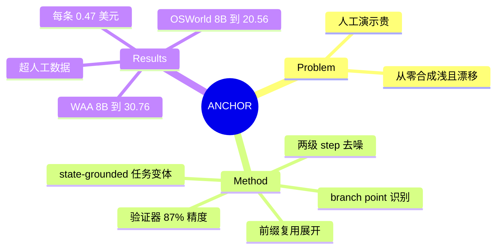

## Summary

ANCHOR 把"分支"用于训练数据合成：在少量种子轨迹上由 GPT-5.1 识别 branch point（UI 发生实质状态变化的节点），从该状态出发提出新任务变体、由执行 agent（Claude Sonnet 4.5）展开新轨迹、验证器过滤，配合前缀过滤与 branch 后去噪两级 step 级清洗——1,777 条轨迹（\$0.47/条）使 Qwen3-VL-8B 在 OSWorld 16.82→20.56、WindowsAgentArena 23.07→30.76。

## Problem & Motivation

桌面 GUI agent 的训练数据瓶颈：人工演示昂贵，现有合成管线要么任务多样性受限（从任务描述从零生成），要么轨迹 goal-drifting（噪声大）。核心思路：种子轨迹的中间状态是免费的"深层 UI 状态"资产——从 branch point 展开可以复用已验证前缀直达深层状态，比从桌面初始态从零合成更高效、更多样。

## Method

- **Branch point 识别**：GPT-5.1 沿种子轨迹选 3-5 个决策节点——UI 发生实质变化（新窗口/面板出现、新内容可见）的时刻，作为多个下游任务可以合理分叉的状态。
- **任务变体提议**：给 LLM 轨迹前缀 + 当前 GUI 状态，合成 state-grounded 的新任务描述；执行中若 agent 行为漂移或环境变化，迭代修正指令。
- **轨迹展开与验证**：Claude Sonnet 4.5 从 branch 状态执行新任务；task summarizer 产生高层描述；Qwen3-VL-32B 验证器做 state-aware 完成检查，失败轨迹丢弃（人工审计 87% 一致率，95% CI 79.0-92.2%）。
- **两级 step 过滤**：(1) 前缀过滤——对跨后代共享的前缀生成多个候选 action-reasoning 对，只保留与观测状态转移视觉一致的步骤；(2) branch 后去噪——intention-consistency 检查动作与视觉变化匹配性，剔除噪声步但保留其后的有效步（保留"犯错后纠正"的恢复监督）。
- 产出：1,777 条成功轨迹（Ubuntu 1,174 / Windows 603），平均 17.24 步，\$0.47/条。

## Key Results

- **OSWorld**：Qwen2.5-VL-7B 0.93→7.94（超 task-driven 合成 5.61 和人工数据 4.67）；Qwen3-VL-8B 16.82→20.56；GLM-4.1V-9B 0.47→7.01。
- **WindowsAgentArena**：Qwen3-VL-8B 23.07→30.76；GLM-4.1V-9B 5.49→16.30；Qwen2.5-VL-7B 4.39→15.22。
- 消融：去掉 step 级过滤与 branch 后去噪一致掉分（20.56→19.15 / 7.94→7.01 / 7.01→6.54）。

## Strengths & Weaknesses

**Strengths**
- Branch-point 展开在数据合成谱系中占据一个干净的生态位：介于"从零合成"（多样但浅）与"人工演示"（深但贵）之间，复用已验证前缀直达深层 UI 状态，\$0.47/条的成本数字有说服力。
- 超过人工数据（7.94 vs 4.67）是合成数据罕见的强 claim——解释是覆盖了人工演示不会经过的状态多样性。
- 去噪时保留"错误后的纠正段"，无意中成为恢复行为的监督来源。

**Weaknesses / 边界**
- 管线依赖三个前沿闭源模型（GPT-5.1 提议 + Claude Sonnet 4.5 执行 + Qwen3-VL-32B 验证），本质是蒸馏——收益天花板是执行 agent 的能力，小模型 +7pp 的大增益部分来自基线极低（0.47/0.93）。
- Branch point 识别是 LLM 判断（"实质状态变化"），无可执行标准；与 EvoCUA-1.5 的可执行 validator 相比验证只有 87% 精度。
- 只做 SFT 数据；branch 结构本可提供 step 级对比信号（同状态不同后续），未被利用。

## Mind Map

## Notes

- 训练侧 branch 用法与 [[2606-SRC]]（rollback 造纠正数据）、[[2605-GUIRobustEval]]（error-depth 初态注入）、[[2506-GoBrowse]]（prefixed sampling）同赛道；ANCHOR 的差异在于 branch 目的是**任务多样性**而非恢复行为，但去噪设计意外保留了恢复监督。
- 与 [[2509-TreeGRPO]] 对照：同样从中间状态分支，TreeGRPO 用于 RL rollout 结构（需环境支持），ANCHOR 用于离线 SFT 数据工厂（只需一次执行）——branch 原语在训练侧的两种消费方式。
